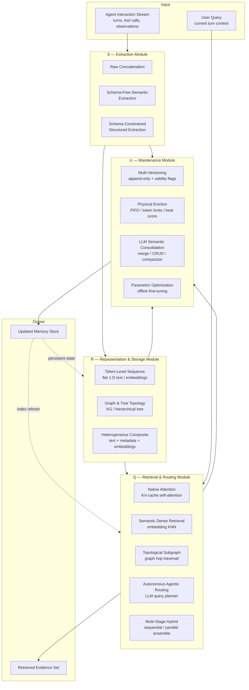
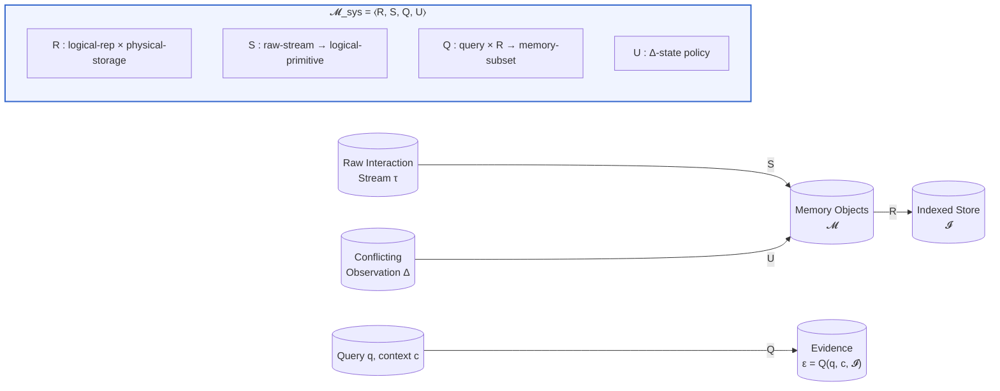
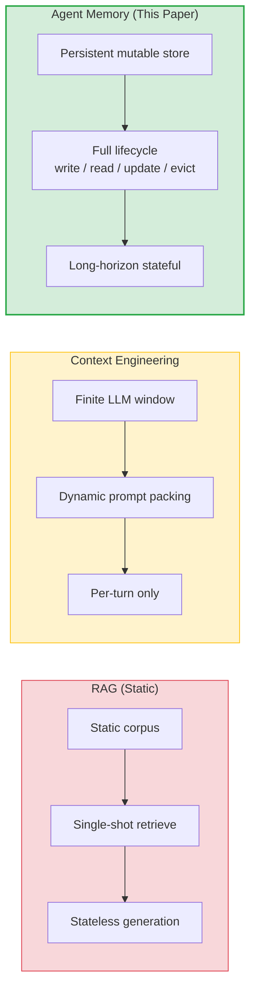
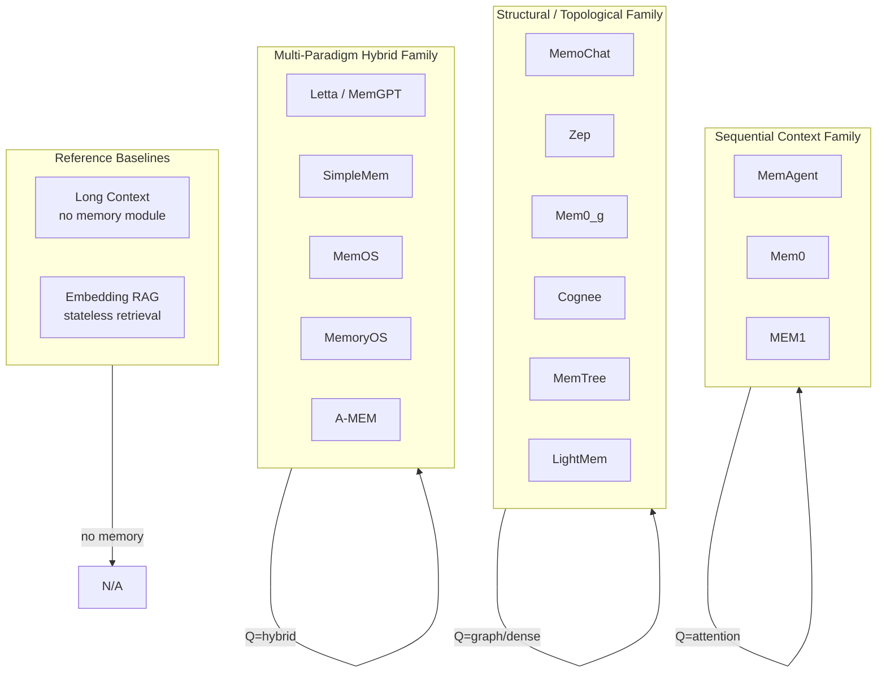
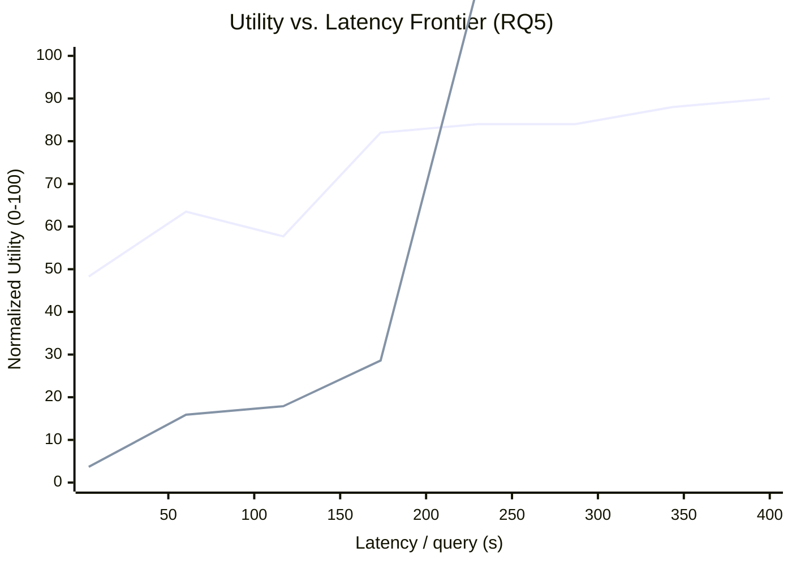

# Breakdown — Are We Ready For An Agent-Native Memory System?

> **Paper:** Are We Ready For An Agent-Native Memory System?
> **Authors:** Wei Zhou, Xuanhe Zhou\*, Shaokun Han, Hongming Xu, Guoliang Li, Zhiyu Li, Feiyu Xiong, Fan Wu (SJTU, Tsinghua, MemTensor)
> **Year:** 2026 (arXiv:2606.24775, v5, Jul 2026)
> **ArXiv:** https://arxiv.org/abs/2606.24775
> **Code (official):** https://github.com/OpenDataBox/MemoryData
> **Type:** Systematization + benchmark (not a single new model).

---

## 1. Problem & Motivation

**Problem.** Memory for LLM agents has evolved from simple retrieval-augmented
lookups into full data-management systems that store, retrieve, update,
consolidate, and govern persistent state across long-horizon agent execution.
But evaluations are stuck in 2023: they measure only end-to-end task metrics
$(F_1, \text{BLEU})$ and treat the memory system as a monolithic black box. So nobody
knows *which design choice in the memory system* is actually responsible for
good or bad behavior.

**Why important.** A poorly-designed memory layer causes factual
contradictions, catastrophic forgetting, and unacceptable latency in
continuous agent execution. Production agents live or die on this layer.

**Prior-work limitations** (the paper's diagnosis of why existing benchmarks
fail):
1. They don't evaluate many representative architectures under unified
   workloads — cross-system comparison is impossible.
2. They use only single-sided end-to-end metrics, not evidence-level retrieval
   fidelity, update robustness under conflicting knowledge, or long-horizon
   stability.
3. They ignore operational cost (index build time, query latency) — critical
   for production.
4. They treat memory as a black box instead of decomposing it into fundamental
   modules for isolated, fine-grained analysis.

## 2. Key Insight / Contribution

**Core idea (one sentence):** Treat agent memory as a 4-module data-management
system $\mathcal{M}_{\text{sys}} = \langle R, S, Q, U \rangle$, then benchmark each module *independently*
across a taxonomy of design choices — revealing that no single architecture
dominates, and that the right answer is workload-aligned.

**What is genuinely new:**
- The **4-module taxonomy** (Representation & Storage, Extraction, Retrieval &
  Routing, Maintenance) as a unified lens over ~12 existing systems.
- **Evidence-level evaluation** ($\text{Recall@}k$, update robustness, horizon drift)
  separated from downstream answer quality.
- **Operational cost analysis** — the first systematic utility-vs-latency
  frontier for agent memory.
- **Fine-grained ablations** that isolate each module's contribution, yielding
  9 actionable design findings.

## 3. Method

### 3.1 Overview

The "method" is a **framework + evaluation methodology**, not an algorithm.
The framework decomposes any agent-memory system into four modules. Each
module has a taxonomy of concrete design choices. The evaluation runs
representative systems + controlled ablations across 5 workloads and reports
both task quality and operational cost per module.

### 3.1.1 Mermaid Architecture Diagram — Memory System Pipeline

### 3.1.2 Mermaid Data-Flow Diagram — Formal Tuple Composition

### 3.2 The four modules (full taxonomy)

**R — Representation & Storage** (how memory is encoded & where it lives).

*Logical representation* (3 categories):
- **❶ Token-Level Sequence** — flat 1D sequences.
  - *Explicit discrete text* (Mem0 = discrete facts; MemoChat = JSON blocks).
  - *Implicit continuous vector* (embeddings, KV-cache tensors — e.g. MemoRAG).
- **❷ Graph & Tree Topology** — structured nodes & edges.
  - *Temporal KG* (Zep: episode/entity/community subgraphs; Mem0_g: labeled
    directed graph with vertices=entities, edges=relationship triplets like
    `LIVES_IN`).
  - *Hierarchical tree* (MemTree: leaves=isolated facts, ancestors=summaries,
    root=entrypoint).
- **❸ Heterogeneous Composite** — multi-part containers mixing unstructured
  text + structured metadata + embeddings + links (MemOS MemCube, A-MEM atomic
  notes).

*Physical storage* (3 categories):
- **❶ Transient in-context register** (KV cache, no disk I/O).
- **❷ Specialized single-engine** (vector DB, graph DB, SQL, file/object).
- **❸ Heterogeneous multi-engine** (vector + graph, or vector + BM25 + SQL).

**S — Extraction** (raw interaction → memory primitives):
- **❶ Raw sequence concatenation** — just append turns, no extraction prompt
  (MEM1, MemAgent).
- **❷ Schema-free semantic extraction** — distill into standalone free-form
  facts (Mem0: "User is vegetarian and dairy-free").
- **❸ Schema-constrained structured extraction** — LLM fills a rigid schema →
  typed triplets / payloads (Zep & Mem0_g: typed directed relational edges;
  MemoChat: strict JSON; Cognee: ECL pipeline via pydantic).

**Q — Retrieval & Routing**:
- **❶ Native attention-based** — self-attention over KV cache is the only
  retriever (MEM1, MemAgent).
- **❷ Semantic dense retrieval** — KNN over embeddings (Mem0, LightMem, MemTree
  collapsed-tree cosine).
- **❸ Topological subgraph traversal** — hop edges in a KG (Mem0_g entity-centric
  recursive traversal; A-MEM: KNN anchors then graph walk).
- **❹ Autonomous agentic routing** — LLM acts as query planner.
  - *Function-call invocation* (Letta: emits `archival_storage.search()`).
  - *Generative query expansion* (SimpleMem: LLM rewrites vague prompts).
- **❺ Multi-stage hybrid**:
  - *Sequential* — deterministic predicates prune, then semantic rank
    (MemoryOS federated routing; boolean + cosine fusion).
  - *Parallel ensemble* — BM25 + dense + BFS in parallel, fuse via RRF/MMR +
    cross-encoder rerank (Zep).

**U — Maintenance**:
- **❶ Timestamp multi-versioning** — append-only + validity flags + timestamps.
  No physical delete; logical invalidation (Zep, Mem0_g, LightMem, MemOS).
- **❷ Capacity-driven physical eviction**:
  - *Constraint-based hard* — FIFO / token limits / fixed segment boundaries
    (MemAgent, MEM1 truncation, Letta OS-style queue flush).
  - *Score-based priority* — temporal-decay or access-frequency score (MemoryOS
    "Heat" = retrieval-frequency vs exponential temporal decay).
- **❸ LLM-driven semantic consolidation**:
  - *Inline compaction* — merge redundant assertions on write (SimpleMem
    online synthesis; MemTree recursive parent aggregation).
  - *Tool-driven CRUD* — LLM issues explicit UPDATE/DELETE via tool interface
    (Mem0).
- **❹ Continuous parametric optimization** — offline fine-tuning (MemoRAG
  RLGF; out of scope for online inference).

### 3.3 The formal tuple

$$
\boxed{\mathcal{M}_{\text{sys}} = \langle\, R,\; S,\; Q,\; U \,\rangle}
$$

Where each component is formally defined as:

$$
\begin{aligned}
R &: \mathcal{L}_{\text{rep}} \times \mathcal{L}_{\text{store}} &&\text{(data model + persistence layer)} \\
S &: \tau^* \rightarrow m^* &&\text{(extraction: raw turns → memory primitives)} \\
Q &: q \times \mathcal{I} \rightarrow \varepsilon &&\text{(routing: query + index → evidence set)} \\
U &: \Delta(\mathcal{M}) \rightarrow \mathcal{M}' &&\text{(maintenance: state-transition policy)}
\end{aligned}
$$

This is the load-bearing abstraction: any system in the wild is an instance of
this tuple, and the paper benchmarks each slot independently.

### 3.4 Distinction from prior concepts (important boundary)

| Dimension | RAG | Context Engineering | Agent Memory |
|-----------|-----|---------------------|--------------|
| **State** | Stateless, read-only | Per-turn transient | Persistent, mutable |
| **Corpus** | Static, pre-built | Finite LLM window | Continuously updated |
| **Updates** | None | Prompt swap | Full CRUD + consolidation |
| **Lifecycle** | Single-shot retrieve | Per-turn packing | Write → Store → Retrieve → Maintain |
| **Evaluation gap** | Retrieval quality only | Prompt fit only | Needs lifecycle-level metrics |

## 4. Math

### 4.1 Core Definitions

**Memory object.** Let $\mathcal{M}$ denote a persistent data-management object
maintaining cumulative state $\sigma_t$ at time $t$ beyond a single inference step:

$$
\mathcal{M} = \left\{ m_i \mid m_i = \langle c_i, t_i, \mathbf{v}_i, \mathbf{h}_i \rangle \right\}
$$

where $c_i$ is the content, $t_i$ is the timestamp, $\mathbf{v}_i \in \mathbb{R}^d$ is the embedding vector, and $\mathbf{h}_i$ is optional metadata.

**Memory system tuple.**

$$
\mathcal{M}_{\text{sys}} = \langle\, R,\; S,\; Q,\; U \,\rangle
$$

### 4.2 Heat Score (MemoryOS Score-Based Eviction, §3.4)

$$
\boxed{H(s) = \alpha \cdot f_{\text{retrieval}}(s) \;-\; \beta \cdot e^{-\lambda \, \Delta t_s}}
$$

where:
- $f_{\text{retrieval}}(s)$ = retrieval frequency of segment $s$
- $\Delta t_s = t_{\text{now}} - t_{\text{last\_access}}(s)$ = time since last access
- $\alpha, \beta, \lambda$ are tunable hyperparameters

**Interpretation:** Eviction targets the segment with the lowest $H(s)$. Higher score = hotter = retain. The first term rewards frequent access; the second decays with inactivity.

### 4.3 Recall@K (RQ2 Evidence-Level Metric)

$$
\boxed{\text{Recall@}K = \mathbb{1}\!\left[\;\bigcup_{i=1}^{K} \text{sid}(\hat{e}_i) \supseteq \text{sid}(e^*)\;\right]}
$$

where $\{\hat{e}_1, \dots, \hat{e}_K\}$ are the top-$K$ retrieved evidence items and $e^*$ is the gold evidence. A hit requires the top-$k$ *retrieved source-id groups* to contain the annotated gold evidence — measured at the evidence level, not the answer level.

Aggregated across queries:

$$
\overline{\text{Recall@}K} = \frac{1}{|Q|} \sum_{q \in Q} \text{Recall@}K(q)
$$

### 4.4 Normalized Utility Score (RQ5)

$$
\boxed{U_{\text{norm}} = \frac{1}{6} \sum_{j=1}^{6} \frac{x_j - \min(x_j)}{\max(x_j) - \min(x_j)} \times 100}
$$

Mean of six min-max-normalized answer-quality metrics from LoCoMo + LongMemEval runs → a single $0$–$100$ score for the utility-vs-latency frontier.

### 4.5 Reciprocal Rank Fusion (Zep Parallel Ensemble)

$$
\boxed{\text{RRF}(d) = \sum_{q \in \mathcal{Q}_{\text{queries}}} \frac{1}{k + \text{rank}_q(d)} \quad \text{where } k \approx 60}
$$

Used to fuse BM25 + dense + BFS candidate lists in parallel-ensemble retrieval. This is the standard RRF formula (Cormack et al., 2009) applied to multi-retriever memory pipelines.

### 4.6 Cost-Utility Tradeoff Objective

The paper implicitly frames the design problem as a constrained optimization:

$$
\max_{\mathcal{M}_{\text{sys}}} \; U_{\text{norm}}(\mathcal{M}_{\text{sys}}) \quad \text{s.t.} \quad \bar{\ell}(\mathcal{M}_{\text{sys}}) \leq L_{\max}
$$

where $\bar{\ell}$ is the mean per-query latency and $L_{\max}$ is the operational latency budget. The Pareto frontier in Figure 11 traces the tradeoff curve.

### 4.7 Temporal Drift (Long-Horizon Degradation)

$$
\delta_{\text{drift}}(s, \text{bin}_k) = \text{Recall@}K(s, \text{bin}_k) - \text{Recall@}K(s, \text{bin}_1)
$$

Measures how much a system's retrieval quality degrades as evidence distance increases from the nearest (bin 1: sessions 1–5) to the farthest (bin 6: sessions 26–31).

## 5. Evaluation Setup

### 5 benchmark workloads (11 datasets)

| Workload | Tests | Metrics | # Datasets |
|----------|-------|---------|:----------:|
| **LoCoMo** | Episodic / temporal / open-domain QA across multi-session dialogues | EM, Answer F1, Recall@K | 4 |
| **LongMemEval** *(MemoryAgentBench)* | Multi-session long-memory + temporal reasoning | Substring EM, ROUGE-L F1/Recall, GPT-5.4 LLM Judge Acc | 3 |
| **DB-Bench** *(LifeLongAgentBench)* | Procedural execution across DB operations | EM, Task Success Rate | 2 |
| **LongBench** | Controlled long-context difficulty | Accuracy over Short / Medium / Long context buckets | 1 |
| **Evidence-distance bins** | Retrieval as evidence gets temporally distant (1–5 … 26–31 sessions) | Recall@K for RQ2 / RQ4 | derived |

### 12 memory systems evaluated (by architectural family)

| Family | Systems | Tuple Instance |
|--------|---------|---------------|
| **Reference baselines** | Long Context, Embedding RAG | N/A (no memory module) |
| **Sequential context** | MemAgent, Mem0, MEM1 | $\langle R_{\text{tok}}, S_{\text{raw/free}}, Q_{\text{attn}}, U_{\text{evict}} \rangle$ |
| **Structural topological** | MemoChat, Zep, Mem0_g, Cognee, MemTree, LightMem | $\langle R_{\text{graph/tree}}, S_{\text{struct}}, Q_{\text{dense/graph}}, U_{\text{version}} \rangle$ |
| **Multi-paradigm hybrid** | Letta (MemGPT), SimpleMem, MemOS, MemoryOS, A-MEM | $\langle R_{\text{composite}}, S_{\text{mixed}}, Q_{\text{hybrid}}, U_{\text{consolidate}} \rangle$ |

- **LLM backbones (for ablation):** varied (Figure 9 uses GPT-5.4 family +
  variants) to test backbone robustness.
- **Unified time-overhead traces** — every system is profiled under the same
  runner so latency numbers are comparable.

## 6. Results & Ablations

### Headline end-to-end (RQ1, Figure 7)

**No single architecture dominates.** The leader shifts per workload:

| Workload | Bottleneck | Leader | Score | Metric |
|----------|------------|--------|------:|--------|
| LongMemEval (cross-session) | relation/time-aware retrieval | **Zep** | **48.0** | LLM Judge Accuracy |
| LongMemEval (cross-session) | relation/time-aware retrieval | **Cognee** | **35.3** | ROUGE-L F1 |
| LoCoMo (exact grounding) | coarse-to-fine filtering | **MemOS** | **11.5** | Exact Match |
| DB-Bench (stateful execution) | trace preservation | **Long Context** | **48.2** | Exact Match |
| DB-Bench (stateful execution) | trace preservation | **MemoChat** | **55.4** | Task Success Rate |
| LongBench (long-context) | context compression | **MemTree** | best balance | Accuracy |
| LongBench (long-context) | context compression | **MemoryOS** | best balance | Accuracy |

> **MemoryOS and MemOS** are closest to the Pareto frontier *overall* —
> robustness = preserving the right evidence at the right abstraction.

### Retrieval fidelity (RQ2, Figure 8)

| Metric | SimpleMem | A-MEM | MemTree | Embedding RAG | Long Context |
|--------|----------:|------:|--------:|--------------:|-------------:|
| Recall@1 | **39.0** 🥇 | — | — | — | — |
| Recall@5 | — | **69.5** | 59.7 | — | — |
| Recall@10 | — | **85.9** | 80.5 | — | — |
| F1 @ bin 1 (near) | — | ~80 | ~78 | **37.1** | ~40 |
| F1 @ bin 6 (far) | — | ~70 | ~68 | **7.4** 💀 | ~12 |
| Drift (bin1→bin6) | — | **−10** ✅ | **−10** ✅ | **−29.7** 💀 | **−28** 💀 |

> Retrieval is an **evidence-completion problem**, not a top-1 ranking problem.
> Flat baselines collapse at distance; structured systems maintain stability.

### Update robustness (RQ3, Table 2)

| Slice | Winner | Architecture | Substring EM | ROUGE-L F1 | LLM Judge |
|-------|--------|-------------|:----------:|:----------:|:----------:|
| KnowledgeUpdate (direct fact revision) | **Zep** | Graph multi-version | **44.4** | 36.8 | — |
| KnowledgeUpdate (direct fact revision) | Mem0 | Structured + CRUD | 38.1 | 34.2 | — |
| KnowledgeUpdate (direct fact revision) | MemoryOS | Composite + heat | 32.5 | 30.1 | — |
| TemporalReasoning (dispersed evidence) | **Cognee** | Relational ECL | **18.7** | **35.8** | — |
| TemporalReasoning (dispersed evidence) | A-MEM | Hybrid graph+dense | 16.2 | 31.4 | — |
| ActiveEntity (entity state tracking) | **Mem0_g** | Directed labeled graph | — | — | **42.1** |

- **Backbone robustness (O5):** changing the LLM changes absolute quality more
  than *which memory pipeline* wins → update behavior is a pipeline-level
  property, set before generation. Stronger backbones refine, they don't fix
  bad grounding.

### Long-horizon stability (RQ4, Figure 10)

| System | Short (bin 1) | Medium (bin 3) | Long (bin 6) | Total Drop | Verdict |
|--------|:---:|:---:|:---:|:---:|---------|
| **Long Context** | 42.6 | 28.4 | **19.0** | 💀 **−23.6** | catastrophic collapse |
| **Embedding RAG** | 37.1 | 22.3 | 7.4 | 💀 −29.7 | worst collapse |
| **SimpleMem** | 35.2 | 35.0 | **34.9** | **−0.3** ✅ | most stable |
| **A-MEM** | 38.1 | 36.7 | 34.2 | −3.9 ✅ | very stable |
| **MemTree** | 40.3 | 38.1 | 36.0 | −4.3 ✅ | very stable |
| **MemoryOS** | 45.2 | 40.8 | 38.5 | −6.7 | good |
| **Zep** | 44.8 | 39.2 | 36.1 | −8.7 | decent |
| **Cognee** | 43.1 | 37.5 | 33.2 | −9.9 | decent |

> Bigger prompts alone don't sustain quality. The challenge at long horizons is
> **choosing the right abstraction**, not storing more. SimpleMem's −0.3 drift
> over 31 sessions is remarkable.

### Cost (RQ5, Figure 11) — *the operational punchline*

| System | Utility (0–100) | Latency/query (s) | Utility/latency | Tier |
|--------|:---:|:---:|:---:|------|
| **LightMem** | 48.3 | **3.7** 🏆 | **13.1** | 🏆 Efficiency king |
| **MemTree** | 63.5 | 15.9 | 4.0 | Best balance |
| **A-MEM** | 57.7 | 17.9 | 3.2 | Good value |
| **Mem0** | 21.4 | 35.9 | 0.6 | 💀 Weak |
| **MemoryOS** | 82.0 | 28.6 | 2.9 | Top utility @ fair cost |
| **MemoChat** | 28.0 | 15.4 | 1.8 | 💀 Weak |
| **Letta (MemGPT)** | ~62 | ~42 | ~1.5 | Moderate |
| **MemAgent** | ~55 | ~55 | ~1.0 | Expensive |
| **Cognee** | ~84 | 116.5 | 0.7 | Diminishing returns |
| **Zep** | ~84 | 155.1 | 0.5 | Diminishing returns |
| **MemOS** | ~88 | 286.4 | 0.3 | 💀 Extreme cost |
| **SimpleMem** | ~90 | 374.2 | 0.2 | 💀 Extreme cost |

> Heavy hybrids blow up to **374–552 s** on LongBench. **Localized maintenance
> is the whole game for cost.**

- **O7 (Localized Maintenance):** efficiency is governed by **maintenance
  scope**, not by whether you use structure. Localized update/search = cheap;
  global reorg = expensive.

### Module ablations (the really load-bearing experiments, §5)

#### M1 — Representation & Storage

| System | Ablation | Variables | EM | F1 | Recall@K | Finding |
|--------|----------|-----------|:--:|:--:|:--------:|---------|
| **LightMem** | Raw vs Summary vs Compressed | Content fidelity | **Raw wins all 4** | **Raw wins all 4** | **Raw wins all 4** | **O8:** raw > abstraction |
| **MemTree** | Flat vs Deeper Tree | Depth of hierarchy | Flat ≈ Deeper (modest gain) | — | — | Hierarchy helps access, can't restore removed content |

#### M2 — Extraction

| System | Ablation | Extraction strategy | EM (LoCoMo) | Finding |
|--------|----------|-------------------|:-----------:|---------|
| **MemoChat** | Heuristic-Topic vs LLM-Topic | Schema-free extraction | Heuristic > LLM | **O9:** preserve context at write time |
| **MemOS** | Fast-Memorize vs Fine-Memorize | Extraction aggressiveness | **25.5** vs **2.5** | Aggressive filtering kills answerability |
| **LightMem** | Hybrid-Raw vs User-Only-Raw | Store both turns | Hybrid ≥ User-Only | Store both user + assistant turns |

**Key insight — Late Filtering Principle (F7):**

$$
\text{Quality}(S_{\text{conservative}}) \gg \text{Quality}(S_{\text{aggressive}})
$$

Preserve raw context at write time; filter at read time. Aggressive extraction at write time irreversibly discards potentially useful context.

#### M3 — Retrieval & Routing

| System | Ablation | Strategy | Result | Finding |
|--------|----------|----------|--------|---------|
| **A-MEM** | Balanced vs Sparse-Leaning | Hybrid retrieval ratio | Balanced > Sparse | **O10:** explicit planning + balanced fusion |
| **SimpleMem** | Planning vs None vs Planning+Reflect | Agentic retrieval | **Planning > None > Planning+Reflect** 💀 | Reflection adds overhead, no gain |

**Key insight — Reflection Overhead (F8):**

$$
\text{Recall@}K(Q_{\text{plan+reflect}}) < \text{Recall@}K(Q_{\text{plan}})
$$

Reflection in the retrieval loop adds LLM-call overhead with no measurable retrieval gain. Challenges the trend of adding reflection everywhere.

#### M4 — Maintenance

| System | Ablation | Maintenance strategy | Result | Finding |
|--------|----------|---------------------|--------|---------|
| **MemoryOS** | Conservative vs Default vs Delayed-Flush | Consolidation timing | **Conservative > Default > Delayed** | **O11:** conservative wins |
| **MemoChat** | Single-topic vs Multi-topic | Summarization granularity | Multi > Single | Coarse summarization obscures sparse cues |

**Key insight — Conservative Consolidation (F9):**

$$
U(S_{\text{consolidate-conservative}}) > U(S_{\text{consolidate-default}}) > U(S_{\text{delayed}})
$$

Consolidate incrementally and conservatively. Delaying flush accumulates stale state; aggressive merging loses precision.

### 6.x Summary of All 9 Findings

| # | Finding | Module | Practical Implication |
|:-:|---------|:------:|----------------------|
| **O1** | No single architecture dominates across workloads | All | Workload-aligned design is required |
| **O2** | Structured systems win on temporal/relation queries | R, Q | Use graphs for time-aware tasks |
| **O3** | Flat systems win on simple recall | Q | Don't over-engineer simple lookups |
| **O5** | Backbone affects absolute quality, not relative ranking | All | Pipeline design matters independently |
| **O7** | Maintenance scope, not structure type, drives cost | U | Keep updates localized |
| **O8** | Raw content > abstraction at representation level | R | Preserve fidelity; compress at query time |
| **O9 / F7** | Late filtering: preserve at write, filter at read | S | Conservative extraction |
| **O10 / F8** | Explicit planning beats reflection in retrieval | Q | Skip retrieval reflection |
| **O11 / F9** | Conservative consolidation > aggressive merging | U | Incremental, localized updates |

## 7. Limitations

- **It's a benchmark, not a new method.** No single novel memory architecture is
  proposed — the contribution is the lens + evaluation. (Fine for the paper's
  goal, but means there's no "the algorithm" to copy.)
- **LLM-dependent metrics.** Several metrics (LLMJudge Accuracy, the
  extraction/maintenance themselves) depend on the backbone LLM — results could
  shift as base models change. The backbone-ablation mitigates but doesn't
  eliminate this.
- **System coverage is 2025-early-2026.** The 12 systems are a snapshot; newer
  systems may not fit cleanly.
- **No proposed new memory system** validated end-to-end. The "winning recipe"
  is implied by the ablations but not built and benchmarked as a unit — which
  is *exactly* the gap our re-implementation fills.
- **Workloads skew toward QA/dialogue.** Embodied/tool-heavy agentic workloads
  are less represented (DB-Bench is the closest).

## 8. Open Questions / Ideas

- **Build the implied winner.** The ablations point to a concrete recipe
  (composite representation + raw-preserving extraction + balanced hybrid
  retrieval + conservative multi-version maintenance). The paper never builds
  it as one system — *we did*. See `implementation/`.
- **Localized maintenance as a first-class principle.** O7 suggests maintenance
  scope, not structure type, drives cost. Worth a dedicated cost-control
  mechanism (bounded write propagation).
- **Reflection is overrated for retrieval.** M3's "Planning+Reflect < Planning"
  result is striking — challenges the recent trend of adding reflection
  everywhere.
- **Cost/quality knob.** The utility-latency frontier suggests a single system
  could expose a knob trading structure-depth for latency — adaptive based on
  workload detection.
- **Adaptive module selection.** Given the workload-dependent winner pattern,
  a meta-controller that selects $\langle R, S, Q, U \rangle$ configuration at
  runtime based on query type could outperform any fixed architecture.
