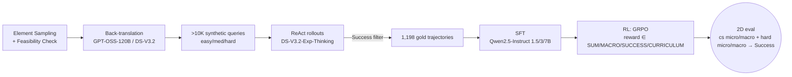

# Breakdown — Demystifying Reinforcement Learning for Long-Horizon Tool-Using Agents: A Comprehensive Recipe

> **Paper:** Demystifying Reinforcement Learning for Long-Horizon Tool-Using Agents: A Comprehensive Recipe
> **Authors:** Xixi Wu, Qianguo Sun, Ruiyang Zhang, Chao Song, Junlong Wu, Yiyan Qi, Hong Cheng (CUHK · IDEA Research · Univ. of Macau)
> **Year:** 2026
> **ArXiv:** https://arxiv.org/abs/2603.21972 (v1, 23 Mar 2026)
> **Code:** https://github.com/WxxShirley/Agent-STAR

> Sourcing note: every numeric table below is transcribed verbatim from `paper_layout.txt` (`pdftotext -layout` of the arXiv PDF, 2149 lines). Figure-only numbers (Figs 1, 4, 5, 6, 7–10) are flagged as bar-readings; all prose-confirmed figures reconcile to the verbatim tables.

---

## 1. Problem & Motivation

- **Problem:** Turning LLMs into autonomous long-horizon agents — decomposing goals into sub-tasks, orchestrating dozens of tool calls, satisfying multifaceted constraints — is an open RL problem. Existing agentic-RL insights come from *short*-horizon tasks (single-step reasoning, few-turn chat), and individual algorithm/data papers each explore only a sliver of the design space. There is no holistic, practical recipe for *scaling* RL in complex multi-turn environments.

- **Why it matters:** Long-horizon workflows (information-seeking web agents, GUI agents, need credit assignment over many steps under sparse success feedback; reward density, model capacity, data mixture, algorithm choice, and even environment reliability interact, and picking each factor in isolation misleads practice.

- **Testbed choice:** TravelPlanner — a travel-agency sandbox requiring orchestration of 6 tools to satisfy commonsense rules (no hallucination, consistent route, diverse restaurants/attractions) **and** hard constraints (budget, room rules/type, cuisine, transport). Local DB → zero-cost, low-latency rollouts essential for RL scale. Even top-tier models (Kimi-K2.5) score <15% success.

- **Evaluation (2D):** A trajectory is a **Success** iff *both* commonsense macro = 1 AND hard-constraint macro = 1. Each dimension also has a micro score (fraction of satisfied rules).

## 2. Key Insight / Contribution

- **Central thesis:** Agentic-RL choices are **scale-dependent** — no single reward/algorithm is universally best; the optimal recipe is a function of model capacity. Smaller models need staged rewards + exploration-heavy algorithms; larger models converge efficiently with simple dense rewards + standard GRPO.

- **Contributions:**
  1. **STAR pipeline** — unified 3-stage post-training framework (Synthesis → SFT → RL) built on rLLM, with a modular setup that varies data/reward/algorithm/environment for controlled study.
  2. **Large-scale empirical study** dissecting the RL design space along **5 axes** → 7 takeaways.
  3. **Actionable scale-aware recipe** → SOTA on TravelPlanner with open-weight 1.5B–7B models, beating leading proprietary LLMs.

- **5 design axes:**

  | Axis | Question | Variants studied |
  |------|----------|----------------|
  | Reward shaping | dense vs sparse? curriculum? | SUM, MACRO, SUCCESS, CURRICULUM |
  | Model scaling | does capacity resolve the bottleneck? | Qwen2.5-Instruct 1.5B / 3B / 7B |
  | Data composition | quantity? difficulty? | 0.1K–2K; Easy/Medium/Hard/Mixed-1K |
  | Algorithm selection | do we need fancy exploration? | GRPO vs DAPO vs ARPO |
  | Environmental stability | robust to noisy tools? | injected tool-failure 0–10% |

## 3. STAR Pipeline (Method)

Three sequential stages:

1. **Data Synthesis.** Sample atomic travel elements (origin, destination, dates) → validate feasibility in-sandbox (guarantee a ground-truth solution exists) → back-translate to NL queries with strong open-weight models (GPT-OSS-120B, DeepSeek-V3.2-Exp). Difficulty controlled by #/type of constraints (easy / medium / hard). Yields **>10K queries**. Reliability check: 200 sampled synthetic queries gave DeepSeek-V3.2-Exp-Thinking **21.9%** success, closely mirroring its **21.1%** on the 180-instance TravelPlanner validation set.

2. **SFT (rejection sampling).** Prompt DeepSeek-V3.2-Exp-Thinking on 5K synthetic queries via ReAct; keep only trajectories hitting task **Success** + format adherence → **1,198 gold trajectories** (avg **10.3K tokens, **9.2 tool calls**; see Table 8). Fine-tune Qwen2.5-Instruct (1.5B/3B/7B). SFT is intentionally *small-scale* — establish protocol adherence without policy collapse, preserving RL exploration room.

3. **RL (the core).** GRPO on rLLM. Reward spectrum aligned to the 2D eval:

  | Reward | Definition | Density |
  |--------|------------|--------|
  | **SUM** | `r = s^micro_cs + s^macro_cs + s^micro_hard + s^macro_hard + s^success` | dense (all sub-metrics) |
  | **MACRO** | `r = s^macro_cs + s^macro_hard + s^success` | semi-sparse (macro only) |
  | **SUCCESS** | `r = s^success` | purely sparse (binary) |
  | **CURRICULUM** | staged: SUM (epochs 1–2) → MACRO (3–4) → SUCCESS (5) | dense→sparse transition |

- **GRPO stabilisation tricks (Yu et al.):** KL-Free & Clip-high (drop KL penalty, raise `ε_high` for exploration); strict protocol (format-error trajectories → reward 0); overlength rollouts excluded from loss but **kept** for advantage normalisation.

## 4. Experiments

### 4.1 Setup (verbatim defaults)

- **SFT:** batch 32, LR `5e-6`, linear warmup 0.1; 3B/7B → 4 epochs, 1.5B → 6 epochs (extra epochs to compensate higher initial entropy).
- **RL (default):** GRPO; **1K** synthetic queries (no SFT overlap); difficulty ratio **4:3:3 easy:medium:hard**; **5 epochs**; group size **G=8**; max ctx **30K** (train) / **32K** (infer); tool-call budget **60**; LR `2e-6`; sampling temp **1.0**. Model selection = best on TravelPlanner's 180-instance validation set.
- **CURRICULUM schedule:** SUM (epochs 1–2) → MACRO (3–4) → SUCCESS (5).
- **Hardware:** 1.5B/3B → single 8×A100-80G node; 7B → two 8×A100-80G nodes.
- **Eval:** in-domain = 1,000-instance TravelPlanner test set; OOD = 7 knowledge-intensive QA benchmarks (NQ, TriviaQA, PopQA, HotpotQA, 2Wiki, Musique, Bamboogle) with a single local Wikipedia-search tool (E5 retriever, top-5 snippets), following Search-R1.
- **Formatting model:** DeepSeek-V3.2-Exp (replaces GPT-4o for cost); all checkpoints + baselines parsed by the *same* pipeline for fairness.
- **Protocol:** strictly one-factor-at-a-time; all others fixed.

### 4.2 Reward Shaping — Tables 1 & 2

> **Table 1 — In-domain TravelPlanner test-set performance (%) across reward designs.** Best per scale in **bold**. (paper_layout.txt L264–287.)

| Scale | Method | CS Micro | CS Macro | Hard Micro | Hard Macro | **Success** |
|-------|--------|---------|---------|----------|----------|----------|
| **1.5B** | Base | 30.1 | 0.0 | 0.0 | 0.0 | 0.0 |
| | SFT | 65.9 | 15.4 | 17.2 | 12.1 | 6.9 |
| | SUM | 95.1 | 71.6 | 51.4 | 33.4 | 33.1 |
| | MACRO | 93.4 | 68.4 | 47.9 | 31.6 | 30.1 |
| | SUCCESS | 93.9 | 68.2 | 51.0 | 34.7 | 33.8 |
| | **CURRICULUM** | 93.9 | 70.2 | 51.0 | 35.4 | **34.9** |
| **3B** | Base | 46.5 | 0.0 | 0.0 | 0.0 | 0.0 |
| | SFT | 70.4 | 24.6 | 28.6 | 20.0 | 12.2 |
| | SUM | 97.6 | 82.5 | 64.8 | 47.6 | 47.0 |
| | MACRO | 95.1 | 79.6 | 68.8 | 52.3 | 48.2 |
| | SUCCESS | 90.6 | 76.1 | 62.6 | 47.7 | 46.6 |
| | **CURRICULUM** | 95.3 | 83.0 | 67.6 | 51.0 | **49.9** |
| **7B** | Base | 55.8 | 0.1 | 0.7 | 0.7 | 0.1 |
| | SFT | 77.1 | 33.1 | 40.6 | 31.3 | 19.7 |
| | **SUM** | 96.9 | 87.4 | 78.7 | 66.5 | **62.8** |
| | MACRO | 97.0 | 89.8 | 77.3 | 60.0 | 58.9 |
| | SUCCESS | 91.4 | 78.3 | 73.4 | 64.0 | 60.9 |
| | CURRICULUM | 96.1 | 85.1 | 76.6 | 60.4 | 57.0 |

> **Table 2 — OOD performance (%) on 7 knowledge-intensive QA benchmarks.** ⋆ = sourced from Ji et al. Best per dataset in **bold**. (L324–353.)

| Scale | Method | NQ | TriviaQA | PopQA | HotpotQA | 2Wiki | Musique | Bamboogle | **Avg** |
|-------|--------|----|--------|-------|---------|-------|--------|----------|------|
| **1.5B** | Base⋆ | 7.1 | 22.4 | 9.9 | 5.9 | 4.3 | 2.6 | 8.0 | 8.6 |
| | SFT | 13.5 | 21.4 | 13.5 | 11.6 | 7.0 | 1.2 | 12.0 | 11.5 |
| | Search-R1⋆ | 39.4 | 51.0 | 39.7 | 14.6 | 24.4 | 2.2 | 4.0 | 25.0 |
| | SUM | 32.1 | 44.5 | 30.9 | 26.0 | 14.8 | 5.3 | 16.8 | 24.3 |
| | MACRO | 29.6 | 45.1 | 28.8 | 26.9 | 19.4 | 6.3 | 23.2 | **25.6** |
| | SUCCESS | 24.8 | 36.9 | 21.3 | 24.2 | 17.7 | 4.6 | 23.2 | 21.8 |
| | CURRICULUM | 20.6 | 28.5 | 20.5 | 16.0 | 11.7 | 3.5 | 17.6 | 16.9 |
| **3B** | Base | 10.6 | 28.8 | 10.8 | 14.9 | 24.4 | 2.0 | 2.4 | 13.4 |
| | SFT | 35.1 | 52.5 | 31.3 | 32.0 | 24.4 | 9.0 | 30.4 | 30.7 |
| | Search-R1 | 34.1 | 54.5 | 37.8 | 32.4 | 31.9 | 10.3 | 26.4 | 32.5 |
| | SUM | 38.2 | 54.9 | 34.3 | 34.2 | 23.3 | 8.8 | 27.2 | 31.6 |
| | MACRO | 37.0 | 54.5 | 34.9 | 37.9 | 29.9 | 11.6 | 33.6 | 34.2 |
| | SUCCESS | 37.5 | 54.1 | 34.0 | 33.7 | 19.4 | 10.3 | 32.0 | 31.6 |
| | CURRICULUM | 41.0 | 56.8 | 36.2 | 39.5 | 27.7 | 12.4 | 32.0 | **35.0** |
| **7B** | Base | 13.4 | 40.8 | 14.0 | 18.3 | 25.0 | 3.1 | 12.0 | 18.1 |
| | SFT | 41.2 | 59.7 | 37.6 | 47.0 | 37.8 | 16.3 | 53.6 | 41.9 |
| | Search-R1 | 39.3 | 61.0 | 39.7 | 37.0 | 41.4 | 14.6 | 36.8 | 38.5 |
| | SUM | 35.5 | 54.5 | 34.8 | 44.8 | 34.6 | 15.4 | 37.6 | 36.7 |
| | MACRO | 42.2 | 61.2 | 39.6 | 48.8 | 38.3 | 17.4 | 52.8 | **42.9** |
| | SUCCESS | 38.7 | 55.9 | 35.2 | 45.8 | 38.4 | 15.5 | 41.6 | 38.7 |
| | CURRICULUM | 41.1 | 58.7 | 37.7 | 48.4 | 38.5 | 17.4 | 45.6 | 41.1 |

> **Takeaway 1 — Reward design is scale-dependent; sparse-only is suboptimal.** Smaller models struggle with long-horizon credit assignment → staged CURRICULUM gives the highest success (1.5B 34.9, 3B 49.9) and faster convergence (Fig 7). The 7B model leverages fine-grained SUM directly → CURRICULUM's heuristic staging is unnecessary/slightly restrictive (SUM 62.8 > CURRICULUM 57.0). Sparse SUCCESS is competitive but **never best at any scale** — outcome-only feedback is insufficient.

> **Takeaway 2 — Overly-dense rewards impose an alignment tax on OOD.** SUM maximises 7B in-domain (62.8) but its OOD Avg (36.7) falls well behind the SFT checkpoint (41.9) — overfit to the TravelPlanner format. Semi-sparse MACRO balances: best 7B OOD (42.9) while staying competitive in-domain.

### 4.3 Model Scaling — Figure 4

> In-domain success-rate deltas across scales (Figure 4 bar-readings; all reconcile exactly to Table 1's Success column):

  | Reward | 1.5B → 3B | 3B → 7B | 1.5B → 7B (total) |
  |--------|-----------|-----------|---------------------|
  | SUM | +13.9 (33.1→47.0) | +15.8 (47.0→62.8) | +29.7 |
  | MACRO | +18.1 (30.1→48.2) | +10.7 (48.2→58.9) | +28.8 |
  | SUCCESS | +12.8 (33.8→46.6) | +14.3 (46.6→60.9) | +27.1 |
  | CURRICULUM | +15.0 (34.9→49.9) | +7.1 (49.9→57.0) | +22.1 |

> **Takeaway 3 — Scaling consistently helps, but the gain magnitude is reward-dependent.** 1.5B→7B nearly doubles SUM success (33.1→62.8). Larger models converge faster + reach higher asymptotes (Fig 8). — capacity is the primary bottleneck and RL unlocks it. But the 3B→7B gain ranges from **+15.8 (SUM)** down to **+7.1 (CURRICULUM)** — improvement rate is reward-dependent.

### 4.4 Data Composition — Figure 5, Tables 3 & 9

> **Data quantity (Figure 5 bar-readings, success rate, 3B + CURRICULUM):** SFT 12.2 → 0.1K 37.5 → 0.2K 44.1 → 0.5K 45.4 → **1K 49.9** → 2K 50.8. (All configs run an equalised ~155 gradient steps.)

> **Table 3 — In-domain TravelPlanner (%) across data-difficulty compositions (3B, CURRICULUM, 1K prompts).** (L453–477.)

| Composition | CS Micro | CS Macro | Hard Micro | Hard Macro | **Success** |
|-------------|---------|---------|----------|----------|----------|
| Easy-1K | 92.8 | 79.7 | 62.8 | 46.9 | 45.3 |
| Medium-1K | 94.9 | 69.2 | 66.2 | 49.0 | 41.1 |
| Hard-1K | 90.0 | 48.4 | 65.5 | 47.2 | 25.9 |
| **Mixed-1K** | 95.3 | 83.0 | 67.6 | 51.0 | **49.9** |

> **Table 9 — OOD (%) across data configurations (3B, CURRICULUM).** Best per dataset in **bold**. (L1376–1389.) Note Mixed-1K == the 1K default, hence identical rows.

| Mode | Data | NQ | TriviaQA | PopQA | HotpotQA | 2Wiki | Musique | Bamboogle | **Avg** |
|------|------|----|--------|-------|---------|-------|--------|----------|------|
| (SFT) | — | 35.1 | 52.5 | 31.3 | 32.0 | 24.4 | 9.0 | 30.4 | 30.7 |
| **Quantity** | 0.1K | 39.2 | 57.4 | 35.0 | 38.5 | 26.3 | 9.8 | 30.4 | 33.8 |
| | 0.2K | 37.5 | 56.7 | 34.7 | 36.8 | 29.2 | 9.6 | 29.6 | 33.4 |
| | 0.5K | 39.9 | 57.3 | 34.0 | 37.4 | 25.2 | 11.8 | 29.6 | 33.6 |
| | **1K** | 41.0 | 56.8 | 36.2 | 39.5 | 27.7 | 12.4 | 32.0 | **35.0** |
| | 2K | 38.5 | 56.7 | 34.4 | 34.3 | 22.4 | 9.6 | 29.6 | 32.2 |
| **Difficulty** | Easy-1K | 37.0 | 54.4 | 33.5 | 37.7 | 30.7 | 10.1 | 31.4 | 33.5 |
| | Medium-1K | 38.7 | 56.5 | 34.9 | 38.3 | 26.5 | 10.7 | 26.4 | 33.1 |
| | Hard-1K | 38.1 | 55.1 | 36.8 | 39.0 | 29.9 | 11.1 | 28.0 | 34.0 |
| | **Mixed-1K** | 41.0 | 56.8 | 36.2 | 39.5 | 27.7 | 12.4 | 32.0 | **35.0** |

> **Takeaway 4 — RL data has a sweet spot; over-scaling degrades OOD.** 0.1K→1K lifts in-domain success 37.5→49.9 and OOD Avg to a **35.0** peak. Pushing to 2K barely moves in-domain (50.8, +0.9) but **drops OOD to 32.2** — the model over-optimises the training distribution, sacrificing transferability.

> **Takeaway 5 — Balanced difficulty prevents reward sparsity.** Easy-only learns basic planning (CS Macro 79.7) but fails complex constraints. Hard-only collapses (CS Macro 48.4, Success 25.9) — multifaceted constraints make successful trajectories too rare → reward sparsity → can't learn even commonsense. Mixed-1K resolves both: enough easy tasks for dense commonsense signal + enough hard tasks for constraint mastery → best Success (49.9).

### 4.5 Algorithm Selection — Table 4

> **Table 4 — Performance (%) + training efficiency across RL algorithms.** Best per metric per scale in **bold**. GPU-hours: 8×A100-80G (1.5B/3B), 16×A100 (7B). (L523–537.) Reward = MACRO for 1.5B/3B, SUM for 7B.

| Scale | Algorithm | CS Micro | CS Macro | Hard Micro | Hard Macro | **Success ↑** | Time/Step (min) ↓ | **GPU-hrs ↓** |
|-------|-----------|---------|---------|----------|----------|------------|---------------|-----------|
| **1.5B** | GRPO | 93.4 | 68.4 | 47.9 | 31.6 | 30.1 | **8.0** | **164** |
| | DAPO | 94.4 | 77.7 | 55.6 | 38.2 | 36.9 | 8.2 | 183 |
| | ARPO | 93.1 | 76.4 | 58.1 | 39.4 | **37.5** | 9.5 | 195 |
| **3B** | GRPO | 95.1 | 79.6 | 68.8 | 52.3 | **48.2** | **8.6** | **176** |
| | DAPO | 93.6 | 78.6 | 66.1 | 48.7 | 45.6 | 8.9 | 184 |
| | ARPO | 95.4 | 80.3 | 67.9 | 51.5 | 47.5 | 13.3 | 273 |
| **7B** | GRPO | 96.9 | 87.4 | 78.7 | 66.5 | **62.8** | **9.0** | **368** |
| | DAPO | 95.6 | 87.9 | 75.4 | 60.6 | 58.4 | 9.5 | 390 |
| | ARPO | 96.7 | 86.8 | 76.6 | 61.1 | 58.3 | 13.3 | 547 |

> **Takeaway 6 — Need for fancy exploration is inversely correlated with model capability.** At 1.5B, exploration-heavy ARPO/DAPO beat GRPO (37.5 / 36.9 vs 30.1). The gap closes at 3B and **inverts at 7B**: plain GRPO wins (62.8 > DAPO 58.4 > ARPO 58.3) — and at the lowest cost (368 GPU-hrs vs ARPO 547). Practical shift: for strong base models, rely on GRPO's raw efficiency instead of engineering complex heuristic samplers. (ARPO's per-step entropy-difference branching adds ~50% step-time overhead: 8.0→13.3 min.)

### 4.6 Environmental Stability — Figure 6

> Setup: inject a global `<tool_response> Error: Current tool {tool_name} is not available.</tool_response>` into the observation space at random probability during any tool execution; train 3B + MACRO; evaluate on a **clean** test env. Sweep 0% / 1% / 2% / 5% / 10%.

> **Takeaway 7 — Resilient to mild noise, degrades under high instability.** Test success stays roughly flat for failure-rate ≤5% (Fig 6b). At 10%, training convergence slows + variance rises (Fig 6a) and final test success drops across **all** metrics — high instability starves the model of reliable reward signal during exploration, blocking constraint mastery.

### 4.7 Headline SOTA — Figure 1

> Figure 1 (bar-readings; the only prose-anchored number is "Kimi-K2.5 < 15%"). STAR-trained 1.5B/3B/7B significantly beat both their SFT counterparts and leading proprietary LLMs (DeepSeek-V3.2-Exp-Thinking-671B, Gemini3-Pro, Seed-1.8, Kimi-K2.5-1T, Qwen3.5-122B-A10B, Qwen3.5-397B-A17B, GPT-5, Planner-R1-32B). STAR's best per scale (SUM/ CURRICULUM, from Table 1): 1.5B **34.9**, 3B **49.9**, 7B **62.8** — vs top-tier LLMs all <15%. Sourcing caveat: per-model bar heights are figure-only; the text gives only the qualitative "below 15%" claim for the strongest baseline.

## 5. TravelPlanner Testbed Details (Appendix B)

> **Table 5 — Implemented tools (sandbox DB).** (L1039–1046.) 6 information-gathering tools, all local-DB → zero execution cost.

| Tool | Arguments | Description | # Data Entries |
|------|-----------|-------------|--------------|
| SearchCity | state | Find cities within a state | 64 |
| SearchFlight | departure, destination, date | Flight info between cities on dates | 3,827,361 |
| GoogleDistance | departure, destination, mode | Distance / travel-time / cost between cities | 17,603 |
| SearchRestaurant | city | Restaurant options in a city | 9,552 |
| SearchAttraction | city | Tourist attractions in a city | 5,303 |
| SearchAccommodation | city | Accommodation options in a city | 5,064 |

> **Dataset splits:** train 45 / validation 180 / **test 1,000**.

> **Table 6 — Difficulty examples (validation set).** Difficulty ∝ # constraints. (L1057–1080.) Easy = 1 person + a single budget limit. Medium = a group + accommodation prefs alongside budget. Hard = long-horizon, multi-dimensional constraints (strict accommodation rules + transport limits).

> **Table 7 — Official evaluation rules.** (L1095–1118.) *Commonsense:* within-sandbox (no hallucination), complete information, within-current-city, reasonable city route, diverse restaurants, diverse attractions, non-conflict transportation, minimum-nights-stay. *Hard constraint:* budget, room rule (no parties/smoking/children-under-10/pets/visitors), room type (entire/private/shared/no-shared), cuisine (Chinese/American/Italian/Mexican/Indian/Mediterranean/French), transportation (no flight / no self-driving).

## 6. SFT Trajectory Statistics — Table 8

> **Table 8 — Filtered SFT trajectories on synthetic data.** (L1166–1172.) "Avg. Tokens of Planning" = avg token cost of the final itinerary.

| Type | # Entries | Avg Tool Calls | Avg Tokens | Avg. Tokens of Planning |
|------|----------|---------------|-----------|---------------------------|
| Easy | 627 (52.3%) | 8.8 | 10.1K | 1204.7 |
| Medium | 373 (31.1%) | 8.4 | 9.8K | 1203.1 |
| Hard | 198 (16.5%) | 11.7 | 11.8K | 1343.1 |
| **All** | **1,198** | **9.2** | **10.3K** | **1227.1** |

> Reconciliation (source-free): 627+373+198 = 1198 ✓; 627/1198 = 52.34% ✓; the All avg-tool-calls (9.2) = (627·8.8 + 373·8.4 + 198·11.7)/1198 = 9.15 ✓.

## 7. OOD Generalisation Findings

- TravelPlanner-only RL transfers to simpler domains: STAR variants match or beat the domain-specific Search-R1 baseline on QA Avg across scales (1.5B MACRO 25.6 vs Search-R1 25.0; 3B CURRICULUM 35.0 vs 32.5; 7B MACRO 42.9 vs 38.5).
- The alignment tax (Takeaway 2) is visible only at 7B and only for the densest reward: SUM 7B OOD Avg 36.7 < SFT 41.9; MACRO/SUCCESS/CURRICULUM (42.9/38.7/41.1) all stay ≥ SFT. At 1.5B/3B no reward shows a clear tax — small models don't overfit because they never saturate the task.

## 8. Strengths / Weaknesses / Limitations

**Strengths**
- Genuinely holistic: 5-axis decomposition with strict one-factor-at-a-time control, equalised gradient steps (~155) across data-quantity configs, shared technical enhancements across algorithms, identical eval pipeline for all checkpoints + baselines.
- Scale-aware recipe is actionable and counter-intuitive (small = staged + exploration; large = dense + GRPO).
- Open-weight SOTA with 1.5B–7B beating proprietary 100B–1T LLMs — strong efficiency result.
- Cheap local-sandbox testbed → reproducible at low cost.

**Weaknesses / threats to validity**
- Single-factor analysis by design — the 5 axes surely *interact* (e.g. small-model-favoured CURRICULUM + exploration-heavy ARPO may combine differently than isolated); the paper flags this as limitation #4 but does not study it.
- One testbed (TravelPlanner) — reward/algorithm findings could be testbed-specific (limitation #1).
- OOD = only knowledge-intensive QA (limitation #2) — generalisation claim is narrow.
- ≤7B only (limitation #3) — the scale-aware recipe's crossover point (where SUM overtakes CURRICULUM, GRPO overtakes ARPO) is extrapolated, not measured, for frontier models.
- Formatting-model swap (DeepSeek-V3.2-Exp for GPT-4o) is justified by an offline alignment study but the alignment-rate number is not reported.
- Reward shaping is trajectory-level/task-specific (limitation #4) — no step-level bonuses tested.

## 9. Verdict

A clean, well-controlled empirical "recipe" paper in the spirit of the verification-horizon / are-we-ready-for-an-agent lineage. The contribution is the *systematic map* of the agentic-RL design space + a counter-intuitive scale-aware prescription, not a new algorithm. Tables 1–4 + 9 are the load-bearing evidence; Figures 4–6 + 7–10 are dynamics that corroborate but don't add new numeric claims. Highest-value cells for a re-verifier: Table 1 (reward × scale success), Table 4 (algorithm × scale success **and** GPU-hours — the efficiency angle is under-appreciated in the prose), and Table 3 (difficulty collapse). The headline "beats proprietary LLMs" rests on Figure 1 bar-readings (only Kimi-K2.5 < 15% is prose-confirmed) — quote it qualitatively unless re-measuring the bars.

---

> **Iteration note:** breakdown built fresh from arXiv 2603.21972 in iteration 29 of the gnhf run. All 9 tables transcribed verbatim from `paper_layout.txt`; every Avg reconciles (Table 2 / Table 9 row-means); Figure 4 deltas and Figure 5 / Table 3 / Table 8 internal arithmetic all check out. No first-pass cell scrambling to correct because this is a primary (source-first) build, not a re-derivation from a collapsed plain-text dump.
