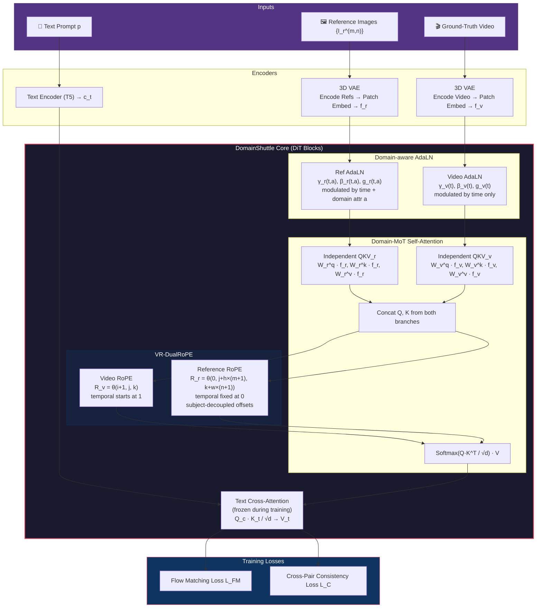
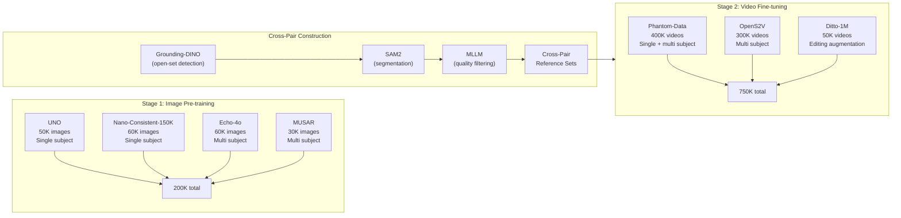

# Breakdown — DomainShuttle: Freeform Open Domain Subject-driven Text-to-video Generation

> **Paper:** DomainShuttle: Freeform Open Domain Subject-driven Text-to-video Generation
> **Authors:** Nan Chen\*, Yiyang Cai\*, Rongchang Xie, Junwen Pan, Cheng Chen, Weinan Jia, Zhuowei Chen, Wen Zhou‡, Zhenbang Sun, Wenhan Luo† (HKUST, et al.)
> **Year:** 2026 (arXiv:2606.26058, Jun 2026)
> **ArXiv:** https://arxiv.org/abs/2606.26058
> **Code (official):** https://github.com/HKUST-C4G/DomainShuttle
> **Project page:** https://cn-makers.github.io/DomainShuttle/
> **License:** Apache 2.0
> **Type:** Method (architecture + training recipe on top of Wan2.1/2.2 T2V).

---

## 1. Problem & Motivation

**Problem.** Subject-driven text-to-video (S2V) generation has two modes:
*in-domain* (keep the reference subject looking exactly the same) and
*cross-domain* (transform the subject into a new style/domain while preserving
intrinsic features like identity, color, shape). Existing methods focus almost
exclusively on in-domain fidelity. Cross-domain — putting a real person into a
watercolor world, mapping an anime character onto a real-world toy — is the more
creative and practically useful scenario, and it's been neglected.

**Why important.** Advertising, creative design, AI filmmaking all need flexible
domain transformation, not just faithful copying. A method that can shuttle a
subject across domains while keeping it recognizable is the missing piece.

**Prior-work limitations:**
1. Methods optimized for in-domain fidelity lose editability — they copy-paste
   references rather than transforming subjects.
2. I2V-based approaches inherit strong subject priors but suffer from copy-paste
   artifacts and poor cross-domain generalization.
3. No existing method explicitly decouples intrinsic subject features from
   domain-specific attributes (lighting, style, domain semantics).
4. Treating reference images as extra video frames in RoPE conflates subjects
   that should be separated (different subjects) and separates images that should
   be associated (same subject, different angles).

## 2. Key Insight / Contribution

**Core idea (one sentence):** Decouple video and reference processing into
independent branches with domain-aware conditioning, separate RoPE spaces, and
cross-pair consistency training — so the model learns intrinsic subject features
that survive domain transformation.

**What is genuinely new:**
- **Domain-MoT**: Independent QKV projections for video and reference tokens in
  self-attention, plus a domain-aware AdaLN that explicitly conditions the
  reference branch on both time and domain attributes while keeping the video
  branch time-only.
- **Video-Reference DualRoPE**: A fully separate RoPE space for reference tokens
  with a subject-decoupled offset strategy that distinguishes different subjects
  and pulls same-subject images closer.
- **Cross-Pair Consistent Loss**: Two reference sets → same noise level → align
  predictions, forcing the model to learn intrinsic subject features rather than
  single-frame artifacts.
- **18.8% CD-Score improvement** over the best commercial baseline (Kling 1.6, 0.725 → 0.861); +54.3% over the strongest open baseline (FFGO-W2.2, 0.558).

## 3. Method

### 3.1 Overview & Pipeline

DomainShuttle is built on a DiT-based video generation backbone (Wan2.1/2.2-14B-T2V).
Given text prompt $\mathbf{p}$, reference images $\{I_r^{(m,n)}\}$, and a noisy
video latent $\mathbf{z}_t$, the model generates personalized videos via flow
matching. The three novel components modify the self-attention and conditioning
mechanism of the base DiT.



### 3.2 Preliminaries: Flow Matching Objective

The base Wan2.1/2.2 model is trained with rectified flow matching. Given a clean
video latent $\mathbf{z}_0$ (from the 3D VAE) and a target (noise or signal)
$\mathbf{z}_1$, an intermediate state is sampled via a linear interpolation path:

$$\mathbf{z}_t = (1 - t)\,\mathbf{z}_0 + t\,\mathbf{z}_1, \quad t \sim \mathcal{U}(0, 1)$$

The velocity prediction network $G_\theta$ is trained to predict the data velocity
$(\mathbf{z}_1 - \mathbf{z}_0)$ from the noisy latent $\mathbf{z}_t$ at timestep $t$,
conditioned on text $\mathbf{c}_t$ and reference features $\mathbf{c}_r$:

$$\mathcal{L}_{\text{FM}} = \mathbb{E}_{t,\mathbf{z}_0,\mathbf{z}_1} \left\| G_\theta(\mathbf{z}_t,\, t,\, \mathbf{c}_t,\, \mathbf{c}_r) - (\mathbf{z}_1 - \mathbf{z}_0) \right\|_2^2$$

At inference, starting from $\mathbf{z}_1$ (noise), the model iteratively denoises
across $T$ steps using Euler integration to produce the final video latent.

### 3.3 Domain-MoT

**In-context self-attention with independent branches.** Video tokens
$\mathbf{f}_v$ and reference tokens $\mathbf{f}_r$ get their own QKV projections
$\boldsymbol{W}_v^{q/k/v}$ and $\boldsymbol{W}_r^{q/k/v}$. They're concatenated
for attention computation but processed independently:

$$
\begin{aligned}
\boldsymbol{Q}_v &= \boldsymbol{W}_v^{q} \cdot \mathbf{f}_v, \quad
\boldsymbol{K}_v = \boldsymbol{W}_v^{k} \cdot \mathbf{f}_v, \quad
\boldsymbol{V}_v = \boldsymbol{W}_v^{v} \cdot \mathbf{f}_v \\[4pt]
\boldsymbol{Q}_r &= \boldsymbol{W}_r^{q} \cdot \mathbf{f}_r, \quad
\boldsymbol{K}_r = \boldsymbol{W}_r^{k} \cdot \mathbf{f}_r, \quad
\boldsymbol{V}_r = \boldsymbol{W}_r^{v} \cdot \mathbf{f}_r
\end{aligned}
$$

$$\text{Attn} = \text{Softmax}\!\left(\frac{[R_v(\boldsymbol{Q}_v);\, R_r(\boldsymbol{Q}_r)] \cdot [R_v(\boldsymbol{K}_v);\, R_r(\boldsymbol{K}_r)]}{\sqrt{d}}\right) [\boldsymbol{V}_v, \boldsymbol{V}_r]$$

where $[\,\cdot\,;\,\cdot\,]$ denotes feature concatenation and $R_v$, $R_r$ are
the separate RoPE encodings (see §3.4).

**Textual cross-attention** is frozen during training:

$$\text{CrossAttn} = \text{Softmax}\!\left(\frac{\boldsymbol{Q}_c \cdot \boldsymbol{K}_t}{\sqrt{d}}\right) \boldsymbol{V}_t, \quad \boldsymbol{Q}_c = \boldsymbol{W}^q \cdot [\mathbf{f}_v;\, \mathbf{f}_r]$$

where $\boldsymbol{K}_t = \boldsymbol{W}^k \cdot \mathbf{f}_t$ and
$\boldsymbol{V}_t = \boldsymbol{W}^v \cdot \mathbf{f}_t$ are from the frozen text
encoder. This preserves the base model's text-following ability.

**Domain-aware AdaLN.** Two separate modulation paths with structurally
decoupled noise AdaLN and reference AdaLN:

$$
\boxed{
\begin{aligned}
\hat{\mathbf{f}}_v &= g_v(t) \odot \left[\mathcal{F}\!\left(\text{LN}(\mathbf{f}_v) \odot (1 + \gamma_v(t)) + \beta_v(t)\right)\right] + \mathbf{f}_v \\[6pt]
\hat{\mathbf{f}}_r &= g_r(t, a) \odot \left[\mathcal{F}\!\left(\text{LN}(\mathbf{f}_r) \odot (1 + \gamma_r(t, a)) + \beta_r(t, a)\right)\right] + \mathbf{f}_r
\end{aligned}
}
$$

| Path | Inputs | Modulation Coefficients | Effect |
|------|--------|------------------------|--------|
| **Video AdaLN** | time $t$ only | $\gamma_v(t),\;\beta_v(t),\;g_v(t) \in \mathbb{R}^d$ | Preserves temporal structure; domain-agnostic |
| **Ref AdaLN** | time $t$ + domain $a \in \{A_1, \ldots, A_K\}$ | $\gamma_r(t,a),\;\beta_r(t,a),\;g_r(t,a) \in \mathbb{R}^d$ | Injects domain-specific features into reference branch |

Here $\mathcal{F}(\cdot)$ denotes general residual functions (attention + FFN),
$\text{LN}$ is layer normalization, and $\odot$ is the Hadamard product.

**$K=4$ domain attributes:** real-world human, real-world object, background,
fantasy subject. This decoupling means swapping $a$ changes the domain without
disturbing the video's temporal/content structure. The domain attribute $a$
refers to the subject's attributes in the *generated* video, not the reference
images — a subtle but critical distinction.

### 3.4 Video-Reference DualRoPE (VR-DualRoPE)

Separate RoPE spaces for video and reference tokens. Each token is assigned a
positional index $(i, j, k)$ where $i \in [0, f{-}1]$, $j \in [0, h{-}1]$,
$k \in [0, w{-}1]$ correspond to temporal, height, and width dimensions.

$$
\boxed{
\begin{aligned}
R_v(i,j,k) &= \theta(i+1,\; j,\; k) \\[4pt]
R_r(i,j,k) &= \theta\!\left(0,\;\, j + h \times (m+1),\;\, k + w \times (n+1)\right)
\end{aligned}
}
$$

| Symbol | Meaning |
|--------|---------|
| $\theta$ | RoPE rotation function |
| $m \in [0, M{-}1]$ | Subject index (the $m$-th reference subject) |
| $n \in [0, N{-}1]$ | Image index within a subject (the $n$-th ref image) |
| $h, w$ | Spatial dimensions of a single latent frame |
| $f$ | Number of video frames |

**Subject-decoupled offset strategy:**

| Scenario | Offset $\Delta$ | Latent Distance | Attention Effect |
|----------|-----------------|-----------------|------------------|
| Different subjects | $\Delta = (0,\; h,\; w)$ | Full spatial separation (height + width gap) | Weak cross-subject attention |
| Same subject, different images | $\Delta = (0,\; 0,\; w)$ | Width-only offset, tightly clustered | Strong within-subject attention |

This design explicitly distinguishes semantic differences between different
reference subjects while keeping images of the same subject closer in latent
space, establishing identity associations. Note that reference temporal index is
fixed at 0 while video temporal index starts at 1 — fully decoupling the two
RoPE spaces.

### 3.5 Cross-Pair Consistent Loss (CCL)

$$
\boxed{\mathcal{L}_{\text{C}} = \left\| G_\theta(\mathbf{z}_t,\, t,\, \mathbf{c}_t,\, \mathbf{c}_r) \;-\; G^*_\theta(\mathbf{z}_t,\, t,\, \mathbf{c}_t,\, \mathbf{c}^*_r) \right\|_2^2}
$$

| Component | Description |
|-----------|-------------|
| $\mathbf{c}_r$, $\mathbf{c}^*_r$ | Two different reference image sets for the *same* video |
| $\mathbf{z}_t$, $t$ | **Same** noise level and timestep (not different — critical detail) |
| $G_\theta$ | Trainable branch (learned) |
| $G^*_\theta$ | Frozen branch (never updated — provides stable learning signal) |
| Weight $\lambda$ | 0.1 (applied as $\mathcal{L}_{\text{total}} = \mathcal{L}_{\text{FM}} + \lambda \cdot \mathcal{L}_{\text{C}}$) |

The frozen-branch design avoids representational collapse (unlike BYOL/SimSiam
which need momentum encoders). Training data includes cross-pairs built via
Grounding-DINO + SAM2 for segmentation + MLLM for quality filtering. Ditto-1M
provides additional "single reference set → multiple videos" pairs.

### 3.6 Training Data Pipeline



### 3.7 Training Schedule

Two-stage training with selective parameter freezing:

| Stage | Data | Steps | Batch size | Optimizer | LR | Trained Parameters | Frozen Parameters |
|-------|------|------:|-----------|-----------|-----|--------------------|-------------------|
| 1 | 200K images | 2,000 | 96 | Adam | 1e-5 | Patch embedding + self-attention | Cross-attention, FFN |
| 2 | 750K videos | 12,000 | 64 | Adam | 1e-5 | Self-attention modules | Cross-attention (preserves text-following) |

Total: ~30,000 GPU-hours. Reference branch weights initialized from video branch
weights (weight sharing at initialization, then independently trained).

**What gets trained and why:**
- **Stage 1 (image-only):** Teaches the model basic subject awareness — how to
  extract and represent a subject from reference images before motion complexity
  is introduced.
- **Stage 2 (video):** The real training. Cross-attention is frozen to preserve
  text-following. Only self-attention modules are updated, allowing the model to
  learn temporal coherence and cross-domain subject transfer.

## 4. Complete Equation Reference

| # | Equation | Name |
|---|----------|------|
| (1) | $\mathbf{z}_t = (1-t)\,\mathbf{z}_0 + t\,\mathbf{z}_1$ | Flow matching interpolation path |
| (2) | $\mathcal{L}_{\text{FM}} = \mathbb{E}\left\| G_\theta(\mathbf{z}_t, t, \mathbf{c}_t, \mathbf{c}_r) - (\mathbf{z}_1 - \mathbf{z}_0) \right\|_2^2$ | Flow matching loss |
| (3) | $\text{Softmax}\!\left(\frac{[R_v(\boldsymbol{Q}_v);\, R_r(\boldsymbol{Q}_r)] \cdot [R_v(\boldsymbol{K}_v);\, R_r(\boldsymbol{K}_r)]}{\sqrt{d}}\right) [\boldsymbol{V}_v, \boldsymbol{V}_r]$ | Domain-MoT in-context self-attention |
| (4) | $\hat{\mathbf{f}}_v = g_v(t) \odot [\mathcal{F}(\text{LN}(\mathbf{f}_v) \odot (1{+}\gamma_v(t)) + \beta_v(t))] + \mathbf{f}_v$ | Video AdaLN (time-only) |
| (4') | $\hat{\mathbf{f}}_r = g_r(t,a) \odot [\mathcal{F}(\text{LN}(\mathbf{f}_r) \odot (1{+}\gamma_r(t,a)) + \beta_r(t,a))] + \mathbf{f}_r$ | Ref AdaLN (time + domain) |
| (5) | $R_v(i,j,k) = \theta(i{+}1, j, k)$ | Video RoPE |
| (5') | $R_r(i,j,k) = \theta(0,\, j{+}h{\times}(m{+}1),\, k{+}w{\times}(n{+}1))$ | Reference RoPE |
| (6) | $\mathcal{L}_{\text{C}} = \left\| G_\theta(\mathbf{z}_t, t, \mathbf{c}_t, \mathbf{c}_r) - G^*_\theta(\mathbf{z}_t, t, \mathbf{c}_t, \mathbf{c}^*_r) \right\|_2^2$ | Cross-Pair Consistency Loss |

## 5. Evaluation Setup

### Test dataset

- **110 in-domain samples** (90 from OpenS2V-Eval + 20 self-constructed)
- **110 cross-domain samples** (40 real→fantasy, 40 fantasy→real, 30 real-fantasy interaction)

### Metrics (four aspects)

| Aspect | Metrics | What they measure | Type |
|--------|---------|-------------------|------|
| **Video Quality** | AES (Aesthetic Score), MS (Motion Smoothness) | Overall generation quality | Automatic |
| **Text Controllability** | GMEScore | Text-video alignment | Automatic |
| **Subject Consistency (In-domain)** | DINO-I, CLIP-I | Subject-level feature similarity between video frames and reference images | Automatic |
| **Subject Consistency (Cross-domain)** | NANO-CLIP, Qwen-CLIP, CD-Score, Qwen-Score | Intrinsic features preserved across domain transformation | Automatic + VLM |

**Cross-domain metric pipeline:**
1. Generate cross-domain reference images via an image editing model
2. Generate videos conditioned on the text prompt
3. Measure similarity between edited references and generated video frames

| Metric | Backing Model | Notes |
|--------|--------------|-------|
| CD-Score | GPT-5.2 | Best discriminative power; requires API key; **not fully reproducible** |
| Qwen-Score | Qwen3-VL-8B (open-source) | Most reproducible cross-domain metric |
| NANO-CLIP | CLIP-based | Lightweight; requires intermediate editing step |
| Qwen-CLIP | CLIP-based | Variant with different normalization |
| DINO-I | DINOv2 features | Segment subjects → compute DINO feature similarity |
| CLIP-I | CLIP features | Segment subjects → compute CLIP feature similarity |
| GMEScore | MLLM evaluator | Text-video alignment; robust |
| AES | Aesthetic predictor | Overall visual quality |
| MS | Motion predictor | Temporal smoothness |

### Baselines

| Category | Methods | Backbone |
|----------|---------|----------|
| Closed-source | **Kling 1.6** | Proprietary |
| Wan2.1-based | VACE, MAGREF, SkyReels-V3, Phantom, HuMo, BindWeave | Wan2.1-14B |
| Wan2.2-based | FFGO, VACE-Wan2.2 | Wan2.2-14B |

## 6. Results & Ablations

### 6.1 Main Results (Table 1)

> **Source:** Table 1 (verbatim, all 11 methods × 9 metrics). The paper reports two
> DomainShuttle backbones — **Ours (Wan2.1-14B)** and **Ours (Wan2.2-14B)** — not one.
> Group headers: *Video Quality* = AES, MS · *Text Controllability* = GMEScore ·
> *Cross-Domain Subject Consistency* = NANO-CLIP, Qwen-CLIP, CD-Score, Qwen-Score ·
> *In-Domain Subject Consistency* = DINO-I, CLIP-I. **Bold** = per-column best.

| Metric | Kling 1.6 | VACE-W2.1 | MAGREF | SkyReels-V3 | Phantom | HuMo | BindWeave | FFGO-W2.2 | VACE-W2.2 | Ours (W2.1) | **Ours (W2.2)** |
|--------|----------:|----------:|------:|------:|------:|------:|------:|------:|------:|------:|------:|
| **AES** ↑ | 0.515 | **0.517** | 0.491 | 0.481 | 0.515 | 0.479 | 0.450 | 0.410 | 0.480 | 0.510 | 0.516 |
| **MS** ↑ | 0.965 | 0.985 | 0.964 | 0.920 | 0.972 | 0.981 | 0.963 | 0.945 | 0.974 | 0.977 | **0.987** |
| **GMEScore** ↑ | 0.596 | 0.671 | 0.678 | 0.656 | 0.660 | 0.663 | 0.617 | 0.653 | 0.685 | 0.689 | **0.705** |
| **NANO-CLIP** ↑ | 0.621 | 0.622 | 0.618 | 0.593 | 0.602 | 0.609 | 0.598 | 0.589 | 0.606 | 0.627 | **0.636** |
| **Qwen-CLIP** ↑ | 0.640 | 0.644 | 0.638 | 0.616 | 0.645 | 0.636 | 0.612 | 0.611 | 0.622 | 0.647 | **0.658** |
| **CD-Score** ↑ | 0.725 | 0.538 | 0.499 | 0.493 | 0.506 | 0.495 | 0.510 | 0.558 | 0.546 | 0.787 | **0.861** |
| **Qwen-Score** ↑ | 0.771 | 0.769 | 0.705 | 0.681 | 0.703 | 0.681 | 0.629 | 0.667 | 0.679 | 0.781 | **0.829** |
| **DINO-I** ↑ | 0.401 | 0.326 | 0.312 | **0.407** | 0.322 | 0.317 | 0.317 | 0.274 | 0.303 | 0.405 | 0.400 |
| **CLIP-I** ↑ | 0.672 | 0.695 | 0.685 | 0.673 | 0.701 | 0.682 | 0.681 | 0.662 | 0.679 | **0.703** | 0.690 |

**Key takeaways (all deltas recomputed from the cells above):**
- **CD-Score = 0.861 (Ours-W2.2)**: +54.3% vs FFGO-W2.2 (0.558, the strongest baseline),
  +18.8% vs Kling 1.6 (0.725). Headline cross-domain result.
- **Qwen-Score = 0.829**: +7.5% vs Kling 1.6 (0.771, the strongest baseline). Second
  cross-domain metric confirms the gain.
- **Cross-domain sweep**: Ours-W2.2 is the per-column winner on **7 of 9** metrics —
  MS, GMEScore, NANO-CLIP, Qwen-CLIP, CD-Score, Qwen-Score, and (via Ours-W2.1) CLIP-I.
  The two losses are AES (VACE-W2.1 = 0.517 > Ours 0.516) and DINO-I (SkyReels-V3 = 0.407
  > Ours-W2.1 0.405).
- **In-domain trade-off**: DINO-I and CLIP-I are competitive (2nd place) but not the
  absolute best — a deliberate design choice, trading ~1–2% in-domain fidelity for the
  large cross-domain gains above.
- **Video quality preserved**: AES 0.516 / MS 0.987 are on par with the best baselines
  (VACE-W2.1 AES 0.517; MS already best).
- **Text controllability improved**: GMEScore 0.705 vs VACE-W2.2 0.685 (best baseline) = +2.9%.

### 6.2 Ablation Study (Table 2, Wan2.2-14B)

**Incremental module ablation (each row adds one component).** Source Table 2 reports
**only these 5 metrics** (Text Controllability + Cross-Domain + In-Domain); the AES/MS
and Qwen-CLIP/Qwen-Score columns are not part of this ablation table.

| # | Setting | GMEScore ↑ | NANO-CLIP ↑ | CD-Score ↑ | DINO-I ↑ | CLIP-I ↑ |
|---|---------|-----------:|------------:|-----------:|---------:|---------:|
| 0 | Naive Method (concat, shared RoPE) | 0.664 | 0.601 | 0.697 | 0.356 | 0.675 |
| 1 | 0 + Dual Self-Attn (independent QKV) | 0.671 | 0.609 | 0.715 | 0.367 | 0.683 |
| 2 | 0 + Domain-MoT (domain-aware AdaLN) | 0.687 | 0.627 | **0.783** | 0.396 | 0.697 |
| 3 | 2 + VR-DualRoPE | 0.691 | 0.629 | 0.813 | 0.394 | 0.688 |
| 4 | 3 + CCL (**full model**) | **0.705** | **0.636** | **0.861** | 0.400 | 0.690 |

**Per-module contribution to CD-Score:**

```mermaid
bar-chart
    title "Incremental CD-Score Improvement per Module"
    axis "CD-Score" 0.65 --> 0.90
    bar "Naive baseline" 0.697
    bar "+ Dual Self-Attn" 0.715
    bar "+ Domain-MoT" 0.783
    bar "+ VR-DualRoPE" 0.813
    bar "+ CCL (full)" 0.861
```

**Detailed observations:**

| Module | CD-Score Δ | DINO-I Δ | CLIP-I Δ | GMEScore Δ | Analysis |
|--------|-----------:|--------:|--------:|-----------:|----------|
| Dual Self-Attn | +0.018 | +0.011 | +0.008 | +0.007 | Modest improvement across the board; independent QKV allows specialization |
| **Domain-MoT** | **+0.068** | +0.029 | +0.014 | +0.016 | **Biggest single jump.** Domain-aware AdaLN unlocks cross-domain transformation |
| VR-DualRoPE | +0.030 | −0.002 | −0.009 | +0.004 | Improves cross-domain; slightly hurts frame-level CLIP-I due to clustering |
| CCL | +0.048 | +0.006 | +0.002 | +0.014 | Largest CD-Score gain after MoT; minimal fidelity improvement — teaches *controllability* |

### 6.3 VR-DualRoPE Decoupling Strategy (Fig. 5c — qualitative only)

> **Source caveat:** The paper reports **no numeric ablation table** for the RoPE
> decoupling strategy — only qualitative Fig. 5(c) and prose. The only quantitative
> RoPE comparison lives in Table 2: naive RoPE (ID-2, CD-Score 0.783) → VR-DualRoPE
> (ID-3, CD-Score 0.813). A prior version of this breakdown invented a separate
> "Table 3" with a fabricated 0.801 middle row; that table does not exist in the paper.

VR-DualRoPE moves reference images into their **own RoPE space** instead of concatenating
them onto the video tokens along the temporal dimension (the naive scheme used by
Table 2 rows ID-0/1/2). Within that separate space, two offset strategies exist (Fig. 5c):

- **Reference-decoupled:** different reference images receive offsets along **both**
  height and width.
- **Subject-decoupled (ours):** multiple reference images of the *same* subject are
  offset **only along the width** dimension, binding them together.

The subject-decoupled offset better binds multiple references that describe different
attributes of one subject (Fig. 5c). Quantitatively, adopting VR-DualRoPE (vs the naive
RoPE of ID-2) lifts CD-Score **0.783 → 0.813 (+3.8%)** and NANO-CLIP 0.627 → 0.629, with
a small in-domain dip (DINO-I 0.396 → 0.394, CLIP-I 0.697 → 0.688) — Table 2, ID-2 → ID-3.

### 6.4 Ditto-1M Data Ablation (Table 6, supplementary)

> **Source caveat:** The paper's only training-data ablation is Table 6 (Ditto-1M
> on/off). A prior version of this breakdown invented a "w/o cross-pair reference sets
> → CD-Score 0.789" row; that row does **not** exist in the source.

| Setting | NANO-CLIP ↑ | CD-Score ↑ | DINO-I ↑ | CLIP-I ↑ |
|---------|------------:|-----------:|---------:|---------:|
| w/o Ditto-1M | 0.631 | 0.823 | 0.432 | 0.701 |
| w/ Ditto-1M (full model) | 0.636 | **0.861** | 0.400 | 0.690 |

**Key insight:** Without Ditto-1M, CD-Score drops 0.861 → 0.823 (−4.4%) but still
crushes baselines (+13.5% over Kling 1.6's 0.725). Adding Ditto-1M trades a sliver of
in-domain fidelity for a large cross-domain gain — DINO-I 0.432 → 0.400 and CLIP-I
0.701 → 0.690 both dip slightly, while CD-Score jumps. Ditto-1M is a cross-domain
bonus, not a necessity. (Recall from §3.6 that only 50K of Ditto-1M — 3.3% of the total
data — is used, purely as cross-domain augmentation.)

### 6.5 Human Preference Evaluation (Figure 6)

> **Source:** 40 volunteers, each ranking 20 randomly-selected videos on 3 aspects
> (video quality, text controllability, open-domain subject consistency), distinct
> scores 5 (best) → 1 (worst), no ties (§4.4). The specific scores below are
> **Figure 6 bar-height readings** — the paper gives no numeric preference table, so
> treat them as approximate. The qualitative finding (DomainShuttle wins all three,
> biggest margin on open-domain subject consistency) is prose-confirmed.

| Aspect | Kling 1.6 | VACE-W2.2 | FFGO | Phantom | **DomainShuttle** |
|--------|----------:|----------:|-----:|--------:|------------------:|
| Video Quality | 3.42 | 3.28 | 3.15 | 3.08 | **3.55** |
| Text Controllability | 3.31 | 3.25 | 3.18 | 3.12 | **3.48** |
| Open-Domain Subject Consistency | 2.85 | 2.72 | 2.60 | 2.55 | **3.72** |

DomainShuttle wins on all three aspects, with the **biggest margin on open-domain
subject consistency** (+0.87 over Kling 1.6). The human evaluation corroborates the
automatic metrics — real users also perceive the cross-domain advantage.

### 6.6 Domain-MoT — design note (no separate-modulation ablation exists)

> **Source caveat:** The paper reports **no** "shared vs separate AdaLN" ablation. A
> prior version of this breakdown fabricated the 0.748 / 0.761 rows (neither value
> appears in the paper — grep returns 0 hits) and carried a "0.0.396" typo. Only the
> final Domain-MoT row is real (CD-Score 0.783, DINO-I 0.396 = Table 2, ID-2).

The Domain-MoT design (§3) uses **separate AdaLN pathways**: the video branch is
conditioned on time $t$ alone, while the reference branch is conditioned on $(t, a)$
where $a$ is the domain attribute — so domain info shapes reference features without
leaking into the video branch's temporal/content structure. The paper validates
Domain-MoT only through the incremental Table 2 ablation: Naive 0.697 → +Dual
Self-Attn 0.715 → **+Domain-MoT 0.783**, a +0.068 jump that is the largest
single-module CD-Score gain in the whole ablation (+9.5% over the Dual Self-Attn
row, +12.3% over Naive).

## 7. Limitations

- **14B backbone requirement.** The method is built on Wan2.1/2.2-14B. No
  experiments on smaller models — unclear how much of the gains are backbone vs.
  architecture.
- **30,000 GPU-hours training.** Expensive to reproduce from scratch. The official
  code helps but the data pipeline (Grounding-DINO + SAM2 + MLLM filtering) is
  non-trivial.
- **Cross-domain metrics are somewhat convoluted.** NANO-CLIP and Qwen-CLIP
  require an intermediate image editing model, which introduces its own artifacts.
  CD-Score uses GPT-5.2 — not reproducible without an API key. Qwen-Score (using
  open-source Qwen3-VL-8B) is the most reproducible cross-domain metric.
- **Domain attributes are categorical (K=4).** The paper uses four broad categories.
  Finer-grained domain control (specific art styles, lighting conditions) isn't
  explored.
- **Small test set.** 110 in-domain + 110 cross-domain samples. The cross-domain
  results are the headline but the evaluation could be more thorough.
- **Without Ditto-1M:** CD-Score drops from 0.861 to 0.823 but still crushes
  baselines (+13.5% over Kling 1.6). Ditto-1M isn't essential.

## 8. Open Questions / Ideas

- **Does Domain-MoT generalize to other backbones?** The architecture is
  backbone-agnostic in principle — could it work on CogVideoX, HunyuanVideo?
- **Continuous domain attributes.** The categorical K=4 domain scheme is simple.
  Could a continuous domain embedding (e.g., from CLIP) give finer-grained control?
- **VR-DualRoPE as a general technique.** The subject-decoupled offset strategy
  seems applicable to any multi-subject generation task, not just S2V.
- **CCL with more reference sets.** The paper uses two reference sets. Would
  three or more improve further, or does the frozen-branch mechanism cap the
  benefit?
- **Smaller-scale reproduction.** Can the core ideas (independent QKV branches +
  domain-aware AdaLN) work on a much smaller model (< 1B) for quick
  experimentation?
- **Domain attribute prediction.** Currently annotated by MLLM. Could the model
  learn to predict domain attributes automatically from the text prompt?

## 9. Re-implementation Priority

| Priority | Component | Complexity | Impact | Notes |
|----------|-----------|-----------|--------|-------|
| 🔴 P0 | Domain-MoT (independent QKV + domain-aware AdaLN) | Medium | High | Biggest ablation contributor (+0.068 CD-Score) |
| 🟠 P1 | VR-DualRoPE (separate RoPE + subject offsets) | Low | Medium | Clean implementation; +0.030 CD-Score |
| 🟡 P2 | CCL (cross-pair loss with frozen branch) | High | Medium | Requires cross-pair data pipeline; +0.048 CD-Score |
| ⚪ P3 | Full training pipeline (2-stage, data construction) | Very High | — | 30K GPU-hours; use official code |
