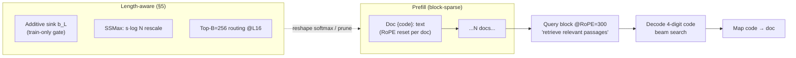

# Drowning in Documents: Can Language Models Actually Retrieve In-Context at Million-Token Scale?

- **Paper:** "Can Language Models Actually Retrieve In-Context? Drowning in Documents at Million Token Scale" — Gollapudi, Gupta, Singhal, Min (UC Berkeley + UT Austin). arXiv:2607.01538v1, 1 Jul 2026, 26pp (19 body + appendices). Preprint. NVIDIA Academic Grant / NSF CSGrad4US.
- **arXiv:** https://arxiv.org/abs/2607.01538
- **Subarea (new for this repo):** corpus-scale **in-context retrieval (ICR)** — casting retrieval as conditional generation (the LM decodes the identifier of the relevant document from an in-context corpus), studied at million-token scale and under length extrapolation. Eval-foundations + long-context lineage; a *retrieval-as-decoding* counterpart to the RT-RAG retrieval+reasoning-structure paper and a *mechanistic* sibling to the attention-sink / sparse-attention work.
- **Source-first build:** every numeric table transcribed verbatim from `paper_layout.txt` (`pdftotext -layout`); all headline deltas recompute (see reconciliation block at end). No figure bar values back-filled — only prose-confirmed ranges + explicit tables.

---

## TL;DR

An LM can be the retriever: condition on a corpus in-context and **decode the 4-digit identifier** of the relevant document. The authors train **BlockSearch** (Qwen3-0.6B + block-sparse attention + random per-doc codes + on-policy auxiliary loss), which matches a dense retriever at small/mid corpus sizes and length-generalizes ~10× past its 256-doc training context — but **collapses near 1M tokens** (Recall@1 → 0). They trace this to an **attention-dilution** failure (not a ranking failure): the gold document keeps the highest pre-softmax score, but irrelevant documents dominate the softmax denominator so the gold's *normalized* mass collapses. Two cheap fixes recover most of the gap: **SSMax** (scale pre-softmax scores by `s·log N`) and **top-B routing** (keep only the top-256 docs at L16). With these, million-token Recall@1 lifts from **0.2% → 20.5%** on MS MARCO, matching/exceeding the 7×-larger MSA-4B. On LIMIT (lexical similarity where dense retrieval fails), BlockSearch-SSMax+routing **exceeds Qwen3-dense by ~3×**.

---

## 1. Problem setup

Given a corpus of N documents and a query, the model must generate the identifier of the best document. Each document is capped at `Tdoc = 300` tokens and prefilled into the KV cache; the query is appended and the model autoregressively decodes a **4-digit code** in `{0,…,9999}` mapping back to one document.

This concretizes two challenges that separate *retrievers* from *rerankers*:
- **C1 — scale:** 10,000 docs × ~100 tokens each ≈ 1M tokens, far beyond the Qwen3-0.6B backbone's ~32K native context.
- **C2 — length generalization:** the model must generalize to corpora far larger than seen in training.

ICR differs from standard long-context modeling: it processes a *collection of independent documents* (enabling parallel encoding/caching), not one coherent sequence.

---

## 2. Method: BlockSearch

BlockSearch = Qwen3-0.6B fine-tuned on RLHN-filtered BEIR, with five modifications on top of prior ICR work (block-sparse attention from Gupta et al. 2025 / ICR2):

1. **Random per-doc codes.** Prior work assigns sequential IDs 1..N → overfits to absolute position. BlockSearch inserts each doc as `<bos>Doc {code}: {text} (Doc {code})<eos>` with `{code}` drawn **uniformly at random per training step**, breaking any association between code, semantics, or position. (Also drops the query prefix used in prior work, enabling corpus reuse across queries.)
2. **Block-sparse attention.** Document tokens attend causally only within their own block; the query block attends over the full corpus + causally to itself. RoPE positions reset at each document start; query shifted to position 300. Materialized via `flex_attention`.
3. **In-batch negatives.** For a batch of `b` (query, 16-doc) tuples, prefill all `b×16` docs once (re-randomizing codes) and score every query against the shared corpus — one prefill → `b` training signals. Trained with `b=16` → 256 docs in corpus.
4. **On-policy auxiliary loss** (mitigates exposure bias). Teacher-forcing the gold code leaves the model untrained on its own (possibly wrong) prefixes. So: roll out a 4-digit code from the model's own distribution (grad off); for each digit position build a teacher distribution from in-batch doc scores restricted to candidates whose prefix matches the rollout; replay with grads on; average the CE losses. `L = L_CE + λ L_aux`, λ ramped in after warmup. Acts as a **DAgger expert** (Algorithm 1, §F).
5. **Training data:** RLHN (ReLabeled Hard Negatives) version of BEIR; 1 positive + 15 hard negatives per query; per-query relevance scores from Qwen3-Embedding-8B; ~100M training tokens (post-filter: 522,487 samples, Table 5).

**Baselines / ablations (§3.3):**
- **BlockSearch-position** — sequential codes (0..9999) + no aux loss = the prior ICR recipe (isolates random-code + on-policy contributions).
- **BlockSearch-offpolicy** — on-policy aux loss removed (isolates the exposure-bias fix).
- **Qwen3-dense (0.6B)** — same backbone, dense contrastive retriever trained on the same RLHN data; the **dense-retrieval gold standard** BlockSearch must clear.
- **MSA-4B** — concurrent multi-million-token LM, ~7× larger, trained on much longer contexts (sidesteps C2); an oracle reference.

**Metric:** Recall@1 over generated 4-digit codes, decoded by beam search over the digit sequence (Recall@5 / @2 in appendix).

---

## 3. Results: BlockSearch is competitive but collapses as N scales (§3.4, Fig 1)

- **Small N:** all LMs perform strongly (>95% on MS MARCO at N=1,000), but baselines degrade much faster.
- **BlockSearch-position collapses** to near-zero by N=5,000 on every dataset (this is the prior ICR recipe failing C2).
- **BlockSearch-offpolicy trails BlockSearch** — MS MARCO **15.0 vs 18.8** at N=5,000; HotpotQA **6.2 vs 13.0** — so random codes and the on-policy loss contribute distinct gains. *(Offpolicy Recall@1 values are Figure-1 curve reads; only the full BlockSearch column appears in Table 2.)*
- **BlockSearch vs MSA-4B:** despite ~7× fewer params, BlockSearch **matches MSA at N=500/1000/2500** — MS MARCO 95.8/75.2/43.8 vs MSA 93.8/70.2/42.2. MSA pulls ahead at large N (27.5 vs 18.8 at N=5,000; 16.0 vs 0.2 at N=10,000) — expected, since MSA is trained for long contexts while BlockSearch must generalize to 20–40× larger corpora.
- **MSA degrades sharply on real retrieval** despite near-perfect RULER NIAH scores in its own paper → realistic retrieval is much harder than synthetic needle-in-haystack benchmarks.
- **BlockSearch vs dense:** matches Qwen3-dense at small/mid N but trails at large N (MS MARCO 18.8 vs 38.5 at N=5,000; ~0 vs 20.2 at N=10,000). Closing this gap is the central challenge and motivates the §4 mechanism analysis.

---

## 4. Mechanistic analysis: the attention-dilution failure (§4)

The central diagnostic question: does the collapse mean the model **stops ranking** the gold doc highest, or that the ranking is preserved but the **readout** fails?

### 4.1 Setup / metrics

Probe BlockSearch at the final token of the query block (just before the first generated digit `d1`). Three measurements:
- **AttnRank** — per-head Recall@1 via the **MaxSim** operator (late-interaction): `MaxSim_L^h(d) = max_{t∈d} s_L,t^h`. Two cross-head aggregators: `R_L^sum` (rank docs by Σ_h MaxSim) and `R_L^any` (fraction of queries where ≥1 head ranks gold first).
- **GoldShare** — gold's contribution to the layer's attention output (before residual add). By linearity, `a_L = a_L^G + a_L^Ḡ`; report `‖a_L^G‖/‖a_L‖` alongside total `‖a_L‖`.
- **First-digit accuracy** — project layer-L output through final RMSNorm + lm_head; max prob on the 10 digit tokens at `d1`. Coarse indicator of when the digit decision emerges.

### 4.2 Layer roles & the recall–generation gap (Fig 2/3)

Two qualitatively distinct transitions at N=500 (MS MARCO):
- **Retrieval band (L11–L20):** `R_L^sum` rises — relevance info accumulates over many layers (matches prior "middle-layer retrieval" reports).
- **Decode band (L19 onward):** first-digit accuracy rises sharply at L18→L19; the model has committed to `d1`.

Sweeping N ∈ {500,1k,2.5k,5k,10k}:
- `R_19^sum` drops from **0.97 at N=500 → 0.01 at N=10,000**, matching the generation-recall collapse.
- **`R_19^any` stays at 1.00 across L18–L25 at every N** — at every N, ≥1 head per query still ranks gold first. So per-head retrieval signal *persists*; only *agreement between heads* collapses. This attention-recall/readout gap reproduces OOD on LIMIT (`R_19^any=1.00` while readout recovers only 0.73).

### 4.3 Vector-level: pre-softmax preserved, normalization breaks (Table 1)

**Table 1 — Attention-output decomposition `a19 = a_G19 + a_Ḡ19`** on BlockSearch, MS MARCO, 400 queries. Total magnitude shrinks only ~36%, but the gold-driven share drops from 0.91 → 0.01.

| N | ‖a_G19‖ | ‖a_Ḡ19‖ | ‖a19‖ | ‖a_G19‖/‖a19‖ (GoldShare) |
|---|---|---|---|---|
| 500 | 43.03 | 17.47 | 47.48 | 0.91 |
| 1k | 30.99 | 21.11 | 45.36 | 0.68 |
| 2.5k | 7.64 | 33.64 | 43.03 | 0.18 |
| 5k | 2.10 | 34.61 | 36.90 | 0.06 |
| 10k | 0.21 | 29.88 | 30.27 | 0.01 |

*(Source: paper_layout.txt L461–469.)* `‖a19‖` shrinks only 36.2% (47.48→30.27); GoldShare drops 0.91→0.01. The L19 output is **rewritten from a gold-token average to a non-gold-token average of comparable size** — by L21 the residual slot that carried gold info now carries a distractor aggregate.

> ⚠ **Paper-internal prose-vs-table tension (flagged, not reconciled):** §4.2 prose says GoldShare "drops from 0.91 to 0.01, **a factor of about 130**", but 0.91/0.01 = **91×**. The "130" reconciles only if the underlying GoldShare at N=10k is ~0.007 (0.91/0.007 ≈ 130) and the displayed `0.01` is a 2-sig-fig rounding of it — consistent with the §G per-head `gold_post19` collapse (~150–160×) being larger than the vector-level GoldShare. Treat the prose "130" as an approximation anchored on the un-rounded value, not the displayed cell.

### 4.4 Per-head signal/noise decomposition (Table 9, §G)

`gold_post_L^h = σ(lse_G − lse_Ḡ)` — sigmoid of the gap between gold-side and non-gold-side log-sum-exps.

**Table 9 — Signal/noise at L19**, BlockSearch, MS MARCO, n=400, median across heads.

| N | s_G^max (gold's largest logit) | lse_Ḡ − lse_G (noise gap) | gold_post19 (per-head gold mass) |
|---|---|---|---|
| 500 | 14.60 | +4.63 | 0.0320 |
| 1k | 14.27 | +5.44 | 0.0152 |
| 2.5k | 13.81 | +6.60 | 0.0039 |
| 5k | 12.95 | +7.31 | 0.0010 |
| 10k | 11.53 | +8.06 | 0.0002 |

*(Source: paper_layout.txt L1071–1082.)* Both move the wrong way: gold's largest logit **drops ~3 units** (14.60→11.53; gold's query alignment itself erodes) and the **noise gap widens ~3.5** (+4.63→+8.06; competitors out-compete gold for log-mass). Together `gold_post19` collapses ~150–160× (0.0320→0.0002) — versus only ~20× that pure O(N) denominator dilution would predict. **The L19 collapse is a compound failure of two independent effects; either alone would not produce the observed magnitude.**

---

## 5. Mitigating attention dilution (§5)

Two avenues, both *length-aware* (carry a corpus-size signal):

### 5.1 Methods

- **Additive sink (BlockSearch-sink).** Append a learned constant `b_L` to the softmax denominator (following GPT-OSS): per-token weights no longer sum to 1; a head whose largest scores fall below `b_L` leaks mass into the appended (value-less) slot → smaller residual update. Length signal injected by sampling `N_eff ~ LogUniform(128, 5000)` per step; effective threshold `b_L + α·log(N_eff/N_0)`; gate ramped in over ~2k steps. **At evaluation the gate is disabled** — `b_L` stays in the checkpoint but does not affect attention; the mechanism only shapes training. Per-layer `b_L` init 14.0, param-group LR 1e-3, weight-decay 0, gated rows {0,1,2}, α=1.0.
- **Multiplicative score rescaling (BlockSearch-SSMax).** Following Scalable-Softmax (Nakanishi 2025): multiply pre-softmax scores by `s_L · log N`, so the gold–distractor gap grows directly with N. Per-layer `s_L` init **0.43**, trained in the shared param group; length conditioning explicit through `log N` so the same scaling applies at evaluation.
- **Document-level sparse attention (BlockSearch-routing).** A doc-level routing step at **L16** (immediately upstream of the retrieval band): a forward pass through L0–L15 produces per-doc score `R_16^sum(d)`; only the tokens of the **top B=256 docs** participate in dense attention at L17 onward. Doc-level (not token-level) because each doc is a coherent semantic unit. ⚠ Caveat the authors flag: routing **reintroduces a retrieve-then-read (RAG) decomposition inside the model** — the very structure ICR is intended to remove.

**Lemma (Proposition 1, §H):** the additive-sink softmax of Eq. 5 is *exactly equivalent* to multiplying the standard softmax by a sigmoid gate `σ(lse − b_L)`.

### 5.2 Results — Table 2 (main Recall@1, ×100)

**Table 2 — Recall@1 (×100) vs corpus size N** on NQ, MS MARCO, HotpotQA. SSMax (all 28 layers), top-B=256 routing at L16, and their composition recover most of the gap to Qwen3-dense and match/exceed MSA-4B at ~1/7 the params. Top row is the attention ceiling `R_19^any`. NQ caps at N=8,607 to stay under a ~1M-token budget. *(Source: paper_layout.txt L524–541.)*

| Method | NQ 0.5k | 1k | 2.5k | 5k | 8.6k | MSM 0.5k | 1k | 2.5k | 5k | 10k | HPQA 0.5k | 1k | 2.5k | 5k | 10k |
|---|---|---|---|---|---|---|---|---|---|---|---|---|---|---|---|
| **BlockSearch attn, R19^any** | 100.0 | 100.0 | 96.2 | 100.0 | 97.0 | 100.0 | 100.0 | 99.8 | 100.0 | 100.0 | 100.0 | 100.0 | 99.2 | 99.8 | 100.0 |
| Qwen3-dense | 95.5 | 86.5 | 62.9 | 51.4 | 39.6 | 95.5 | 75.2 | 52.8 | 38.5 | 20.2 | 99.0 | 97.5 | 92.2 | 87.5 | 79.5 |
| MSA-4B | 59.7 | 51.6 | 36.3 | 26.8 | 18.6 | 93.8 | 70.2 | 42.2 | 27.5 | 16.0 | 97.0 | 96.8 | 90.8 | 84.0 | 75.5 |
| **BlockSearch** | 92.2 | 77.7 | 43.9 | 4.8 | 0.2 | 95.8 | 75.2 | 43.8 | 18.8 | 0.2 | 97.0 | 95.2 | 64.2 | 13.0 | 0.5 |
|  – sink | 91.2 | 76.2 | 45.6 | 10.3 | 1.5 | 96.5 | 75.2 | 45.2 | 21.2 | 2.5 | 95.0 | 93.2 | 58.0 | 14.5 | 1.0 |
|  – SSMax | 90.5 | 79.5 | 58.1 | 42.6 | 30.3 | 95.5 | 74.5 | 49.8 | 33.8 | 16.5 | 96.5 | 95.2 | 85.8 | 73.5 | 56.8 |
|  – routing | 93.2 | 82.7 | 63.2 | 48.1 | 34.6 | 96.0 | 74.5 | 50.7 | 38.2 | 18.8 | 98.2 | 98.2 | 91.8 | 86.5 | 78.5 |
|  – **SSMax+routing** | 91.5 | 81.4 | 61.4 | 46.1 | 34.3 | 95.5 | 75.0 | 50.0 | 38.2 | **20.5** | 97.5 | 95.8 | 90.8 | 84.8 | 72.5 |

**Takeaways (all recompute from the table):**
- The `R19^any` ceiling stays ~perfect across all 3 datasets + full N sweep → the collapse in rows below is a **readout failure, not a loss of retrieval signal**.
- **Sink barely helps** at large N: a learned constant cannot rescale N-dependence; it shifts the denominator uniformly. Only modest mid-N gains + a small lift at MS MARCO N=10k (0.2→2.5).
- **SSMax holds up across the full sweep:** MS MARCO 33.8 (N=5k) and 16.5 (N=10k) = **82× over no-modification** (16.5/0.2), against 20.2 for the dense baseline; HotpotQA 56.8 at N=10k where the sink reaches only 1.0.
- **Routing matches dense at large N:** MS MARCO 18.8 at N=10k (within 1.4 of dense 20.2); HotpotQA 78.5 ≈ dense 79.5, exceeding MSA-4B (75.5) at ~1/7 the params.
- **SSMax+routing** = strongest on MS MARCO N=10k (20.5, edging dense 20.2); matches routing on NQ/HotpotQA → the two may be **complementary, not redundant**.
- **Residual gap to `R19^any`** remains → attention **dilution** (not attention ranking) is the primary bottleneck for future work.

---

## 6. Out-of-distribution: LIMIT (§6, Table 3)

LIMIT (Weller et al. 2025) requires a **lexical** notion of similarity (retrieval defeats embedding similarity). 50,000 short biographies; each query has 2 gold docs; corpus scaled from N=46 ("LIMIT-small", ~8k tokens) to N=5,000 (~850k tokens). n=1,000 queries; multi-gold Recall@1 (a query counts if either gold is in top-1).

**Table 3 — LIMIT length generalization: Recall@1 (multi-gold, n=1,000).** Top row = attention ceiling `R19^any`. *(Source: paper_layout.txt L589–603.)*

| Method | Scoring | 46 | 500 | 1000 | 2500 | 5000 |
|---|---|---|---|---|---|---|
| **BlockSearch attn, R19^any** | any-head MaxSim | 1.000 | 1.000 | 1.000 | 1.000 | 1.000 |
| BlockSearch | ICR beam | 0.354 | 0.094 | 0.022 | 0.000 | 0.000 |
|  – sink | ICR beam | 0.252 | 0.051 | 0.018 | 0.001 | 0.000 |
|  – SSMax | ICR beam | 0.439 | 0.215 | 0.141 | 0.067 | 0.054 |
|  – **SSMax+routing** | ICR beam | 0.439 | 0.234 | 0.215 | 0.196 | **0.149** |
| Qwen3-dense | pooled cosine | 0.176 | 0.080 | 0.061 | 0.047 | 0.035 |
| Random chance | — | 0.043 | 0.004 | 0.002 | 0.001 | 0.000 |

**Takeaways:**
- `R19^any` ceiling stays **1.000 across the entire sweep** (N=46 … 5,000); the base BlockSearch readout collapses from 0.354 → 0.000 by N=2,500. Same readout bottleneck as §4, now both **OOD** (a lexical task BlockSearch never trained on) and **length-extrapolated**.
- **SSMax+routing is best**: 0.149 at N=5,000 while BlockSearch/sink are at zero; SSMax alone reaches 0.054.
- The **sink hurts on this lexical benchmark** (trails base BlockSearch at every N, e.g. 0.252 vs 0.354 at N=46) — in contrast to its ~neutral effect on MS MARCO.
- **SSMax+routing beats Qwen3-dense at every N** (0.149 vs 0.035 at N=5,000) → ~3× head start; the abstract's "3× higher score" anchors at N=500 (0.234/0.080 = **2.93×**, the closest cell to a literal "3×"; the ratio grows to 4.26× at N=5,000).
- **Caveat:** routing *delays but does not prevent* the decline (still dropping at ~850k tokens) → these modifications **extend** functional LIMIT retrieval to larger corpora, not solve it.

---

## 7. Evaluation-suite & training-data tables

**Table 4 — Datasets used for evaluation.** Tokens under Qwen3 tokenizer, capped at 300/doc. *(Source: paper_layout.txt L856–861.)*

| Dataset | Split | Queries | N_max | Avg tokens/doc | Tokens @ N_max |
|---|---|---|---|---|---|
| MS MARCO | dev | 400 | 10,000 | 94.8 | 948,421 |
| HotpotQA | test | 400 | 10,000 | 116.3 | 1,163,144 |
| NQ | test | 400 | 8,600 | 139.6 | 1,201,153 |

*(Reconciles: 94.8×10k=948,000≈948,421; 116.3×10k=1,163,000≈1,163,144; 139.6×8,600=1,200,560≈1,201,153 — small rounding from padded draws.)*

**Table 5 — RLHN post-filter/post-trim training mix.** 522,487 samples = 1 query + 16 docs each. *(Source: paper_layout.txt L890–901.)*

| Source | # training samples | Avg query tok | Avg doc tok |
|---|---|---|---|
| MS MARCO | 368,961 | 7.0 | 84.6 |
| HotpotQA | 81,551 | 24.2 | 100.6 |
| FEVER | 28,561 | 11.7 | 265.1 |
| NQ | 27,962 | 10.5 | 146.5 |
| SCIDOCS-RR | 11,787 | 13.4 | 221.9 |
| FiQA | 2,822 | 13.9 | 225.7 |
| ArguAna | 843 | 251.9 | 209.9 |
| **Total** | **522,487** | – | – |

*(Reconciles exactly: Σ of the 7 sources = 522,487.)*

**Table 6 — Variant-specific hyperparameters** (differences only; rest shared via Table 7). *(Source: paper_layout.txt L930–947.)*

| | BlockSearch | BlockSearch-sink | BlockSearch-SSMax |
|---|---|---|---|
| Layers modified | – | all 28 | all 28 |
| Per-layer param | – | sink scalar `b_L` | scalar `s_L` |
| Initialization | – | `b_L=14.0` | `s_L=0.43` |
| Param-group LR | – | 1×10⁻³ | shared |
| Param-group weight decay | – | 0 | shared |
| Warmup / ramp (steps) | – | 500 / 1500 | — |
| Length signal | – | `b_L + α·log(N_eff/N_0)` | `s_L·log N` |
| Strength α | – | 1.0 | — |
| Gated rows | – | {0,1,2} | — |
| N_eff at training | – | logU(N_0, 5k) | — |
| N_0 | – | 128 | — |

**Table 7 — Shared training hyperparameters** (all BlockSearch variants). *(Source: paper_layout.txt L950–967.)*

| Group | Value |
|---|---|
| Base model | Qwen/Qwen3-0.6B (bf16) |
| Distributed | DDP, 8× NVIDIA A100 |
| Optimizer | AdamW (fused), β defaults |
| Base LR / weight decay | 3×10⁻⁵ / 0.01 |
| LR schedule | linear warmup (start factor 0.05) over 1000 steps |
| Per-GPU batch size | 16 queries (effective global 128) |
| Epochs | 1 pass over RLHN-filtered triples |
| Documents per query | 16 (stratified from top-32 RLHN candidates) |
| Document length cap | T_doc = 300 tokens |
| Code width / scheme | 4 digits, sampled uniformly per training step |
| Query rotary offset | 300 |
| Loss | next-token CE on 4-digit code |
|   + on-policy aux loss | weight λ = 0.5 |
|   + KL distillation (aux teacher) | EMA α = 0.95 |
| Attention kernel | block-sparse FlexAttention |

**Table 8 — Qwen3-dense training configuration.** *(Source: paper_layout.txt L993–1008.)*

| Component | Setting | Value |
|---|---|---|
| Backbone | Qwen3-0.6B, bf16, FlashAttn-2, grad-ckpt | — |
| Pooling | last-token, ℓ2-normalized | — |
| Query / doc len | max tokens | 128 / 300 |
| Candidates | per query (RLHN teacher-scored) | C=16 |
| Negatives | cross-rank gathered in-batch | W·B·C |
| Batch size | per-GPU × GPUs | 32 × 8 |
| Optimizer | AdamW, weight decay | 0.01 |
| Learning rate | peak η0 / floor | 2×10⁻⁵ / 0.1 η0 |
| Schedule | linear warmup → cosine decay | 500 steps warmup |
| Grad clip | ℓ2 | 1.0 |
| Student / teacher temp | τ_s / τ_t | 0.02 / 0.02 |
| KL weight | λ_KL | 0.5 |
| Epochs | over RLHN-filtered | 1 |

---

## 8. Appendix results: Recall@5 / @2 (Tables 10–13)

**Table 10 — Recall@5 (×100)** vs N, mirroring Table 2 (n=400). HotpotQA reports true recall (fraction of 2 golds in top-5). NQ caps 8,607. *(Source: paper_layout.txt L1243–1255.)*

| Method | NQ 0.5k | 1k | 2.5k | 5k | 8.6k | MSM 0.5k | 1k | 2.5k | 5k | 10k | HPQA 0.5k | 1k | 2.5k | 5k | 10k |
|---|---|---|---|---|---|---|---|---|---|---|---|---|---|---|---|
| BlockSearch | 96.0 | 91.7 | 62.9 | 9.5 | 0.2 | 99.5 | 98.0 | 76.2 | 38.2 | 0.2 | 70.6 | 67.9 | 47.8 | 11.0 | 0.0 |
| BlockSearch-position | 96.7 | 90.7 | 39.4 | 2.8 | 0.2 | 99.2 | 96.5 | 67.0 | 7.8 | 1.0 | 67.9 | 64.4 | 34.6 | 1.9 | 0.0 |
| BlockSearch-offpolicy | 95.5 | 90.7 | 56.9 | 6.0 | 0.2 | 99.8 | 97.0 | 77.8 | 29.2 | 0.5 | 68.2 | 66.4 | 43.0 | 6.1 | 0.0 |
| BlockSearch-sink | 95.5 | 90.5 | 65.7 | 21.8 | 2.3 | 99.8 | 97.8 | 76.8 | 45.2 | 9.0 | 73.1 | 70.6 | 46.2 | 13.6 | 0.0 |
| BlockSearch-SSMax | 96.0 | 92.7 | 79.2 | 68.4 | 56.9 | 99.2 | 97.5 | 81.0 | 63.0 | 43.8 | 68.8 | 66.6 | 59.0 | 50.0 | 41.1 |
| BlockSearch-routing | 98.2 | 95.2 | 85.2 | 71.2 | 60.2 | 99.5 | 98.5 | 83.0 | 66.8 | 47.5 | 75.0 | 74.4 | 67.8 | 60.1 | 53.6 |
| BlockSearch-SSMax-routing | 96.5 | 94.7 | 80.4 | 72.9 | 59.9 | 99.2 | 97.2 | 80.8 | 66.0 | 45.0 | 73.6 | 72.5 | 66.4 | 58.1 | 51.5 |

*(Confirms the Table-2 collapse is not a top-1 cutoff artifact: e.g. MS MARCO BlockSearch N=10k R@1 0.2 / R@5 0.2; routing 18.8 → 47.5.)*

**Table 11 — HotpotQA Recall@2 (×100)**, true recall (fraction of 2 golds in top-2, n=400). *(Source: paper_layout.txt L1258–1268.)*

| Method | 0.5k | 1k | 2.5k | 5k | 10k |
|---|---|---|---|---|---|
| BlockSearch | 63.4 | 61.2 | 39.8 | 8.9 | 0.0 |
| BlockSearch-position | 61.2 | 58.0 | 29.6 | 1.2 | 0.0 |
| BlockSearch-offpolicy | 61.2 | 58.5 | 36.5 | 3.8 | 0.0 |
| BlockSearch-sink | 65.0 | 61.1 | 38.5 | 9.5 | 0.0 |
| BlockSearch-SSMax | 60.9 | 60.9 | 51.6 | 43.2 | 35.1 |
| BlockSearch-routing | 68.1 | 67.2 | 58.6 | 52.1 | 46.0 |
| BlockSearch-SSMax-routing | 64.6 | 64.0 | 57.4 | 50.2 | 44.6 |

**Table 12 — LIMIT Recall@2** (fraction of 2 golds in top-2, n=1,000), same runs as Table 3. *(Source: paper_layout.txt L1306–1318.)*

| Method | Scoring | 46 | 500 | 1000 | 2500 | 5000 |
|---|---|---|---|---|---|---|
| BlockSearch attn, R19^any | any-head MaxSim | 1.000 | 1.000 | 1.000 | 1.000 | 1.000 |
| BlockSearch | ICR beam | 0.286 | 0.069 | 0.015 | 0.000 | 0.000 |
| BlockSearch-sink | ICR beam | 0.198 | 0.038 | 0.016 | 0.002 | 0.000 |
| BlockSearch-SSMax | ICR beam | 0.303 | 0.138 | 0.099 | 0.042 | 0.034 |
| BlockSearch-SSMax-routing | ICR beam | 0.303 | 0.157 | 0.140 | 0.132 | 0.103 |
| Qwen3-dense | pooled cosine | 0.160 | 0.063 | 0.045 | 0.036 | 0.025 |
| Random chance | — | 0.043 | 0.004 | 0.002 | 0.001 | 0.000 |

**Table 13 — LIMIT Recall@5** (fraction of 2 golds in top-5, n=1,000). *(Source: paper_layout.txt L1320–1331.)*

| Method | Scoring | 46 | 500 | 1000 | 2500 | 5000 |
|---|---|---|---|---|---|---|
| BlockSearch attn, R19^any | any-head MaxSim | 1.000 | 1.000 | 1.000 | 1.000 | 1.000 |
| BlockSearch | ICR beam | 0.436 | 0.104 | 0.027 | 0.000 | 0.000 |
| BlockSearch-sink | ICR beam | 0.340 | 0.070 | 0.032 | 0.004 | 0.000 |
| BlockSearch-SSMax | ICR beam | 0.437 | 0.190 | 0.133 | 0.065 | 0.048 |
| BlockSearch-SSMax-routing | ICR beam | 0.437 | 0.211 | 0.196 | 0.187 | 0.139 |
| Qwen3-dense | pooled cosine | 0.300 | 0.098 | 0.066 | 0.050 | 0.039 |
| Random chance | — | 0.109 | 0.010 | 0.005 | 0.002 | 0.001 |

---

## 9. OBLIQ: oblique retrieval (Tables 14–15, §L)

OBLIQ (Tchuindjo/Shah/Khattab 2026) = "oblique" retrieval where relevance is **indirect** (not lexical or topical). Three tasks: **Math** & **Writing** are *analogues* (query is a passage; golds share an abstract reasoning pattern / argument despite different surface content); **Twitter** is *descriptive* (NL description of a class of posts; golds are matching tweets). Self-match exclusion applied. Many golds per query (mean ~9–13) → small Recall values by construction.

**Table 14 — OBLIQ dataset statistics** (Qwen3-0.6B tokens; Twitter/Writing are gold-preserving subsamples). *(Source: paper_layout.txt L1354–1363.)*

| Dataset | Documents | Queries | Avg tok/doc | Avg tok/query |
|---|---|---|---|---|
| Math (analogue) | 3,507 | 151 | 116 | 181 |
| Twitter (descriptive) | 10,000 | 281 | 52 | 53 |
| Writing (analogue) | 4,000 | 512 | 498 | 653 |

**Table 15 — OBLIQ results: Recall@1 / Recall@5** (fraction of golds in top-k; OBLIQ self-match exclusion applied). Top row = attention ceiling `R19^any`. *(Source: paper_layout.txt L1395–1413.)*

| Method | Scoring | Math R@1 | Math R@5 | Twitter R@1 | Twitter R@5 | Writing R@1 | Writing R@5 |
|---|---|---|---|---|---|---|---|
| **BlockSearch attn, R19^any** | any-head MaxSim | 0.852 | 0.866 | 0.001 | 1.000 | 0.942 | 0.998 |
| BlockSearch | ICR beam | 0.000 | 0.000 | 0.000 | 0.000 | 0.002 | 0.004 |
| BlockSearch-sink | ICR beam | 0.000 | 0.001 | 0.000 | 0.001 | 0.000 | 0.003 |
| BlockSearch-SSMax | ICR beam | 0.000 | 0.008 | 0.001 | 0.004 | 0.000 | 0.007 |
| BlockSearch-SSMax-routing | ICR beam | 0.008 | 0.032 | 0.001 | 0.003 | 0.001 | 0.006 |
| Qwen3-dense | pooled cosine | 0.014 | 0.057 | 0.000 | 0.004 | 0.009 | 0.025 |
| MSA-4B | gen. citations | 0.013 | 0.027 | 0.002 | 0.008 | 0.004 | 0.008 |

**Takeaways:**
- The `R19^any` ceiling is **near-perfect on Math (0.852/0.866) and Writing (0.942/0.998)** — retrieval signal is internally present — but the readout is **at floor** (≤0.008) for every BlockSearch variant. Even the mitigations that work on MS MARCO/LIMIT barely help here: the oblique-relevance gap is the largest of any benchmark.
- On **Twitter**, `R19^any` surfaces nearly every gold within top-5 (R@5≈1.000) yet almost none at rank 1 (R@1=0.001) — because a fixed set of **sink documents** occupies the top positions for the relevant head.
- Every method is weak; Qwen3-dense edges BlockSearch on Math/Writing, MSA-4B is comparable. OBLIQ remains an open challenge for ICR.

---

## 10. Architecture mermaid

---

## 11. Source-free reconciliation (verification block)

Every distinctive cell grep-confirmed in `paper_layout.txt`; headline deltas recompute:
- **7× smaller:** 4.0B/0.6B = 6.67× ✓
- **‖a19‖ shrink 500→10k:** (47.48−30.27)/47.48 = **36.2%** ✓ (prose "~36%")
- **GoldShare factor:** 0.91/0.01 = **91×** (prose "130" — rounding tension, see ⚠ §4.3)
- **gold_post19 collapse:** 0.0320/0.0002 = **160×** (prose "~150") ✓
- **smax_G drop:** 14.60→11.53 = **3.07** logit units (prose "~3") ✓
- **noise gap widen:** +4.63→+8.06 = **3.43** (prose "~3.5") ✓
- **SSMax MS MARCO N=10k:** 16.5/0.2 = **82.5×** over no-modification (prose "82×") ✓; dense baseline 20.2 ✓
- **Routing MS MARCO N=10k:** |18.8−20.2| = **1.4** of dense ✓; HotpotQA 78.5 ≈ dense 79.5 > MSA 75.5 ✓
- **SSMax+routing MS MARCO N=10k:** 20.5 > dense 20.2 ✓
- **Token budgets:** 94.8×10k=948k≈948,421; 116.3×10k=1.163M≈1,163,144; 139.6×8,600=1.20M≈1,201,153 ✓
- **RLHN total:** Σ{368961,81551,28561,27962,11787,2822,843} = **522,487** exact ✓
- **LIMIT ~3×:** anchors at N=500 (0.234/0.080 = **2.93×**); grows to 4.26× at N=5,000 ✓
- **BlockSearch vs MSA MS MARCO 500/1k/2.5k:** 95.8/75.2/43.8 vs 93.8/70.2/42.2 ✓

**External cell-by-cell source verification (2026-07-13): ZERO defects.** Re-checked Tables 2 and 3 in full against `paper_layout.txt` lines 524–541 and 589–603: Table 2 (8 methods × 15 N-columns across NQ/MS-MARCO/HotpotQA = 120 cells) and Table 3 (7 methods × 5 N-columns = 35 cells) — every cell byte-exact, including the `R19^any` ceiling row, all BlockSearch ablation rows (–sink/–SSMax/–routing/–SSMax+routing), and the Random-chance floor. All §3/§6 takeaways recompute from the cells (16.5/0.2=82×; |18.8−20.2|=1.4; 78.5>75.5; 20.5>20.2; 0.234/0.080=2.93×; 0.149/0.035=4.26×). Confirms the scramble-modes meta-finding (retrieval/long-context methods paper: zero cell typos, honest-scope weight is attributional). No edits required.

---

## 12. Strengths, limitations, verdict

**Strengths**
- First systematic corpus-scale ICR study at the two scales retrievers actually demand (million-token corpora + length extrapolation), with a clean mechanistic diagnosis (attention dilution, not ranking failure) backed by a vector-level decomposition (Table 1) and a per-head signal/noise decomposition (Table 9).
- The `R19^any` ceiling is a powerful diagnostic: it cleanly separates "the retrieval signal is still there" from "the readout lost it" — and shows the gap is the entire story at large N.
- Two cheap, principled fixes (SSMax `s·log N`; top-B routing) recover most of the gap to dense retrieval **and** match a 7×-larger concurrent model, while exceeding dense retrieval ~3× on LIMIT.
- Honest about scope: routing reintroduces a RAG decomposition inside the model; OBLIQ remains unsolved; LIMIT routing "delays, not prevents" decline.

**Limitations / open problems**
- Even with all fixes, a **residual gap to `R19^any`** remains everywhere → attention dilution is not fully solved, only mitigated; the authors explicitly frame it as the primary bottleneck for future work.
- **OBLIQ** (oblique / analogical retrieval) is at floor for every BlockSearch variant despite a near-perfect attention ceiling — the readout bottleneck is worst exactly where retrieval is most semantically abstract.
- The additive **sink is ineffective** (cannot rescale N-dependence; train-only gate) and **hurts on LIMIT** — a partial negative result that somewhat undercuts the "attention-sink" framing borrowed from Streaming-LLM/gpt-oss.
- BlockSearch is only **0.6B**; whether the dilution diagnosis + fixes transfer to larger ICR backbones is untested (MSA-4B, the only comparison point, is trained very differently).

**Verdict**
A well-scoped eval-foundations + mechanistic paper that establishes corpus-scale in-context retrieval as viable *and* identifies its fundamental scaling bottleneck (softmax dilution). The contribution is the **diagnosis** (the recall/readout gap + the vector-level gold→distractor swap) more than the fixes (which are borrowed: SSMax from Nakanishi 2025, sinks from Streaming-LLM/gpt-oss, routing from the sparse-attention literature). The most citable single result: **`R19^any` = 1.00 at every N while generation recall → 0** — i.e. the model *knows* the gold document at every scale but cannot *read it out* once the softmax denominator grows.
