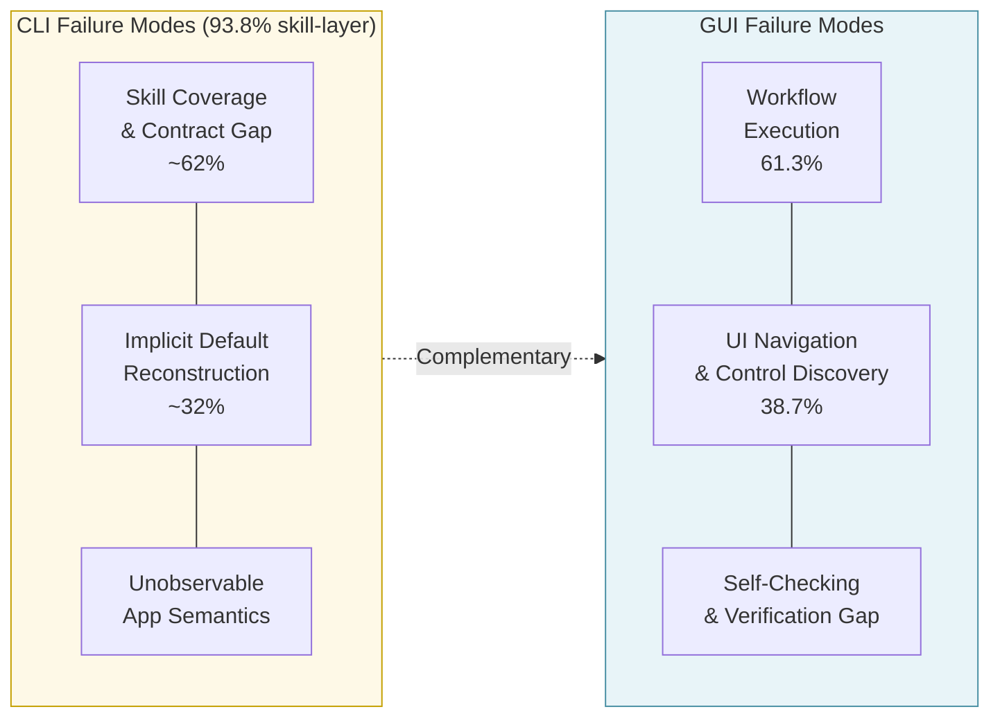

# Breakdown — GUI vs. CLI: Execution Bottlenecks in Screen-Only and Skill-Mediated Computer-Use Agents

> **Paper:** GUI vs. CLI: Execution Bottlenecks in Screen-Only and Skill-Mediated Computer-Use Agents
> **Authors:** Xiao Zhou, Siyue Zhang, Yilun Zhao, Jinbiao Wei, Tingyu Song, Arman Cohan, Chen Zhao (NYU Shanghai, Yale NLP Lab, NTU, Data & Models)
> **Year:** 2026 (arXiv:2606.24551v1, Jun 2026)
> **ArXiv:** https://arxiv.org/abs/2606.24551
> **Code (official):** https://github.com/rebeccaz4/gui-vs-cli
> **Type:** Benchmark + diagnostic analysis (no new model).

---

## 1. Problem & Motivation

**Problem.** Computer-use agents can execute desktop tasks through two modalities — GUI (screenshots + clicks) or CLI (programmatic skills). Existing evaluations confound modality with differences in tasks, initial states, verifiers, and permitted actions, so nobody can isolate *why* one modality outperforms the other.

**Why important.** Every agent framework must choose (or combine) an interaction strategy. Without controlled evidence, these choices are based on intuition and marketing claims rather than empirical grounding.

**Prior-work limitations** (the paper's diagnosis):
1. GUI benchmarks and CLI benchmarks use *different tasks* — cross-modality comparison is impossible.
2. They use *different initial states and verifiers* — success criteria aren't aligned.
3. They allow *different action spaces* — you can't tell if the gap is the model or the interface.
4. Nobody has measured how much of the CLI gap is explained by incomplete skill coverage.

## 2. Key Insight / Contribution

**Core idea (one sentence):** Hold task goals, initial states, and final-state verifiers fixed; vary only the native action interface — and you discover that the CLI gap is primarily a skill-coverage bottleneck, not a model capability gap.

**What is genuinely new:**
- The **matched execution-layer protocol** — identical tasks, states, verifiers across modalities.
- **440-task benchmark** across 18 applications and 12 workflow categories.
- **Verifier-guided skill-coverage diagnostic** — original skills satisfy only 37.6% of verifier checkpoints; patched skills raise CLI from 48.2% → 69.3%.
- **Complementary failure taxonomy** — 3 GUI failure modes + 3 CLI failure modes.
- **Procedure-guided grounding experiment** — explicit workflow steps barely improve GUI completion but cut wasted exploration by 20%.

## 3. Method

### 3.1 Benchmark composition

```
440 tasks
├── 18 applications (GIMP, Krita, draw.io, Audacity, MuseScore, Obsidian, Zotero,
│                    FreeCAD, CloudCompare, RenderDoc, LibreOffice Writer/Calc/Impress,
│                    Shotcut, OBS, Zoom, Godot 4, Chrome)
└── 12 workflow categories (Visual Design, Audio, Knowledge, CAD & 3D,
                            Graphics Debugging, Documents, Video & Streaming,
                            Spreadsheets, Presentations, Communication, Game, Web)
```

### 3.2 Three-stage construction pipeline

```mermaid
flowchart TD
    subgraph Stage_I["Stage I: Application & Task Selection"]
        A[OpenComputer task pool<br/>(Wei et al. 2026a)] --> B{Has CLI-Anything<br/>skill support?}
        B -- Yes --> C[Include application]
        B -- No --> D[Exclude application]
    end

    subgraph Stage_II["Stage II: Task Rewriting & Curation"]
        C --> E[Rewrite step-by-step GUI<br/>instructions → modality-agnostic<br/>outcome descriptions]
        E --> F{Modality biased?}
        F -- Yes --> G[Remove or rebalance task]
        F -- No --> H[Include task]
        G --> I[Add compensating<br/>tasks to balance]
        I --> H
    end

    subgraph Stage_III["Stage III: Manual Validation"]
        H --> J{Solvable in<br/>both modalities?}
        J -- Yes --> K{Instruction avoids<br/>modality-specific cues?}
        J -- No --> L[Rewrite or discard]
        K -- Yes --> M[✓ Validated task<br/>(440 final tasks)]
        K -- No --> L
        L --> E
    end

    style Stage_I fill:#e8f4f8,stroke:#4a90a4
    style Stage_II fill:#fef9e7,stroke:#c4a000
    style Stage_III fill:#e8f8e8,stroke:#4a90a4
```

### 3.3 Matched execution protocol

The central methodological innovation: both modalities execute the same tasks from the same initial states and are judged by the same verifiers. Only the action interface differs.

```mermaid
flowchart LR
    subgraph Shared["Shared (controlled)"]
        T[Task instruction<br/>τ_i]
        S[Initial state<br/>s_0]
        V[Verifier<br/>V(τ_i)]
    end

    subgraph GUI_modality["GUI Modality"]
        G_obs[Screenshot<br/>observation π_g] --> G_act[Screen actions<br/>A_g = {click, drag, type,<br/>scroll, shortcut}]
        G_act --> G_out[Final state<br/>s_g]
    end

    subgraph CLI_modality["CLI Modality"]
        C_obs[Skill discovery<br/>observation π_c] --> C_act[CLI skill calls<br/>A_c = {invoke, inspect,<br/>verify}]
        C_act --> C_out[Final state<br/>s_c]
    end

    T --> GUI_modality
    T --> CLI_modality
    S --> GUI_modality
    S --> CLI_modality
    s_g --> V
    s_c --> V

    style Shared fill:#f0f0f0,stroke:#888
    style GUI_modality fill:#e8f4f8,stroke:#4a90a4
    style CLI_modality fill:#fef9e7,stroke:#c4a000
```

### 3.4 Action space enforcement

| Modality | Allowed | Disallowed |
|----------|---------|------------|
| **GUI** | Screenshot observation + screen-level actions (click, drag, type, scroll, keyboard shortcuts) | Code execution, shell commands, filesystem/database edits |
| **CLI** | CLI-Anything skill discovery/invocation, read-only inspection, verification | Direct file edits, Python/sed/awk for mutation, manual artifact editing |

### 3.5 Evaluation protocol

- **Final-state verification** — not trajectory matching. Executable verifier checkpoints over application state and artifacts.
- **Full pass rate** — all verifier checks for a task must pass (strictest criterion).
- **Average task time** — wall-clock runtime per task as execution cost measure.

## 4. Formal Definitions & Math

### 4.1 Benchmark domain

Let $\mathcal{T} = \{\tau_1, \tau_2, \dots, \tau_N\}$ denote the set of $N = 440$ benchmark tasks, each drawn from one of 12 workflow categories $C = \{c_1, \dots, c_{12}\}$ and targeting one of 18 applications $A = \{a_1, \dots, a_{18}\}$.

Each task $\tau_i$ is a tuple:

$$\tau_i = (\text{instruction}_i,\; s_0^{(i)},\; V_i)$$

where $\text{instruction}_i$ is the modality-agnostic task description, $s_0^{(i)}$ is the fixed initial application state, and $V_i = \{v_1^{(i)}, v_2^{(i)}, \dots, v_{K_i}^{(i)}\}$ is the set of $K_i$ verifier checkpoints for that task.

### 4.2 Full Pass Rate

Each verifier checkpoint $v_j^{(i)}$ evaluates to a binary outcome:

$$v_j^{(i)} \in \{0, 1\} \quad \text{(fail / pass)}$$

A task $\tau_i$ **fully passes** iff every one of its checkpoints passes:

$$\text{Pass}(\tau_i) = \prod_{j=1}^{K_i} v_j^{(i)} = 1 \iff v_j^{(i)} = 1 \;\forall j$$

The **Full Pass Rate** (FPR) over all tasks is:

$$\text{FPR} = \frac{1}{N} \sum_{i=1}^{N} \text{Pass}(\tau_i) = \frac{|\{\tau_i \in \mathcal{T} : \text{Pass}(\tau_i) = 1\}|}{N}$$

### 4.3 Skill Coverage

For the CLI modality, define skill coverage over all verifier checkpoints:

$$\sigma = \frac{\sum_{i=1}^{N} \sum_{j=1}^{K_i} \mathbf{1}[v_j^{(i)} = 1 \mid \text{skills}]}{\sum_{i=1}^{N} K_i}$$

where $\mathbf{1}[\cdot]$ is the indicator function. This measures what fraction of *all verifier checkpoints* can be satisfied by the current skill set.

| Skill setting | Coverage $\sigma$ |
|---------------|-------------------|
| Original CLI-Anything skills | **37.6%** |
| Patched skills (verifier-guided repair) | **100%** |

The patched-skill setting uses verifier information during repair and is explicitly framed as a *diagnostic upper bound*, not a deployable baseline.

### 4.4 CLI gap decomposition

The observed CLI gap $\Delta$ can be decomposed:

$$\Delta = \text{FPR}_{\text{GUI}} - \text{FPR}_{\text{CLI}}^{\text{orig}}$$

$$\Delta_{\text{skill}} = \text{FPR}_{\text{CLI}}^{\text{patched}} - \text{FPR}_{\text{CLI}}^{\text{orig}} \quad \text{(recoverable via skill repair)}$$

$$\Delta_{\text{residual}} = \text{FPR}_{\text{GUI}} - \text{FPR}_{\text{CLI}}^{\text{patched}} \quad \text{(true modality gap)}$$

For the best models (GPT-5.4 GUI vs Codex GPT-5.5 CLI):

$$\Delta = 59.1\% - 48.2\% = 10.9\%$$
$$\Delta_{\text{skill}} = 69.3\% - 48.2\% = 21.1\% \quad \text{(exceeds total gap!)}$$
$$\Delta_{\text{residual}} = 59.1\% - 69.3\% = -10.2\% \quad \text{(CLI now leads)}$$

Since $\Delta_{\text{skill}} > \Delta$, the CLI gap is entirely explained by skill coverage — and once fixed, CLI *surpasses* GUI.

### 4.5 Per-workflow modality differential

For each workflow category $c_k \in C$, define the modality differential:

$$\delta_k = \text{FPR}_{\text{GUI}}^{(k)} - \text{FPR}_{\text{CLI,patched}}^{(k)}$$

- $\delta_k > 0$: GUI dominates in workflow $c_k$ (interface-exposed workflows).
- $\delta_k < 0$: CLI dominates in workflow $c_k$ (structured-artifact workflows).

## 5. Evaluation Setup

### Models tested

| Modality | Models |
|----------|--------|
| **GUI** | GPT-5.4, Claude Sonnet 4.6, Claude Opus 4.7, EvoCUA-32B, Qwen3.5-27B, Kimi-K2.6 |
| **CLI** | Codex GPT-5.4, Codex GPT-5.5, Claude Code Sonnet 4.6, Claude Code Opus 4.7 |

### Three experimental settings

| Setting | What changes |
|---------|-------------|
| **Original skills** | CLI agents use unmodified CLI-Anything skills (37.6% coverage) |
| **Patched skills** | CLI skills repaired via verifier-coverage pipeline (100% coverage, diagnostic only) |
| **Procedure-guided GUI** | GUI agents receive explicit step-by-step workflow cues (176-task subset) |

## 6. Results & Analyses

### Main results (Table 1)

| Setting | Model | Full Pass | Avg Time |
|---------|-------|----------:|----------|
| GUI | GPT-5.4 | **59.1%** | 455.8s |
| GUI | Claude Opus 4.7 | 55.9% | 346.4s |
| GUI | Claude Sonnet 4.6 | 49.1% | 245.4s |
| GUI | EvoCUA-32B | 23.9% | 254.4s |
| GUI | Qwen3.5-27B | 19.3% | 1306.8s |
| GUI | Kimi-K2.6 | 38.6% | 1421.2s |
| CLI (original) | Codex GPT-5.5 | **48.2%** | 188.1s |
| CLI (original) | Codex GPT-5.4 | 24.3% | 254.4s |
| CLI (original) | Claude Code Sonnet 4.6 | 25.2% | 208.6s |
| CLI (original) | Claude Code Opus 4.7 | 24.3% | 248.8s |

> **Key observation:** GPT-5.4 via GUI (59.1%) beats the stronger GPT-5.5 model via CLI (48.2%) when skills are incomplete. The interface matters more than raw model strength when the skill layer is incomplete.

### Skill-coverage diagnostic (Table 2)

| Setting | Full Pass | Avg Time |
|---------|----------:|----------|
| GUI GPT-5.4 (reference) | 59.1% | 455.8s |
| CLI Codex GPT-5.5 (original skills) | 48.2% | 188.1s |
| CLI Codex GPT-5.5 (patched skills) | **69.3%** | 162.6s |

> +21.2 percentage points from skill repair alone. CLI now beats GUI overall (+10.2pp) and is also **nearly 3× faster** (162.6s vs 455.8s).

#### Verifier-coverage skill repair pipeline

The paper describes a four-phase pipeline used to construct the patched skills (diagnostic upper bound):

1. **Verifier-to-skill mapping** — inspect verifier code, harness code, skill docs; label each checkpoint Pass/Partial/Fail.
2. **Skill implementation & tests** — repair Partial/Fail checkpoints; add comprehensive tests.
3. **Coverage report** — app-level README with pass/fail totals per application.
4. **Skill documentation update** — update SKILL.md to match actual post-repair capabilities.

### Per-workflow detailed breakdown (Table 3)

| Workflow | # Tasks | GUI Best | GUI Model | CLI Original | CLI Model | CLI Patched | Modality Winner |
|----------|--------:|---------:|-----------|-------------:|-----------|------------:|-----------------|
| Visual Design | 51 | 47.1% | GPT-5.4 | 54.9% | Codex GPT-5.5 | 66.7% | **CLI** |
| Audio | 34 | **73.5%** | Claude Opus | 42.9% | Codex GPT-5.5 | 81.6% | CLI (patched) |
| Knowledge | 28 | 42.9% | GPT-5.4 | 22.4% | Codex GPT-5.5 | **81.6%** | **CLI** (+38.7pp) |
| CAD & 3D | 30 | 63.3% | Claude Opus | 67.3% | Codex GPT-5.5 | **73.5%** | **CLI** |
| Graphics Debugging | 41 | **51.2%** | Claude Opus | 9.8% | Codex GPT-5.5 | 48.8% | GUI (margin) |
| Documents | 43 | 60.5% | GPT-5.4 | 60.5% | Codex GPT-5.5 | **86.8%** | **CLI** |
| Video & Streaming | 36 | **61.1%** | Claude Opus | 47.2% | Codex GPT-5.5 | 41.7% | **GUI** |
| Spreadsheets | 32 | **78.1%** | GPT-5.4 | 46.9% | Codex GPT-5.5 | 65.6% | GUI |
| Presentations | 20 | 70.0% | GPT-5.4 | 50.0% | Codex GPT-5.5 | **95.0%** | **CLI** (patched) |
| Communication | 19 | **84.2%** | Claude Opus | 35.3% | Codex GPT-5.5 | 35.3% | **GUI** (+48.9pp) |
| Game | 38 | 88.2% | Claude Opus | 89.5% | Codex GPT-5.5 | **100.0%** | **CLI** |
| Web | 17 | 84.2% | Claude Opus | 100.0% | Codex GPT-5.5 | **100.0%** | **CLI** |

#### Per-workflow analysis

**GUI-dominant workflows (interface-exposed):**
- **Audio (+30.6pp):** GUI wins with Claude Opus (73.5% vs CLI original 42.9%). Audio editing is heavily reliant on visual waveform inspection and interactive timeline manipulation.
- **Communication (+48.9pp):** Largest GUI advantage. Real-time collaboration interfaces (Zoom, Obsidian) are fundamentally screen-mediated.
- **Spreadsheets (+31.2pp):** Cell-level visual inspection and drag operations favor GUI.
- **Video & Streaming (+13.9pp over original CLI; +19.4pp over patched CLI):** Timeline-based editing is inherently visual.

**CLI-dominant workflows (structured-artifact):**
- **Knowledge (+38.7pp with patched CLI):** Biggest gain from skill repair — from 22.4% → 81.6% (+264.3% relative improvement). Citation management and document structuring are well-served by programmatic operations.
- **Graphics Debugging (+398% relative with patched CLI):** From 9.8% → 48.8% — debugging structured graphics state is highly programmatic. Note: GUI still holds a marginal edge (51.2%) because render inspection remains visual.
- **Documents (+26.3pp with patched CLI):** From 60.5% → 86.8%. Structured document manipulation via CLI excels.
- **Game (+10.5pp original CLI):** Already CLI-competitive before patching (89.5% vs 88.2%); reaches 100% patched. Scene graph manipulation is fundamentally programmatic.
- **Web (+15.8pp original CLI):** Already 100% for CLI — web interaction is inherently URL/API-driven.

```mermaid
xychart-beta
    title "Per-Workflow Full Pass Rates: GUI Best vs CLI Patched"
    x-axis ["Visual Design", "Audio", "Knowledge", "CAD & 3D", "Graphics Debug", "Documents", "Video", "Spreadsheets", "Presentations", "Communication", "Game", "Web"]
    y-axis "Full Pass Rate (%)" 0 --> 100
    bar [47.1, 73.5, 42.9, 63.3, 51.2, 60.5, 61.1, 78.1, 70.0, 84.2, 88.2, 84.2]
    bar [66.7, 81.6, 81.6, 73.5, 48.8, 86.8, 41.7, 65.6, 95.0, 35.3, 100.0, 100.0]
```



### Procedural grounding experiment (Table 4)

| | Full Pass | Avg Reward | Time |
|--|----------:|-----------:|-----:|
| Before (no procedure hints) | 59.7% | 0.7401 | 397.0s |
| After (explicit step-by-step cues) | 60.2% | 0.7576 | 314.8s |
| Δ | +0.8% | +2.4% | −20.7% |

> Giving GUI agents explicit procedure steps barely helps completion (+0.8%) but cuts wasted exploration by 20%.
> **Interpretation:** GUI's real bottleneck is *visual grounding* and *long execution chains*, not just "not knowing the steps." Even with perfect procedural knowledge, the agent still struggles to find the right UI elements and maintain state across long interaction sequences.

### Execution cost comparison

CLI agents are consistently faster than GUI agents across all models:

| Model pair | GUI Time | CLI Time | Speedup |
|------------|---------:|---------:|--------:|
| GPT-5.4 / Codex GPT-5.5 | 455.8s | 188.1s | **2.4×** |
| Claude Opus 4.7 / Claude Code Opus 4.7 | 346.4s | 248.8s | **1.4×** |
| Claude Sonnet 4.6 / Claude Code Sonnet 4.6 | 245.4s | 208.6s | **1.2×** |

> CLI is faster because programmatic skill invocation avoids the perception-action loop overhead of screenshot interpretation and screen navigation.

## 7. Failure Taxonomy

### 7.1 CLI failure modes (93.8% in two primary categories)

The paper analyzes 80 failed CLI trajectories and identifies three failure types:

| Failure Type | Share | Description | Example |
|-------------|------:|-------------|---------|
| **Skill Coverage & Contract Gap** | ~62% (primary) | Required operations are missing from the skill library, or the documented behavior of a skill differs from its actual behavior. The agent calls a skill expecting one result but gets another. | CLI-Anything's GIMP skill lacks a "layer blend mode" operation; the agent hallucinates a plausible function name. |
| **Implicit Default Reconstruction** | ~32% (sub-category) | The agent must reconstruct defaults that GUI users receive automatically — object naming conventions, identifier schemes, file naming rules. These are never documented in skill contracts. | An agent must guess the default layer name in GIMP; GUI users simply see it on screen. |
| **Unobservable Application Semantics** | part of 93.8% | Critical application state is not exposed through any skill, so the agent hallucinates plausible values. | RenderDoc captures have internal format IDs not exposed via CLI; agent fabricates parameters. |

> **Key insight:** 93.8% of CLI failures are skill-layer failures, not model reasoning failures. The model *knows what to do* but the skill interface prevents it.

### 7.2 GUI failure modes

| Failure Type | Share | Description | Example |
|-------------|------:|-------------|---------|
| **Workflow Execution** | **61.3%** | Wrong execution order, missing confirmation steps, premature termination of long multi-step sequences. The agent loses track of where it is in a complex workflow. | Agent exports a GIMP project before applying the final filter; misses a "Save As" confirmation dialog. |
| **UI Navigation & Control Discovery** | **38.7%** | Cannot locate correct menus, tabs, dialogs, or hidden settings. The agent clicks plausible-but-wrong locations. | Agent fails to find the "Blend Mode" dropdown buried in a nested panel in Krita. |
| **Self-Checking & Verification Gap** | (identified, not separately quantified) | Agent declares success without verifying exported files, saved state, or output artifacts. | Agent says "Done" but never actually exports the final PNG. |

> **Key insight:** GUI failures are execution-chain failures — the agent can *find* UI elements but cannot *maintain* coherent multi-step plans.

### 7.3 Complementarity of failure modes



> The failure modes are *complementary*: CLI fails at the skill layer (what operations are available), GUI fails at the execution layer (how to chain actions correctly). This motivates **hybrid agents** that combine both modalities.

## 8. Limitations

- **No unrestricted agents.** Real deployed systems combine GUI + CLI + scripts + direct file edits. This paper restricts to modality-native actions for clean comparison, but results shouldn't be read as claims about unconstrained agents.
- **Patched skills are diagnostic, not deployable.** Repair uses verifier information → doesn't guarantee generalization to unseen tasks. The 69.3% CLI ceiling is an *upper bound*, not an achievable baseline.
- **Failure taxonomy is coarse.** GUI failures often mix navigation with workflow execution; assigning a single primary label is a simplification. 80 failed trajectories per modality is a modest sample.
- **Snapshot of models and skills.** Results are tied to specific 2026 models and CLI-Anything skill versions. As models improve, the modality balance may shift.
- **No new method proposed.** This is purely diagnostic/benchmark work — no hybrid agent or adaptive router is introduced.
- **Task scope limited to desktop applications.** Results may not transfer to mobile, web-native, or server-administration tasks.

## 9. Open Questions / Ideas

- **Build the benchmark construction pipeline.** The three-stage rewriting + verification protocol is the most re-implementable artifact. Automating Stage II (task rewriting) with an LLM is a natural extension.
- **Automatic skill construction.** The paper shows 37.6% coverage is the bottleneck. Can LLMs build CLI-Anything skills from application documentation without verifier peeking? The four-phase repair pipeline could be partially automated.
- **Hybrid agents.** The paper deliberately avoids hybrid settings. Given the complementary failure modes (skill-layer vs execution-layer), how much does combining GUI + CLI improve over either alone? A workflow-adaptive router could leverage the per-category analysis.
- **Per-workflow modality routing.** Since modality advantage is workflow-dependent (GUI wins Audio/Communication; CLI wins Knowledge/Game), an adaptive router could pick GUI vs CLI per task — potentially exceeding both monolithic approaches.
- **Scale the failure taxonomy.** 80 failed trajectories per modality is a start — scaling to thousands would give finer-grained proportions and enable automated failure classification.
- **Dynamic skill coverage estimation.** Can an agent estimate its own skill coverage *during* execution and fall back to GUI when it detects gaps? This would operationalize the diagnostic finding.
- **Cost-effectiveness frontier.** CLI is 2.4× faster; GUI is more forgiving of skill gaps. What is the optimal cost/quality tradeoff frontier across modalities for production deployments?
