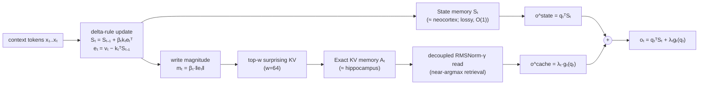

# HOLA — A Hippocampus for Linear Attention: An Exact Memory for What the Recurrent State Forgets

**arXiv:** 2607.02303v1 [cs.AI], 2 Jul 2026 (12pp)
**Author:** Wanyun Cui, Shanghai University of Finance and Economics
**PDF source:** `paper.pdf` → `paper_layout.txt` (`pdftotext -layout`, 752 lines, 6 explicit tables + 5 figures)
**Repo subarea:** linear-attention / state-space **exact-memory architecture** — semiparametric test-time memory. Genuinely uncovered in the 28-paper library (no prior paper covers linear attention, SSMs, recurrent-state memory, or CLS-inspired architectures). Architectural sibling-in-spirit to the inference-efficiency lineage (`jetspec`/`speculating-experts`/`spin` attack FLOPs/serving; HOLA attacks the *memory-architecture* bottleneck) and to `iLLaDA` (both reform attention), but HOLA keeps a recurrent compressor and *adds* a bounded episodic store.

---

## 1. The Problem (and the CLS framing)

Linear-attention / state-space LMs (DeltaNet, Gated DeltaNet/GDN, GLA, GSA, Mamba) compress the prefix into a **fixed-size recurrent state** `S` (`(d_k × d_v)` matrix): O(1) memory, sub-quadratic compute, but a **lossy exact memory**. Once the number of distinct key→value associations exceeds the state's bounded rank (`≤ d_k`), new writes overwrite old ones along shared key directions. This hurts exactly where softmax attention (O(T) memory, O(T²) compute) still wins:

- multi-item associative recall (Zoology),
- passkey / needle-in-a-haystack retrieval,
- verbatim distant-token copying.

**Complementary Learning Systems (CLS)** analogy: the brain keeps a slow, compressive *neocortex* (generalization) separate from a fast, exact *hipocampus* (one-shot episodes). Linear attention's recurrent state is a superb *neocortex* but a leaky *hippocampus*. **HOLA gives it a hippocampal complement**: a bounded exact KV cache that preferentially stores *surprise*.

---

## 2. Method

### 2.1 Background: the delta rule and its lossiness (Eq. 1)

DeltaNet compresses history into matrix `S` (online associative memory; read-out for key `k` is `kᵀ S`). With unit-norm `q_t, k_t` and write strength `β_t ∈ [0,1]`:

```
S_t = S_{t−1} + β_t k_t e_tᵀ ,    e_t = v_t − k_tᵀ S_{t−1} ,    o^state_t = q_tᵀ S_t          (Eq. 1)
```

`e_t` is the **residual / innovation** (the part of `v_t` S cannot already predict along `k_t`). `S` is fixed-size, rank `≤ d_k` ⇒ lossy.

### 2.2 Semiparametric memory as test-time regression (Definitions 1–2, Eq. 2–4)

> **Definition 1 (test-time memory regression, TMR).** A memory state `M_t` with Write and Read ops; Read returns `f̂_t(q)`, an estimator (built from the causally-available KV observations `D_t = {(k_i, v_i)}_{i≤t}`) of the context-specific map `f: q ↦ v`.

> **Definition 2 (semiparametric TMR).** `M_t = (S_t, A_t)` where `S_t` is a fixed-size **parametric** state and `A_t ⊆ D_t` is a set of **exact KV pairs** kept non-parametrically. Read:

```
o_t = Read(q_t, M_t) = q_tᵀ S_t  +  λ_t · g_t(q_t)                                                  (Eq. 3)
```

`λ_t` = read-side mixing coefficient; `g_t` = non-parametric model over exact KV pairs in `A_t`.

This spectrum locates the alternatives cleanly:

| Mechanism | `S_t` | `A_t` | Read |
|---|---|---|---|
| **GDN** (pure parametric) | fixed-size state | ∅ | `qᵀ S` (Eq. 2) |
| **HOLA** (bounded semiparametric) | full GDN state | bounded exact KV set (top-w by β·‖e‖) | `qᵀ S + λ g(q)` (Eq. 3) |
| **Full softmax attention** (unbounded non-parametric) | disabled | `A = D` (all tokens) | Nadaraya–Watson kernel estimator (Eq. 4) |

### 2.3 What to store: write-magnitude β·‖e‖ as "surprise" (Eq. 5–6)

Write the update as a rank-1 matrix `Δ_t = β_t k_t e_tᵀ` (Eq. 5). A token's total effect on `S` is its Frobenius norm; for rank-1 with `‖k_t‖=1`:

```
m_t = ‖Δ_t‖_F = β_t ‖k_t‖ ‖e_t‖ = β_t ‖e_t‖          (Eq. 6)
```

`m_t = β·‖e‖` is **how much the token changed `S`** — a parameter-free, intrinsic surprise score. **Cache = the top-w tokens seen so far by β·‖e‖** (default `w=64`), regardless of distance. `m_t` is fixed at write-time ⇒ the same top-w set is maintained online or blockwise with no order dependence (training and inference use identical cache semantics).

> *Why the product matters (ablated in Table 4):* residual alone (`‖e‖`) lacks the write-strength utility signal; write strength alone (`β‖v‖`) lacks the innovation signal; **their product is best.**

> *Versus recency:* sliding-window memories (StreamingLLM/NHA/RAttention) select by *position* — an old-but-important item slides out and is lost. β·‖e‖ keeps surprising KV pairs **across distance**.

### 2.4 How to read: retrieval, not soft averaging (Eq. 7)

An exact copy is worthless if read like linear attention. If the cache reuses the backbone's unit-L2-normalized `q, k`, the effective logit is `τ·(1/√d)cos ≈ 0.83·cos` (learned `τ≈6.6`): over `w=64` entries a perfect match gets only ~3.5% of softmax mass ⇒ the cache degenerates into a soft-average lossy summary.

**Fix — decoupled RMSNorm-γ** (Qwen3-style): apply RMSNorm with learnable `γ` to the **cache-path** `q̃ = RMSNorm_γ(q), k̃ = RMSNorm_γ(k)` (norm kept at `≈√d ≈ 11`, not 1), `τ=1` fixed:

```
o^cache_t = Σ_{j∈V_t} softmax_j( q̃_tᵀ k̃_j / √d ) v_j                                              (Eq. 7)
```

Now the effective logit is `≈√d·cos ≈ 11·cos` (vs `0.83·cos`) ⇒ **near-argmax retrieval**. Acts *only* on the cache read; decoupled from the state path (the `q, k` feeding `S` stay unit-L2 — the delta rule needs `‖k‖=1` to keep the update operator `I − βkkᵀ` eigenvalues within [0,1]; a `√d` norm in the state update would give eigenvalues `1−βd` and diverge). The learnable `γ` self-moderates sharpness. **Empirically the single largest design lever: perplexity 70→60, ~2× multi-key capacity.**

### 2.5 Instantiation (GDN) + overhead

Backbone = **Gated DeltaNet** (adds data-dependent decay gate `α_t ∈ (0,1]`; prediction `α_t kᵀ S_{t−1}`, residual `e_t = v_t − α_t kᵀ S_{t−1}`). Orthogonal to the method; `β·‖e‖` unchanged.

**Overhead over GDN at 340M (L=24, H=4, d=256):**
- cache-specific learned params = cache-path Q/K RMSNorm scales + per-head sink + cache gate = `L(2d + 2H) = 24(512 + 8) = 12,480 scalars` → **<0.004%** of the full model; frozen temperature adds `L·H = 96` stored scalars.
- cache (inference state, not weights): in bf16 decoding ≤ `(w+C)` KV pairs/layer ≈ `24 · 320 · 4 · 256 · 2 · 2 ≈ 31 MB`.
- measured **peak GPU allocation** (weights incl., bs=1 decode): **0.75 GB HOLA vs 0.72 GB GDN** at both 32k and 128k → flat with context, **~5% peak-memory overhead**.

---

## 3. Experimental Setup

| Knob | Value |
|---|---|
| Architecture | GDN 340M: `d_model=1024`, 24 layers, 4 heads × head-dim 256, `expand_v=1`, `hidden_ratio=4`, conv 4, tied embeddings, vocab 32000 |
| HOLA cache | `evict=betae`, window `w=64`, chunk `C=256`, `gate_init=−4.0`, `cache_norm=rms`, `tau_init=1.0`, `tau_freeze=true`, `cache_kernel=sdpa` |
| Corpus | SlimPajama **15.0B tokens**, Mistral tokenizer, ctx 2048 |
| Optimizer | AdamW (peak lr `4e−4`, wd 0.01, cosine, warmup 1000, grad-clip 1.0), batch 0.5M tokens, 1 epoch |
| Hardware | 8×A800 |
| Recipe | Preconditioned-DeltaNet 340M (Tumma et al., 2026) — enables reuse of published DeltaNet/KDA/GDN rows |
| Baselines | own GDN anchor + HOLA (controlled same-backbone); borrowed recipe-matched rows: Transformer++/GLA/GSA (Du et al., 2025), DeltaNet/KDA/GDN (Tumma et al., 2026); KDA = Kimi Delta Attention (Kimi Linear) |
| Eval | (1) LM: Wikitext-103 PPL, LAMBADA; (2) Commonsense (zero-shot): ARC-e/c, PIQA, HellaSwag, WinoGrande, BoolQ, SciQ, OpenBookQA, LAMBADA-acc; (3) in-context retrieval: FDA, SWDE, SQuAD; (4) long context: RULER (2k→32k; MK/MV/MQ/VT) + passkey/needle |

**Closest related work:** LTE (He & Garner, 2025) also augments GDN with a bounded evictable KV cache but **learns** eviction with an extra CNN module and alternates GDN with sparse-attention layers; HOLA uses the delta rule's own write magnitude (parameter-free) and attaches the cache inside *every* recurrent layer. No matched-memory LTE comparison was run (Limitations).

---

## 4. Results

### 4.1 Main comparison — 340M / SlimPajama-15B / ctx-2048 (Table 1, verbatim)

> Bold = best per column **among sub-quadratic models** (Transformer++ excluded — different, quadratic-cost class). Avg. = six-task commonsense mean (ARCe/ARCc/Hella/PIQA/Wino/LMBa). Commonsense differences among the three own models (GDN / HOLA+recency / HOLA) are within single-seed noise (<0.7 on the six-task avg); the cache's gains are in perplexity and retrieval.

| Model (source) | Wiki ↓ | LMB ↓ | ARCe ↑ | ARCc ↑ | Hella ↑ | PIQA ↑ | Wino ↑ | LMBa ↑ | **Avg ↑** | FDA ↑ | SWDE ↑ |
|---|---|---|---|---|---|---|---|---|---|---|---|
| Transformer++ full-attn (Du'25) | 26.88 | 42.15 | 44.91 | 25.94 | 34.95 | 64.31 | 51.07 | 32.84 | 42.34 | 46.1 | 25.9 |
| DeltaNet (Tumma'26) | 29.04 | 45.76 | 44.02 | 23.55 | 34.08 | 65.07 | 50.91 | 29.58 | 41.20 | 8.5 | 27.1 |
| GLA (Du'25) | 28.78 | 39.00 | 44.53 | 22.27 | 34.84 | 63.93 | 51.38 | 32.27 | 41.54 | 11.3 | 16.8 |
| GSA (Du'25) | 28.17 | 42.57 | 45.50 | 24.23 | 35.00 | 64.85 | 50.43 | 30.78 | 41.80 | 6.4 | 16.9 |
| KDA (Tumma'26) | 26.18 | 31.37 | 45.45 | 22.70 | 36.06 | 66.00 | 52.25 | 34.04 | 42.75 | 13.9 | 34.1 |
| GDN (Tumma'26) | 27.08 | 31.39 | 44.49 | 24.32 | 35.96 | 65.83 | 51.30 | 34.50 | 42.73 | 13.6 | 29.4 |
| **GDN (ours, anchor)** | 27.32 | 30.95 | 46.13 | 23.72 | 35.88 | 65.07 | 50.43 | 34.02 | 42.54 | 11.7 | 29.0 |
| HOLA+recency (control) | 25.04 | 32.33 | 46.13 | 24.40 | 35.62 | 65.34 | 52.80 | 34.72 | 43.17 | 16.9 | 29.9 |
| **HOLA (ours)** | **22.92** | **30.26** | 46.00 | 24.06 | 35.91 | 65.02 | 51.54 | 34.54 | 42.85 | **20.1** | **35.9** |

*Source-free check:* the Avg column reproduces from its six task cells for every row — HOLA (46.00+24.06+35.91+65.02+51.54+34.54)/6 = 42.845→42.85 ✓; GDN(ours) 42.54 ✓; HOLA+recency 43.17 ✓; GDN(Tumma) 42.73 ✓; KDA 42.75 ✓; DeltaNet 41.20 ✓; GLA 41.54 ✓; GSA 41.80 ✓; Transformer++ 42.34 ✓. (All 9 reconcile.)

**Headline deltas (recompute-verified):**
- **Wikitext PPL:** 27.32 → 22.92 = **−16.1%** vs same-backbone GDN; below strongest sub-quadratic baseline KDA (26.18) **and** below full-attention Transformer++ (26.88). *Also the lowest LAMBADA PPL in the table (30.26).*
- **In-context retrieval:** FDA 11.7 → 20.1 = **+72% relative**; SWDE 29.0 → 35.9 = **+24%**; SQuAD 32.5 → 33.8 (from §4.2 prose). Best among linear models; only full-attention T++ still leads pure extraction (FDA 46.1).
- **Commonsense:** six-task avg essentially a tie among the strong models (HOLA 42.85, HOLA+recency 43.17, KDA 42.75, GDN ~42.7 — all within ~0.6, above T++ 42.34). On the 9-task accuracy mean, HOLA 0.446 vs GDN 0.440 (BoolQ 0.548→0.584, +3.5pt).

> ⚠ *Denominator note (paper-internal, transcribed verbatim):* Table 1's "Avg." is a **6-task** commonsense mean, while §4.2 also cites a **9-task** accuracy mean (HOLA 0.446 vs GDN 0.440). Different denominators — not comparable head-to-head. Also, abstract/Figure-1 round the headline to 27.3→22.9 (table: 27.32→22.92) — harmless rounding.

### 4.2 Consistency across scale (Table 2, verbatim)

Same-backbone GDN-vs-HOLA at three scales; gain is **15–16% relative** at every scale.

| Scale | GDN PPL ↓ | HOLA PPL ↓ | Δ rel |
|---|---|---|---|
| 46M | 71.0 | 59.5 | −16.2% |
| 170M | 35.98 | 30.51 | −15.2% |
| 340M | 27.32 | 22.92 | −16.1% |

*Source-free check:* (71.0−59.5)/71.0 = 0.162 ✓; (35.98−30.51)/35.98 = 0.152 ✓; (27.32−22.92)/27.32 = 0.161 ✓.

### 4.3 Long-context retrieval — RULER (Table 3, verbatim; 340M, 2k–8k compact snapshot)

> Transformer++ = full-attention ceiling (RoPE, max position 8192); three sub-quadratic models compared. Single-needle = S-NIAH-1/2/3 (cols 1–3); multi-needle = multi-key-1 (MK1), multi-value (MV), multi-query (MQ). **Bold = best sub-quadratic per cell.** T++ is strongest within its 2k training length but collapses to **0** under RoPE extrapolation at 4k+, where HOLA degrades gracefully. 16k/32k S-NIAH-1 trend in Figure 1b.

| len | model | S-NIAH **1** | **2** | **3** | MK1 | MV | MQ |
|---|---|---|---|---|---|---|---|
| **2k** | Transformer++ | 1.00 | 1.00 | 0.79 | 0.71 | 0.34 | 0.33 |
| | GDN | 1.00 | 0.38 | 0.26 | 0.17 | 0.17 | 0.24 |
| | HOLA+recency | 1.00 | 0.83 | 0.89 | 0.26 | 0.21 | 0.22 |
| | **HOLA** | **1.00** | **1.00** | **0.96** | 0.25 | **0.28** | 0.18 |
| **4k** | Transformer++ | 0.00 | 0.00 | 0.00 | 0.00 | 0.00 | 0.00 |
| | GDN | 1.00 | 0.52 | 0.23 | 0.17 | 0.14 | 0.19 |
| | HOLA+recency | 0.93 | 0.27 | 0.38 | 0.13 | 0.17 | 0.17 |
| | **HOLA** | **0.99** | **0.89** | **0.43** | **0.30** | **0.28** | **0.26** |
| **8k** | Transformer++ | 0.00 | 0.00 | 0.00 | 0.00 | 0.00 | 0.00 |
| | GDN | 0.83 | 0.09 | 0.07 | 0.03 | 0.07 | 0.02 |
| | HOLA+recency | 0.74 | 0.04 | 0.02 | 0.05 | 0.03 | 0.01 |
| | **HOLA** | **0.98** | **0.35** | **0.05** | **0.11** | **0.16** | **0.08** |

**Headline long-context (S-NIAH-1, from §4.4 prose + Figure 1b; not in Table 3):** at **32k** (16× the 2k training length), HOLA **0.58** vs HOLA+recency **0.24** vs GDN **0.14** → **+0.44** margin over the state, **+0.64 at 16k**. The recurrent state (GDN) collapses with length; HOLA stays robust; a recency cache sits barely above no-cache at the far needle (0.24 vs 0.14).

### 4.4 Ablation — eviction signal (Table 4, verbatim; 46M, flat read)

> Isolates the eviction rule (same 46M backbone, cache size, flat read). "Far" = teacher-forced passkey accuracy at depth 0.1 in a 4k context; multi-key cols = associative-recall capacity for 1/2/4 facts; PPL = Wikitext-103 test. Pure `‖e‖` lacks the write-strength utility signal and performs poorly on the far needle; multiplying by the GDN write gate `β·‖e‖` (the actual delta-rule update magnitude) is best/tied-best on every column AND gives the lowest PPL.

| Eviction score | has β? | far d=0.1 | 1 key | 2 keys | 4 keys | Wiki PPL ↓ |
|---|---|---|---|---|---|---|
| GDN (no cache) | – | 0.55 | 0.78 | 0.45 | 0.41 | 70.21 |
| cumulative attention (H2O) | – | 0.43 | 0.97 | 0.69 | 0.55 | 71.45 |
| residual `‖e‖` | no | 0.22 | 0.71 | 0.61 | 0.48 | 70.50 |
| `β‖v‖` | yes | 0.42 | 0.97 | 0.72 | 0.54 | 70.76 |
| **`β·‖e‖` (ours)** | yes | **0.67** | 0.97 | **0.74** | **0.56** | **70.10** |

*Cross-table check:* GDN-no-cache PPL 70.21 == Table 5 GDN-no-cache 70.21 ✓; `β·‖e‖` flat-read PPL 70.10 == Table 5 unit-L2-read 70.10 ✓.

### 4.5 Ablation — cache-read normalization (Table 5, verbatim; 46M)

> Eviction rule fixed to β·‖e‖. Unit-L2 q,k make the cache read too flat (soft average). RMSNorm-γ keeps the natural `√d` logit scale while letting the model tune it → turns the same bounded cache into an exact local memory: **>10-point PPL drop** + sharply higher multi-key capacity, without losing the far-needle behavior. (RMSNorm-γ row is a three-seed mean.)

| Read / model | Wiki PPL ↓ | far d=0.1 | passkey mean | 1 key | 4 keys | 8 keys | 16 keys |
|---|---|---|---|---|---|---|---|
| GDN (no cache) | 70.21 | 0.55 | 0.60 | 0.78 | 0.41 | 0.35 | 0.31 |
| β·‖e‖ + unit-L2 read | 70.10 | 0.67 | 0.67 | 0.97 | 0.56 | 0.41 | 0.31 |
| **β·‖e‖ + RMSNorm-γ (ours)** | **59.5** | **0.75** | **0.69** | 0.97 | **0.77** | **0.67** | **0.41** |

*Cross-table check:* RMSNorm-γ PPL 59.5 == Table 2 (46M HOLA) 59.5 ✓. Sharpening lift = 70.10 → 59.5 = **−15.1%** — the "70→60" / "single largest lever" claim from §2.4.

### 4.6 Scale configurations (Table 6, verbatim)

Within each row GDN and HOLA share backbone + recipe; HOLA only adds the bounded exact KV cache.

| Scale | `d_model` | layers | corpus | train tokens | ctx |
|---|---|---|---|---|---|
| 46M | 512 | 12 | FineWeb-Edu | 0.5B | 4096 |
| 170M | 1024 | 12 | SlimPajama | 6.22B | 2048 |
| 340M | 1024 | 24 | SlimPajama | 15.0B | 2048 |

170M/340M follow the GDN recipe (4 heads × head-dim 256, expand_v=1, hidden_ratio=4, conv 4, tied embeddings, vocab 32000, Mistral tokenizer, AdamW peak lr 4e−4). The 46M row is the 12-layer / `d_model=512` architecture trained on FineWeb-Edu for 0.5B tokens at ctx 4096 — the scale used for the component studies in Tables 4–5.

---

## 5. Takeaways

1. **A linear-attention model's own update rule diagnoses what it fails to remember.** The delta-rule write magnitude `β·‖e‖` is a parameter-free "surprise" score; spending a small exact memory on exactly those tokens recovers the long-range exact recall the compressor loses.
2. **Two design choices, both load-bearing:** *what to store* (top-w by β·‖e‖, not recency — Table 4) and *how to read* (decoupled RMSNorm-γ sharpening — Table 5). Each alone gives little; together they drop 340M Wikitext PPL **27.32→22.92 (−16.1%)**, below full-attention Transformer++ (26.88).
3. **The matched recency control is the key causal probe:** HOLA+recency keeps the identical architecture (w=64, sharpened read, gate, kernel) and changes *only* the eviction signal. Recency barely beats no-cache at the far needle (S-NIAH-1 @32k: 0.24 vs GDN 0.14) while surprise-eviction reaches 0.58 — *for a bounded exact memory, what to cache matters more than how recent*.
4. **Length-robust out to 16× training length:** at 32k (trained at 2k) HOLA holds S-NIAH-1 = 0.58 where GDN collapses to 0.14 and the 2k-trained full-attention checkpoint reaches 0 (RoPE extrapolation).
5. **Cheap:** <0.004% extra trainable params, ~5% peak-memory over GDN, flat with context (0.75 vs 0.72 GB at 32k/128k).
6. **Honest scope:** the cache is bounded (w+C+1 ≈ 321 tokens), so single-needle recall is 0.58 not perfect at 32k and very-long / needle-dense contexts can't retain everything; HOLA narrows but does not close the gap to full attention on pure token-exact extraction (FDA 20.1 vs T++ 46.1); main-scale results are single-seed; no matched-memory comparison vs learned-eviction (LTE's CNN).

---

## 6. Mermaid — HOLA layer



---

## 7. Strengths / Limitations / Verdict

**Strengths**
- Clean theoretical framing (semiparametric TMR) that puts GDN / HOLA / full-attention on one spectrum — *why* the design works, not just *that* it works.
- Causal isolation of both design axes via matched controls: HOLA+recency (Table 1/3/Fig 1b) for *what to store*; unit-L2-vs-RMSNorm-γ (Table 5) for *how to read*.
- Beats a full-attention Transformer++ on perplexity at sub-quadratic cost — a strong, falsifiable headline.
- Cross-scale consistency (15–16% PPL gain at 46M/170M/340M).

**Limitations**
- Single-seed at main scale (340M); the matched recency comparison + 46M three-seed diagnostics support the eviction rule but don't substitute for multi-seed main numbers.
- Bounded cache ⇒ 0.58 not 1.0 at 32k single-needle; no dense-needle regime.
- No matched-memory comparison vs learned-eviction modules (LTE's CNN) — the closest prior work.
- Under-cited mechanism detail: the effective-logit arithmetic in §2.4 (`≈0.83·cos` for unit-L2 with `τ≈6.6`; `≈√d·cos ≈ 11·cos` for RMSNorm-γ) implies inconsistent effective dimensions versus the stated head-dim 256 (`√256 = 16`); treated as the paper's stated heuristic, not re-derived.

**Verdict:** a well-motivated, cheap, and well-ablated architectural add-on for linear-attention LMs. The contribution is the *combination* of a parameter-free intrinsic surprise signal (β·‖e‖) with a decoupled sharpened read — both individually small, jointly responsible for the perplexity drop below full attention. The honest scope and the matched-control ablations make the central claim (the recurrent update already exposes what to cache) credible. Highest value for readers working on linear-attention/SSM recall, hybrid recurrent+exact memory, or efficient long-context architectures.

---

*Sourcing: all 6 explicit tables (Table 1 lines 389–410; Table 2 471–475; Table 3 509–531; Table 4 549–557; Table 5 573–580; Table 6 735–739) transcribed verbatim from `paper_layout.txt` (`pdftotext -layout`). Headline deltas recomputed from displayed cells (−16.1% / +72% / +24%; Table 2 Δ 15–16%; Table 5 −15.1%). Figure-derived values (Figure 1a bar heights, Figure 1b S-NIAH-1 curve, 16k/32k points) quoted only where prose-confirmed (§4.4 gives 0.58/0.24/0.14 @32k and +0.64 @16k); per-point bar reads not back-filled.*
