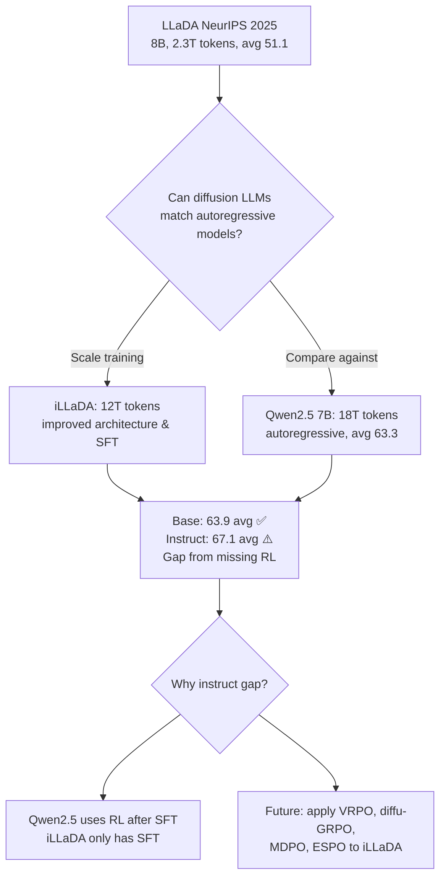
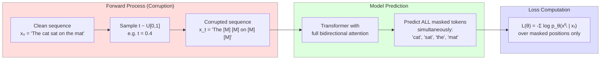
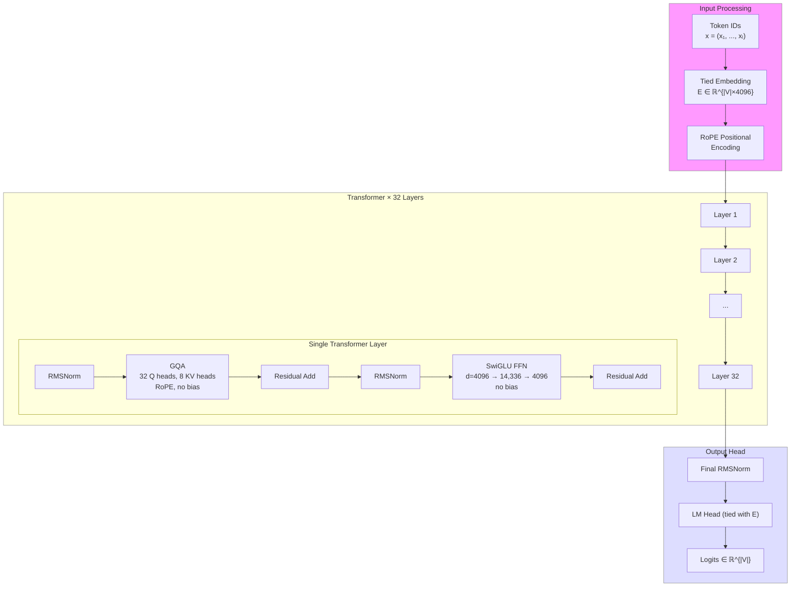
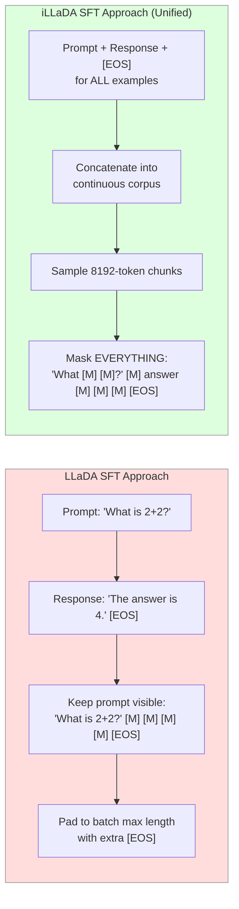
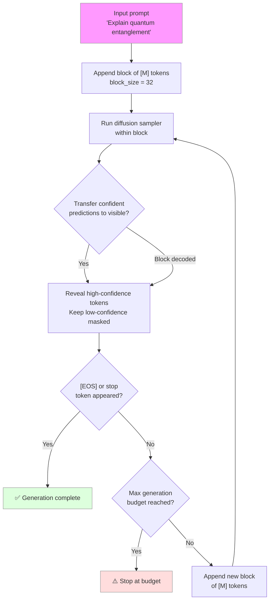

# Breakdown — iLLaDA: Improved Large Language Diffusion Models

> **Paper:** Improved Large Language Diffusion Models
> **Authors:** Shen Nie, Qiyang Min, Shaoxuan Xu, Zihao Huang, Yuxuan Song, Yong Shan, Yankai Lin, Wayne Xin Zhao, Chongxuan Li, Ji-Rong Wen (Renmin U + ByteDance Seed)
> **Year:** 2026 (arXiv:2606.25331)
> **ArXiv:** https://arxiv.org/abs/2606.25331
> **Code:** https://github.com/ML-GSAI/LLaDA
> **Type:** Scaling & engineering improvements to masked diffusion LLMs
> **Predecessor:** LLaDA (NeurIPS 2025 Oral)

---

## 1. Problem & Motivation

**Problem.** LLaDA (NeurIPS 2025) showed that masked diffusion language models trained from scratch with fully bidirectional attention can acquire core LLM capabilities (in-context learning, instruction following). However, LLaDA 8B was trained on only 2.3T tokens and its performance remained behind strong autoregressive models like Qwen2.5 7B (51.1 vs 63.3 average score across benchmarks).

**Why important.** If diffusion LLMs can match autoregressive ones at scale, they bring fundamental advantages:
- **Better bidirectional reasoning** — reversal and bidirectional tasks are naturally supported
- **Data efficiency** — can train on repeated data without overfitting, unlike autoregressive models
- **Multimodal/omni-modeling extensions** — unified diffusion framework naturally extends to vision, audio, etc.
- **Parallel token generation** — non-autoregressive by nature, all tokens predicted simultaneously

The core question motivating this paper: *can you just scale a diffusion LLM properly and close the gap with autoregressive models?*

**Answer from this paper:** Yes, for base models — iLLaDA 8B-Base slightly outperforms Qwen2.5 7B-Base (63.9 vs 63.3 avg). Mostly yes for instruct, but RL alignment is still needed to fully close the instruct gap (67.1 vs 77.1 avg vs Qwen2.5 7B-Instruct).

### Motivation Diagram



---

## 2. Key Insight / Contribution

**Core idea (one sentence):** Scaling masked diffusion language models to 12T tokens with improved architecture (GQA, tied embeddings), proper LR scheduling, unified SFT format, and confidence-based scoring produces a model competitive with Qwen2.5 7B, showing that fully bidirectional diffusion training from scratch is a viable path to strong language models.

**What is genuinely new (incrementally):**
- **Confidence-based MC scoring** — deterministic heuristic that outperforms likelihood-based scoring on multiple-choice tasks (+1.3/+0.6/+2.3 on PIQA/ARC-C/HellaSwag)
- **Unified pre-training/SFT format** — mask everything (prompt + response + EOS), not just response; eliminates the need for special SFT data processing
- **SFT at 12 epochs** — diffusion models continue improving on repeated SFT data without saturation, unlike autoregressive models
- **Practical scaling recipe** — GQA, tied embeddings, variable-length attention, adaptive LR schedule

Not new: the masked diffusion objective, the variable-length generation approach, the core Transformer backbone. Those all come from LLaDA (NeurIPS 2025).

---

## 3. Method

### 3.1 Masked Diffusion Pre-training Objective

The training objective is a likelihood-based masked diffusion objective for discrete data. Given a clean sequence $\mathbf{x}_0 = (x_1^0, x_2^0, \ldots, x_L^0)$ of length $L$:

**Step 1 — Corruption.** Sample a masking ratio $t \sim \mathcal{U}[0, 1]$ uniformly. Then independently replace each token with the mask token $[\text{M}]$ with probability $t$:

$$ \mathbb{P}(x_i^t = [\text{M}] \mid x_i^0) = t, \quad \mathbb{P}(x_i^t = x_i^0 \mid x_i^0) = 1 - t $$

This produces a corrupted sequence $\mathbf{x}_t = (x_1^t, x_2^t, \ldots, x_L^t)$.

**Step 2 — Prediction.** The model predicts all masked tokens in a single forward pass using fully bidirectional attention:

$$ \mathcal{L}(\theta) = -\mathbb{E}_{t, \mathbf{x}_0, \mathbf{x}_t} \sum_{i=1}^{L} \mathbf{1}[x_i^t = [\text{M}]] \cdot \log p_\theta(x_i^0 \mid \mathbf{x}_t) \tag{1} $$

**Symbol definitions:**
| Symbol | Meaning |
|--------|---------|
| $\mathbf{x}_0$ | Clean (unmasked) token sequence of length $L$ |
| $\mathbf{x}_t$ | Corrupted sequence after applying mask ratio $t$ |
| $t$ | Masking ratio, sampled uniformly from $[0, 1]$ |
| $[\text{M}]$ | Special mask token |
| $\mathbf{1}[\cdot]$ | Indicator function (1 if condition is true, 0 otherwise) |
| $p_\theta(x_i^0 \mid \mathbf{x}_t)$ | Model's predicted probability of the clean token at position $i$ given the corrupted sequence |
| $\theta$ | Model parameters |

**Plain English:** For each training step, the model is given a partially masked sequence and must predict the original tokens at all masked positions simultaneously. The masking ratio varies randomly between 0% and 100%, so sometimes only a few tokens are masked (easy) and sometimes nearly all are masked (hard). The indicator ensures the loss is computed only on masked positions. Unlike BERT which uses a fixed 15% masking ratio, the uniform sampling over the full range enables the diffusion formulation.

**Key distinction from BERT:** The masking ratio $t$ is sampled from $\mathcal{U}[0, 1]$ — a continuous uniform distribution — not a fixed value. This continuous noise schedule is what makes it a diffusion process rather than simple masked language modeling.

### Masked Diffusion Process Diagram



### 3.2 Architecture Changes vs LLaDA

iLLaDA uses the same dense Transformer backbone as LLaDA (RMSNorm, SwiGLU, RoPE, no attention/MLP bias) with several targeted modifications:

| Component | LLaDA 8B | iLLaDA 8B | Change |
|-----------|----------|-----------|--------|
| Layers | 32 | 32 | — |
| Model dim ($d_{\text{model}}$) | 4,096 | 4,096 | — |
| Attention | MHA (32 heads) | GQA (32 Q, 8 KV heads) | **GQA** |
| FFN dim ($d_{\text{FFN}}$) | 12,288 | 14,336 | **Expanded** |
| Vocab size ($|V|$) | 126,464 | 155,136 | **Larger** |
| Max sequence length | 4,096 | 8,192 | **2× longer** |
| Embeddings | Untied | Tied (input + LM head) | **Tied** |
| Total params | 8.02B | 7.62B | **-0.4B** |
| Non-embedding params | 6.98B | 6.98B | — |

**GQA motivation:** Grouped-Query Attention reduces the memory footprint of cached key/value states. Recent work (dkv-cache, EntropyCache, etc.) has adapted KV-cache mechanisms to diffusion language models. With GQA, the 8 KV heads (vs 32 full heads) reduce KV-cache memory by 4×, which matters for cache-style diffusion inference.

**Tied embeddings:** Input embedding matrix $E \in \mathbb{R}^{|V| \times d_{\text{model}}}$ and output LM head share the same parameters. This reduces total parameters by ~400M while keeping the 6.98B non-embedding parameters unchanged.

**FFN expansion:** The SwiGLU FFN dimension is expanded from 12,288 to 14,336 (ratio $d_{\text{FFN}}/d_{\text{model}}$ increases from 3.0 to 3.5), increasing model capacity while staying within similar compute budget.

### Architecture Diagram



### 3.3 Training Recipe

**Pre-training configuration:**

| Hyperparameter | Value |
|---------------|-------|
| Max sequence length | 8,192 |
| Total training tokens | 12T |
| Optimizer | AdamW |
| Weight decay | 0.1 |
| Peak learning rate | $2 \times 10^{-4}$ |
| Minimum learning rate | $5 \times 10^{-6}$ |
| LR schedule | Warmup → constant → cosine decay |
| Random-length training | 30% chance to split 8192 → two shorter segments |

**Variable-length attention:** Rather than padding all sequences to length 8192, sequences are packed and attention is computed using a FlashAttention-based variable-length kernel with cumulative sequence offsets. This avoids wasting compute on padding tokens.

**Random-length training:** With probability 0.3, an 8192-token sequence is split into two shorter segments at a random position. This prevents the model from overfitting to a fixed sequence length and improves generalization to variable-length inputs during inference.

**Learning rate schedule** — a two-phase approach:

$$ \eta(\text{step}) = \begin{cases} \eta_{\text{peak}} \cdot \frac{\text{step}}{\text{warmup\_steps}} & \text{during warmup} \\ \eta_{\text{peak}} & \text{constant phase (until plateau)} \\ \eta_{\min} + \frac{1}{2}(\eta_{\text{peak}} - \eta_{\min})\left(1 + \cos\left(\pi \cdot \frac{\text{step} - s_0}{s_1 - s_0}\right)\right) & \text{cosine decay (after plateau)} \end{cases} $$

where $\eta_{\text{peak}} = 2 \times 10^{-4}$, $\eta_{\min} = 5 \times 10^{-6}$, and $s_0, s_1$ mark the start and end of the cosine decay phase.

Notable: the cosine decay was not planned in advance. The authors observed the pre-training loss plateau during constant LR, then switched to cosine decay. The loss started decreasing again after the switch, suggesting the constant LR had saturated the model's ability to learn.

### 3.4 Supervised Fine-Tuning (SFT)

**Prior approach (LLaDA):** Each SFT instance is a prompt + reference response. The prompt tokens are kept visible while masks are applied only within the response region. Shorter responses are padded with $[\text{EOS}]$ to match the longest response in each mini-batch.

**iLLaDA approach — unified format:** The SFT data processing is identical to pre-training:

1. **Format:** Each instruction example as `prompt + response + [EOS]`
2. **Concatenate:** All formatted examples into a continuous instruction corpus
3. **Sample:** 8,192-token sequences from the corpus
4. **Mask:** Apply random masks to the **entire** sequence — prompt tokens, response tokens, and $[\text{EOS}]$ tokens may all be masked
5. **Optimize:** Same masked diffusion objective as pre-training (Eq. 1)
6. **Random-length:** Same 30% split probability as pre-training

**SFT hyperparameters:**

| Hyperparameter | Value |
|---------------|-------|
| SFT corpus size | ~25B tokens |
| Epochs | 12 |
| Peak learning rate | $5 \times 10^{-6}$ |
| Minimum learning rate | $5 \times 10^{-7}$ |
| LR schedule | Warmup → constant → linear decay (last 10%) |
| Optimizer | AdamW |
| Weight decay | 0.1 |

**Why 12 epochs matter:** Unlike autoregressive models which typically degrade with repeated SFT data, diffusion LLMs continue to improve. The SFT epoch ablation (Section 6) shows monotonic improvement from 3 to 12 epochs across all tested benchmarks. This is consistent with findings that diffusion language models are "super data learners" — they can effectively exploit repeated training data without memorization degradation.

### SFT Data Processing Comparison



### 3.5 Confidence-Based MC Scoring

For multiple-choice evaluation, iLLaDA introduces a deterministic confidence-based scoring rule that outperforms the standard likelihood-based scoring used by autoregressive models.

**Setup:** Given a prefix (question) $p$ and a candidate continuation $y = (y_1, y_2, \ldots, y_L)$ of length $L$, we need to assign a score $S(y \mid p)$ for candidate ranking.

**Procedure:**

1. **Initialize:** Start from the all-masked candidate $\tilde{\mathbf{y}}_0 = ([\text{M}], [\text{M}], \ldots, [\text{M}])$ with $\mathcal{M}_0 = \{1, 2, \ldots, L\}$ (all positions masked).

2. **Iterative reveal:** At step $k = 1, 2, \ldots, L$, select the remaining masked position with the highest model confidence:
$$ i_k = \underset{i \in \mathcal{M}_{k-1}}{\arg\max} \; p_\theta(y_i \mid p, \tilde{\mathbf{y}}_{k-1}) \tag{2a} $$

3. **Reveal and score:** Set position $i_k$ to the ground-truth token $y_{i_k}$ and accumulate the log-probability:
$$ \tilde{\mathbf{y}}_k[j] = \begin{cases} y_j & \text{if } j \in \{i_1, \ldots, i_k\} \\ [\text{M}] & \text{otherwise} \end{cases} $$
$$ S_{\text{conf}}(y \mid p) = \sum_{k=1}^{L} \log p_\theta(y_{i_k} \mid p, \tilde{\mathbf{y}}_{k-1}) \tag{2b} $$

**Symbol definitions:**
| Symbol | Meaning |
|--------|---------|
| $p$ | Prefix (question/prompt) tokens |
| $y$ | Candidate answer continuation |
| $L$ | Length of candidate $y$ |
| $\mathcal{M}_k$ | Set of remaining masked positions after step $k$ |
| $\tilde{\mathbf{y}}_k$ | Partially revealed candidate at step $k$ |
| $i_k$ | Position selected for reveal at step $k$ (highest confidence) |
| $S_{\text{conf}}(y \mid p)$ | Confidence-based score for candidate $y$ |

**Plain English:** The algorithm starts with the entire answer masked, then greedily reveals tokens one at a time — always picking the position where the model is most confident about the correct answer. The score is the sum of log-probabilities at each reveal step. Intuitively, a "correct" candidate should have high confidence at every step, while a wrong candidate should have low confidence at some positions.

**Important distinction:** $S_{\text{conf}}$ is *not* a likelihood estimate. It is a task-specific scoring surrogate for comparing a finite set of candidate answers. The greedy selection order makes it deterministic and well-suited for multiple-choice evaluation.

### 3.6 Variable-Length Generation

For open-ended generation, iLLaDA uses variable-length block generation with a low-confidence remasking strategy (following LLaDA and MaskGIT):



**Algorithm:**
1. Append a block of mask tokens after the prompt
2. Run the diffusion sampler within this block — the model predicts all masked positions
3. Transfer the most confident predictions to visible tokens; keep low-confidence positions masked
4. Repeat until the block is fully decoded
5. If $[\text{EOS}]$ or another stop token appears → terminate generation
6. If no stop token but block is fully decoded → append a new mask block and repeat
7. Continue until a maximum generation budget is reached

### 3.7 Inference Quirks and Mitigations

| Issue | Description | Mitigation |
|-------|-------------|------------|
| Repetitive reasoning loops | On hard instruct problems, model produces loops like "Wait, let me check again..." without reaching a final answer | Gradually increase stop-thinking token probability as generation lengthens |
| Code generation (HumanEval) | Semi-autoregressive block sampling with small blocks hurts code performance | Use block length = max gen length = 512 (effectively single-block generation) |
| Benchmark-specific tuning | Optimal block length varies by task | Task-specific max gen length and block length (see Section 5) |

The repetitive reasoning loop issue is attributed to chain-of-thought traces in the SFT corpus generated by reasoning models, which sometimes include self-correction patterns that the model over-learns.

---

## 4. Math Summary

### 4.1 Masked Diffusion Training Objective

$$ \mathcal{L}(\theta) = -\mathbb{E}_{t, \mathbf{x}_0, \mathbf{x}_t} \sum_{i=1}^{L} \mathbf{1}[x_i^t = [\text{M}]] \cdot \log p_\theta(x_i^0 \mid \mathbf{x}_t) \tag{1} $$

This is a likelihood-based masked diffusion objective for discrete data. The indicator function $\mathbf{1}[\cdot]$ restricts the loss to masked positions only. The expectation over $t \sim \mathcal{U}[0,1]$ ensures the model sees all corruption levels during training.

### 4.2 Masking Process

$$ x_i^t \sim \begin{cases} [\text{M}] & \text{with probability } t \\ x_i^0 & \text{with probability } 1 - t \end{cases}, \quad t \sim \mathcal{U}[0, 1] $$

### 4.3 Confidence-Based MC Scoring

$$ S_{\text{conf}}(y \mid p) = \sum_{k=1}^{L} \log p_\theta(y_{i_k} \mid p, \tilde{\mathbf{y}}_{k-1}), \quad i_k = \underset{i \in \mathcal{M}_{k-1}}{\arg\max} \; p_\theta(y_i \mid p, \tilde{\mathbf{y}}_{k-1}) \tag{2} $$

This is a deterministic, greedy scoring rule. At each step, the position with highest model confidence is selected and revealed, and the log-probability is accumulated into the score.

### 4.4 Cosine Learning Rate Decay

$$ \eta(s) = \eta_{\min} + \frac{1}{2}(\eta_{\text{peak}} - \eta_{\min})\left(1 + \cos\left(\pi \cdot \frac{s - s_0}{s_1 - s_0}\right)\right) $$

Applied after the pre-training loss plateau during the constant LR phase.

### 4.5 Relationship to Likelihood

The masked diffusion objective (Eq. 1) corresponds to an upper bound on the negative log-likelihood of the model distribution. This means:

$$ -\log p_\theta(\mathbf{x}_0) \leq \mathcal{L}(\theta) $$

This connection motivates using diffusion LLMs for evaluation: minimizing the diffusion loss also pushes toward better likelihood, even though exact likelihood computation remains intractable for fully masked predictions.

---

## 5. Evaluation Setup

### 5.1 Benchmark Suite

| Category | Benchmarks | Description |
|----------|------------|-------------|
| General understanding | MMLU, BBH, ARC-Challenge, HellaSwag | Multi-task knowledge, reasoning, commonsense |
| Mathematical reasoning | GSM8K, MATH | Grade-school and competition math |
| Code generation | HumanEval, MBPP | Python function synthesis |
| Instruct-only | MMLU-Pro, MMLU-Redux | Harder multi-task, error-corrected MMLU |
| Scoring ablation | PIQA, ARC-C, HellaSwag | Physical commonsense + reasoning for MC scoring |

### 5.2 Baselines

| Model | Type | Training | Predecessor |
|-------|------|----------|-------------|
| **iLLaDA 8B** | Diffusion from scratch | 12T tokens | — |
| LLaDA 8B | Diffusion from scratch | 2.3T tokens | LLaDA (NeurIPS 2025) |
| Dream 7B | Diffusion fine-tuned from AR | 18T AR + 0.6T diffusion | Fine-tuned from Qwen2.5 |
| Qwen2.5 7B | Autoregressive | 18T tokens | — |

### 5.3 Generation Settings

**Base model settings:**

| Task | Max gen length | Block length | Notes |
|------|----------------|-------------|-------|
| BBH, GSM8K, MATH | 1,024 | 32 | Standard block sampling |
| MBPP | 1,024 | 32 | Standard block sampling |
| HumanEval | 512 | 512 | Single-block (semi-AR hurts code) |

**Instruct model settings:**

| Task | Max gen length | Block length | Notes |
|------|----------------|-------------|-------|
| MMLU | 4 | 4 | Single letter answer |
| MMLU-Redux | 3 | 3 | Single letter answer |
| GSM8K | 2,048 | 32 | Longer budget for CoT |
| HumanEval | 2,048 | 32 | Longer budget for code |
| MMLU-Pro | 4,096 | 32 | Longest budget, hardest task |
| MATH | 4,096 | 32 | Longest budget, hardest task |
| MBPP | 2,048 | 16 | Smaller blocks for code |

---

## 6. Results

### 6.1 Base Model Comparison

| Model | Tokens | Type | MMLU | BBH | ARC-C | HellaSwag | GSM8K | MATH | HumanEval | MBPP | **Avg** |
|-------|--------|------|------|-----|-------|-----------|-------|------|-----------|------|---------|
| **iLLaDA 8B** | **12T** | **Diff** | **74.8** | **71.3** | **60.8** | 76.6 | **81.9** | 38.4 | 50.0 | 57.8 | **63.9** |
| LLaDA 8B | 2.3T | Diff | 65.9 | 49.7 | 45.9 | 70.5 | 70.3 | 31.4 | 35.4 | 40.0 | 51.1 |
| Dream 7B | 18T+0.6T | Diff | 69.5 | 57.9 | 59.8 | 73.3 | 77.2 | 39.6 | **57.9** | 56.2 | 61.4 |
| Qwen2.5 7B | 18T | AR | 71.9 | 63.9 | 51.5 | **79.0** | 78.9 | **41.1** | 56.7 | **63.6** | 63.3 |

**Key takeaways (cells verbatim from paper Table 2; bold = per-column winner):**
- **iLLaDA vs LLaDA: +12.8 avg** — large improvement from scaling pre-training 5.2× (2.3T → 12T). Per-benchmark gains: MBPP +17.8, BBH +21.6, HumanEval +14.6, ARC-C +14.9, GSM8K +11.6, MMLU +8.9, MATH +7.0, HellaSwag +6.1.
- **iLLaDA vs Qwen2.5 7B: +0.6 avg** — iLLaDA edges Qwen2.5 on average and is the per-column winner on **MMLU (74.8)**, **BBH (71.3)**, **ARC-C (60.8)**, and **GSM8K (81.9)**; Qwen2.5 wins HellaSwag (79.0), MATH (41.1), MBPP (63.6). This matches the paper's claim that iLLaDA-Base "obtains the best results on MMLU, BBH, ARC-Challenge, and GSM8K." (The BBH +21.6 and ARC-C +14.9 gains also match the paper abstract.)
- **Dream 7B comparison:** Dream benefits from 18T AR pre-training tokens (Qwen2.5) plus 0.6T diffusion fine-tuning. Despite this, iLLaDA (trained from scratch) wins on average (63.9 vs 61.4) and on most general/math benchmarks; Dream's only per-column edge is HumanEval (57.9 vs 50.0).

### 6.2 Instruct Model Comparison

| Model | Type | MMLU | MMLU-Pro | MMLU-Redux | GSM8K | MATH | HumanEval | MBPP | **Avg** |
|-------|------|------|----------|------------|-------|------|-----------|------|---------|
| **iLLaDA 8B** | **Diff** | 71.6 | 52.3 | **76.4** | 89.0 | 56.7 | 65.9 | 58.0 | 67.1 |
| LLaDA 8B | Diff | 65.5 | 37.0 | 68.9 | 77.5 | 42.2 | 49.4 | 41.0 | 54.5 |
| Dream 7B | Diff | 67.0 | 43.3 | 76.3 | 81.0 | 39.2 | 55.5 | 58.8 | 60.2 |
| Qwen2.5 7B | AR | **76.6** | **56.3** | 75.7 | **91.6** | **75.5** | **84.8** | **79.2** | **77.1** |

*All four models report the full 7-benchmark instruct suite in paper Table 3 — Dream's MMLU-Pro (43.3), GSM8K (81.0), and MATH (39.2) are present in the source, not missing.

**Key takeaways (cells verbatim from paper Table 3; bold = per-column winner):**
- **iLLaDA vs LLaDA: +12.6 avg** — consistent improvement from scaling, especially on MMLU-Pro (+15.3), HumanEval (+16.5), MBPP (+17.0), MATH (+14.5), GSM8K (+11.5).
- **iLLaDA vs Qwen2.5 7B: -10.0 avg** — large gap in the instruct setting. Qwen2.5 dominates code (HumanEval 84.8 vs 65.9, MBPP 79.2 vs 58.0) and math (MATH 75.5 vs 56.7, GSM8K 91.6 vs 89.0, MMLU-Pro 56.3 vs 52.3) and wins 7 of 8 columns.
- **iLLaDA's only per-column win is MMLU-Redux (76.4)**, edging Dream (76.3) and Qwen2.5 (75.7) by 0.1–0.7pp — this is the paper's "competitive results on MMLU-Redux" claim. (A prior draft incorrectly asserted iLLaDA beat Qwen on GSM8K 89.0 vs 88.0 — Qwen's GSM8K is 91.6, so iLLaDA loses — and that iLLaDA's MMLU-Pro 43.3 beat Qwen's 39.2; 43.3 is Dream's value, and iLLaDA's MMLU-Pro is 52.3 < Qwen's 56.3.)

### 6.3 Results Summary Diagram

```mermaid
bar-chart
    title Base Model Average Scores
    x-axis [iLLaDA 8B, Qwen2.5 7B, Dream 7B, LLaDA 8B]
    y-axis "Average Score" 0 --> 70
    bar [63.9, 63.3, 61.4, 51.1]
```

### 6.4 Scoring Ablation (Multiple-Choice)

| Scoring Rule | PIQA | ARC-C | HellaSwag | Avg Δ |
|-------------|------|-------|-----------|-------|
| Likelihood (baseline) | 77.2 | 60.2 | 74.3 | — |
| **Confidence-based** | **78.5** | **60.8** | **76.6** | **+1.4** |
| Δ (Confidence − Likelihood) | +1.3 | +0.6 | +2.3 | — |

Confidence-based scoring consistently improves over likelihood-based scoring across all three benchmarks. The improvement is especially large on HellaSwag (+2.3), which tests commonsense reasoning and benefits from the greedy confidence ordering.

### 6.5 SFT Epoch Ablation

Performance of iLLaDA-8B-Instruct evaluated at different SFT epochs (values read from paper **Figure 1**, not a table — they are approximate bar-height readings; the paper reports only the qualitative "performance generally improves as SFT epochs increases" trend, with no exact per-epoch numbers in text):

| Epochs | GSM8K | MATH | MMLU-Pro | Avg |
|--------|-------|------|----------|-----|
| 3 | ~85 | ~50 | ~48 | ~61 |
| 6 | ~87 | ~54 | ~50 | ~64 |
| 9 | ~88 | ~56 | ~52 | ~65 |
| **12** | **~89** | **~57** | **~53** | **~66** |

All three benchmarks show **continuous, monotonic improvement** across 12 epochs with no signs of saturation. This is a key finding:
- GSM8K improves by +4 from epoch 3 to 12
- MATH improves by +7 from epoch 3 to 12
- MMLU-Pro improves by +5 from epoch 3 to 12

The absence of saturation at 12 epochs suggests that further gains are possible with more training compute. This behavior is consistent with the broader finding that diffusion language models can effectively exploit repeated data (up to 96 epochs in prior work on 1B unique tokens).

### 6.6 Per-Benchmark Improvement Analysis (iLLaDA vs LLaDA)

| Benchmark | Base Δ | Instruct Δ | Category |
|-----------|--------|------------|----------|
| MMLU | +8.9 | +6.1 | General |
| MMLU-Pro | — | +15.3 | General (instruct-only) |
| MMLU-Redux | — | +7.5 | General (instruct-only) |
| BBH | +21.6 | — | Reasoning |
| ARC-Challenge | +14.9 | — | Reasoning |
| HellaSwag | +6.1 | — | Commonsense |
| GSM8K | +11.6 | +11.5 | Math |
| MATH | +7.0 | +14.5 | Math |
| HumanEval | +14.6 | +16.5 | Code |
| MBPP | +17.8 | +17.0 | Code |
| **Average** | **+12.8** | **+12.6** | — |

The largest absolute gains are on code (MBPP +17.8 base / +17.0 instruct) and reasoning (BBH +21.6, HumanEval +14.6, ARC-C +14.9), suggesting that bidirectional attention with sufficient scale is particularly beneficial for multi-step reasoning and structured generation.

---

## 7. Ablation Studies

### 7.1 Multiple-Choice Scoring Rule

Confidence-based scoring vs. likelihood-based scoring (Section 6.4). Confidence scoring is a strict improvement on all tested benchmarks. The mechanism works because:
1. Greedy ordering reveals the most "obvious" tokens first, making subsequent predictions easier
2. The accumulated score reflects how well the model "understands" the entire candidate, not just local token probabilities
3. For wrong candidates, the model will have low confidence at some positions, driving down the score

### 7.2 SFT Duration

12 epochs of SFT produce strictly better results than 3, 6, or 9 epochs (Section 6.5). No ablation beyond 12 epochs due to compute constraints.

### 7.3 Learning Rate Schedule (Qualitative)

The reactive switch from constant LR to cosine decay was not formally ablated. However, the observation that the pre-training loss plateau broke after switching to cosine decay is a strong qualitative signal. It is unclear whether cosine decay from the start would have been equivalent or better.

### 7.4 Missing Ablations

This is the main weakness of the paper. The following were **not** ablated:
- GQA vs MHA (does GQA affect quality or just inference memory?)
- Tied vs untied embeddings (does tying hurt capacity?)
- FFN width (is 14,336 optimal? what about 12,288 or 16,384?)
- Masking schedule (any benefit from non-uniform $t$ distributions?)
- Data composition (what was in the 12T corpus? synthetic data?)
- Pre-training token count (is 12T optimal for 8B, or is more better?)

---

## 8. Limitations

1. **No RL alignment.** Qwen2.5 7B Instruct uses RL (likely DPO or similar) after SFT; iLLaDA only has SFT. The authors explicitly identify this as the main source of the instruct gap. Existing RL methods for diffusion LLMs — VRPO, diffu-GRPO, MDPO, ESPO — are all applicable and could close this gap.

2. **Single scale (8B only).** No scaling curves, no 70B+ results. Cannot determine whether the diffusion-vs-AR pattern holds at larger scales or whether 12T tokens at 8B is the right compute allocation.

3. **Short paper, missing details.** No training compute (FLOPs), no data composition breakdown, no training infrastructure description, no wall-clock training time.

4. **Repetitive reasoning loops.** On hard instruct problems, the model enters repetitive self-correction loops ("Wait, let me check again..."). The mitigation (gradually increasing stop token probability) is heuristic and may truncate legitimate long reasoning chains.

5. **Dream comparison isn't fully fair.** Dream 7B was fine-tuned from Qwen2.5 (AR pre-training) — it benefits from 18T AR tokens of knowledge. iLLaDA is trained entirely from scratch with diffusion. A fairer comparison would be a purely from-scratch diffusion model at the same 18T scale.

6. **Ad-hoc LR schedule.** The switch from constant to cosine was reactive (based on observing a loss plateau), not planned from the start. It's unclear whether cosine decay from the beginning would have been equivalent or better.

7. **HumanEval weakness.** iLLaDA falls behind both Dream 7B (50.0 vs 57.9) and Qwen2.5 7B (50.0 vs 56.7) on HumanEval, suggesting that diffusion generation may have inherent weaknesses for structured code generation despite its advantages on mathematical reasoning.

---

## 9. Open Questions / Ideas

- **Apply RL alignment.** VRPO, diffu-GRPO, MDPO, and ESPO are all directly applicable to iLLaDA. This is the most obvious next step and could close the instruct gap significantly. Given that iLLaDA-Base already matches Qwen2.5-Base, RL alignment could bring instruct performance close to AR models.

- **Scale to 70B+.** Does the diffusion-vs-AR pattern hold at larger scales? Is 12T tokens at 8B the right compute-optimal allocation? Chinchilla-optimal would suggest more tokens for 8B, but the returns may be diminishing.

- **Ablate individual architectural changes.** GQA, tied embeddings, FFN width, unified SFT format — what contributes most to the improvements over LLaDA? A systematic ablation would significantly strengthen the paper's claims.

- **Data composition analysis.** What was in the 12T pre-training corpus? Any synthetic data? What fraction is code, math, web text? The data composition likely matters a lot for the observed benchmark improvements.

- **Long-context evaluation.** Max training length is 8,192 tokens. How does iLLaDA fare on longer-context tasks (long document QA, needle-in-haystack)? The variable-length attention kernel suggests they planned for this but didn't evaluate it.

- **Inference efficiency comparison.** What's the wall-clock latency vs Qwen2.5 for equivalent generation lengths? The parallel generation claim needs concrete numbers. KV-cache-based inference for diffusion LLMs (dkv-cache, EntropyCache) is emerging and could make the comparison more favorable.

- **Cosine LR from the start.** Train a new model with cosine decay from the beginning to determine if the reactive schedule switch was necessary or if it was simply an artifact of monitoring.

- **Comparison with LLaDA 2.0.** There is apparently a 16B MoE and 100B version of LLaDA now. How does iLLaDA 8B compare to these larger models?

- **SFT beyond 12 epochs.** Since no saturation was observed at 12 epochs, how far can SFT scaling go? Is there a point of diminishing returns or degradation?

- **Combine with data augmentation.** Given the data-reuse advantage of diffusion models, can synthetic data generation and repeated training be combined effectively for further gains?
