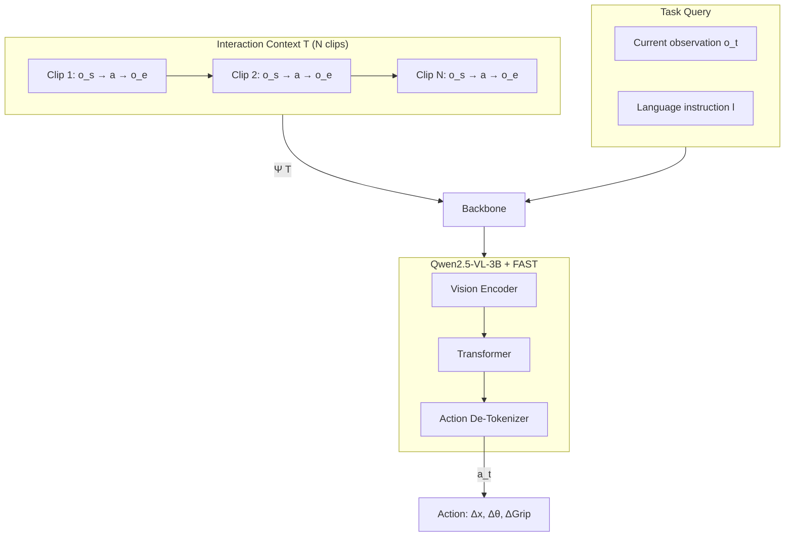

# In-Context World Modeling for Robotic Control — Full Breakdown

**ArXiv:** 2606.26025v2 · June 2026
**Fudan University / Shanghai Innovation Institute / Tongji University**

---

## Problem & Motivation

Standard VLA models learn π(a_t | o_t, l) — a mapping from current observation + language instruction to action. This formulation embeds a hidden assumption: the system configuration ψ (camera viewpoint, robot morphology, mounting offsets) is fixed and baked into the weights during training.

When deployment conditions differ from training, there's no mechanism to recover the correct observation-action correspondence. Performance degrades. The current fix is per-setup fine-tuning, which doesn't scale.

The paper frames this as a **system identification problem**: the policy lacks knowledge of ψ at test time. The proposed solution: recover ψ from a short history of self-generated, task-agnostic interactions, prepended as context.

---

## Key Insight

**Repurpose the transformer's context window for system identification instead of behavior specification.**

Existing in-context learning for robotics uses demonstrations to tell the model *what* to do. ICWM uses random exploration clips to tell the model *how the system operates*. The context window becomes a calibration tool.

This is supported by Proposition 1: under mild assumptions (partial observability + information-preserving transitions), a sequence of observations + actions carries strictly more information about ψ than any single observation alone. And this holds for *any* action sequence — even random ones.

---

## Method

### Overview

ICWM augments a standard VLA (Qwen2.5-VL-3B + FAST action tokenizer) with two phases:

1. **Training:** Prepend N task-agnostic interaction clips to each training sample as context. Train with standard next-token prediction.
2. **Inference:** 
   - **Active Probing Phase:** Robot performs N random probing actions, records (start_img, action, end_img) transitions.
   - **In-Context Execution Phase:** Feed interaction context + task query to the model. Single forward pass.

No extra parameters. No gradient updates at test time. No task-specific demonstrations.

### Architecture

```
┌─────────────────────────────────────────────────────────────┐
│                    INTERACTION CONTEXT T                      │
│                                                              │
│  Clip 1:        Clip 2:        Clip 3:        ...Clip N     │
│  ┌─────┐ ┌──┐  ┌─────┐ ┌──┐  ┌─────┐ ┌──┐  ┌─────┐ ┌──┐  │
│  │ img │→│a │→│ img │→│a │→│ img │→│a │→│ img │→│a │  │
│  │  s  │ │  │  │  s  │ │  │  │  s  │ │  │  │  s  │ │  │  │
│  └─────┘ └──┘  └─────┘ └──┘  └─────┘ └──┘  └─────┘ └──┘  │
│      ↓           ↓           ↓                  ↓        │
│  ┌─────┐       ┌─────┐    ┌─────┐            ┌─────┐      │
│  │ img │       │ img │    │ img │            │ img │      │
│  │  e  │       │  e  │    │  e  │            │  e  │      │
│  └─────┘       └─────┘    └─────┘            └─────┘      │
└──────────────────────────┬──────────────────────────────────┘
                           │  Ψ(T) = configuration-aware
                           │  hidden states
                           ▼
┌─────────────────────────────────────────────────────────────┐
│                    TASK QUERY                                 │
│                                                              │
│  ┌──────────┐  ┌─────────────────┐                           │
│  │ Task Img │  │ Language Instr  │   ──→  Action Tokens      │
│  │   o_t    │  │      l          │         a_t               │
│  └──────────┘  └─────────────────┘                           │
└─────────────────────────────────────────────────────────────┘
                           │
                           ▼
              ┌──────────────────────┐
              │  Qwen2.5-VL-3B     │
              │  (shared backbone)  │
              │                     │
              │  Vision Encoder    │
              │  + Transformer      │
              │  + Action Detok     │
              └──────────────────────┘
```

Mermaid version:



### Forward Pass

1. Encode all images (context + task) through vision encoder
2. Tokenize actions in context clips with FAST action tokenizer
3. Concatenate: `[context_tokens] [task_obs_tokens] [instruction_tokens]`
4. Pass through transformer — attention over context builds Ψ(T)
5. Generate action tokens autoregressively
6. Decode action chunk (Δx, Δθ, ΔGrip) via action de-tokenizer

At test time, Ψ(T) can be pre-computed and cached via KV caching since ψ doesn't change during a deployment.

### Loss

Standard autoregressive next-token prediction, applied to the task actions only:

**L = −log π_θ(a_t | Ψ(T), o_t, l)**

Where Ψ(T) is the hidden state representation induced by processing the interaction context. The context clips are treated as conditioning — the loss is only computed on the task-action tokens.

---

## Math (Plain English)

**Standard VLA formulation:** The policy π_θ(a_t | o_t, l) marginalizes over all system configurations during training. At test time on a specific ψ', this averaged policy lacks the context to correctly interpret the observation-action correspondence.

**Proposition 1:** A sequence of (observation, action) pairs carries strictly more information about the system configuration than a single observation. The proof uses mutual information chain rule and d-separation in the POMDP graphical model. Key insight: conditioning on o_0 activates a collider at s_0, opening an active path from s_0 through state transitions to future observations. Since ψ is embedded in s_0 and preserved through transitions, the interaction context reveals ψ.

**Policy reformulation:** Instead of π(a_t | o_t, l), ICWM conditions on implicitly inferred configuration:
π_θ(a_t | Ψ(T), o_t, l)

where Ψ(T) is the representation built from processing the interaction context T = {(o_s^i, a^i, o_e^i)} for i=1..N.

---

## Training Details

| Component | Setting |
|---|---|
| Backbone | Qwen2.5-VL-3B |
| Action Tokenizer | FAST |
| Action Chunk Size | 5 |
| Number of Context Clips (N) | 5 |
| GPUs | 8× NVIDIA A100 |
| Optimizer | AdamW |
| Weight Decay | 10⁻⁴ |
| Learning Rate | 5×10⁻⁵ (peak) |
| Warmup | 50k steps |
| Schedule | Cosine decay |

**Training data:** Expert demonstrations from LIBERO benchmark replayed and re-rendered from 8 in-domain camera angles. Interaction clips sampled from a pool of all training trajectories across viewpoints.

**Context sampling:** For each training sample, N=5 interaction clips are randomly sampled from the pool. Clips are from diverse configurations, providing implicit training signal — the model must learn to extract dynamics info from T to predict task actions accurately.

---

## Results & Ablations

### LIBERO Simulation (Seen / Unseen Viewpoints)

| Suite | ICWM Seen | MV Seen | ICWM Unseen | MV Unseen |
|---|---|---|---|---|
| Spatial | 81.2% | 74.5% | 49.9% | 48.3% |
| Goal | 71.6% | 73.3% | 44.2% | 38.7% |
| Object | 70.5% | 64.9% | 15.9% | 12.7% |
| Long | 40.0% | 30.8% | 25.0% | 19.8% |
| **Avg** | **65.8%** | **60.9%** | **33.8%** | **29.9%** |

> 🏆 ICWM improves OOD average by **+13.0%** over Multi-View BC. Biggest gains on long-horizon tasks: **+26.3%** on LIBERO-Long OOD.

### Real Robot (UR5e, 4 Tasks, 6 Novel Viewpoints)

| Task | MV Baseline | ICWM |
|---|---|---|
| Pick | ~low | +33% gain |
| Stack | ~low | +71% gain |
| Lift | ~low | +90% gain |
| Move | ~low | +175% gain |
| **Avg** | ~17% | **+129% avg gain** |

> Standard VLA drops from 68% (training views) to 17% (novel views). ICWM substantially recovers performance without any parameter updates.

### Ablation: Context Components

| Setting | Avg OOD Success | Δ from Full ICWM |
|---|---|---|
| Full ICWM | **25.0%** | — |
| w/o actions | 21.6% | −13.6% |
| w/o images | 10.9% | **−56.4%** |
| w/o context | 22.0% | −12.0% |
| False context (180° offset) | 18.9% | −24.4% |

> 💀 Removing images causes the biggest collapse — the model mimics exploratory actions as task demos. False context is *worse* than no context, confirming genuine system identification.

### Ablation: Probing Strategy

| Strategy | Avg OOD Success |
|---|---|
| Multi-View Baseline (no probing) | 19.8% |
| Random | **25.0%** |
| XY-only | 22.8% |
| Z-only | 23.4% |
| R-only | 24.9% |

> ✅ All strategies outperform baseline by 15–27%. The benefit comes from the interaction format, not any particular movement pattern.

### Generalization Beyond Viewpoints

| Perturbation | MV | ICWM |
|---|---|---|
| Distractor objects | 27.5% | **35.0%** |
| Novel table textures | 37.5% | **41.2%** |
| Morphology ΔL=80mm | 5.6% | **14.4%** |
| WindowX 90% link | 57% | **77%** |
| WindowX 80% link | 28% | **62%** |

> 🏆 ICWM maintains margins across semantic and morphological perturbations. The advantage *grows* as kinematic uncertainty increases.

### Inference Latency (RTX 4090)

| Setting | Latency/step |
|---|---|
| Baseline (N=0) | 0.112s |
| ICWM N=3 | 0.165s |
| ICWM N=5 | 0.185s |

> KV caching can bring this back to near-baseline since Ψ(T) is static per deployment.

---

## Limitations

1. **Probing phase safety:** The random exploration must avoid task-relevant objects. In cluttered environments, finding a "safe" probing space might be hard. The paper defines the workspace in robot base frame, but collision avoidance isn't guaranteed.

2. **Static ψ assumption:** The method assumes system configuration doesn't change during task execution. If the camera moves, lighting shifts dramatically, or the robot picks up a heavy payload that changes dynamics, the cached context becomes stale.

3. **Viewpoint coverage:** Certain OOD angles (especially 135°) remain hard for all methods. The paper attributes this to occlusion/visibility, suggesting a perceptual ceiling that ICWM can't overcome.

4. **Simulation-reality gap in probing:** In simulation, you can just replay transitions. On a real robot, you need 5–6 seconds of actual movement. This is practical but means the "zero-shot" claim has a physical cost.

5. **Limited morphological evaluation:** The morphology experiments use rigid spacers and link-length scaling — systematic but narrow. More diverse morphological changes (different grippers, tool attachments) aren't tested.

6. **Scalability to diverse tasks:** The real-robot evaluation covers 4 manipulation tasks on one platform. Generalization to very different task families (locomotion, assembly) is untested.

---

## Open Questions

1. **Can we make probing adaptive?** Instead of random movements, what if the robot actively explored to maximize information gain about ψ? Could a few smart probes replace 20 random ones?

2. **What happens with very long task horizons?** The action chunk is 5 steps. Over hundreds of steps, does the context signal attenuate? Could periodic re-probing help?

3. **How does this interact with other adaptation methods?** Could ICWM be combined with test-time fine-tuning or meta-learning for even stronger adaptation?

4. **What's the minimum context needed?** The paper uses N=5 clips. Is there a sharp phase transition, or does performance scale smoothly?

5. **Can this extend to multi-robot or multi-camera systems?** If you have multiple cameras with different ψ values, does a single context window suffice, or do you need per-camera contexts?
