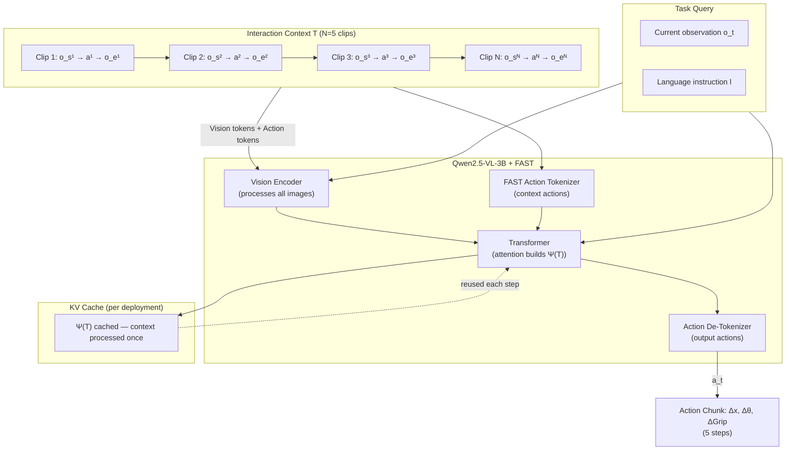

# Breakdown — In-Context World Modeling for Robotic Control

> **Paper:** In-Context World Modeling for Robotic Control
> **Authors:** Siyin Wang, Junhao Shi, Senyu Fei, Zhaoyang Fu, Li Ji, Jingjing Gong, Xipeng Qiu
> **Year:** 2026
> **ArXiv:** 2606.26025v2
> **Code (official):** Not released at time of publication
> **Affiliations:** Fudan University / Shanghai Innovation Institute / Tongji University

---

## 1. Problem & Motivation

Modern Vision-Language-Action (VLA) models learn a mapping $\pi_\theta(a_t \mid o_t, l)$ — from current observation $o_t$ and language instruction $l$ to action $a_t$. This formulation embeds a hidden assumption: the **system configuration** $\psi$ (camera viewpoint, robot morphology, mounting offsets, kinematic structure) is fixed and baked into the model weights during training.

When deployment conditions differ from training — a shifted camera angle, a different gripper, an altered workspace geometry — the model has **no mechanism** to recover the correct observation-action correspondence. Performance degrades catastrophically: the paper reports a drop from **68% to 17%** on real robots simply by switching to a novel camera viewpoint. The current industry fix is **per-setup fine-tuning**, which requires new demonstrations and retraining for every new environment — fundamentally incompatible with the goal of generalist robot deployment.

The paper reframes this failure as a **system identification problem**: the policy lacks knowledge of $\psi$ at test time. Without $\psi$, training forces the model to marginalize over all configurations:

$$\pi_\theta(a_t \mid o_t, l) \approx \int \pi_\theta^*(a_t \mid o_t, l, \psi)\, p(\psi)\, d\psi$$

At deployment on a specific $\psi'$, this averaged policy lacks the context to correctly interpret the observation-action correspondence.

The proposed solution: **recover $\psi$ at test time from a short history of self-generated, task-agnostic interactions**, prepended as context — no parameter updates, no task-specific demonstrations, no gradient computation required.

---

## 2. Key Insight / Contribution

**Repurpose the transformer's context window for system identification instead of behavior specification.**

Existing in-context learning for robotics uses demonstrations to tell the model *what* to do (behavior specification). ICWM uses **random exploration clips** to tell the model *how the system operates* (system identification). The context window becomes a calibration tool.

This is grounded in a formal information-theoretic result (**Proposition 1**, see Section 4): under mild assumptions (partial observability + information-preserving transitions), a sequence of observations and actions carries **strictly more information** about $\psi$ than any single observation alone — and this holds for **any** action sequence, including purely random ones.

Three key contributions:
1. **Reframing:** VLA generalization failure is identified as a test-time system identification problem, not a data scarcity issue.
2. **Method:** ICWM achieves implicit configuration recovery from $N=5$ task-agnostic interaction clips, using **zero additional parameters**.
3. **Validation:** Consistent improvements across simulation (LIBERO) and real-world (UR5e) on novel viewpoints, with generalization to semantic and morphological perturbations.

---

## 3. Method

### 3.1 Overview

ICWM augments a standard VLA pipeline (Qwen2.5-VL-3B backbone + FAST action tokenizer) with two operational phases:

| Phase | When | What Happens | Actions Generated |
|---|---|---|---|
| **Training** | Offline | Prepend $N$ task-agnostic interaction clips to each training sample as context | None (standard next-token prediction on task actions) |
| **Active Probing** | At test time, before task | Robot performs $N$ random probing actions, records $(o_s^i, a^i, o_e^i)$ transitions | Random spatial movements within safe workspace |
| **In-Context Execution** | At test time, during task | Feed interaction context + task query to model in single forward pass | Conditioned actions $\Delta x, \Delta\theta, \Delta\text{Grip}$ |

**No extra parameters. No gradient updates at test time. No task-specific demonstrations.** The same transformer processes both interaction context and task query — the attention mechanism implicitly builds a configuration-aware representation.

### 3.2 Architecture

```
╔══════════════════════════════════════════════════════════════════════════════════╗
║                         TOKEN SEQUENCE INPUT TO TRANSFORMER                       ║
╠══════════════════════════════════════════════════════════════════════════════════╣
║                                                                                   ║
║  INTERACTION CONTEXT  T = {(o_s^i, a^i, o_e^i)}_{i=1}^{N},  N=5                 ║
║  ┌───────────────────────────────────────────────────────────────────────────┐  ║
║  │  Clip 1          Clip 2          Clip 3      ...      Clip N                │  ║
║  │  ┌────┐ ┌───┐    ┌────┐ ┌───┐   ┌────┐ ┌───┐        ┌────┐ ┌───┐         │  ║
║  │  │o_s │→│ a │→  │o_s │→│ a │→  │o_s │→│ a │→  ... → │o_s │→│ a │→ ...    │  ║
║  │  │(V) │ │(A)│   │(V) │ │(A)│   │(V) │ │(A)│         │(V) │ │(A)│         │  ║
║  │  └────┘ └───┘    └────┘ └───┘   └────┘ └───┘        └────┘ └───┘         │  ║
║  │     ↓               ↓              ↓                    ↓                  │  ║
║  │  ┌────┐          ┌────┐         ┌────┐              ┌────┐               │  ║
║  │  │o_e │          │o_e │         │o_e │              │o_e │               │  ║
║  │  │(V) │          │(V) │         │(V) │              │(V) │               │  ║
║  │  └────┘          └────┘         └────┘              └────┘               │  ║
║  └────────────────────────────────────┬──────────────────────────────────────┘  ║
║                                       │                                           ║
║                                       │  Ψ(T) — configuration-aware               ║
║                                       │  hidden states built by                   ║
║                                       │  self-attention over context               ║
║                                       ▼                                           ║
║  TASK QUERY                           │                                           ║
║  ┌────────────────────────────────────┼──────────────────────────────────────┐  ║
║  │  ┌──────────┐  ┌───────────────┐   │  ┌──────────────┐  ┌───────────────┐  │  ║
║  │  │  Task    │  │  Language     │   └──│  Action      │→ │  Action       │  │  ║
║  │  │  Image   │  │  Instruction  │      │  Tokens     │  │  De-tokenizer │  │  ║
║  │  │  o_t     │  │     l         │      │  (FAST)     │  │               │  │  ║
║  │  │  (V)     │  │  (T)          │      └──────────────┘  └───────┬───────┘  │  ║
║  │  └──────────┘  └───────────────┘                               │          │  ║
║  └───────────────────────────────────────────────────────────────┼──────────┘  ║
║                                                                   │              ║
║                                                                   ▼              ║
║                                                        ┌──────────────────┐      ║
║                                                        │  Δx, Δθ, ΔGrip   │      ║
║                                                        │  (action chunk)  │      ║
║                                                        └──────────────────┘      ║
╚══════════════════════════════════════════════════════════════════════════════════╝
                                  │
                                  ▼
╔══════════════════════════════════════════════════════════════════════════════════╗
║                          QWEN2.5-VL-3B BACKBONE (shared)                         ║
║                                                                                   ║
║  ┌──────────────────┐    ┌─────────────────────────────┐    ┌───────────────┐   ║
║  │  Vision Encoder   │→   │  Transformer Decoder Layers   │→   │  FAST Action  │   ║
║  │  (ViT, patch     │    │  (self-attention + cross-    │    │  Tokenizer /   │   ║
║  │   tokens for all │    │   attention over full seq)   │    │  De-tokenizer │   ║
║  │   images)        │    │  KV-cache: context portion   │    │               │   ║
║  │                  │    │  cached per deployment        │    │               │   ║
║  └──────────────────┘    └─────────────────────────────┘    └───────────────┘   ║
║                                                                                   ║
║  Token types: V = Vision patch tokens, T = Text tokens, A = Action tokens        ║
╚══════════════════════════════════════════════════════════════════════════════════╝
```



**Key architectural details:**
- **Backbone:** Qwen2.5-VL-3B (3B parameter vision-language model), used as-is with no architectural modifications.
- **Vision encoding:** ViT-based patch tokenization applied uniformly to all images (context start images, context end images, and task image).
- **Action tokenization:** FAST (Flow Action Sparse Tokenizer) discretizes continuous actions into tokens. Each action $a = (\Delta x, \Delta\theta, \Delta\text{Grip})$ is tokenized and embedded alongside vision/text tokens.
- **Parameter sharing:** $\Psi$ shares all parameters with $\pi_\theta$ — the configuration inference function is the same transformer. This is motivated by structural symmetry: both action prediction and configuration inference require understanding observation-action correspondences.
- **KV caching optimization:** Since $\psi$ doesn't change during a deployment, the context portion of the KV cache can be computed once and reused across all task inference steps, bringing latency near baseline.

### 3.3 Forward Pass / Pipeline

**Training forward pass:**
1. **Sample context:** For each training sample, randomly sample $N=5$ interaction clips $\{(o_s^i, a^i, o_e^i)\}_{i=1}^{5}$ from a pool of all training trajectories across all viewpoints and configurations.
2. **Encode images:** Pass all images (context start/end images + task observation $o_t$) through the ViT vision encoder $\rightarrow$ vision patch tokens.
3. **Tokenize context actions:** Encode each $a^i$ through FAST action tokenizer $\rightarrow$ action tokens.
4. **Concatenate sequence:** `[V(o_s^1)] [A(a^1)] [V(o_e^1)] ... [V(o_s^N)] [A(a^N)] [V(o_e^N)] [V(o_t)] [T(l)] [A(a^*)]`
5. **Transformer forward pass:** Self-attention over the full sequence. Attention over context tokens builds $\Psi(T)$ — a configuration-aware hidden state representation.
6. **Generate action:** Autoregressively predict action tokens for the task query segment.
7. **De-tokenize:** Convert predicted action tokens back to continuous $(\Delta x, \Delta\theta, \Delta\text{Grip})$ chunk of size 5.

**Inference forward pass:**
1. **Active Probing Phase:** Robot performs 20 random probing actions (~5–6 seconds). Record all $(o_s, a, o_e)$ transitions. From this pool, randomly sample $N=5$ triplets as the context prefix $T$.
2. **KV Cache Construction (once per deployment):** Process $T$ through the transformer. Cache the resulting key-value pairs — this is $\Psi(T)$, which remains fixed as long as the system configuration doesn't change.
3. **In-Context Execution:** For each task step, feed $o_t$ and $l$ with the cached context KV. Single forward pass produces action $a_t \sim \pi_\theta(a_t \mid \Psi(T), o_t, l)$.
4. **Execute and repeat** until task completion.

### 3.4 Loss Function

Standard autoregressive next-token prediction, applied **only to the task-action tokens** (not the context):

$$\mathcal{L} = -\log \pi_\theta(a_t \mid \Psi(T), o_t, l)$$

where $\Psi(T)$ denotes the hidden states induced by processing the interaction context $T$. The context clips are treated as **conditioning** — the loss is not computed on context action tokens. This means during training, the model learns to *use* the context for accurate task-action prediction, but is not penalized for the context actions themselves (which are random and carry no task information).

---

## 4. Math

### 4.1 Standard VLA Formulation

A standard VLA policy maps multimodal observations and language instructions to actions:

$$\pi_\theta(a_t \mid o_t, l) \tag{1}$$

where $o_t \in \mathcal{O}$ is the current observation, $l \in \mathcal{I}$ is the language instruction, $a_t \in \mathcal{A}$ is the action, and $\theta$ are model parameters optimized on dataset $\mathcal{D}$ collected under specific system setups.

**The ideal policy** would condition on the true system configuration $\psi$:

$$\pi_\theta^*(a_t \mid o_t, l, \psi) \tag{2}$$

Since $\psi$ is not provided, training **marginalizes** over all configurations:

$$\pi_\theta(a_t \mid o_t, l) \approx \int \pi_\theta^*(a_t \mid o_t, l, \psi)\, p(\psi)\, d\psi \tag{3}$$

At deployment on a specific $\psi'$, this averaged policy lacks the context to correctly interpret the observation-action correspondence, leading to degraded performance.

### 4.2 POMDP Graphical Model

Robot-environment interaction is modeled as a POMDP where the latent state decomposes as $s_k = \langle \psi, \xi_k \rangle$, with $\psi$ being the **time-invariant system configuration** and $\xi_k$ the **time-varying scene state**. The system evolves as:

$$s_0 \xrightarrow{a_1} s_1 \xrightarrow{a_2} s_2 \xrightarrow{a_3} \cdots \xrightarrow{a_k} s_k \tag{4}$$

$$o_k \sim p(o \mid s_k)$$

**Graphical structure:**
- $s_0$ is a root node containing $\psi$ (system config) and $\xi_0$ (initial scene state).
- Actions $a_1, a_2, \ldots, a_t$ are **exogenous root nodes** (chosen by the agent).
- State transitions: $s_{k-1} \rightarrow s_k$ (deterministic or stochastic dynamics).
- Observation emissions: $s_k \rightarrow o_k$ (partial observability).
- Critical structure: $s_{k-1} \rightarrow s_k \leftarrow a_k$ forms a **collider** (v-structure) at each $s_k$.

### 4.3 Formal Statement of Proposition 1

> **Proposition 1.** Under Assumptions (A1) and (A2) below, for any action sequence $a_{1:t}$, the interaction context $T = \langle o_{0:t}, a_{1:t} \rangle$ carries strictly more information about the system configuration $\psi$ than any single observation $o_0$:
>
> $$I(\psi;\, o_{0:t}, a_{1:t}) > I(\psi;\, o_0) \tag{5}$$

**Assumptions:**
- **(A1) Partial observability:** $H(s_k \mid o_k) > 0$ — a single image cannot uniquely identify the viewpoint or kinematics. This means the observation is a lossy projection of the state.
- **(A2) Information-preserving transitions:** $I(s_0;\, s_k \mid a_{1:k}) > 0$ — state transitions preserve information about $s_0$ (and hence $\psi$). This holds because $\psi \subseteq s_0$ is time-invariant.

**Proof sketch (Appendix A):**

Since $\psi \subseteq s_0$, it suffices to prove the stronger statement $I(s_0;\, o_{0:t} \mid a_{1:t}) > I(s_0;\, o_0)$, from which the theorem follows by the data processing inequality.

Applying the chain rule of mutual information:

$$I(s_0;\, o_{0:t} \mid a_{1:t}) = I(s_0;\, o_0 \mid a_{1:t}) + I(s_0;\, o_{1:t} \mid o_0, a_{1:t}) \tag{8}$$

**First term:** In the graphical model, every path between $s_0$ (or $o_0$) and any $a_k$ passes through a collider at $s_k$. Since no collider or its descendants are conditioned upon, these paths are **blocked by d-separation**, giving $s_0, o_0 \perp\!\!\!\perp a_{1:t}$. Therefore:

$$I(s_0;\, o_0 \mid a_{1:t}) = I(s_0;\, o_0) \tag{9}$$

**Second term:** Consider the path $s_0 \rightarrow s_1 \rightarrow \cdots \rightarrow s_k \rightarrow o_k$ for any $k \geq 1$. Conditioning on $o_0$ — a descendant of $s_0$ — **activates the collider** at $s_0$, leaving the path $s_0 \rightarrow s_k \rightarrow o_k$ **active** under d-separation given $\{o_0, a_{1:t}\}$. Hence $s_0 \not\!\perp\!\!\!\perp o_k \mid o_0, a_{1:t}$, and by A2:

$$I(s_0;\, o_{1:t} \mid o_0, a_{1:t}) \geq I(s_0;\, o_k \mid o_0, a_{1:t}) > 0 \tag{10}$$

Substituting into (8):

$$I(s_0;\, o_{0:t} \mid a_{1:t}) = \underbrace{I(s_0;\, o_0)}_{>0} + \underbrace{I(s_0;\, o_{1:t} \mid o_0, a_{1:t})}_{>0} > I(s_0;\, o_0) \tag{11}$$

$\square$

**Key insight:** The mechanism is **collider activation**. The single observation $o_0$ alone blocks the information path from $s_0$ to future observations. But by conditioning on $o_0$ *together with* the action sequence $a_{1:t}$, the collider at $s_0$ is activated, opening an active path from $s_0$ through state transitions to future observations $o_1, \ldots, o_t$. Since $\psi \subseteq s_0$ is preserved through transitions, the interaction context reveals $\psi$.

**Practical implication:** Since the inequality holds for **any** action distribution, purely random movements provide sufficient context for implicit system identification — no task-specific exploration is needed.

### 4.4 Policy Reformulation

ICWM conditions the policy on the implicitly inferred configuration:

$$a_t \sim \pi_\theta(a_t \mid \Psi(T), o_t, l) \tag{6}$$

where $T = \{(o_s^i, a^i, o_e^i)\}_{i=1}^{N}$ is the interaction context (with $N=5$ clips), and $\Psi(T)$ is the configuration-aware representation built by the transformer when processing $T$. The function $\Psi$ shares all parameters with $\pi_\theta$, implemented as the hidden states induced by self-attention over the context prefix.

**Notation summary:**

| Symbol | Meaning |
|---|---|
| $\psi$ | True (latent) system configuration (viewpoint, morphology, etc.) |
| $\Psi(T)$ | Implicit configuration representation inferred from context $T$ |
| $o_t \in \mathcal{O}$ | Current observation (RGB image) |
| $l \in \mathcal{I}$ | Language instruction |
| $a_t \in \mathcal{A}$ | Action vector $(\Delta x, \Delta\theta, \Delta\text{Grip})$ |
| $T = \{(o_s^i, a^i, o_e^i)\}_{i=1}^N$ | Interaction context — $N$ triplets of (start image, action, end image) |
| $N$ | Number of context clips (default: 5) |
| $\theta$ | Model parameters (shared between $\pi_\theta$ and $\Psi$) |
| $s_k = \langle \psi, \xi_k \rangle$ | Latent state at step $k$ (system config + scene state) |
| $\mathcal{L}$ | Training loss (negative log-likelihood) |

---

## 5. Training

### 5.1 Dataset

| Property | Value |
|---|---|
| **Benchmark** | LIBERO (4 suites: Spatial, Goal, Object, Long) |
| **Training viewpoints** | 8 in-domain azimuthal angles: $\psi_{\text{train}} \in \{30°, 60°, 90°, 120°, 240°, 270°, 300°, 330°\}$ |
| **Test viewpoints** | 6 OOD angles: $\psi_{\text{test}} \in \{45°, 135°, 225°, 255°, 285°, 315°\}$ |
| **Total episodes** | $500 \times 15 \times 4 = 30{,}000$ (500 tasks × 15 viewpoints × 4 suites) |
| **Data collection** | Expert demonstrations replayed and re-rendered from 8 in-domain camera angles |
| **Context pool** | All training trajectories across all viewpoints; interaction clips sampled from this pool |
| **Real-robot demos** | ~100–150 human teleoperation demonstrations per task |

### 5.2 Optimizer & Hyperparameters

| Component | Setting |
|---|---|
| Backbone | Qwen2.5-VL-3B (3B params, no modification) |
| Action Tokenizer | FAST (Flow Action Sparse Tokenizer) |
| Action Chunk Size | 5 steps |
| Number of Context Clips ($N$) | 5 |
| GPUs | $8 \times$ NVIDIA A100 |
| Optimizer | AdamW |
| Weight Decay | $10^{-4}$ |
| Peak Learning Rate | $5 \times 10^{-5}$ |
| Warmup | 50k steps |
| Schedule | Cosine decay |
| Loss | Standard autoregressive NLL on task-action tokens only |

### 5.3 Training Tricks

- **Context diversity:** For each training sample, $N=5$ interaction clips are randomly sampled from the pool of *all* training trajectories across *all* viewpoints. Clips are from diverse configurations — the model must learn to extract dynamics information from $T$ to predict task actions accurately regardless of the specific $\psi$ in the context.
- **Context as conditioning, not supervision:** The loss is computed only on task-action tokens. Context action tokens are not supervised (they're random exploratory actions carrying no task signal).
- **Frame filtering:** Following OpenVLA preprocessing, unsuccessful episodes are removed, and frames with near-zero action norms and static gripper state are filtered out for high-density learning signal.
- **No architectural changes:** $\Psi$ shares all parameters with $\pi_\theta$ — no auxiliary heads, no separate encoders, zero additional parameters.

### 5.4 Compute Budget

Training on $8 \times$ A100 GPUs with standard VLA training compute. No additional training cost compared to the Multi-View BC baseline — the only difference is the context prepended to each training sample.

---

## 6. Results & Ablations

### 6.1 LIBERO Simulation — Seen (In-Domain) Viewpoints

| Suite | π-FAST | π₀.₅ | NORA | MV | EXP | **ICWM (Ours)** | Δ vs MV |
|---|---|---|---|---|---|---|---|
| Spatial | 4.1% | 7.6% | 3.8% | 74.5% | 75.9% | **81.2%** | +6.7% |
| Goal | 2.2% | 9.2% | 1.4% | 73.3% | 70.7% | **71.6%** | −1.7% |
| Object | 1.5% | 8.1% | 0.6% | 64.9% | 66.6% | **70.5%** | +5.6% |
| Long | 0.7% | 2.9% | 1.0% | 30.8% | 32.4% | **40.0%** | +9.2% |
| **Average** | **2.1%** | **7.0%** | **1.7%** | **60.9%** | **61.4%** | **65.8%** | **+4.9%** |

> 📌 **Sourced verbatim from Table 3 (Avg column) via `paper_layout.txt`.** ICWM wins all four seen-viewpoint suites; the Average Δ of +4.9pp (65.8 vs MV 60.9) is modest because seen viewpoints are already near-saturated for the multi-view methods — the larger ICWM advantage appears on OOD viewpoints (§6.2) and long-horizon tasks. (The earlier version of this table had grabbed the **330° column** values for the Spatial row — 14.0/20.6/17.8/78.4/82.6/88.0 — instead of the Avg column, and consequently reported +9.6pp instead of the true +6.7pp Spatial Δ.)

### 6.2 LIBERO Simulation — Unseen (OOD) Viewpoints

| Suite | π-FAST | π₀.₅ | NORA | MV | EXP | **ICWM (Ours)** | Δ vs MV |
|---|---|---|---|---|---|---|---|
| Spatial | 1.1% | 1.8% | 1.6% | 48.3% | 46.3% | **49.9%** | +1.6% |
| Goal | 0.2% | 5.9% | 0.0% | 38.7% | 41.5% | **44.2%** | +5.5% |
| Object | 0.7% | 1.2% | 0.0% | 12.7% | 15.3% | **15.9%** | +3.2% |
| Long | 0.0% | 0.1% | 0.0% | 19.8% | 20.2% | **25.0%** | +5.2% |
| **Average** | **0.5%** | **2.3%** | **0.4%** | **29.9%** | **30.8%** | **33.8%** | **+3.9%** |

> 🏆 **ICWM improves OOD average by +3.9% absolute (+13.0% relative) over Multi-View BC.** The largest gains come from long-horizon tasks: **+26.3% relative improvement on LIBERO-Long OOD** over MV. Small pretrained models (π-FAST, π₀.₅, NORA) all collapse to near-zero on unseen viewpoints, confirming viewpoint generalization is fundamentally unsolved without adaptation.

### 6.3 Real Robot — UR5e, 4 Tasks, 6 Novel Viewpoints

> Source: §5.3 prose + Figure 5 bar chart. The paper reports **no absolute per-task success-rate table** for the real robot — only (a) the average drop of the standard VLA from 68% (training views) to 17% (novel views), and (b) per-task **relative** gains of ICWM over the Multi-View (MV) baseline read from the Figure 5 bar labels. Absolute per-task MV/ICWM success rates are figure-bar-only and are not restated as numbers in the text, so they are not tabulated below.

| Quantity | Value | Source |
|---|---|---|
| Standard VLA avg success, training viewpoints | **68%** | §5.3 prose |
| Standard VLA avg success, novel viewpoints | **17%** (~75% relative collapse) | §5.3 prose |

**ICWM relative gain over the MV baseline, per task (Fig. 5 bar labels):**

| Task | ICWM vs MV (relative) |
|---|---|
| Pick (toy → basket) | +33% |
| Stack (yellow → red cup) | +71% |
| Lift (basket) | +90% |
| Move (eggplant → plate) | +175% |
| **Average** | **+129%** |

> Standard VLA drops from 68% (training views) to 17% (novel views) — a **~75% relative collapse**. ICWM substantially recovers performance with zero parameter updates and zero task-specific demonstrations. The 600 total trials (4 tasks × 6 OOD viewpoints × 25 trials) show consistent gains; the largest relative recovery is on **Move (+175%)**.

### 6.4 Ablation: Context Components (LIBERO-Long OOD)

> Suite correction: Table 1's ICWM row (45°/135°/225°/255°/285°/315° = 36.6/2.2/8.8/28.4/36.6/37.6, avg 25.0) is **byte-identical to Table 4's LIBERO-Long OOD ICWM row**, and the w/o-context baseline (22.0) and false-context (18.9) rows sit between Long-OOD MV (19.8) and ICWM (25.0). So this ablation is run on the **LIBERO-Long OOD** suite (the hardest suite, where ICWM helps most), not LIBERO-Spatial OOD as previously headed.

| Setting | Avg OOD Success | Δ from Full ICWM |
|---|---|---|
| **Full ICWM** | **25.0%** | — |
| w/o actions (images only) | 21.6% | −13.6% |
| w/o images (actions only) | 10.9% | **−56.4%** |
| w/o context (baseline) | 22.0% | −12.0% |
| False context (180° camera offset) | 18.9% | −24.4% |

> 💀 **Removing images causes the biggest collapse (−56.4%)** — without visual observations, the model treats exploratory actions as task demonstrations and mimics them. **False context is worse than no context** (−24.4% vs −12.0%), confirming that the model is performing genuine system identification rather than superficial pattern matching — wrong information actively harms performance.

### 6.5 Ablation: Probing Strategy (LIBERO-Long OOD)

> Same suite correction as §6.4: Table 2's MV column (avg 19.8) and Random column (avg 25.0) are byte-identical to Table 4's LIBERO-Long OOD MV/ICWM rows, so the probing ablation is also on **LIBERO-Long OOD**, not Spatial.

| Strategy | Avg OOD Success | Δ vs No Probing |
|---|---|---|
| Multi-View Baseline (no probing) | 19.8% | — |
| **Random (full DOF)** | **25.0%** | **+26.3%** |
| XY-only movements | 24.9% | +25.8% |
| Z-only movements | 22.8% | +15.2% |
| Rotation-only movements | 23.4% | +18.2% |

> ✅ **All probing strategies outperform the no-probing baseline by 15–27%.** The benefit comes from the interaction format itself, not any particular movement pattern. Even Z-only (vertical) probing — which seems least informative for viewpoint identification — provides significant gains. This aligns with Proposition 1: any action sequence enriches information about $\psi$.

### 6.6 Generalization Beyond Viewpoints

**Semantic Perturbations** (4 tasks × 4 in-domain viewpoints × 10 trials = 160 trials/condition):

| Perturbation | MV Baseline | **ICWM** | Δ |
|---|---|---|---|
| Distractor objects (10 task-irrelevant) | 27.5% | **35.0%** | +27.3% |
| Novel table textures (4 unseen) | 37.5% | **41.2%** | +9.9% |

**Morphological Perturbations — UR5e rigid spacers** (ΔL ∈ {20, 40, 80} mm):

| Perturbation | MV | **ICWM** | Δ |
|---|---|---|---|
| ΔL = 20mm | — | — | — |
| ΔL = 40mm | — | — | — |
| ΔL = 80mm | 5.6% | **14.4%** | +157% |

**Morphological Perturbations — WindowX link length scaling** (trained on 100% and 70%, tested on interpolated):

| Configuration | MV | **ICWM** | Δ |
|---|---|---|---|
| 90% link length (interpolated) | 57% | **77%** | +35.1% |
| 80% link length (interpolated) | 28% | **62%** | +121.4% |

> 🏆 **The ICWM advantage grows with kinematic uncertainty.** At 90% link length, ICWM adds +20pp; at 80% link length, the gap widens to +34pp. This suggests ICWM's implicit world model captures kinematic structure, not just visual appearance.

### 6.7 Inference Latency (RTX 4090)

| Setting | Latency / Step |
|---|---|
| Baseline ($N=0$, no context) | 0.112s |
| ICWM $N=3$ | 0.165s (+47%) |
| ICWM $N=5$ | 0.185s (+65%) |

> The latency overhead comes from processing context images through the vision encoder. With **KV caching**, the context portion is processed once per deployment and cached — subsequent task steps run at near-baseline latency. The 20-step probing phase takes ~5–6 seconds total, performed once before task execution.

---

## 7. Limitations

1. **Probing phase safety:** Random exploration must avoid task-relevant objects. In cluttered environments, finding a "safe" probing space may be difficult. The probing workspace is defined in the robot base frame (derived from forward kinematics), but collision avoidance is not guaranteed. The workspace bounding box is invariant across camera viewpoint shifts but must be specified once per physical workstation.

2. **Static $\psi$ assumption:** The method assumes system configuration doesn't change during task execution. If the camera moves, lighting shifts dramatically, or the robot picks up a heavy payload that changes dynamics, the cached context becomes stale. Periodic re-probing is not addressed.

3. **Viewpoint coverage ceiling:** Certain OOD angles (especially $135°$) remain hard for all methods including ICWM. The paper attributes this to occlusion/visibility constraints — at $135°$, manipulation targets can exit the field of view during execution. This is a perceptual limitation that ICWM cannot overcome.

4. **Simulation-reality gap in probing:** In simulation, transitions can be replayed directly. On a real robot, the probing phase requires 5–6 seconds of actual physical movement (~20 probing actions). This is practical but means the "zero-shot" claim has a physical time cost.

5. **Limited morphological evaluation:** Morphology experiments use rigid spacers (ΔL ∈ {20, 40, 80} mm) and link-length scaling (70%–100%). More diverse morphological changes — different grippers, tool attachments, soft deformations — are not tested.

6. **Scalability to diverse tasks:** Real-robot evaluation covers 4 tabletop manipulation tasks on one platform (UR5e). Generalization to very different task families (locomotion, mobile manipulation, assembly, cooking) is untested.

7. **Context length scaling:** The paper fixes $N=5$. The relationship between context length and adaptation capability is not thoroughly characterized (though the probing strategy ablation shows all strategies help).

---

## 8. Open Questions / Ideas

1. **Adaptive probing:** Instead of random movements, could the robot actively explore to maximize information gain about $\psi$? A few information-theoretically optimal probes might replace 20 random ones, reducing the ~5–6 second probing overhead. This connects to active learning and Bayesian experimental design.

2. **Long-horizon context attenuation:** The action chunk is 5 steps. Over hundreds of steps, does the context signal $\Psi(T)$ attenuate in the attention mechanism? Could periodic re-probing or context refreshing help maintain calibration during extended tasks?

3. **Interaction with other adaptation methods:** Could ICWM be combined with test-time fine-tuning (e.g., LoRA) or meta-learning? ICWM provides a strong initialization via implicit system identification — gradient-based refinement on top might yield even stronger adaptation.

4. **Minimum context analysis:** The paper uses $N=5$ clips from 20 recorded transitions. Is there a sharp phase transition in performance vs. $N$, or does it scale smoothly? What's the information-theoretic minimum for a given perturbation magnitude?

5. **Multi-camera / multi-robot systems:** If you have multiple cameras with different $\psi$ values, does a single context window suffice, or do you need per-camera contexts? How does ICWM handle heterogeneous sensor configurations?

6. **Non-visual modalities:** The current formulation uses RGB images. Could ICWM extend to depth cameras, force/torque sensors, or tactile sensing? The Proposition 1 proof is modality-agnostic — any observation channel that satisfies A1 and A2 should work.

7. **Compositional configurations:** What happens when multiple aspects of $\psi$ change simultaneously (e.g., novel viewpoint + novel morphology)? Does the model disentangle these factors, or does joint perturbation exceed its capacity?

8. **Deployment efficiency:** With KV caching, $\Psi(T)$ is computed once per deployment. Could this be serialized and stored for known configurations, enabling instant calibration when returning to a previously seen setup? This would turn ICWM into a learned calibration database.
