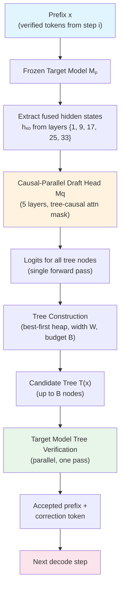
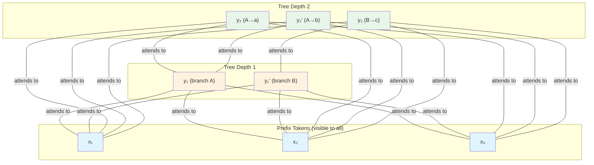
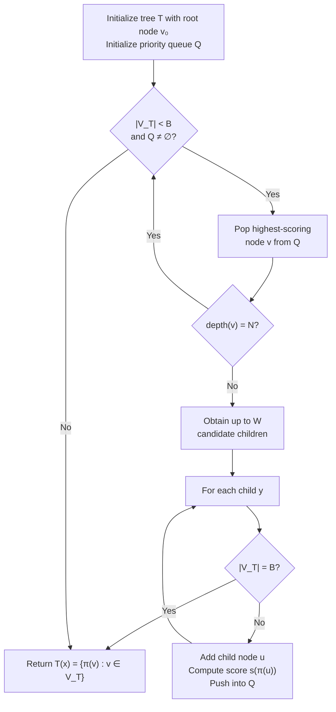
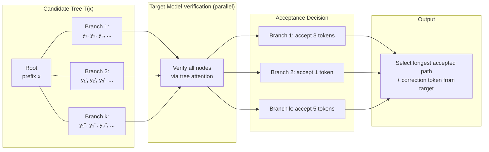

# Breakdown — JetSpec: Breaking the Scaling Ceiling of Speculative Decoding with Parallel Tree Drafting

> **Paper:** JetSpec: Breaking the Scaling Ceiling of Speculative Decoding with Parallel Tree Drafting
> **Authors:** Lanxiang Hu, Zhaoxiang Feng, Yulun Wu, Haoran Yuan, Yujie Zhao, Yu-Yang Qian, Bojun Wang, Peng Zhao, Daxin Jiang, Yibo Zhu, Tajana Rosing, Hao Zhang
> **Year:** 2026 (arXiv:2606.18394, v3, Jun 2026)
> **ArXiv:** https://arxiv.org/abs/2606.18394
> **Code (official):** https://github.com/hao-ai-lab/JetSpec
> **Project page:** https://jetspec-project.github.io/jetspec-web/
> **Type:** Inference acceleration (speculative decoding method).

---

## 1. Problem & Motivation

**Problem.** Speculative decoding (SD) accelerates autoregressive LLMs by drafting multiple tokens
and verifying them in parallel, but it hits a scaling ceiling. Increasing the draft budget only helps
when (a) acceptance rate stays high and (b) drafting overhead stays low. Existing head-based SD
methods face a **causality-efficiency dilemma**:

1. **Autoregressive drafters** (EAGLE, EAGLE-3): produce high-quality path-conditioned candidates
   with good acceptance, but require sequential draft passes as tree depth grows → cost explodes.
2. **Bidirectional block-diffusion drafters** (DFlash): generate all positions in one pass → very cheap,
   but their branch-agnostic marginals can form individually plausible yet mutually inconsistent trees
   → low acceptance at scale.

**Why important.** Decoding latency is the bottleneck for math, coding, and agentic reasoning tasks
where models produce long generations. Speculative decoding is the most practical approach to
speed this up without quality loss, but it's currently capped at ~4–6× speedup for head-based
methods. Breaking through means real latency improvements in production serving.

**Prior-work limitations:**
- EAGLE-3: tree-mode max depth 8 is the practical limit; larger budgets give minimal gains.
- DFlash: one-pass parallel, but branch-agnostic predictions produce inconsistent trees.
- DDTree: constructs trees from DFlash's distributions, but inherits the diffusion head's inconsistency.
- Nobody has combined parallel drafting efficiency with branch-wise causal conditioning.

## 2. Key Insight / Contribution

**Core idea (one sentence):** Train a causal parallel draft head with a tree-causal attention mask so
that all tree nodes are predicted in one forward pass, but each branch is conditioned on its own
ancestor tokens — making draft distributions aligned with the target model's autoregressive
factorization.

**What is genuinely new:**
- **Tree-causal attention mask** (Eq. 5): each node attends to prefix + ancestors only, not descendants
  or sibling branches — all computed in parallel.
- **Branch-wise draft factorization** (Eq. 7): mirrors target AR factorization (Eq. 4) while remaining
  parallel — this is the load-bearing innovation.
- **Joint cost + acceptance optimization**: low per-token cost (one forward pass) + high acceptance
  (causal conditioning) → draft budgets of 256+ tokens become practical.
- **Structural robustness**: causal head is insensitive to loss-weighting parameter $\gamma$, unlike diffusion
  heads that require careful tuning.

## 3. Method

### 3.1 Overview

JetSpec operates in a three-phase loop at each decoding step:
1. **Feature extraction:** The frozen target model $M_p$ processes the verified prefix $x$ and produces
   fused hidden states $h_x^o$ by concatenating intermediate layer representations.
2. **Parallel tree drafting:** A lightweight 5-layer causal draft head $M_q$ predicts logits for all
   tree nodes in a single forward pass, using a tree-causal attention mask.
3. **Tree verification:** The target model $M_p$ verifies all branches in parallel via tree attention,
   accepting the longest consistent prefix from any branch.

### 3.2 Why Causality Matters

A key requirement for effective parallel tree drafting is that each node distribution should be
conditioned on its own branch prefix, not on a branch-agnostic marginal. Consider a draft tree
rooted at prefix $x$, where each node $v$ corresponds to a candidate token $y_v$. Let
$\pi(v) = (y_{v_1}, \ldots, y_v)$ denote the draft-token path from root to $v$, and $\pi_{<v}$ the
ancestor tokens before node $v$.

**Without causal conditioning** (the DFlash failure mode), tree construction ranks branches
according to a pseudo-distribution:

$$q_{\text{sur}}(y_{1:k} \mid x) \propto \prod_{i=1}^{k} r_i(y_i \mid x)$$

where $r_i$ denotes the branch-agnostic draft distribution at position $i$. This can favor
continuations whose tokens are individually plausible but **mutually inconsistent** — for example,
"given" at depth 1 and "told" at depth 2 cannot co-occur syntactically, yet each scores high
marginally.

**With causal conditioning** (JetSpec), each node is conditioned on its own ancestor path, preventing
this structural failure mode entirely.

### 3.3 Tree-Causal Attention Mask

The core mechanism. For two tree nodes $u$ and $v$, define:

$$M_{v,u} = \begin{cases} 0, & \text{if } u \in \text{Anc}(v) \cup \{v\} \\ -\infty, & \text{otherwise} \end{cases}$$

**Notation:**
- $M_{v,u}$: the $(v, u)$-th entry of the tree-causal attention mask — controls whether node $v$ can attend to node $u$
- $\text{Anc}(v)$: the set of ancestor nodes of $v$ on the path from the root to $v$'s parent
- The $-\infty$ entries effectively block attention to all descendants and sibling branches after softmax

**Plain English:** Node $v$ can see (attend to) the original prefix and its own ancestors (the tokens
along the branch from root to $v$), but it is completely blocked from seeing any descendant tokens or
tokens in sibling branches. This is what makes the tree-causal mask fundamentally different from a
standard bidirectional or block-diffusion mask.

The masked attention computation for node $v$ is:

$$\text{Attn}(Q_v, K, V) = \text{softmax}\left(\frac{Q_v K^\top}{\sqrt{d}} + M_v\right) V$$

**Notation:**
- $Q_v$: query vector for node $v$
- $K, V$: key and value matrices for all positions in the sequence
- $d$: head dimension (128 in JetSpec)
- $M_v$: the row of the mask corresponding to node $v$ (entries are 0 or $-\infty$)
- $\sqrt{d}$: standard attention scaling factor

**Plain English:** This is standard multi-head scaled dot-product attention, but with the tree-causal
mask $M_v$ added element-wise to the pre-softmax scores. The $-\infty$ entries force softmax output to
zero for those positions, and the $0$ entries leave the scores unchanged. Critically, **all tree nodes
at all depths can be processed in a single forward pass** because the mask structure is compatible
with parallel computation — no sequential dependencies between layers are needed.

**Key property:** Sibling branches cannot see each other. Branch B's child $y_2$ attends to the
prefix and to $y_1'$ (its parent), but **not** to $y_1$ or its children in branch A. This enforces
per-branch autoregressive structure while maintaining parallelism across branches.

### 3.4 Branch-Wise Factorization

The tree-causal mask induces a **branch-wise** draft distribution over any root-to-node path
$\pi(v)$:

$$q(\pi(v) \mid x) = \prod_{u \in \pi(v)} q(y_u \mid x, h_x^o, \pi_{<u})$$

**Notation:**
- $q(\pi(v) \mid x)$: the draft probability assigned by $M_q$ to the entire path from root to node $v$
- $u \in \pi(v)$: iterates over all nodes on the path from root to $v$ (inclusive)
- $y_u$: the draft token at node $u$
- $h_x^o$: the fused hidden state representation of the prefix $x$, extracted from the target model
- $\pi_{<u}$: the sequence of ancestor tokens preceding node $u$ along the path

**Plain English:** The probability of an entire branch (a path from root to any node) factors into a
product of per-token conditional probabilities, where each token's probability depends on the
prefix, the fused target-model features, and **only the tokens that came before it on that specific
branch**. This is a causal chain — exactly mirroring how the target model generates tokens
autoregressively.

Compare with the **target model's** autoregressive factorization:

$$p(y_{1:k} \mid x) = \prod_{i=1}^{k} p(y_i \mid x, y_{<i})$$

**Notation:**
- $p(y_{1:k} \mid x)$: the target model's probability for a length-$k$ continuation given prefix $x$
- $y_{<i}$: all tokens before position $i$ in the continuation

**Plain English:** The target model generates each token conditioned on the prefix and all preceding
tokens. The draft distribution $q$ mirrors this structure, but conditions on fused features $h_x^o$
instead of the full target-model hidden state, and operates in parallel via the tree-causal mask.

And with **DFlash's branch-agnostic surrogate:**

$$q_{\text{sur}}(y_{1:k} \mid x) \propto \prod_{i=1}^{k} r_i(y_i \mid x)$$

**Notation:**
- $r_i(y_i \mid x)$: the position-$i$ marginal draft distribution, conditioned only on the prefix $x$, not on any specific ancestor tokens

**Plain English:** In DFlash, each position's distribution is independently predicted from the prefix
only — no conditioning on what tokens were selected at earlier depths. This means a branch's
rank in the tree is determined by a product of position-wise marginals that have no notion of
coherence across positions.

**The critical difference:** The causal factorization (Eq. 7) matches the target's autoregressive
structure (Eq. 4) because both condition on the actual ancestor tokens along the path. The DFlash
surrogate (Eq. 3) does not — its per-position marginals can rank an incoherent branch highest,
wasting budget on tokens that verification will reject.

### 3.5 Tree Construction (Algorithm 1)

Best-first expansion with a priority queue:

**Algorithm steps:**
1. Start with root node (the verified prefix)
2. Pop highest-scoring expandable node from heap
3. Expand it with up to $W$ children at next depth
4. Score each child by accumulated draft log-probability (Eq. 10 below)
5. Push children back into heap
6. Repeat until budget $B$ exhausted or no expandable nodes remain

**Parameters:** max depth $N$, branching width $W$, node budget $B$. Production setting:
$N=16$, $W=7$, $B=255$.

### 3.6 Branch Scoring

By default, JetSpec uses **accumulated draft log-probability** for branch scoring:

$$s(\pi(v)) = \sum_{u \in \pi(v)} \log q(y_u \mid x, h_x^o, \pi_{<u})$$

**Notation:**
- $s(\pi(v))$: the score assigned to the path from root to node $v$, used to rank candidates in the priority queue
- $q(y_u \mid x, h_x^o, \pi_{<u})$: the draft model's probability for token $y_u$ given the prefix and its specific ancestor path
- The sum accumulates log-probabilities along the entire branch from root to $v$

**Plain English:** Each branch's score is simply the sum of log-probabilities assigned by the draft
model to each token along that branch, conditioning on the actual ancestor tokens. Branches with
higher cumulative log-probability (i.e., more likely continuations) are expanded first. This
heuristic dominates alternatives like entropy-guided or hybrid scoring (see ablations, §6).

An alternative **hybrid scoring** combines log-probability with per-depth entropy:

$$s_{\text{hybrid}}(\pi(v)) = \sum_{u \in \pi(v)} \log q(y_u \mid x, h_x^o, \pi_{<u}) + \alpha \cdot H_u$$

where $H_u$ is the per-depth entropy and $\alpha$ controls the exploration-exploitation trade-off.
However, ablations show $\alpha \to 0$ (pure log-probability) is optimal.

### 3.7 Training

#### Data Preparation

- 780K examples from Nemotron Post-Training Dataset V2 (coding, math, STEM, chat splits + 20K CodeAlpaca)
- Anchor positions sampled, $N=16$ consecutive future positions per block
- Anchor excluded from loss; future positions predicted under block-causal mask
- For each example, up to 512 anchors sampled randomly from the sequence

#### Feature Fusion

The draft head reuses intermediate representations from the frozen target model $M_p$. For
Qwen3-8B (36 layers), hidden states are extracted from layers $\{1, 9, 17, 25, 33\}$, concatenated
along the channel dimension, and projected back to hidden size through a bias-free linear layer
followed by RMSNorm:

$$h_x^o = \text{RMSNorm}(W_{\text{proj}} \cdot [\mathbf{h}^{(1)}_x; \mathbf{h}^{(9)}_x; \mathbf{h}^{(17)}_x; \mathbf{h}^{(25)}_x; \mathbf{h}^{(33)}_x])$$

**Notation:**
- $[\cdot; \cdot]$: concatenation along the channel dimension, producing a $5d$ feature vector
- $W_{\text{proj}}$: a linear projection matrix mapping $5d \to d$ (where $d = 4096$ for Qwen3-8B)
- $\mathbf{h}^{(\ell)}_x$: the hidden state at layer $\ell$ of the target model for prefix $x$

**Plain English:** Take hidden states from five carefully chosen layers of the target model, stack
them together, and use a learned linear projection to squash them back to the model's hidden
dimension. This fused representation serves as the context that the draft head conditions on.

The draft head itself is a lightweight Qwen3-style decoder with 5 layers, 32 attention heads,
8 KV heads, head dimension 128, and MLP intermediate size 12288. In each draft layer, the projected
target feature is injected as contextual key/value states.

#### Distillation Loss (Forward KL)

For each active draft position $m$, let $z_q^{(m)}$ and $z_p^{(m)}$ denote the draft and target logits
over the vocabulary $\mathcal{V}$. Define temperature-normalized distributions:

$$\tilde{q}^{(m)} = \text{softmax}\left(\frac{z_q^{(m)}}{T_{\text{KD}}}\right), \quad \tilde{p}^{(m)} = \text{softmax}\left(\frac{z_p^{(m)}}{T_{\text{KD}}}\right)$$

**Notation:**
- $z_q^{(m)}$: raw logits from the draft head at position $m$ (before softmax)
- $z_p^{(m)}$: raw logits from the target model at position $m$
- $T_{\text{KD}}$: distillation temperature — controls the softness of the target distribution (higher = softer labels)
- $\tilde{q}^{(m)}, \tilde{p}^{(m)}$: temperature-scaled softmax distributions (probability vectors over the vocabulary)

**Plain English:** Apply a temperature-scaled softmax to both the draft and target logits. The
temperature controls how "soft" the target distribution is — a higher temperature spreads probability
mass more evenly across tokens, giving the draft head more information about the target's
preferences beyond just the top-1 prediction.

The per-position forward KL divergence is:

$$\mathcal{L}^{(m)}_{\text{FKL}} = D_{\text{KL}}\left(\tilde{p}^{(m)} \,\|\, \tilde{q}^{(m)}\right) = \sum_{y \in \mathcal{V}} \tilde{p}^{(m)}(y) \log \frac{\tilde{p}^{(m)}(y)}{\tilde{q}^{(m)}(y)}$$

**Notation:**
- $D_{\text{KL}}(p \| q)$: the KL divergence measuring how much $q$ diverges from $p$
- The sum is over all tokens $y$ in the vocabulary $\mathcal{V}$
- Forward KL: the target distribution $\tilde{p}$ is in the "numerator" position — it encourages the
  draft $\tilde{q}$ to **cover** (place mass on) all tokens that the target considers probable

**Plain English:** Forward KL penalizes the draft model whenever the target model assigns higher
probability to a token than the draft does. This is a "coverage" objective — it forces the draft to
spread probability mass to cover all modes of the target distribution, which is essential for tree
drafting where multiple diverse continuations must be scored.

The total training loss normalizes across all active positions:

$$\mathcal{L}_{\text{train}} = \frac{1}{T_{\text{KD}}^2} \sum_m \frac{w_m \mathcal{L}^{(m)}_{\text{FKL}}}{\sum_m w_m}$$

**Notation:**
- $w_m$: per-position weight (controlled by the loss-weighting parameter $\gamma$)
- $\gamma = 0$ in JetSpec by default → uniform weighting ($w_m = 1$ for all positions)
- The $1/T_{\text{KD}}^2$ factor is the standard gradient-magnitude correction for temperature-scaled softmax

**Plain English:** Average the per-position KL divergence losses across all active draft-token
positions (excluding anchor tokens), weighted by $w_m$. The temperature correction ensures gradients
are properly scaled.

#### Key Training Choices

- **Learning rate:** $3 \times 10^{-4}$ (optimal; performance plateaus beyond this)
- **Loss objective:** Forward KL $\approx$ SFT > Reverse KL (reverse KL causes 36–46% relative drop)
- **Training data:** Regenerated target-model sequences > raw corpus for training data
- **$\gamma = 0$** (uniform weighting) — causal head doesn't need DFlash-style exponential decay

### 3.8 Verification

After constructing the candidate tree $T(x) = \{\pi(v) : v \in V_T\}$, the target model $M_p$
verifies all tree nodes in parallel using tree attention.

For each candidate branch $\pi(v) = y_{1:k}$, the target distribution factorizes autoregressively
per Eq. 4. The verifier applies the speculative decoding acceptance rule along each branch. For
each draft token $y_t$, we define the acceptance decision:

$$A_t \sim \text{Bernoulli}(\alpha_t)$$

$$\alpha_t = \alpha\left(y_t;\; q(\cdot \mid x, y_{<t}),\; p(\cdot \mid x, y_{<t})\right)$$

**Notation:**
- $A_t$: binary acceptance indicator for draft token $y_t$ at position $t$ along the branch
- $\alpha_t$: the acceptance probability for this token
- $q(\cdot \mid x, y_{<t})$: the draft distribution for the next token, conditioned on the prefix and all previously accepted tokens on this branch
- $p(\cdot \mid x, y_{<t})$: the target model's distribution for the next token under the same context
- $\alpha(\cdot)$: the specific verification function (rejection sampling or greedy)

In standard **non-greedy** speculative sampling, the acceptance rule uses rejection sampling:

$$\alpha_t = \min\left(1,\; \frac{p(y_t \mid x, y_{<t})}{q(y_t \mid x, y_{<t})}\right)$$

**Notation:**
- $p(y_t \mid x, y_{<t}) / q(y_t \mid x, y_{<t})$: the likelihood ratio of the target and draft distributions evaluated at the specific draft token $y_t$
- The $\min(1, \cdot)$ clamps the ratio so it's always a valid probability
- When rejection occurs ($A_t = 0$), a correction token is sampled from the residual distribution $p - q$

**Plain English:** For each draft token, accept it with probability equal to the minimum of 1 and
the ratio of the target model's probability to the draft model's probability. If the draft
assigns higher probability to this token than the target, it's always accepted. If the target
assigns much higher probability, it's accepted with probability proportional to how well the
draft covers it. When rejected, a correction token is drawn from the "leftover" probability mass.

In the **greedy setting**, $A_t$ becomes deterministic: a draft token is accepted if it matches
the target model's argmax next-token prediction under the same context. This is the setting used
in most of the paper's experiments.

The **accepted prefix length** is:

$$a = \max\{r \leq k : A_t = 1,\; \forall t \leq r\}$$

**Plain English:** Find the longest prefix of the draft branch where every single token was
accepted. If the 4th token is rejected, $a = 3$, regardless of what happens after.

## 4. Core Math — Scaling Analysis

### Expected Tokens per Iteration

$$\mathbb{E}[\#\text{tokens}] = \frac{1 - \alpha^{N+1}}{1 - \alpha}$$

**Notation:**
- $\alpha$: average acceptance rate per token
- $N$: number of draft tokens proposed
- The formula arises from a geometric series: expected accepted tokens = $1 + \alpha + \alpha^2 + \cdots + \alpha^N$

**Plain English:** If the acceptance rate is $\alpha$, the expected number of accepted tokens is
roughly $\alpha \cdot N$ when $\alpha$ is high and $N$ is large. The exact formula accounts for the
geometric decay — later tokens have slightly lower acceptance probabilities due to compounding
rejection risk.

### Expected Speedup

$$\text{Speedup} = \frac{1 - \alpha^{N+1}}{(1 - \alpha)(Nc + 1)}$$

**Notation:**
- $\alpha$: average acceptance rate
- $N$: number of draft tokens
- $c$: cost coefficient — the ratio of one draft step's time to one target verification step's time
- $Nc$: total drafting cost (in units of target-verification time) for $N$ draft tokens
- $Nc + 1$: total cost per iteration (drafting + one verification pass)

**Plain English:** Speedup equals the expected number of tokens accepted divided by the total cost
per iteration. This formula **exposes the scaling bottleneck**: increasing $N$ helps only when
$\alpha$ remains high AND $Nc$ remains small. If acceptance drops or drafting cost is non-negligible,
adding more draft tokens is counterproductive.

### Per-Draft-Token Cost

$$c(N, L) = \frac{T_{\text{draft}}(N, L)}{N \cdot T_{\text{verify}}(N, L)}$$

**Notation:**
- $T_{\text{draft}}(N, L)$: latency of one parallel draft-head forward pass proposing $N$ tokens at context length $L$
- $T_{\text{verify}}(N, L)$: latency of one parallel target-model verification pass over the same $N$ candidates at context length $L$
- The $1/N$ factor amortizes the one-time forward-pass cost across all $N$ proposed tokens

**Plain English:** What fraction of a target verification step's time does each draft token cost?
Because the draft head produces all $N$ tokens in a single parallel forward pass, the cost per
token decreases as $1/N$. On H200 NVL with $N=256$ and $L \leq 2048$, this drops to ~0.05% — an
ultra-low-cost regime where the draft overhead is negligible.

### Failure Mode Analysis: Causal vs. Diffusion

**Concrete example (MATH-500 prompt 0, decode step 0):**

| Metric | Diffusion Head ($\gamma=0$) | Causal Head |
|--------|---------------------------|-------------|
| Rank-1 branch | "given told that" | "are told that" |
| Draft surrogate $\sum \log r_i$ | $-3.76$ nats | $-3.88$ nats |
| Target conditional $\sum \log p(y_i \mid x, \pi_{<v_i})$ | $-63.32$ nats | $-3.54$ nats |
| Surrogate–target gap | $+59.56$ nats | $-0.34$ nats |
| Mean accepted length (γ=0, 50 prompts) | 4.84 | 9.46 |

**Notation:**
- Draft surrogate: $\sum_i \log r_i$ — the score used to rank the branch in the tree
- Target conditional: $\sum_i \log p(y_i \mid x, \pi_{<v_i})$ — the *true* joint probability under the target model for this branch's tokens
- Gap = surrogate $-$ target: a large positive gap means the tree ranked this branch far higher than the target model actually supports

**Plain English:** The diffusion head's top-ranked branch looks good according to its own scoring
(−3.76 nats), but the target model gives it a catastrophic −63.32 nats — the branch combines
"given" and "told" which cannot co-occur. The causal head's top branch has almost no gap (−0.34
nats) — its surrogate score faithfully reflects the target's actual evaluation. Across 50 prompts,
the diffusion head's rank-1 gap exceeds the causal head's on **92%** of prompts, with median 5×
larger magnitude.

## 5. Evaluation Setup

### Models
- **Qwen3-8B** (dense, 36 layers, $d=4096$)
- **Qwen3-30B-A3B** (MoE, 3B active params)
- Non-thinking mode throughout

### Benchmarks

| Category | Benchmarks |
|----------|-----------|
| Math | GSM8K, MATH-500, AIME25 |
| Coding | HumanEval, MBPP, LiveCodeBench |
| Chat | MT-Bench (open-ended conversation) |

### Baselines

| Method | Type | Key characteristic |
|--------|------|-------------------|
| **EAGLE-3** | Autoregressive head | Multi-layer feature fusion, sequential drafting |
| **DFlash** | Block-diffusion head | One-pass parallel, bidirectional, no tree-causal mask |
| **DDTree** | Tree from DFlash distributions | Best-first tree expansion but diffusion head |

### Hardware
- Offline inference: 8×H100 or 4×B200
- Serving: single H100, vLLM integration
- Custom SM90 paged FlashAttention kernel for tree verification (using NVIDIA CuTe DSL)

## 6. Results & Ablations

### Low-Budget Regime (Table 1, budget 16–32)

JetSpec ≈ DFlash at budget 16 (short linear draft covers high-probability continuations).
At budget 32, JetSpec starts to pull ahead while DFlash saturates or degrades.

Speedup (τ) at temp=0, Qwen3-8B:

| Benchmark | Budget | EAGLE-3 | DFlash | JetSpec |
|-----------|--------|--------:|-------:|--------:|
| MATH-500 | 16 | 2.10× (τ 3.61) | **6.12×** (τ 7.83) | 6.06× (τ 7.75) |
| MATH-500 | 32 | 2.23× (τ 3.87) | 5.39× (τ 6.89) | **6.35×** (τ 8.23) |
| MT-Bench | 16 | 1.91× (τ 3.40) | **2.72×** (τ 4.03) | 2.68× (τ 3.98) |
| MT-Bench | 32 | 2.04× (τ 3.62) | 2.48× (τ 3.61) | **2.67×** (τ 4.09) |

### High-Budget Regime (Table 2, budget 64–256) — the main story

MATH-500 headline (temp=0), EAGLE-3 at its budget-64/depth-8 ceiling vs DDTree/JetSpec at budget 256:

| Method | $\tau$ | Speedup |
|-------------------------------|------:|--------:|
| EAGLE-3 (depth 8, budget 64) | 4.13 | 2.36× |
| DDTree | 9.81 | 8.78× |
| **JetSpec** | **10.76** | **9.64×** |

Full speedup across benchmarks (temp=0; EAGLE-3 at budget 64, DDTree/JetSpec at budget 256):

| Benchmark | EAGLE-3 | DDTree | JetSpec |
|-----------|--------:|-------:|--------:|
| GSM8K | 2.53× | 7.04× | **7.82×** |
| MATH-500 | 2.36× | 8.78× | **9.64×** |
| AIME25 | 2.35× | 8.33× | **8.78×** |
| HumanEval | 2.49× | 6.31× | **7.12×** |
| MBPP | 2.22× | 6.09× | **6.73×** |
| LCB | 2.09× | 6.75× | **7.67×** |
| MT-Bench | 2.19× | 4.26× | **4.58×** |

Temperature=1 results (budget 256) show JetSpec remains effective under non-greedy decoding,
achieving 7.83× on MATH-500 and 4.06× on MT-Bench.

### MoE Generalization (Table 5, Qwen3-30B-A3B)

| Benchmark | DDTree | JetSpec |
|-----------|-------:|--------:|
| MATH-500 | 8.61× / $\tau$=9.49 | **9.45×** / $\tau$=10.65 |
| AIME25 | 9.01× / $\tau$=9.71 | **9.35×** / $\tau$=10.28 |
| MT-Bench | 4.26× / $\tau$=5.35 | **4.33×** / $\tau$=5.59 |

### vLLM Serving (Table 11, single H100, MATH-500)

End-to-end serving speedup over AR (single H100, MATH-500, temp=0); AR baseline in TPS:

| Batch | AR (TPS) | Budget 16 | Budget 32 | Budget 64 | Budget 128 |
|-------|---------:|---------:|---------:|---------:|----------:|
| 1  | 127.8 | 1.75× | 2.44× | 3.50× | 4.33× |
| 2  | 163.3 | 1.63× | 2.21× | 3.16× | 3.81× |
| 4  | 203.8 | 2.13× | 2.62× | 3.26× | 3.64× |
| 8  | 246.2 | 2.76× | 3.41× | 3.49× | 3.26× |
| 16 | 287.3 | 3.10× | 3.81× | 3.47× | 2.80× |

> The body text additionally reports an extended budget-256 configuration beyond Table 11: budget
> 256 drops to 4.51× at batch size 16 and 2.85× at batch size 32 (Table 11 itself caps at budget 128
> and batch 16).

> Large budgets shine at small batch sizes; diminish at large batch sizes due to increased
> verification cost and compute pressure.

### Ablation: Causal vs. Diffusion Head (Table 7, MATH-500)

| Head | $\gamma=0$ | $\gamma=3$ | $\gamma=7$ | $\gamma=15$ |
|------|-----:|----:|----:|-----:|
| Causal | 8.29× / $\tau$=9.81 | **8.50×** / $\tau$=10.00 | 8.40× / $\tau$=9.99 | 8.41× / $\tau$=9.96 |
| Diffusion | 5.46× / $\tau$=6.45 | 8.16× / $\tau$=9.65 | **8.36×** / $\tau$=9.72 | 6.17× / $\tau$=7.19 |

> Causal head is flat across $\gamma$ (8.29–8.50×) — structural robustness. Diffusion peaks at
> $\gamma=7$ (8.36×) and collapses at $\gamma=0$ (5.46×) and $\gamma=15$ (6.17×), requiring careful
> tuning.

### Ablation: Loss Objective (Table 4)

| Objective | MATH-500 Speedup | $\tau$ |
|-----------|-----------------|---:|
| SFT | 8.42 | 9.98 |
| Forward KL | **8.46** | **10.01** |
| Reverse KL | 5.25 | 6.59 |

> Reverse KL causes 36–46% relative drop. Mode-seeking concentrates probability on high-confidence
> teacher modes, killing tree diversity.

### Ablation: Tree Scoring (Table 10)

| Algorithm | Speedup | $\tau$ |
|-----------|--------:|---:|
| Accum log-prob (default) | **8.15×** | **9.81** |
| Entropy-guided | 4.76× | 5.52 |
| Hybrid ($\alpha=1$) | 8.15× | 9.78 |
| Hybrid ($\alpha=8$) | 7.42× | 9.00 |

> Cumulative log-probability dominates. Entropy alone collapses to 4.76×. Increasing $\alpha$
> monotonically degrades acceptance.

### Ablation: Loss-Weighting Parameter $\gamma$

The loss-weighting parameter $\gamma$ controls how aggressively the training objective downweights
per-position loss at positions far from the anchor token:

$$w_i = \exp\left(-\frac{\max(i - i_{\text{anchor}},\; 0)}{\gamma}\right)$$

**Notation:**
- $w_i$: the training loss weight for position $i$ within a block
- $i_{\text{anchor}}$: the index of the anchor token (the first token in the block, excluded from loss)
- $\gamma$: controls the decay rate — larger $\gamma$ means slower decay (positions far from anchor retain more weight)
- $\gamma = 0$ is interpreted as the limit of uniform per-position weighting (no decay)

**Plain English:** In DFlash-style training, positions farther from the anchor receive exponentially
lower weight. This is important for bidirectional heads that are more accurate near the anchor. For
JetSpec's causal head, this weighting is unnecessary — the causal mask ensures all positions
receive consistent conditioning, so uniform weighting ($\gamma=0$) is optimal and tuning $\gamma$
doesn't matter.

## 7. Limitations

- **Static budget policy only.** The paper acknowledges that dynamic serving-time budget scheduling
  (adapting tree budget to load) is left to future work.
- **Qwen3 family only.** All experiments use Qwen3-8B and Qwen3-30B-A3B. Generalization to other
  architectures (Llama, Mistral, DeepSeek, etc.) is not tested.
- **Non-thinking mode only.** Qwen3 supports thinking mode (internal chain-of-thought), but this
  is not evaluated. Speculative decoding for thinking models is an open problem.
- **Training cost not reported.** We know 8×H100 GPUs with micro batch 2, but wall-clock training
  time and total training tokens/epochs are not explicitly stated for the full run.
- **Serving results limited to single GPU.** Multi-GPU serving and multi-node deployment are not covered.
- **The causal head adds mask complexity.** Tree-causal attention is more complex than simple
  block-diffusion; the custom vLLM kernels (CuTe DSL tree-attention, shared-memory tree-mask staging,
  tree-tail masking) are non-trivial engineering.

## 8. Open Questions / Ideas

- **Does causal tree drafting help with retrieval-augmented generation?** RAG outputs have
  different distributional properties than pure generation — acceptance rates may differ.
- **Thinking mode speculation.** Qwen3's thinking mode generates internal reasoning tokens before
  the final answer. Could JetSpec draft both thinking and answer tokens? The tree structure could
  naturally accommodate this by treating thinking tokens as part of the branch.
- **Dynamic budget scheduling.** The serving results clearly show budget should adapt to load.
  A simple heuristic: high load → small budget; low load → large budget. More sophisticated
  approaches could use queue-length prediction or latency SLOs.
- **Other target architectures.** Testing on Llama, Mistral, DeepSeek would establish generality.
  The fused-feature extraction approach (picking layers $\{1, 9, 17, 25, 33\}$) may need
  re-tuning per architecture.
- **Training cost / data efficiency.** How few examples are needed? Could you fine-tune on
  50K examples instead of 780K? The corpus-trained JetSpec-Corpus results suggest significant
  robustness, but the exact data-efficiency frontier is unexplored.
- **Draft head sharing across tasks.** One draft head for math + code + chat, or task-specific heads?
  The current results use a single mixed-training head — but domain-specific heads might improve
  acceptance within each domain.
- **Combining with other acceleration methods.** Could JetSpec be combined with prompt lookup
  decoding, KV cache compression, or quantization for compound speedups?
- **Adaptive tree width $W$.** Currently fixed at 7. Could width vary by depth (narrow at
  shallow depths where uncertainty is low, wide at deep depths where exploration helps)?
