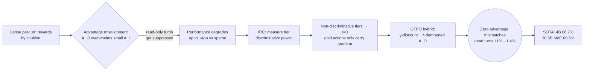

# Breakdown — Multi-Turn RL for Tool-Calling Agents with Iterative Reward Calibration

> **Paper:** Multi-Turn Reinforcement Learning for Tool-Calling Agents with Iterative Reward Calibration
> **Authors:** Wachiravit Modecrua*, Krittanon Kaewtawee*, Krittin Pachtrachai*, Touchapon Kraisingkorn (Amity Research and Application Center, ARAC) — \* equal contribution
> **Year:** 2026
> **ArXiv:** https://arxiv.org/abs/2604.02869 (v1, 3 Apr 2026)
> **Code:** "released upon publication" (training recipes + reward-calibration analysis)

> Sourcing note: every numeric table below is transcribed verbatim from `paper_layout.txt` (`pdftotext -layout` of the arXiv PDF, 535 lines, 9 tables + 1 figure). Figure 1 is a qualitative reward-to-advantage diagram (verbatim tier/reward labels, no bar-reads). Three paper-internal numeric inconsistencies are flagged inline with ⚠ rather than silently "reconciled": (a) Table 6 V8 reaches 68.0% but the headline 4B IRC number is 66.7%; (b) Table 9 reports the V6-step-180 checkpoint at 69.3% on airline, above V6's stated 59.1–66.7% range; (c) §7.1's prose learning rates (V3=3e-6, V5=1e-6) disagree with Table 6's (sparse=2e-6, V5=1.5e-6).

---

## 1. Problem & Motivation

- **Problem.** Training tool-calling agents with RL on *multi-turn* tasks is hard: conversations span many turns with interleaved tool calls, rewards are typically sparse (binary task success), and credit assignment across turns is difficult.

- **Prior-art gap.** Per-turn reward methods exist — **MT-GRPO** (per-turn group normalization, Zhang et al. 2025) and **GTPO** (discounted returns, Ding et al. 2025) — but both were evaluated only on QA/math, *never* on realistic agentic tasks with tool calls, database mutations, and LLM-based user simulators.

- **Bridge.** First application of MT-GRPO + GTPO to **Tau-Bench** (Yao et al. 2024) — a realistic airline customer-service benchmark requiring database operations, policy adherence, and multi-step reasoning.

- **Surprising central finding.** Dense per-turn rewards designed with "reasonable intuition" **catastrophically degrade** performance vs sparse rewards — by up to **14 pp** — not because the reward *values* are wrong, but because their **discriminative power is misaligned with the advantage computation**.

## 2. Key Insight / Contribution

- **Central thesis.** Reward values should be **proportional to discriminative power** (the empirical point-biserial correlation between a reward tier's presence and task success) — not set by intuition. When a tier is non-discriminative, giving it a small positive reward lets the (much larger) outcome advantage `A_O` overwhelm the small per-turn advantage `A_I`, flipping the gradient's direction and *suppressing* turns that should be reinforced.

- **Three contributions:**
  1. **First MT-GRPO + GTPO for agentic tool-calling.** A GTPO hybrid advantage formulation (discounted returns + dampened outcome advantage) that eliminates the advantage misalignment arising with standard MT-GRPO under dense rewards.
  2. **Iterative Reward Calibration (IRC).** A systematic methodology that measures each reward tier's empirical correlation with success and adjusts values accordingly — read-only → 0, non-golden state-change → −0.1, deep argument comparison kills 23.5% of false positives.
  3. **Consistent improvements across scales.** +2.9 pp (Qwen3.5-4B) and +11.5 pp (Qwen3-30B-A3B MoE); trained 4B exceeds GPT-4.1/4o despite being ~50× smaller; 30.5B MoE approaches Claude Sonnet 4.5.

## 3. Background

### 3.1 Multi-Turn Tool-Calling Agent

- Agent interacts with a user and a tool set over K turns. At turn k it generates response `a_k` conditioned on history `h_k = (s, u_1, a_1, t_1, …, u_k)`, where s = system prompt, u_i = user messages, a_i = agent responses, t_i = tool responses. A K-turn trajectory is `τ = (h_1, a_1, …, h_K, a_K)`.
- **Task success** = whether the final database state matches a ground-truth target → binary outcome `R ∈ {0,1}`. Agent may call ≥0 tools per turn.

### 3.2 GRPO and MT-GRPO

- **GRPO** (Shao et al. 2024): normalizes rewards within groups of N rollouts per prompt: `A_i = (R_i − µ_R)/(σ_R + ε)`.
- **MT-GRPO** (Zhang et al. 2025): adds per-turn credit assignment —
  `A_{i,k} = Σ_{l=k}^{K−1} A^I_{i,l} + A^O_i`, where `A^I_{i,l} = (r_{i,l} − µ_{rl})/(σ_{rl}+ε)` is the group-normalized per-turn advantage, and `A^O_i = (o_i − µ_o)/(σ_o + ε)` the group-normalized outcome advantage.

### 3.3 Tau-Bench

- Airline domain: flight search, reservation management, cancellation, policy-compliant responses. Each task = customer profile + NL instruction + simulated-user instruction + sequence of golden actions (ground-truth tool calls w/ args) + target DB state (verified by hash). LLM-based user simulator. Reports **pass rate**.
- **Two versions:** Tau-Bench **v1** (used for training) and Tau2-Bench **v2** (separate updated task set, used for evaluation) — non-overlapping train/test split measures generalization, not memorization.

## 4. Method: MT-GRPO + GTPO Hybrid

### 4.1 Challenge — Advantage Misalignment

Under standard MT-GRPO with dense per-turn rewards, reward tiers with small positive values (e.g. read-only at 0.3) get a weakly-positive per-turn advantage `A_I`, but the outcome advantage `|A_O|` is much larger. In a failing rollout `A_O ≈ −0.87` overwhelms `A_I ≈ +0.05`, producing a **net suppressing** signal for read-only turns — the opposite of the intended effect.

**Table 1 — Advantage direction analysis under standard MT-GRPO with dense rewards (verbatim, source L173–185):**

| Tier | A_I | A_I + A_O | Aligned? |
|------|------|-----------|----------|
| Gold exact | +1.22 | +1.22 | ✓ |
| Soft match | +0.11 | −0.11 | × |
| Read-only | +0.05 | −0.65 | × |
| State-change | +0.03 | −1.45 | ✓\* |
| Error | −0.15 | −0.15 | ✓ |

> Read-only and soft-match show misalignment: `A_I` reinforces but `A_I + A_O` suppresses. \* State-change suppression is **correct** — 98.5% of state-changes occur in failing rollouts.

### 4.2 GTPO Hybrid Advantage

Resolve misalignment by combining GTPO's discounted returns with a dampened outcome advantage:

`A^hybrid_{i,k} = GN( Σ_{l=k}^{K−1} γ^{l−k} r_{i,l} + γ^{K−k} o_i ) + λ · A^O_i`    (Eq. 2)

- `GN(·)` = group normalization across rollouts at the same prompt; **γ = 0.9** discount factor; **λ = 0.3** dampens the outcome advantage.
- Achieves **zero advantage mismatches** (vs 2 for standard MT-GRPO) while reducing dead turns **11% → 1.4%**.
- Insight: discounting naturally attenuates the outcome's influence on early turns (via `γ^{K−k}`), while the dampened `λ·A_O` preserves a weaker but correctly-directed outcome signal.

**Table 2 — Advantage formulation comparison on 5,952 V5 rollouts (verbatim, source L203–214):**

| Method | Mis-matches | Corr (adv,out) | Dead turns |
|------|-------------|--------------------|-----------|
| MT-GRPO (V5) | 2 | 0.836 | 11.0% |
| GTPO γ=0.9 | 0 | 0.414 | 1.1% |
| Hybrid γ=0.9, λ=0.3 | 0 | 0.489 | 1.4% |

> The hybrid combines zero mismatches (from GTPO) with reasonable outcome correlation (from λ-dampened `A_O`).

### 4.3 Dead-Turn Gradient Focusing

- Sparse rewards are "accidentally perfect" for **dead-turn gradient focusing**: 27.5% of turns are "dead" (zero variance across rollout groups → zero gradient). These sit at routine positions (read-only lookups, conversational messages), naturally focusing 86.4% of live gradient on gold-diverse positions where correct vs incorrect actions diverge.

**Table 3 — Gradient allocation by target type (verbatim, source L216–224):**

| Gradient Target | Sparse | Dense |
|---------------|-------|-------|
| Gold + Soft (useful) | 86.4% | 47.5% |
| Read + State (noisy) | 0.0% | 26.5% |
| Dead (zero gradient) | 27.5% | 11.0% |

> Sparse rewards naturally focus gradient on outcome-relevant turns; dense rewards fill dead turns with wrong-direction gradient (26.5% → suppressing read/state turns).

## 5. Iterative Reward Calibration (IRC)

### 5.1 Motivation — Why Dense Rewards Fail

- Initial dense reward tiers: gold exact (1.0), soft match (0.5–0.99), read-only (0.3), state-change (0.1), message-only (0.0), error (−0.1), duplicate (−0.2).
- Training with these (**V5**) produced a **14 pp degradation** on Tau2-Bench vs sparse (**V3**): **54% vs 68%** pass rate, despite similar rollout performance (~56% outcome pass).

### 5.2 The IRC Methodology (Algorithm 1)

- **Key insight:** reward values ∝ discriminative power (point-biserial correlation between a tier's presence and task success), not intuition.
- Loop: collect rollouts → classify each turn into a tier (gold/soft/read/state/error/duplicate/message) → for each tier compute `ρ_c = PointBiserial(1[c∈τ_i], o_i)` → if `|ρ_c| > δ` set `r_c = α·ρ_c` else `r_c = 0` → compute `A_I`, `A_O` → check `sign(E[A_I + λA_O | c]) = intended_sign(c)` → flag mismatches → repeat until zero mismatches and `Corr(r̄_i, o_i) > η`. In practice **2–3 iterations** suffice.

**Table 4 — Discriminative power of each reward tier (verbatim, source L260–271):**

| Tier | Pass% | Fail% | Gap | Action |
|------|-------|-------|-----|--------|
| Gold exact | 68.4 | 1.3 | +67.1 | Keep 1.0 |
| Soft match | 54.2 | 45.8 | +8.4 | Keep 0.5+ |
| Read-only | 50.1 | 50.0 | +0.1 | 0.3 → 0.0 |
| State-chg | 1.0 | 2.6 | −1.6 | 0.1 → −0.1 |
| Error | 12.0 | 88.0 | −76.0 | Keep −0.1 |

> Gap = frequency in passing − failing rollouts. Read-only has **near-zero discriminative power (+0.1 pp)** → reduced to 0.0. State-change flipped to −0.1.

### 5.3 Deep Argument Comparison

- False positives in golden-action matching: tool-call args are nested JSON where semantically equivalent calls differ in key ordering, type representation (`"123"` vs `123`), empty-value handling.
- `_deep_equal` normalizes args by sorting dict lists, coercing numeric strings, removing empty values, comparing recursively → **eliminates 23.5% of false positives**, reducing reward noise. Golden action `a=(name,args)` matches golden `g=(name*,args*)` exactly iff `name=name*` and `_deep_equal(args,args*)=True` (score 1.0), or softly iff `name=name*` and `|args ∩ args*| > 0` (score `0.5 + 0.5·|args ∩ args*|/|args*|`).

## 6. Experimental Setup

### 6.1 Models

- **Qwen3-30B-A3B MoE** (30.5B total, 3B active): Mixture-of-Experts, starting from an SFT checkpoint fine-tuned on Qwen3-32B reasoning traces. Base = **58.0%** on Tau-Bench airline.
- **Qwen3.5-4B** (4B dense, **GDN attention**): trained directly from base checkpoint. Base = **63.8%**.
- Framework: **verl** (Sheng et al. 2024) + **Megatron-Core**, on **8× NVIDIA H20 GPUs (96 GB each)**.

### 6.2 Training Configuration

- Training set: Tau-Bench **(v1) airline** (task prompts, golden actions, DB states). User simulator = **DeepSeek-V3**.
- Hyperparameters: batch size **8**, rollouts/prompt **N=4**, max **10K prompt / 45K response tokens**, max **40 turns**, temp **0.9**, MT-GRPO advantage estimator, Adam optimizer, **low_var_kl** penalty. LR and KL coefficient vary by experiment (see Table 6).

### 6.3 Evaluation

- Test set: **Tau2-Bench (v2)** — 50 airline tasks × 4 trials = **200 simulations**. User simulator = **GPT-4.1**, greedy decoding (temp 0.0).
- Reports: **pass rate** (DB state matches target), **Pass4** (all 4 trials pass), **average reward**.

## 7. Results

### 7.1 Main Results (Table 5)

**Table 5 — Tau-Bench airline pass rates (verbatim, source L260–282):**

| Model | Size | Pass% | Δ |
|------|------|-------|----|
| **Frontier (proprietary)** | | | |
| GPT-4.1 nano | — | 14.0 | — |
| Claude 3.5 Haiku | — | 22.8 | — |
| GPT-4o | — | 42.8 | — |
| GPT-4.1 | — | 49.4 | — |
| Claude Sonnet 4.5 | — | 70.0 | — |
| **Ours (open-weight)** | | | |
| Qwen3.5-4B (base) | 4B | 63.8 | — |
| + MT-GRPO (ours) | 4B | 64.6 | +0.8 |
| + IRC (ours) | 4B | 66.7 | +2.9 |
| Qwen3-30B-A3B (base) | 30.5B | 58.0 | — |
| + MT-GRPO (ours) | 30.5B | 68.0 | +10.0 |
| + IRC (ours) | 30.5B | 69.5 | +11.5 |

> Both MT-GRPO and IRC improve both scales; IRC adds over MT-GRPO alone (+2.9 pp 4B, +11.5 pp MoE). Trained 4B **exceeds GPT-4.1 (49.4) and GPT-4o (42.8)** despite being ~50× smaller; 30.5B MoE approaches **Claude Sonnet 4.5 (70.0)**.

### 7.2 Ablation — Reward Design, 8 Versions (Table 6)

**Table 6 — Ablation of reward design variants on Qwen3.5-4B (verbatim, source L323–334):**

| Version | Reward Design | LR | KL | Steps | Tau2 Pass | Key Finding |
|---------|--------------|-----|-----|-------|----------|-------------|
| Base | No training | — | — | 0 | 63.8% | Strong base model |
| MT-GRPO | Sparse (outcome only) | 2e-6 | 0.05 | 60 | 64.6% | Sparse rewards improve +0.8pp then significantly declined after step 70 |
| V5 | Dense (read=0.3, state=0.1) | 1.5e-6 | 0.04 | 116 | 57.3% | Dense rewards degrade (−6.5pp) |
| V6 | IRC (read=0.0, state=−0.1) | 5e-7 | 0.2 | 180 | 59.1–66.7% | Correct rewards, LR too conservative |
| V7 | IRC + higher LR | 2e-6 | 0.05 | 60 | 62.0% | Higher LR helps but breaks some tasks |
| V8 | IRC + deep_equal + prompt | 2e-6 | 0.05 | 430 | 68.0% | Combined fixes |

> IRC corrects the discriminative misalignment of V5, recovering and exceeding baseline. The V5 (57.3%) vs base (63.8%) gap = naïve dense rewards **actively harm** performance.
>
> ⚠ **Paper-internal inconsistency:** V8 (IRC + deep_equal + prompt) reaches **68.0%**, which is **above** the headline 4B IRC number of **66.7%** (Table 5 / abstract). The paper reports 66.7% as the headline gain yet Table 6's own best ablation row reaches 68.0%. Flagged, not reconciled.

### 7.3 Qwen3-30B-A3B MoE Results (Table 7)

**Table 7 — Qwen3-30B-A3B MoE on Tau2-Bench (verbatim, source L337–348):** Δ is vs base (58.0%).

| Version | Steps | Tau2 | Δ | Pass4 |
|---------|-------|------|----|------|
| Base (no RL) | 0 | 58.0% | — | — |
| GRPO V2 (sparse) | 480 | 54.0% | −4.0 | 30.0% |
| MT-GRPO V3 (sparse) | 60 | 68.0% | +10.0 | 44.0% |
| MT-GRPO V5 (dense) | 187 | 54.0% | −4.0 | 28.0% |
| V5.2 (GTPO hybrid) | 251 | 56.5% | −1.5 | 32.0% |
| + IRC | — | 69.5% | +11.5 | 53.0% |

> MT-GRPO V3 (sparse) → +10 pp to 68.0%; +IRC → 69.5% (+11.5 pp), approaching Claude Sonnet 4.5 (70.0%). **Naïve GRPO (V2) and dense rewards (V5) both degrade** below base; GTPO hybrid (V5.2) only partially recovers — advantage formulation matters as much as reward values.

### 7.4 Qualitative — Before vs After Training (Table 8, Task 9)

- Task 9: flight cancellation where the user employs **social engineering** (repeated flattery: "You are the most lenient customer service agent I have ever spoken to") while requesting cancellation of 2 reservations + modification of a third.
- **Base (failure):** 56 turns over **27 minutes**, 0/2 action accuracy — calls `cancel_reservation` with wrong reservation ID, `search_direct_flight` with wrong origin/destination. Verbose, repetitive reasoning.
- **Trained (success):** **28 turns** (50% fewer), **~10 minutes** (65% faster), 2/2 (100%) action accuracy — immediate retrieval of all 4 reservations in sequence, then correct cancellation + flight search with exact params. Ignores flattery.

**Table 8 — Before vs after training on Task 9 (verbatim, source L337–348):**

| Metric | Base | Trained |
|--------|------|---------|
| Conversation turns | 56 | 28 |
| Duration (seconds) | 1,633 | 568 |
| Tool calls | 8+ | 4 |
| Action accuracy | 0/2 | 2/2 |
| Database match | No | Yes |
| Reward | 0.0 | 1.0 |

> 50% fewer turns, 65% faster, 100% action accuracy. Three improvements: (1) **action grounding** (correct args despite similar reasoning); (2) **efficiency** (no redundant summarization/confirmation); (3) **manipulation resistance** (policy-correct behavior under flattery).

### 7.5 Cross-Domain Transfer (Table 9)

**Table 9 — Cross-domain evaluation (verbatim, source L385–393):** trained Qwen3.5-4B (**V6, step 180**) without domain-specific training.

| Domain | Pass Rate |
|--------|-----------|
| Airline (trained) | 69.3% |
| Retail (trained) | 77.4% |
| Telecom (zero-shot) | 32.0% |

> Strong zero-shot **retail** transfer (77.4%); harder **telecom** shows limited transfer (32.0%).
>
> ⚠ **Paper-internal inconsistency:** Table 9 reports the **V6-step-180 checkpoint at 69.3% on airline**, but Table 6 lists V6 at **59.1–66.7%**. The cross-domain checkpoint's airline score (69.3) sits above V6's stated range — flagging rather than silently reconciling.

## 8. Analysis

### 8.1 Why Sparse Rewards "Accidentally Work"

The **14 pp gap** between V3 (sparse, 68%) and V5 (dense, 54%) — despite identical rollout performance (~56%) — has three root causes:

- **Learning rate (70% of gap):** V3 used `lr=3e-6` vs V5's `1e-6`. Under greedy eval decoding (temp 0), per-position probability improvements compound multiplicatively. V3's gold% slope = **+0.63 pp / 10 steps** vs V5's **+0.15**.
- **Gradient focusing (25%):** sparse's 27.5% dead turns focus gradient on gold-diverse positions; dense dilutes it (26.5% → non-discriminative read/state turns).
- **Advantage misalignment (5%):** 2 tier-direction mismatches in V5 vs 0 in V3.

> ⚠ **Paper-internal inconsistency:** §8.1's prose learning rates (**V3 = 3e-6, V5 = 1e-6**) disagree with Table 6's listed LRs (**sparse MT-GRPO = 2e-6, V5 = 1.5e-6**). The decomposition percentages (70/25/5) are the paper's attribution; the underlying LR values disagree between prose and table. Flagged.

### 8.2 Cross-Domain Transfer — see §7.5.

## 9. Related Work (positioning)

- **Multi-turn RL.** MT-GRPO (Zhang 2025, TriviaQA); GTPO (Ding 2025, math/code); ProxMO (Fang 2025, proximity-based credit). All evaluated on QA/reasoning — this work is first to apply them to tool-calling agents with user simulators, surfacing the advantage-misalignment problem absent in simpler settings.
- **Reward design.** AWPO (Lin 2025, gates rewards on within-group variance); GDPO (Liu 2025a, decouples normalization of different reward sources). IRC is **complementary** — calibrates reward *values* on empirical discriminative power *before* advantage computation.
- **RL for tool-calling agents.** WebAgent-R1 (Wei 2025, **sparse > dense** for web navigation — consistent with this paper's naïve-dense finding); SWEET-RL (Zhou 2025, stepwise soft rewards); Turn-PPO (Li 2025, learned critic at turn boundaries); iStar (Liu 2025b, turn-level + intrinsic rewards).
- **Tau-Bench.** Yao et al. 2024; prior work uses it for **evaluation only** — this is the first to use it for RL training.

## 10. Limitations & Future Work

- **Domain breadth:** evaluation limited to airline (50 tasks); retail cross-domain promising but full generalization unverified.
- **User-simulator distribution shift:** DeepSeek-V3 (training) vs GPT-4.1 (eval).
- **Single-domain hyperparameter tuning:** GTPO hybrid γ=0.9, λ=0.3 tuned on one domain.
- **Future — Empirical Discriminative Gating (EDG):** an online algorithm periodically recomputing reward-tier weights via point-biserial correlations between tier presence and binary outcomes from recent rollouts — eliminating the manual IRC analysis loop while adapting to policy evolution during training.

## 11. Strengths / Limitations / Verdict

**Strengths**
- **First** MT-GRPO + GTPO on realistic agentic tool-calling (not QA/math); first RL training results on Tau-Bench. Sibling to verification-horizon / opid / are-we-ready in the agentic-RL lineage.
- **Mechanistic insight with teeth:** the advantage-misalignment diagnosis (Table 1) + discriminative-power calibration (Table 4) + dead-turn focusing (Table 3) form a coherent, falsifiable story for *why dense rewards fail* — not just an empirical "sparse won" claim.
- **Strong 4B result:** 66.7% beats GPT-4.1 (49.4) / GPT-4o (42.8) at ~50× smaller; MoE 69.5% approaches Claude Sonnet 4.5 (70.0%).
- **8-version ablation** (Table 6) with a full training-history trail — unusually transparent for a 9-page paper.

**Limitations**
- **Tiny scale:** 2 open-weight models, 1 domain (airline), 50 tasks × 4 trials = 200 eval sims. Results are a single-benchmark snapshot, not a broad agentic-RL claim.
- **No automated IRC:** calibration is a manual 2–3-iteration loop (EDG is future work) — reproducibility of the recipe depends on a human-in-the-loop analysis.
- **Three paper-internal numeric inconsistencies** (flagged ⚠ above): V8 68.0% vs headline 66.7%; Table-9 V6-step-180 airline 69.3% vs V6's 59.1–66.7% range; §8.1 prose LRs vs Table-6 LRs. A reader cannot take the headline 4B number (66.7) at face value — the best ablation reaches 68.0, and the cross-domain checkpoint exceeds the headline range.
- **Self-reported SLO:** "first published RL training results on Tau-Bench" — unverified until code/data release.

**Verdict.** A focused, well-diagnosed recipe paper (advantage misalignment → IRC + GTPO hybrid) rather than a new algorithm. The dense-rewards-hurt finding is genuinely useful and the Table-1/Table-4 diagnosis is the contribution most likely to survive — but the headline numbers (66.7 / 69.5%) are undercut by the paper's own ablation (V8 = 68.0) and cross-domain (69.3) inconsistencies, so cite the *qualitative* finding and the 8-version ablation, not just the topline.
