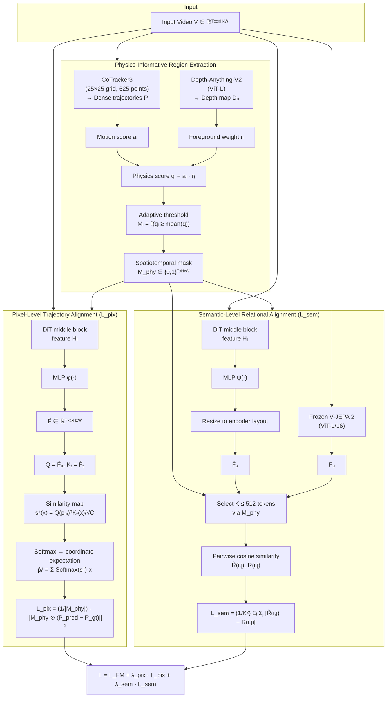

# Breakdown — PhysisForcing: Physics Reinforced World Simulator for Robotic Manipulation

> **Paper:** PhysisForcing: Physics Reinforced World Simulator for Robotic Manipulation
> **Authors:** Peiwen Zhang, Yufan Deng, Shangkun Sun, Juncheng Ma, Duomin Wang, Jonas Du, Zilin Pan, Ye Huang, Hao Liang, Songyan Huang, Ruihua Zhang, Enze Xie, Ming-Yu Liu, Daquan Zhou (Peking University, NVIDIA)
> **Year:** 2026 (arXiv:2606.28128, v1, Jun 2026)
> **ArXiv:** https://arxiv.org/abs/2606.28128
> **Project page:** https://dagroup-pku.github.io/PhysisForcing.github.io/
> **Type:** Training-time physics alignment framework for diffusion video generation.

---

## 1. Problem & Motivation

**Problem.** Video generation models produce photorealistic but physically implausible robot manipulation videos — discontinuous gripper trajectories, object penetration, pushed objects staying still, grasped objects drifting away. These violations make generated videos unreliable as world simulators for downstream robotics tasks.

**Why important.** Embodied world simulation needs more than pretty frames. If a robot policy learns from a video world model that gets physics wrong, it inherits those errors. Contact-rich manipulation is where violations concentrate.

**Prior-work limitations:**
1. **General video models** (Sora, Wan) — visually strong but lack exposure to embodied contact dynamics.
2. **Robot-specific fine-tuning** — improves task relevance but treats all pixels uniformly; physics-critical regions get same supervision as background.
3. **Geometry-based methods** (depth, keypoint tracking, 3D reconstruction) — capture local motion but miss semantic-level interactions (e.g., "pushed object should move away").
4. **Preference-based methods** (DPO, GRPO with physics discriminators) — post-hoc correction, sparse feedback, may sacrifice visual quality.
5. **Simulator-based methods** — high computational cost, limited scalability.

## 2. Key Insight / Contribution

**Core idea (one sentence):** Physical plausibility in manipulation videos is hierarchical and region-localized — so apply pixel-level trajectory alignment and semantic-level relational alignment *only* on physics-informative regions (manipulators, contacts, moving objects).

**What is genuinely new:**
- **Region-focused hierarchical physics alignment** — two complementary losses at different granularity levels, both masked to interaction-critical regions.
- **Pixel-level trajectory alignment** — supervises DiT features using reference point trajectories from CoTracker3, predicting point locations via feature similarity maps.
- **Semantic-level relational alignment** — aligns pairwise token-cosine similarity matrices between DiT and frozen V-JEPA 2 encoder on mask-selected tokens.
- **Zero inference overhead** — all auxiliary models are training-only.
- **Strong results** across 3 generation benchmarks, world-model action planning, and downstream policy learning.

## 3. Method

### 3.1 Overview

### 3.2 Physics-Informative Region Extraction

**Goal:** Find where robot-object interactions happen, ignore static background.

**Step 1 — Dense trajectories.** CoTracker3 on first frame (25×25 grid = 625 points) → per-point 2D trajectories across T frames.

**Step 2 — Motion score.** For each point $i$, accumulate displacement magnitude:

$$a_i = \sum_{t=1}^{T-1} \left\| p_i^{t+1} - p_i^t \right\|_2$$

A larger $a_i$ indicates stronger local motion at that point.

**Step 3 — Foreground weighting.** Depth-Anything-V2 on first frame → depth map $D_0 \in \mathbb{R}^{H \times W}$. For each query point $p_i^0$:

$$r_i = \frac{1}{D_0(p_i^0) + \epsilon}, \qquad q_i = a_i \cdot r_i$$

where $\epsilon$ is a small constant for numerical stability. Closer objects (smaller depth) get higher weight. The product $q_i$ measures both local motion strength and foreground relevance.

**Step 4 — Adaptive threshold.** The mean of all $q_i$ serves as the adaptive threshold:

$$M_i = \mathbb{I}\!\left(q_i \geq \frac{1}{N}\sum_{j=1}^{N} q_j\right)$$

**Step 5 — Rasterize to spatiotemporal mask.** The binary trajectory mask is projected onto each frame to form the final spatiotemporal physics mask:

$$M_{\text{phy},\,t}\!\left(\lfloor p_i^t \rceil\right) = 1, \quad \text{if } M_i = 1, \quad t = 1, \ldots, T$$

where $\lfloor \cdot \rceil$ denotes rounding to the nearest pixel. The final mask is $M_{\text{phy}} \in \{0, 1\}^{T \times H \times W}$.

### 3.3 Pixel-Level Trajectory Alignment ($\mathcal{L}_{\text{pix}}$)

**Goal:** Enforce per-point trajectory continuity on interaction-critical regions.

1. Extract hidden feature $H_l$ from a **middle DiT block** (empirically best — carries both motion and structure).
2. Lightweight MLP $\phi(\cdot)$ → refined feature → reshape to $\hat{F} \in \mathbb{R}^{T \times C \times H \times W}$.
3. First-frame feature as query, remaining frames as keys:

$$Q = \hat{F}_0, \qquad K_t = \hat{F}_t, \quad t = 1, \ldots, T-1$$

4. For each query point $p_i^0$, compute similarity map against all spatial locations:

$$s_i^t(x) = \frac{Q(p_i^0)^\top K_t(x)}{\sqrt{C}}, \quad x \in \Omega$$

where $\Omega$ is the spatial grid of size $H \times W$ and $C$ is the feature dimension.

5. Softmax over spatial dim → predicted location via coordinate expectation:

$$\hat{p}_i^t = \sum_{x \in \Omega} \text{Softmax}_x\!\left(s_i^t(x)\right) \cdot x$$

6. **Masked MSE loss:**

$$\mathcal{L}_{\text{pix}} = \frac{1}{|M_{\text{phy}}|} \left\| M_{\text{phy}} \odot \left(P_{\text{pred}} - P_{\text{gt}}\right) \right\|_2^2$$

where $P_{\text{pred}} = \{\hat{p}_i^t\}_{i,t}$ are trajectories inferred from predicted DiT features, and $P_{\text{gt}} = \{p_i^{\text{gt},t}\}_{i,t}$ are reference trajectories from CoTracker3 on the input video. The mask $M_{\text{phy}}$ restricts supervision to interaction-relevant regions.

**This directly suppresses trajectory discontinuity — the most common local physics failure.**

### 3.4 Semantic-Level Relational Alignment ($\mathcal{L}_{\text{sem}}$)

**Goal:** Ensure that regions that *should* move together (gripper + grasped object) actually do.

1. Frozen V-JEPA 2 encoder extracts $F_u$ from input video. Same DiT block feature → MLP $\psi(\cdot)$ → resize to match encoder layout:

$$F_u = \Phi_u(V), \qquad \hat{F}_u = \text{Resize}\!\left(\psi(H_l)\right)$$

where $\Phi_u(\cdot)$ is the video understanding encoder and $\hat{F}_u$ is dimensionally aligned with $F_u$ by interpolation and padding.

2. Physics mask resized to common token resolution → select $K$ tokens ($K \leq 512$):

$$\hat{F}_M = \left\{ \hat{F}_u^{t,n} \mid (t,n) \in M \right\} \in \mathbb{R}^{K \times C}, \qquad F_M = \left\{ F_u^{t,n} \mid (t,n) \in M \right\} \in \mathbb{R}^{K \times C}$$

where $M$ is the mask-induced token index set.

3. Compute pairwise cosine similarity matrices:

$$\hat{R}(i,j) = \frac{\hat{F}_{M,i} \cdot \hat{F}_{M,j}}{\left\|\hat{F}_{M,i}\right\|_2 \left\|\hat{F}_{M,j}\right\|_2}, \qquad R(i,j) = \frac{F_{M,i} \cdot F_{M,j}}{\left\|F_{M,i}\right\|_2 \left\|F_{M,j}\right\|_2}$$

where $\hat{R}, R \in \mathbb{R}^{K \times K}$ capture pairwise spatio-temporal relations among selected physics-informative tokens.

4. **Loss:**

$$\mathcal{L}_{\text{sem}} = \frac{1}{K^2} \sum_{i=1}^{K} \sum_{j=1}^{K} \left| \hat{R}(i,j) - R(i,j) \right|$$

**This transfers the encoder's relational structure (which captures object coupling, contact dynamics) into the DiT features.**

### 3.5 Flow Matching Objective & Total Training Loss

The overall training objective combines the standard flow matching loss with both physics alignment losses:

$$\boxed{\mathcal{L} = \mathcal{L}_{\text{FM}} + \lambda_{\text{pix}} \, \mathcal{L}_{\text{pix}} + \lambda_{\text{sem}} \, \mathcal{L}_{\text{sem}}}$$

where $\mathcal{L}_{\text{FM}}$ is the standard flow matching (rectified) loss, and $\lambda_{\text{pix}}$, $\lambda_{\text{sem}}$ balance the two physics losses. All auxiliary models are discarded at inference → **zero extra inference cost**.

### 3.6 Training & Inference

- Applied during fine-tuning of pre-trained DiT video backbones.
- Both losses target the **same middle DiT block**.
- $\lambda_{\text{pix}}$ and $\lambda_{\text{sem}}$ balance the two physics losses against flow matching loss.
- **All auxiliary models discarded at inference → zero extra cost.**

## 4. Experiments

### 4.1 Setup

| Facet | Details |
|-------|---------|
| **Training data** | ~500K clips from RoVid-X (filtered from 4M) |
| **Backbones** | Wan2.2-I2V-A14B (MoE 14B active), Wan2.2-TI2V-5B (5B), Cosmos3-Nano (~16B MoT) |
| **Resolution** | 640×480, 81 frames (Wan); 720p, 189 frames (Cosmos3) |
| **Optimizer** | AdamW, lr=1e-5, 20K steps, batch 128 |
| **Auxiliary models** | CoTracker3 (625 pts, 25×25), Depth-Anything-V2 (ViT-L ~335M), V-JEPA 2 (ViT-L/16, vitl-fpc64-256) |
| **V-JEPA 2 tokens** | 32×16×16 spatiotemporal grid (tubelet 2, patch 16); K≤512 selected tokens |
| **Generation benchmarks** | R-Bench (650 prompts), PAI-Bench-G robot domain (174 prompts), EZS-Bench (196 OOD prompts) |
| **Robotics benchmarks** | WorldArena (action planner), RoboTwin 2.0 (Fast-WAM policy) |

### 4.2 Generation Results — R-Bench (Main Benchmark)

R-Bench evaluates across task-oriented dimensions (Manipulation, Spatial, Multi-entity, Long-horizon, Reasoning) and embodiment-specific dimensions (Single arm, Dual arm, Quadruped, Humanoid).

#### Open-Source Models

| Model | Avg | Manip. | Spatial | Multi-ent. | Long-horiz. | Reasoning | S-arm | D-arm | Quad | Humanoid |
|-------|----:|-------:|--------:|-----------:|------------:|----------:|------:|------:|-----:|--------:|
| HunyuanVideo 1.5 | 46.0 | 43.7 | 39.9 | 38.1 | 38.0 | 36.1 | 34.4 | 33.9 | 30.3 | 25.6 |
| LongCat-Video | 44.2 | 37.2 | 34.4 | 28.4 | 33.1 | 20.3 | 30.2 | 20.6 | 17.7 | 11.6 |
| Wan2.1-14B | 31.6 | 31.0 | 26.8 | 30.4 | 31.3 | 27.6 | 17.6 | 25.8 | 18.0 | 11.2 |
| LTX-2 | 31.2 | 22.0 | 28.2 | 23.3 | 14.2 | 20.3 | 21.0 | 17.3 | 10.8 | 9.8 |
| Wan2.2-TI2V-5B | 43.8 | 38.4 | 33.5 | 38.6 | 31.8 | 25.4 | 28.0 | 16.9 | 14.7 | 21.2 |
| SkyReels | 36.4 | 18.6 | 20.5 | 16.4 | 23.4 | 23.4 | 24.1 | 17.0 | 3.5 | 7.9 |
| LTX-Video | 51.3 | 58.6 | 46.4 | 45.3 | 43.6 | 50.7 | 44.0 | 44.0 | 45.4 | 33.8 |
| FramePack | 52.6 | 57.6 | 49.7 | 42.4 | 44.8 | 47.7 | 45.6 | 46.4 | 48.0 | 38.5 |
| HunyuanVideo | 63.4 | 68.1 | 59.5 | 62.2 | 59.0 | 58.6 | 52.6 | 62.6 | 62.5 | 46.5 |
| CogVideoX_5B | 59.5 | 62.1 | 59.9 | 55.5 | 60.7 | 50.9 | 46.4 | 54.8 | 52.4 | 49.6 |

#### Commercial Models

| Model | Avg | Manip. | Spatial | Multi-ent. | Long-horiz. | Reasoning | S-arm | D-arm | Quad | Humanoid |
|-------|----:|-------:|--------:|-----------:|------------:|----------:|------:|------:|-----:|--------:|
| Wan2.6 | **60.7** | 59.9 | 58.4 | 57.0 | 56.5 | 56.3 | 55.1 | 53.4 | 36.2 | 26.6 |
| Veo 3.1 | 54.6 | 54.1 | 57.7 | 52.7 | 56.0 | 52.1 | 54.2 | 52.9 | 20.8 | 15.1 |
| Seedance 1.5 Pro | 65.6 | 47.4 | 49.5 | 57.6 | 63.7 | 50.8 | 42.5 | 59.8 | 26.8 | 22.3 |
| Wan2.5 | 47.9 | 53.4 | 48.4 | 40.2 | 38.6 | 43.0 | 44.8 | 36.4 | 18.6 | 11.1 |
| Hailuo v2 | 51.4 | 59.2 | 57.0 | 49.6 | 54.5 | 53.0 | 45.4 | 53.0 | 25.5 | 16.6 |
| Veo 3 | 53.1 | 46.7 | 47.0 | 43.7 | 47.4 | 50.4 | 44.2 | 35.8 | 11.5 | 13.9 |
| Seedance 1.0 | 66.6 | 67.0 | 64.8 | 68.0 | 59.4 | 63.4 | 62.2 | 57.0 | 47.6 | 31.4 |
| Kling 2.6 Pro | 68.1 | 66.6 | 64.1 | 63.4 | 61.1 | 61.0 | 64.1 | 60.5 | 51.3 | 32.4 |
| Sora v2 Pro | 72.3 | 74.3 | 68.0 | 72.6 | 64.0 | 68.9 | 69.8 | 63.7 | 66.4 | 54.4 |
| Sora v1 | 66.7 | 70.4 | 69.2 | 65.4 | 63.5 | 63.7 | 68.6 | 61.3 | 56.1 | 41.9 |

#### Robotics-Specific Models

| Model | Avg | Manip. | Spatial | Multi-ent. | Long-horiz. | Reasoning | S-arm | D-arm | Quad | Humanoid |
|-------|----:|-------:|--------:|-----------:|------------:|----------:|------:|------:|-----:|--------:|
| Cosmos3-Super | 58.1 | 52.9 | 46.4 | 42.0 | 40.5 | 20.6 | 12.3 | — | — | — |
| Abot-PhysWorld | 64.2 | 54.8 | 33.8 | 37.2 | 34.8 | 10.6 | 4.0 | — | — | — |
| Cosmos 2.5 | 44.4 | 43.4 | 20.1 | 29.7 | 21.4 | 5.0 | 1.8 | — | — | — |
| DreamGen(gr1) | 59.1 | 52.3 | 49.6 | 33.4 | 31.6 | 5.4 | 6.2 | — | — | — |
| DreamGen(droid) | 39.5 | 45.4 | 39.9 | 21.5 | 33.9 | 5.0 | 0.0 | — | — | — |
| Vidar | 61.5 | 66.2 | 54.4 | 56.4 | 49.9 | 38.2 | 26.8 | — | — | — |
| UnifoLM-WMA-0 | 62.3 | 66.8 | 56.0 | 53.2 | 47.6 | 41.0 | 19.4 | — | — | — |

#### Finetuned Methods (PhysisForcing)

| Model | Avg | Δ vs base | Δ vs ft | Manip. | Spatial | Multi-ent. | Long-horiz. | Reasoning | S-arm | D-arm | Quad | Humanoid |
|-------|----:|----------:|--------:|-------:|--------:|-----------:|------------:|----------:|------:|------:|-----:|--------:|
| Wan2.2-I2V-A14B (base) | 50.7 | — | — | 38.1 | 44.8 | 33.1 | 39.6 | 43.4 | 31.3 | 41.5 | 42.6 | 45.4 |
| Wan2.2-I2V-A14B (ft) | 57.9 | +7.2 | — | 52.3 | 56.4 | 47.5 | 55.0 | 57.8 | 58.9 | 62.8 | 65.4 | 67.0 |
| **PF-Wan** | **62.0** | **+11.3** | **+4.1** | **56.4** | **57.6** | **49.1** | **46.6** | **49.2** | **51.3** | **58.4** | **57.6** | **59.3** |
| Cosmos3-Nano (base) | 58.4 | — | — | 48.5 | 54.6 | 44.8 | 52.7 | 57.4 | 47.8 | 52.4 | 39.4 | 48.5 |
| Cosmos3-Nano (ft) | 61.5 | +3.1 | — | 53.0 | 57.4 | 60.8 | 64.2 | 68.7 | 59.1 | 66.5 | 69.3 | — |
| **PF-Cosmos** | **63.8** | **+5.4** | **+2.3** | **57.6** | **58.2** | **63.5** | **69.6** | **61.1** | **67.1** | **70.0** | **73.1** | **70.6** |

**Key takeaway:** PF-Cosmos achieves the best overall R-Bench score (63.8), surpassing all baselines including commercial Wan2.6 (60.7) and Sora v2 Pro (72.3 on task dims but lower on embodiment). PF-Wan is second best overall (62.0). Both show consistent per-dimension improvements over vanilla finetuning.

### 4.3 Generation Results — PAI-Bench (Robot Domain)

PAI-Bench-G evaluates quality and domain-specific physics in robot manipulation generation.

| Model | Quality | Domain | Avg |
|-------|--------:|-------:|----:|
| Wan2.2-I2V-A14B (ft) | 75.38 | 76.52 | 76.05 |
| **PF-Wan** | **76.79** | **77.40** | **77.15** |
| Cosmos3-Nano (ft) | 84.42 | 85.17 | 84.91 |
| **PF-Cosmos** | **85.20** | **88.20** | **85.2** |
| Wan2.5 (commercial) | — | — | 81.0 |
| Abot-PhysWorld | — | — | 84.9 |

**Key takeaway:** PF-Cosmos attains the best overall average (85.2), beating the strongest commercial model Wan2.5 (81.0) and the robotics-specific baseline Abot-PhysWorld (84.9). The domain score improvement is particularly strong for Cosmos (85.17 → 88.20, +3.0).

### 4.4 Generation Results — EZS-Bench (Zero-Shot OOD)

EZS-Bench is a training-independent zero-shot benchmark of 196 unseen robot-task-scene combinations probing out-of-distribution generalization.

| Model | Avg | Δ vs ft |
|-------|----:|--------:|
| Wan2.2-I2V-A14B (ft) | 79.0 | — |
| **PF-Wan** | **80.5** | **+1.5** |
| Cosmos3-Nano (ft) | 80.3 | — |
| **PF-Cosmos** | **81.1** | **+0.8** |
| Abot-PhysWorld | 80.3 | — |

**Key takeaway:** PF-Cosmos achieves the best overall average (81.1), outperforming Abot-PhysWorld (80.3). Even on completely unseen combinations, physics alignment generalizes.

### 4.5 Robotics Results — WorldArena Action Planner

Under the WorldArena action-planner protocol, the world model is paired with a shared inverse dynamics model that decodes its predicted rollout into actions executed in the RoboTwin 2.0 simulator.

| Model | Task 1 | Task 2 | Avg |
|-------|-------:|-------:|----:|
| Genie Envisioner | 10.0 | 1.0 | 5.5 |
| TesserAct | 8.0 | 2.0 | 5.0 |
| RoboMaster | 20.0 | 19.0 | 19.5 |
| Vidar | 15.0 | 14.0 | 14.5 |
| WoW (best baseline) | 18.0 | 10.5 | 20.5 |
| Wan2.2-TI2V-5B (base) | 12.0 | 20.0 | 16.0 |
| **+ PhysisForcing** | **20.0** | **26.0** | **24.0** |

**Key takeaway:** PhysisForcing lifts closed-loop success from 16.0% to 24.0% (+8.0 absolute), surpassing all world-model planners including the strongest baseline WoW (20.5%).

### 4.6 Robotics Results — Fast-WAM Downstream Policy

PhysisForcing-trained Wan2.2-TI2V-5B is plugged into Fast-WAM as a drop-in replacement for its video DiT on contact-rich RoboTwin 2.0 tasks. A single policy is jointly trained on six tasks; each is evaluated with 200 rollouts.

| Task | Baseline | +PhysisForcing | Δ |
|------|--------:|--------------:|--:|
| place_empty_cup | 41.5 | 63.0 | **+21.5** |
| press_stapler | 49.0 | 60.0 | **+11.0** |
| grab_roller | 58.5 | 63.0 | +4.5 |
| shake_bottle | 71.5 | 68.5 | −3.0 |
| adjust_bottle | 69.5 | 69.5 | 0.0 |
| stack_bowls_two | 94.5 | 88.0 | −6.5 |
| **Average** | **68.2** | **72.8** | **+4.6** |

**Key takeaway:** Largest gains on contact-rich tasks where physics violations matter most (place_empty_cup +21.5, press_stapler +11.0). Some regression on non-contact tasks (shake_bottle −3.0, stack_bowls_two −6.5) — suggesting the physics alignment introduces a slight bias that trades off on tasks already near ceiling.

### 4.7 Ablation Studies

#### 4.7.1 Component Ablation (R-Bench)

| Model | Embodiments | Tasks | Avg | Δ vs ft |
|-------|-----------:|------:|----:|--------:|
| **Wan2.2-TI2V-5B** | | | | |
| — (ft baseline) | 56.5 | 35.4 | 44.8 | — |
| + $\mathcal{L}_{\text{pix}}$ only | 59.0 | 37.8 | 47.2 | **+2.4** |
| + $\mathcal{L}_{\text{sem}}$ only | 58.4 | 36.5 | 46.2 | +1.4 |
| + PhysisForcing (both) | **58.2** | **38.9** | **47.5** | **+2.7** |
| **Wan2.2-I2V-A14B** | | | | |
| — (ft baseline) | 52.5 | 55.2 | 57.9 | — |
| + $\mathcal{L}_{\text{pix}}$ only | 64.7 | 52.5 | 60.7 | +2.8 |
| + $\mathcal{L}_{\text{sem}}$ only | 67.5 | 55.2 | 60.0 | +2.1 |
| + PhysisForcing (both) | **69.0** | **56.3** | **62.0** | **+4.1** |

**Findings:**
- $\mathcal{L}_{\text{pix}}$ gives the larger single-loss gain — directly suppresses trajectory discontinuity (the most common local failure).
- $\mathcal{L}_{\text{sem}}$ repairs global relational errors (broken contact, decoupled objects).
- Both losses target different error modes and stack (complementary, not redundant).
- The same pattern holds on both 5B and 14B backbones — benefit is not tied to scale.

#### 4.7.2 Physics Region Focus (R-Bench, Wan2.2-TI2V-5B)

| Configuration | Embodiments | Tasks | Avg |
|--------------|-----------:|------:|----:|
| w/o physics region focus (uniform) | 57.0 | 37.2 | 46.0 |
| **w/ physics region focus** | **58.2** | **38.9** | **47.5** |
| Δ | +1.2 | **+1.7** | **+1.5** |

**Finding:** Applying the same two losses uniformly over all tokens already helps (44.8 → 46.0), but restricting to physics-informative regions further lifts the average to 47.5. The largest gain is on task-oriented dimensions (Tasks 35.4 → 38.9), confirming that background and near-static regions dilute the physical signal.

#### 4.7.3 Alignment Layer Choice (PAI-Bench Robot Domain, Wan2.2-TI2V-5B)

| DiT Layer | Robot Domain Score |
|----------:|-------------------:|
| 10 (early) | 83.9 |
| **15 (middle)** | **85.2** |
| 20 | 84.1 |
| 25 (late) | 83.2 |

**Finding:** Middle block (layer 15) is best. Early blocks carry mostly shallow appearance features and lack the semantic structure for relational alignment. Late blocks are already specialized for final noise prediction and are harder to steer. The intermediate block offers the best trade-off, and performance stays stable across nearby layers.

#### 4.7.4 Training Dynamics (PAI-Bench Robot Domain)

Both physics losses outperform vanilla finetuning at every checkpoint, and the full model leads throughout training. Score peaks at 20K steps (+4.1 vs ft baseline at 85.2). All variants decline slightly from mild overfitting after 20K, yet PhysisForcing still leads by +3.7 at 30K — indicating a persistent rather than transient learning signal.

## 5. Strengths & Limitations

**Strengths:**
- ✅ Simple and modular — two losses, no architecture changes
- ✅ Zero inference overhead
- ✅ Works across multiple backbone families and scales (5B, 14B, 16B)
- ✅ Improves not just generation but downstream robotics (planning + policy)
- ✅ Thorough ablations validating each component (layer choice, region focus, component isolation)
- ✅ Generalizes to zero-shot OOD (EZS-Bench)
- ✅ Open-source auxiliary models (CoTracker3, Depth-Anything-V2, V-JEPA 2)

**Limitations:**
- ⚠️ Inherits capability ceiling from base video generators
- ⚠️ Training-only approach, no test-time adaptation
- ⚠️ Requires frozen auxiliary models (tracker, depth, V-JEPA 2)
- ⚠️ Only tested on image-to-video (no action-conditioned generation in main results)
- ⚠️ ~500K filtered clips — data dependency unclear
- ⚠️ Some regression on non-contact-rich downstream tasks (shake_bottle −3.0, stack_bowls_two −6.5)

## 6. Re-implementability Assessment

| Component | Difficulty | Notes |
|-----------|-----------|-------|
| Physics mask extraction | 🟢 Easy | CoTracker3 + Depth-Anything-V2, both open-source |
| Pixel-level trajectory loss | 🟡 Medium | Need to extract intermediate DiT features + MLP + cross-frame attention-style similarity computation |
| Semantic-level relational loss | 🟡 Medium | V-JEPA 2 is open-source; need MLP + resize ops + cosine similarity matrices |
| Integration with DiT backbone | 🟠 Hard | Requires modifying training loop of large DiT models |
| Evaluation (R-Bench, PAI-Bench, EZS-Bench) | 🟡 Medium | Use official eval scripts, but compute-intensive |

**Overall: 🟡 Moderately re-implementable.** The losses are conceptually simple and the auxiliary models are open-source. The hard part is hooking into intermediate DiT layers of 5B–16B parameter models during fine-tuning — you need significant GPU resources and familiarity with the specific backbone's codebase.
