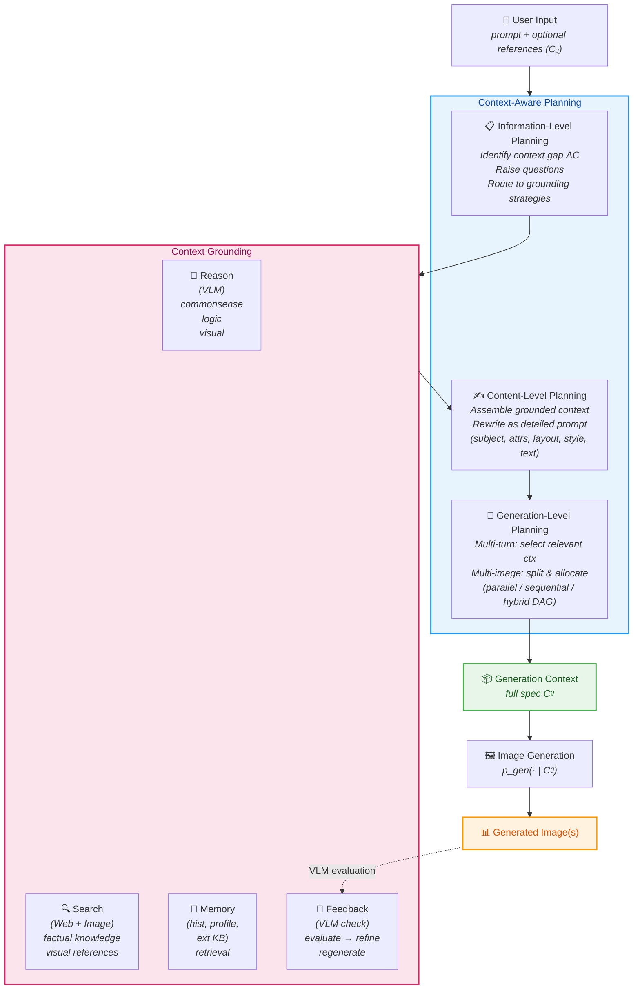

# Breakdown — Qwen-Image-Agent: Bridging the Context Gap in Real-World Image Generation

> **Paper:** Qwen-Image-Agent: Bridging the Context Gap in Real-World Image Generation
> **Authors:** Zekai Zhang, Jiahao Li, Jie Zhang, Kaiyuan Gao, Kun Yan, Lihan Jiang, Ningyuan Tang, Shengming Yin, Tianhe Wu, Xiaoyue Chen, Xiao Xu, Yan Shu, Yanran Zhang, Yixian Xu, Yuxiang Chen, Zhendong Wang, Zihao Liu, Zikai Zhou, Huishuai Zhang, Dongyan Zhao, Chenfei Wu
> **Year:** 2026 (arXiv:2606.26907, v2, Jun 2026)
> **ArXiv:** https://arxiv.org/abs/2606.26907
> **Code (official):** None released
> **Type:** Agentic framework + benchmark (training-free wrapper system).

---

## 1. Problem & Motivation

**Problem.** Text-to-image (T2I) models are trained on fully-specified prompts but real-world requests are underspecified, implicit, or depend on up-to-date knowledge. The user says "make me a scoreboard for the 2026 NBA Finals" — but which teams? What logos? What score? The T2I model has no way to answer these questions on its own.

**Why important.** As image generation moves into marketing, product design, and slide creation, people don't write pixel-perfect prompts. They write vague requests and expect the system to figure out the rest. Current models just fail silently or hallucinate plausible-looking garbage.

**Prior-work limitations:**
1. Existing agentic approaches (plan, reason, search, memory, feedback) are **fragmented** — each paper adds one piece, no unified framework.
2. Existing benchmarks only evaluate rendering quality or isolated knowledge/reasoning — they don't assess the full spectrum of agentic capabilities (planning, memory are largely ignored).

---

## 2. The Context Gap — Formalization

The central contribution is naming and formalizing the **Context Gap**: the mismatch between what the user provides and what the T2I model needs.

### 2.1 Definitions

Let $\mathcal{C}_u = (\text{prompt}_u, \mathcal{R}_u)$ denote the **user context** — the raw prompt plus any optional reference materials (images, documents). Let $\mathcal{C}_g$ denote the **generation context** — the full specification required by the T2I model (subject, attributes, layout, style, text content, spatial relations, etc.).

The **context gap** is defined as:

$$
\Delta\mathcal{C} \;=\; \mathcal{C}_g \;\setminus\; \mathcal{C}_u
$$

In direct generation, $\Delta\mathcal{C} \neq \emptyset$ is left unfilled — the model hallucinates or silently omits missing elements. The agentic approach seeks to **bridge this gap** by constructing $\mathcal{C}_g$ from $\mathcal{C}_u$ before rendering.

### 2.2 Direct vs. Agentic Generation

**Direct generation** — the model receives user context as-is and renders immediately:

$$
y \;\sim\; p_{\text{gen}}\!\left(\cdot \mid \mathcal{C}_u\right)
$$

**Agentic generation** — an agent constructs the full generation context along a trajectory $\tau$, then renders:

$$
p_{\text{agent}}(y \mid \mathcal{C}_u) \;=\; \sum_{\tau} p(\tau \mid \mathcal{C}_u) \;\cdot\; p_{\text{gen}}\!\left(y \mid \mathcal{C}_g = \mathcal{C}(\tau)\right)
$$

where:

- $\tau = \{(s_t, a_t, o_t)\}_{t=1}^{T}$ is the **agent trajectory** — a sequence of states, actions, and observations over $T$ steps.
- $\mathcal{C}(\tau)$ is the **final generation context** derived from executing the trajectory.
- Actions $a_t \in \{\text{plan}, \text{reason}, \text{search}, \text{rewrite}, \text{evaluate}\}$ correspond to pipeline operations.

### 2.3 Agent State

At each step $t$ the agent maintains state:

$$
s_t = \left(\mathcal{C}_t,\; \mathcal{O}_{t-1}\right)
$$

where $\mathcal{C}_t$ is the **context under construction** (accumulating grounded information) and $\mathcal{O}_{t-1} = \{o_1, \ldots, o_{t-1}\}$ is the **observation history** (results from reasoning, search results, memory retrieval, feedback evaluations).

The trajectory evolves as $s_{t+1} = \text{step}(s_t, a_t, o_t)$, growing $\mathcal{C}_t$ until it sufficiently covers the context gap, at which point the generation action $a_T = \text{generate}$ fires.

---

## 3. Key Insight / Contribution

**Core idea (one sentence):** Treat user input as partial context and progressively construct the full generation context through a unified agentic pipeline with context-aware planning and context grounding.

**What is genuinely new:**
- The **Context Gap** as a named, formalized challenge — a conceptual lens for understanding why T2I models fail in practice.
- **Context-Aware Planning** at three levels (information, content, generation) that systematically manages what's missing and how to use it.
- **Context Grounding** from four sources (reason, search, memory, feedback) unified in one pipeline.
- **IA-Bench** — the first benchmark covering all four core agentic capabilities with fine-grained checklist evaluation.
- The system is **training-free** and **generator-agnostic** — works with any T2I backbone.

---

## 4. Method

### 4.1 Pipeline Overview

The pipeline flows top-to-bottom: user input enters **Context-Aware Planning** (three sequential levels), which invokes **Context Grounding** sources to fill the context gap, producing the full generation context handed to the T2I model. The feedback loop returns post-generation evaluations back into the grounding stage.

### 4.2 Context-Aware Planning (Three Levels)

| Level | Purpose | Operations | Output |
|-------|---------|------------|--------|
| **Information-level** | Identify the context gap $\Delta\mathcal{C}$ | Decompose user request → raise questions → classify each question (reason vs. search vs. memory) | A set of grounding tasks routed to appropriate strategies |
| **Content-level** | Assemble grounded info into a renderable prompt | Merge grounded answers → structured rewrite with subject, attributes, layout, style, text | Detailed generation prompt $\mathcal{C}_g$ |
| **Generation-level** | Handle multi-image / multi-turn scenarios | Analyze dependencies → build DAG → allocate context per image/turn | Execution plan (parallel, sequential, or hybrid) |

**Dependency patterns for multi-image generation:**

$$
\text{Parallel:}\quad \mathcal{C}_g^{(i)} \perp \mathcal{C}_g^{(j)} \;\;\forall\; i \neq j
$$

$$
\text{Sequential:}\quad \mathcal{C}_g^{(i)} \;\hookrightarrow\; \mathcal{C}_g^{(i+1)}
$$

$$
\text{Hybrid:}\quad \text{DAG with both independent and dependent nodes}
$$

### 4.3 Context Grounding (Four Sources)

**Grounding via Reason:**
Three subtypes — commonsense reasoning, logical reasoning, visual reasoning. For each question from information-level planning assigned to reasoning, a VLM infers the answer. Turns implicit requests into explicit context items. Example: "draw the CN Tower" → VLM infers $\{$landmark: CN Tower, city: Toronto, country: Canada$\}$.

**Grounding via Search:**
- *Factual knowledge:* extract keywords → web search (Google API, limit 5 results) → summarize via Jina API → concise answer
- *Visual references:* image search (Google API, limit 5 results) → VLM reranking → keep most relevant reference(s)
- Web pages processed via Jina API for extraction

The **reason/search boundary** is defined as:
- **Reason** handles *parametric knowledge* — facts the MLLM already encodes (commonsense, general world knowledge, spatial relations).
- **Search** handles *precise facts* (exact numbers, dates, names, scores) and *dynamic facts* (information that changes over time, e.g., stock prices, weather, current events).

This boundary is acknowledged as model-dependent — as MLLMs improve, more facts shift from "needs search" to "can reason about it."

**Grounding via Memory:**
- Conversation history incorporated as context
- User profiles extracted and maintained (identity, profession, preferred style)
- External KBs via multimodal retriever (text + visual items)

**Grounding via Feedback:**
Iterative self-correction loop:
1. After generation, construct a checklist of expected attributes $\{c_{ij}\}$
2. VLM evaluates each item: $VLM(I_{\text{gen}}, c_{ij}) \in \{0, 1\}$
3. Failed items → feedback context → refine prompt $\mathcal{C}'_g$ → regenerate
4. Max 3 feedback attempts on IA-Bench (disabled on WISE-Verified and MindBench)

### 4.4 Multi-turn Context Management

For multi-turn sessions, image tokens grow fast. The system uses **relevance-based context selection** rather than keeping all history:

$$
\mathcal{C}_t^{\text{multi-turn}} = \text{SelectRelevant}\!\left(\mathcal{C}_t, \mathcal{O}_{t-1}, \text{prompt}_t\right)
$$

This prunes aggressively to prevent context explosion while retaining information relevant to the current request.

---

## 5. IA-Bench — Benchmark Design

### 5.1 Coverage

IA-Bench is the first benchmark to cover **all four core agentic capabilities** for image generation:

| Category | Subtasks | # Instances | # Checklist Items | What It Tests |
|----------|----------|:-----------:|:-----------------:|---------------|
| **Plan** | Composition, Enumeration, Multi-Panel, Maze | — | — | Can the model decompose high-level goals into concrete visual arrangements? |
| **Reason** | Math, Science, Commonsense, Map, Geometry | — | — | Can the model infer latent constraints before rendering? |
| **Search** | Game, Movie, Anime, Celebrity (IP) + Stock, Weather (Info) | — | — | Can the model retrieve external world knowledge? |
| **Memory** | User Profile, Conversation History | — | — | Can the model preserve and leverage context across turns? |
| **Total** | **17 subtasks** | **730** | **1,801** | — |

### 5.2 Subtask Descriptions

**Plan:**
- *Composition:* Arrange multiple objects according to spatial/relational constraints (e.g., "A cat sitting on a table with a book to its left")
- *Enumeration:* Generate images containing specific counts of objects (e.g., "5 red apples on a plate")
- *Multi-Panel:* Create multi-panel layouts (e.g., comic strip with sequential narrative)
- *Maze:* Generate maze images with correct path connectivity

**Reason:**
- *Math:* Visualize mathematical concepts or numerical relationships
- *Science:* Render scientific diagrams, experiments, or phenomena
- *Commonsense:* Infer plausible visual scenes from commonsense knowledge
- *Map:* Generate geographically accurate spatial layouts
- *Geometry:* Create images respecting geometric constraints (angles, shapes, proportions)

**Search:**
- *IP (Game, Movie, Anime, Celebrity):* Generate images of specific intellectual property characters/real people requiring visual knowledge
- *Stock:* Create charts/visualizations of real stock data
- *Weather:* Generate weather visualizations requiring current meteorological data

**Memory:**
- *User Profile:* Maintain and apply user preferences (style, identity) across turns
- *Conversation History:* Use information from prior turns to inform current generation

### 5.3 Evaluation Protocol

Checklists are constructed via a two-stage process:
1. LLM generates candidate checklist items per instance
2. Human annotators refine and validate

Actual evaluation is automated via VLM judges.

**Pass Rate (PR)** — strict all-or-nothing:

$$
\text{PR} = \frac{1}{N} \sum_{i=1}^{N} \prod_{j=1}^{K_i} \text{VLM}\!\left(I_{\text{gen}}^{(i)},\; c_{ij}\right)
$$

An instance passes only if **every** checklist item is satisfied. $\text{VLM}(\cdot) \in \{0, 1\}$.

**Checklist Accuracy (CA)** — average proportion satisfied:

$$
\text{CA} = \frac{1}{N} \sum_{i=1}^{N} \frac{1}{K_i} \sum_{j=1}^{K_i} \text{VLM}\!\left(I_{\text{gen}}^{(i)},\; c_{ij}\right)
$$

Where $N$ is the number of test instances, $K_i$ is the number of checklist items for instance $i$, and $c_{ij}$ is the $j$-th checklist item for instance $i$.

**IA-Score** — weighted composite:

$$
\boxed{\text{IA-score} \;=\; 0.3 \times \text{Plan}_{\text{PR}} \;+\; 0.3 \times \text{Reason}_{\text{PR}} \;+\; 0.3 \times \text{Search}_{\text{PR}} \;+\; 0.1 \times \text{Memory}_{\text{PR}}}
$$

Memory is down-weighted (0.1 vs 0.3) because it has fewer subtasks and instances, but it remains essential as a capability dimension.

---

## 6. Evaluation Setup

### Three Benchmarks

| Benchmark | What It Tests | Scale |
|-----------|--------------|-------|
| **IA-Bench** (theirs) | Plan, Reason, Search, Memory — full agentic spectrum | 17 subtasks, 730 instances, 1801 checklist items |
| **WISE-Verified** | World knowledge + semantic understanding | 6 domains: Culture, Time, Space, Biology, Physics, Chemistry |
| **MindBench** | Dynamic external knowledge + multi-step reasoning | 9 subtasks: SE, Wth MC, IP, WK, SL, Poem, LifeR, GU, Math |

### Baselines Compared

| Category | Models |
|----------|--------|
| **Closed-source T2I (direct)** | GPT-Image-1.5, Nano Banana, Nano Banana Pro, Seedream-5.0-Lite, Qwen-Image-2.0 |
| **Open-source T2I (direct)** | SD-3.5-medium/large, FLUX.2-dev, Bagel, Bagel w/CoT, Echo-4o, Echo-4o w/CoT, Qwen-Image v1 |
| **Agentic systems** | GenSearcher, GEMS, MindBrush, SCOPE, Qwen-Image-Agent |

All agentic baselines are evaluated with the **same backbone** (GPT-5.5-0424 as MLLM + Qwen-Image-2.0 as generator) for fair comparison. The only variable is the agentic framework itself.

---

## 7. Results

### 7.1 IA-Bench (Table 1) — Full Agentic Comparison

| Model | Type | IA-score | Plan PR | Reason PR | Search PR | Memory PR |
|-------|------|:--------:|:-------:|:---------:|:---------:|:---------:|
| **Qwen-Image-Agent** | **Agentic** | **45.4** | **45.3** | **43.7** | **46.1** | **49.0** |
| SCOPE | Agentic | 30.9 | 30.0 | 23.3 | 35.6 | 9.0 |
| MindBrush | Agentic | 30.2 | 32.7 | 18.3 | 28.0 | 13.0 |
| GenSearcher | Agentic | 24.9 | 20.3 | 24.4 | 24.4 | 11.0 |
| GEMS | Agentic | 17.3 | 9.3 | 41.3 | 46.7 | 17.3 |
| Qwen-Image-2.0 | Direct | 17.4 | 6.7 | 42.2 | 21.1 | 11.0 |
| Nano Banana Pro | Direct | 38.0 | 20.0 | 32.7 | 46.0 | 20.0 |
| GPT-Image-1.5 | Direct | 23.3 | 5.3 | 47.8 | 15.0 | 17.7 |

> **Key takeaways:**
> - Qwen-Image-Agent achieves the highest IA-score (**45.4**) and leads on every individual dimension.
> - The gap is largest on **Memory** (49.0 vs. 9.0 for SCOPE, 13.0 for GenSearcher) — none of the other agentic systems have an explicit memory module.
> - Nano Banana Pro is surprisingly strong for a direct model (38.0 IA-score) — especially on Search (46.0) — suggesting its MLLM backbone has strong world knowledge.
> - GEMS and bare Qwen-Image-2.0 score well on Reason/Search but nearly zero on Plan — they lack explicit planning capability.
> - Adding the agentic framework to Qwen-Image-2.0 lifts IA-score from **17.4 → 45.4** (+161%), demonstrating the massive value of context construction.

### 7.2 WISE-Verified (Table 2) — World Knowledge

| Model | Overall | Culture | Time | Space | Biology | Physics | Chemistry |
|-------|:-------:|:-------:|:----:|:-----:|:-------:|:-------:|:---------:|
| **Qwen-Image-Agent** | **90.20** | — | — | — | — | — | — |
| Nano Banana Pro | 87.60 | — | — | — | — | — | — |
| GPT-Image-1.5 | 82.50 | — | — | — | — | — | — |
| Qwen-Image-2.0 | 79.54 | — | — | — | — | — | — |

> Qwen-Image-Agent achieves **90.20** overall, beating even strong closed-source systems. The improvement from bare Qwen-Image-2.0 (79.54) to Qwen-Image-Agent (90.20) shows the agentic framework adds +10.7 points on world-knowledge-heavy generation tasks.

### 7.3 MindBench (Table 3) — Dynamic Knowledge & Reasoning

| Model | Overall | SE | Wth MC | IP | WK | SL | Poem | LifeR | GU | Math |
|-------|:-------:|:--:|:------:|:--:|:--:|:--:|:----:|:-----:|:--:|:----:|
| **Qwen-Image-Agent** | **82** | — | — | — | — | — | — | — | — | — |
| Nano Banana Pro | 68 | — | — | — | — | — | — | — | — | — |
| GPT-Image-1.5 | 62 | — | — | — | — | — | — | — | — | — |
| Qwen-Image-2.0 | 42 | — | — | — | — | — | — | — | — | — |

> MindBench tests dynamic knowledge that requires real-time retrieval. Qwen-Image-Agent at **82** vs bare Qwen-Image-2.0 at **42** — a near-doubling — confirms the search grounding module is critical for temporally-sensitive tasks.

### 7.4 Ablation Study (Table 4) — Component Contributions

| Variant | IA-score | Plan PR | Reason PR | Search PR | Memory PR | Δ IA-score |
|---------|:--------:|:-------:|:---------:|:---------:|:---------:|:----------:|
| **Full Qwen-Image-Agent** | **45.4** | **45.3** | **43.7** | **46.1** | **49.0** | — |
| w/o Reason | 35.1 | 24.7 | 29.7 | 46.1 | 49.0 | −10.3 |
| w/o Search | 34.3 | 45.3 | 44.3 | 7.8 | 49.0 | −11.1 |
| w/o Memory | 40.5 | 43.7 | 43.7 | 46.1 | 0.0 | −4.9 |
| w/o Feedback | 42.1 | 40.0 | 41.3 | 42.8 | 49.0 | −3.3 |
| MLLM → Qwen-Plus | 19.3 | 30.7 | 41.7 | 28.3 | 21.0 | −26.1 |
| Gen → Qwen-Image v1 | 24.7 | 40.0 | 19.4 | 27.8 | 31.1 | −20.7 |

**Component importance ranking (by IA-score drop):**

$$
\text{MLLM backbone}\;(-26.1) \;>\; \text{Image generator}\;(-20.7) \;>\; \text{Search}\;(-11.1) \;>\; \text{Reason}\;(-10.3) \;>\; \text{Memory}\;(-4.9) \;>\; \text{Feedback}\;(-3.3)
$$

**Detailed observations:**

| Removed | Primary Effect | Explanation |
|---------|---------------|-------------|
| **Search** | Search PR: 46.1 → **7.8** (−83%) | Catastrophic — search tasks literally cannot be solved without external retrieval. But Plan PR is *unaffected* (45.3), confirming clean module separation. |
| **Reason** | Plan PR: 45.3 → **24.7** (−45%), Reason PR: 43.7 → 29.7 | Reason removal hurts Plan more than Reason itself — implicit enumeration and composition decomposition *require* reasoning first. |
| **Memory** | Memory PR: 49.0 → **0.0** (−100%) | Clean ablation validation — Memory tasks are entirely dependent on the memory module. |
| **Feedback** | Smallest drop (−3.3) | Qwen-Image-2.0 is already a strong renderer; VLM feedback is generic and not task-specific. |
| **MLLM → Qwen-Plus** | Overall: 45.4 → **19.3** (−57%) | The planner's intelligence matters enormously — the MLLM does the heavy lifting of gap identification, routing, and prompt assembly. |
| **Gen → Qwen-Image v1** | Overall: 45.4 → **24.7** (−46%) | Renderer quality still matters for composition-heavy tasks where even a perfect prompt can't compensate for weak generation. |

---

## 8. Limitations

- **No code released.** The framework is described in detail but there's no implementation to inspect or reproduce. This is a significant gap for an agentic framework paper.
- **Proprietary backbone dependency.** The system uses GPT-5.5-0424 as MLLM and Qwen-Image-2.0 as generator — both closed. The ablation shows swapping to open alternatives causes massive drops (−57% for MLLM, −46% for generator). So the "SOTA" results are partly a backbone effect.
- **Latency and cost.** The full pipeline is substantially more expensive than one-shot generation. DAG execution helps with parallelism but can't eliminate sequential dependencies (planning → grounding → content assembly → generation → feedback).
- **Feedback gains are limited.** The weakest ablation signal (−3.3 IA-score) — partly because Qwen-Image-2.0 is already strong, partly because VLM feedback is generic. The authors suggest future work should move feedback *earlier* in the pipeline (supervising context-gap identification, not just post-hoc critique).
- **VLM-based evaluation.** IA-Bench uses VLM judges, which introduces evaluator-specific biases. Checklist construction involves LLM candidates refined by humans, but the actual evaluation is automated.
- **Training-free limitation.** Being training-free means the system can't improve the underlying generator — it can only work with what the renderer gives it. For tasks like counted composition or precise spatial relations, the renderer is the bottleneck.
- **Reason/search boundary is model-dependent.** The principled split (parametric vs. precise/dynamic facts) depends on the MLLM's knowledge boundary. As base models improve, this boundary shifts — the routing logic may need continuous recalibration.

---

## 9. Open Questions / Ideas

- **Open-source the framework.** The system is well-described but without code it's a black box. An open-source version with an open MLLM backbone would be much more impactful and would enable the community to build on the context-gap framing.
- **Adaptive feedback strength.** The feedback loop is weak partly because it's generic. Task-specific reward models or downstream metrics could unlock stronger test-time scaling. Moving feedback earlier (supervising gap identification) rather than applying it post-hoc is the most promising direction.
- **Context explosion at scale.** Their relevance-based selection helps, but with many turns the system still accumulates huge context. Caching and compression strategies for image tokens are an open problem — could approach use learned context compression or summarization?
- **Multi-image consistency.** The paper mentions parallel/sequential/hybrid patterns organized via DAG but the evaluation doesn't deeply stress cross-image coherence. A dedicated multi-image consistency benchmark would help.
- **The backbone effect question.** How much of the IA-score is framework design vs. backbone quality? A controlled study holding backbone constant while varying only the planning/grounding architecture would isolate the framework's contribution more precisely.
- **Cost-performance Pareto frontier.** The full pipeline with feedback is expensive. Where's the optimal stopping point? Can you get 80% of the IA-score improvement with only 20% of the compute by selectively applying grounding strategies?

---

## References

- Paper: https://arxiv.org/abs/2606.26907
- Writeup: [`writeup.md`](writeup.md)
- Notes: [`notes.md`](notes.md)
