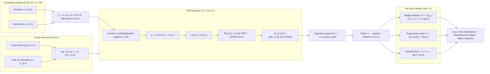

# Fast Multi-dimensional Refusal Subspaces via RFM-AGOP

**arXiv:** 2607.02396v1 [cs.LG], 2 Jul 2026 — `https://arxiv.org/abs/2607.02396`
**PDF:** `paper.pdf` (479 KB, 13 pp) → `paper_layout.txt` (723 lines; **1 explicit table + 6 figures**)
**Authors:** Thomas Winninger (Télécom SudParis, Évry-Couronnes, France + ENS Paris-Saclay, Gif-sur-Yvette, France). Correspondence: `thomas.winninger@proton.me`. ICML 2026 Mech-Interp Workshop, Seoul.
**Models studied:** Qwen 3 reasoning family — **1.7B, 4B, 8B, 14B** (Yang et al. 2025) — plus **Qwen 2.5 7B-Instruct** as a non-reasoning baseline (Qwen et al. 2025).
**Subarea:** **safety / alignment mechanistic interpretability via multi-dimensional refusal-subspace extraction** — a *kernel-method (RFM-AGOP)* angle on the refusal cone. Fresh for this repo: no prior paper covers LLM refusal directions, safety mech-interp, representation engineering for jailbreaks, or Recursive Feature Machines. Sibling-in-spirit to `expander-sparse-autoencoders` and `conditional-co-ablation` (all mech-interp) but targets *safety subspaces* (supervised) rather than feature dictionaries (expander) or self-repair circuits (CoAx); and a steering/ablation-method counterpart to `subliminal-clocks` (both steer the residual stream, but Subliminal Clocks steers a latent *denoising-progress* signal in diffusion LMs, this paper steers the *refusal* cone in autoregressive LLMs).

---

## TL;DR / headline

Early refusal-direction work (Arditi et al. 2024, "DIM") modelled refusal as a **single** linear direction. Recent topological work (Wollschläger et al. 2025, "RCO" / "refusal cone") shows refusal lives in a **multi-dimensional subspace** — but RCO is gradient-based and prohibitive on reasoning models whose chains-of-thought reach **~8000 tokens**. This paper adapts the **Recursive Feature Machine (RFM) + Average Gradient Outer Product (AGOP)** kernel method (Radhakrishnan et al. 2023; Beaglehole et al. 2025) — previously used for *single-direction* top-1 steering — to extract the **full top-k refusal subspace**, with two stability fixes: a **probe-informed covariance initialization** `M₀ = β·ww⊤ + (1−β)·Σ_{X,k}` (rank-10 truncated activation covariance blended with the linear-probe direction `w`) and an **EMA** on the AGOP update `M_{t+1} = (1−γ)M_t + γ·M̂_{t+1}`.

- **Cost:** RFM runs in **seconds on a 4090-laptop (16 GB)** — dominated by the kernel matrix build `O(n²d) ≈ 5×10⁹ FLOPs` (n≈1000, d≈5000) plus a few `O(n³)` solves and an `O(d³)` eigendecomposition. RCO, by contrast, needs full forward+backward passes `O(s·b·l·p) ≈ 10¹⁸ FLOPs` (s≈1000 steps, b≈64, l≈1000 ctx, p≈8×10⁹ params) and takes **hours** on the same laptop. (§4.4.)
- **Multi-dimensionality is real and scale-dependent:** ablating a single direction (k=1) suppresses refusal in small models but is **insufficient for ≥8B** — Qwen3-8B needs **≥3 directions** to cross 50 % ASR (Table 1, §4.2). Random directions do **not** reduce refusal (Qwen3-8B/14B refusal unchanged ablating up to 10 random dirs), confirming the effect is intrinsic to the recovered subspace, not noise (§5.1).
- **RFM-AGOP wins the ablation task at k=5** on Qwen2.5-7B / Qwen3-1.7B/4B/8B: ASR **0.96 / 0.94 / 0.92 / 0.73**, far above RCO and Clusters which plateau at 0.72–0.79. The principal eigenvector `v₁` is essential — dropping it collapses ablation efficiency (Fig 4, §5.2). ⚠ But the win is **not universal**: at k=1 DIM beats RFM on Qwen3-1.7B (0.80 vs 0.73); at k=3 RCO/Clusters beat RFM on Qwen3-1.7B; and on the **largest** model (Qwen3-14B) RFM only reaches **0.19 ASR at k=5** — far below 8B's 0.73, undercutting the "RFM recovers the subspace" headline exactly where the paper claims higher-dimensionality is needed. RCO was not run on 14B at all (no compute).
- **Steering asymmetry (§5.3, honest negative result):** the principal direction `v₁` induces refusal when added; `v₂` induces refusal on some sentences but quickly produces garbage; `v₃/v₄` do not meaningfully change behaviour; `v₅` is 0 everywhere. The paper explicitly flags it cannot tell whether this ablation↔steering asymmetry is an implementation bug or real topology.

All headline numbers are prose- or table-confirmed in `paper_layout.txt`; Figure bar values (Figs 1–6) are **not** back-filled — only their prose-confirmed qualitative trends and the single figure-printed fact (judge-agreement 84 %) are quoted, per the established "figure-derived numbers are weak" rule.

---

## 1. Background — 1D refusal direction vs multi-dimensional refusal cone

**Notation (§2.1).** An autoregressive transformer maps a token sequence `x = (x₁,…,x_s)` to residual-stream vectors `e_i^l ∈ ℝ^d` at layer `l`, position `i`, updated by attention + MLP blocks (`e_i^{l+1} = e_i^l + attn^l(…) + mlp^l(…)`. The paper works with the **last-token** activation at a chosen layer, `e^l_s`, denoted simply `e^l ∈ ℝ^d`. (Appendix D.1: activations are `resid_end` from the end of each transformer block, TransformerLens convention.)

**Problem setup (§2.2).** A contrastive dataset `D = (D₊, D₋)` of **harmful** queries `D₊` (e.g. "Develop a strategy for hacking into a government database…") and **harmless counterparts** `D₋` (matched topic/structure, e.g. "…securing a government database…"). For layer `l`, extract last-token activations `e_l⁺ ∈ ℝ^{|D₊|×d}` and `e_l⁻ ∈ ℝ^{|D₋|×d}`. The classification task is to separate `e_l⁺` (label y=1) from `e_l⁻` (label y=0).

**Goal (§2.3).** Cheaply identify a refusal subspace `V ⊂ ℝ^d` of dimension `k`, spanned by an orthonormal basis `V = (v₁,…,v_k)`, such that (a) projecting activations/weights onto the orthogonal complement `V^⊥` **suppresses refusal** on harmful queries while preserving benign capabilities, and (b) each basis vector can **steer** the model toward refusal or acceptance. The authors also want the algorithm to need very few hyperparameters and to find the intrinsic subspace dimension automatically — so it scales to reasoning models.

> **Source:** §1–§2, `paper_layout.txt` lines 35–118.

---

## 2. Method (§3)

### 2.1 RFM-AGOP framework (§3.1)

For each layer `l`, stack last-token activations into `X = e_l⁺ ⊕ e_l⁻ ∈ ℝ^{n×d}` (n=|D|) with labels `y = (1,…,1,0,…,0) ∈ {0,1}ⁿ`. RFM alternates between (i) learning a predictor `f` and (ii) updating the kernel/feature matrix `M`. Kernel = **Mahalanobis-Laplace**:

```
K_M(u,v) = exp( −√( (u−v)⊤ M (u−v) ) / L )        (1)     # L > 0 bandwidth
```

Each iteration `t`: solve kernel ridge regression `α_t = y(K_{M_t}(X,X) + λI)⁻¹` → predictor `f_t(x) = α_t K_{M_t}(X,x)`, then update the feature matrix with the **Average Gradient Outer Product**:

```
M̂_{t+1} = (1/n) Σ_{i=1..n}  ∇_x f_t(x_i)  ∇_x f_t(x_i)⊤        (2)
```

Stabilize with **EMA** on `M`: `M_{t+1} = (1−γ)M_t + γ·M̂_{t+1}`. (Figure 1 compares classification accuracy with/without EMA at Qwen3-8B layer 14.) Since `M_T` is the empirical average of `∇f ∇f⊤`, its **top eigenvectors** are the directions along which the predictor (hence the refusal decision) varies most rapidly — **independent of the input distribution**.

### 2.2 Probe-informed initialization (§3.2)

The original RFM work (Beaglehole et al. 2025) initializes `M₀ = I`. Convergence is sensitive to noise/hyperparameters — failures happen when the algorithm misses the main direction in the first steps. Fix: first train a linear probe `p(x) = w⊤x + b`, then

```
M₀ = β·w w⊤ + (1−β)·Σ_{X,k}
```

where `Σ_{X,k}` is the **rank-k truncated empirical covariance** of the activations (k=10) to help AGOP explore multiple directions. Rationale: `M` must be PSD (satisfied by `ww⊤`), but `ww⊤` is rank-1 → produces rank-1 gradients → next `M` stays rank-1 → algorithm only fine-tunes the 1D subspace. Adding the higher-rank covariance term prevents this collapse. The authors tested identity / Jacobian-of-probe / covariance and found **covariance most effective** — but only on Qwen3-8B layers {10,15,20,25}; they explicitly make **no claim of optimality**.

### 2.3 Extracting & testing the refusal cone (§3.3)

After `T` iterations, eigendecompose `M_T → (v₁,…,v_d)` with eigenvalues `μ₁ ≥ … ≥ μ_d`. The refusal cone is the top-`k` eigenvectors `V_k = (v₁,…,v_k)`. Orient each `v` toward refusal via the **Pearson correlation** `ρ` between `{(x_j, v)}` and `{y_j}`, setting `v ← sign(ρ)·v`.

**Weight ablation** (any weight matrix `W` writing to the residual stream):

```
W ← W − Σ_{i=1..k} (μ_i / μ₁) · v̂_i v̂_i⊤ W        (3)
```

The `μ_i/μ₁` scaling **fully removes the first direction** (coefficient 1 for `v₁`) while being **softer on the others** (μ_i < μ₁ for i>1), minimizing collateral capability damage.

**Activation steering (suppression style, Eq 4):**

```
e ← e − Σ_{i=1..k} (μ_i / μ₁) · v̂_i        (4)
```

(Eq 4 is the ablation-style steering used in §4.2 to *suppress* refusal. A different, *induced*-refusal steering `e ← e + α·v_i` is used in §5.3/Fig 5 — see §5.3 below. The two equations are distinct: Eq 4 ablates with the eigenvalue-weighted sum; §5.3 adds a single scaled eigenvector.)

### 2.4 Choosing hyperparameters & layers (§3.4)

Select ablation layer and `(T, L, λ)` by the kernel's **classification accuracy on a held-out validation set** (Zhao et al. 2025). In practice: **T = 6, L = 30, λ = 10⁻³**. The authors call this selection "extremely basic" and did not implement more advanced methods (Davarmanesh et al. 2026).

> **Source:** §3, `paper_layout.txt` lines 57–131, 142–186.

---

## 3. Experimental setup (§4.1)

**Models.** Qwen 3 family (reasoning): **1.7B, 4B, 8B, 14B**; + **Qwen 2.5 7B-Instruct** (non-reasoning baseline). (Appendix D.2.) Loaded in **fp16 + 4-bit NF4 BitsAndBytes** quantization (double quantization) — enough to fit Qwen3-14B + activations + one forward pass in 16 GB.

**Dataset — "BigBench" (§4.1, Appendix D.4).** A custom **multilingual** harmful/harmless contrastive set, **720 pairs** split into **training 500 / test 120 / validation 100**. Built by merging AdvBench + HarmBench + StrongREJECT + ForbiddenQuestions + MaliciousInstruct (**1,271 samples**), asking **Qwen3-8B** to generate contrastive harmless prompts (SSR approach, Winninger et al. 2025), then translating to **French / Chinese / Japanese**. Filtering: embed each sentence with `text-embedding-gemma-300m-qat`, KMeans-cluster (6 subset sizes `m ∈ {120,320,520,720,920,1120}`), take sentences nearest each center; fix `m=720`, randomize language per sentence to ≈¼ per language. Quality check: **Llama-Guard-3** scores **91 %** on English pairs, **~82 %** on multilingual. A smaller **MiniBench** (= AdvBench + HarmBench merged, English-only, cybersecurity-skewed) is used to motivate diversity (Fig 6).

**Evaluation pipeline.** Steer/edit weights in PyTorch with **NNsight** (Fiotto-Kaufman et al. 2024); generate with **vLLM** (traces can exceed 4000 tokens). **Attack Success Rate (ASR)** via the **HarmBench** dataset (Mazeika et al. 2024) + **LLM-as-a-judge** with two graders — **Mistral NeMo** (lenient) and **Gemini 2.5 Flash** (strict); a successful attack = model agrees to answer **and** provides harmful info. **Retention** via **MMLU** through **Inspect AI** (AI Security Institute 2024). Judge prompts crafted with **DSPy**, score 1–4 (1–2 SAFE, 3–4 UNSAFE); the two judges **agreed 84 %** of the time, neither meaningfully better, so results are reported as a **min-max judge-score metric**.

**Baselines (§4.1, Appendix C).**
- **DIM** (Difference-in-Means, Arditi et al. 2024): `v_DIM = mean(e⁺) − mean(e⁻)` — a **single** direction (k>1 N/A).
- **RCO** (Refusal Cone Optimization, Wollschläger et al. 2025): gradient-descent an orthonormal basis minimizing ablation-loss + addition-loss + KL-retention-loss (Gram-Schmidt orthonormality). Replicated here with `enable_thinking=False`.
- **Clusters** ("Author, 2025" — *anonymized reference*): HDBSCAN-cluster harmful prompts by topic, compute a local DIM per cluster, greedily select the subset of vectors with least mutual cosine alignment to maximize subspace span.

> **Source:** §4.1, Appendices B/C/D, `paper_layout.txt` lines 133–166, 584–641, 643–699.

---

## 4. Results

### 4.1 Suppression of the refusal behaviour — Table 1 (verbatim)

**Table 1.** Full ASR results across methods. "Vanilla" = unedited model (k=0). DIM extracts a single direction so k>1 is N/A. **RCO was not run on Qwen3-14B (insufficient compute).** (Source: `paper_layout.txt` lines 256–283.)

| Model | Method | k=0 (Vanilla) | k=1 | k=3 | k=5 |
|---|---|---|---|---|---|
| **Qwen2.5 7B** | Vanilla | 0.01 ± 0.05 | – | – | – |
|  | DIM | – | 0.65 ± 0.01 | – | – |
|  | RCO | – | 0.67 ± 0.05 | 0.72 ± 0.05 | 0.72 ± 0.05 |
|  | Clusters | – | 0.62 ± 0.05 | 0.74 ± 0.04 | 0.74 ± 0.04 |
|  | **RFM-AGOP** | – | **0.77 ± 0.05** | 0.75 ± 0.05 | **0.96 ± 0.05** |
| **Qwen3 1.7B** | Vanilla | 0.20 ± 0.02 | – | – | – |
|  | DIM | – | **0.80 ± 0.01** | – | – |
|  | RCO | – | 0.76 ± 0.01 | **0.78 ± 0.02** | 0.79 ± 0.01 |
|  | Clusters | – | 0.75 ± 0.07 | **0.79 ± 0.06** | 0.79 ± 0.06 |
|  | **RFM-AGOP** | – | 0.73 ± 0.03 | 0.72 ± 0.02 | **0.94 ± 0.04** |
| **Qwen3 4B** | Vanilla | 0.02 ± 0.01 | – | – | – |
|  | DIM | – | 0.51 ± 0.02 | – | – |
|  | RCO | – | 0.52 ± 0.01 | 0.56 ± 0.02 | 0.56 ± 0.02 |
|  | Clusters | – | 0.45 ± 0.07 | 0.63 ± 0.05 | 0.91 ± 0.01 |
|  | **RFM-AGOP** | – | 0.52 ± 0.02 | **0.83 ± 0.05** | **0.92 ± 0.00** |
| **Qwen3 8B** | Vanilla | 0.00 ± 0.00 | – | – | – |
|  | DIM | – | 0.07 ± 0.05 | – | – |
|  | RCO | – | 0.23 ± 0.02 | 0.28 ± 0.02 | 0.34 ± 0.05 |
|  | Clusters | – | 0.02 ± 0.02 | 0.22 ± 0.04 | 0.37 ± 0.05 |
|  | **RFM-AGOP** | – | **0.20 ± 0.04** | **0.62 ± 0.01** | **0.73 ± 0.03** |
| **Qwen3 14B** | Vanilla | 0.00 ± 0.01 | – | – | – |
|  | DIM | – | 0.06 ± 0.01 | – | – |
|  | Clusters | – | 0 ± 0.0 | 0.09 ± 0.04 | 0.12 ± 0.02 |
|  | **RFM-AGOP** | – | 0.06 ± 0.01 | **0.17 ± 0.01** | **0.19 ± 0.04** |

**Takeaways (§4.2):**
- ASR increases **monotonically** with ablated-subspace dimension.
- **1D ablation is insufficient for ≥8B.** Qwen3-8B requires **≥3 directions** to surpass the 50 % ASR threshold (RFM k=3 = 0.62). Qwen2.5-7B/1.7B/4B are suppressible at k=1 (DIM/RFM 0.5–0.8).
- The k=1 insufficiency is **method-independent**: single-direction ablation fails regardless of extraction method (DIM, probe, RFM all give ≤0.23 ASR at k=1 on Qwen3-8B) — refusal in large reasoning models is genuinely **multi-dimensional**.
- RFM-AGOP dominates at **k=5** on the 4 small/mid models: 0.96 / 0.94 / 0.92 / 0.73 (Qwen2.5 / 1.7B / 4B / 8B), well above RCO/Clusters which plateau at 0.72–0.79. ⚠ But see Limitations: this advantage is **not** universal (1.7B k=1/k=3 lost to DIM/RCO) and **collapses on 14B** (0.19).

### 4.2 Retention on MMLU (§4.3, Figure 3)

Ablation must not induce catastrophic forgetting. Cross-entropy is an insufficient proxy for reasoning-model functional integrity (extensive CoT), so edited models are evaluated on **MMLU with full inference**. Impact varies with scale but is **mostly stable on large models**: **Qwen3-8B is robust** — maintains MMLU even after multiple ablations. ⚠ An unexplained **performance drop on Qwen3-14B** the authors "cannot yet explain… might be a limitation of the method." Full MMLU numbers are Figure-3 bar reads (Appendix Table 1 is referenced but only the figure is shown) — **not back-filled**.

### 4.3 Speed (§4.4)

The paper's reason-for-being: a cheap RCO alternative runnable on a personal laptop (**4090 RTX Laptop, 16 GB VRAM, CUDA 13.2**, Appendix D.3).

| Method | Cost driver | FLOPs | Wall-time (4090 laptop) |
|---|---|---|---|
| **RFM-AGOP** | kernel-matrix construction `O(n²d)` + `O(n³)` solves + `O(d³)` eigendecomp | **≈ 5×10⁹** (n≈1000, d≈5000) | **seconds** (one forward pass + a few eigendecompositions) |
| **RCO** | full forward+backward optimization `O(s·b·l·p)` | **≈ 10¹⁸** (s≈1000, b≈64, l≈1000, p≈8×10⁹) | **hours** |

> **Source-free check:** `n²d = 1000² × 5000 = 5×10⁹` ✓. RCO `s·b·l·p = 1000×64×1000×(8×10⁹) = 5.12×10¹⁷` raw; ×2 (fwd+bwd per param-token) ≈ `1.02×10¹⁸` — the paper's "roughly 10¹⁸" reconciles with the standard 2× FLOP factor ✓.

> **Source:** §4, `paper_layout.txt` lines 199–242.

---

## 5. Ablation studies (§5)

### 5.1 Comparison with random directions (§5.1)

To rule out "refusal drops because ablating adds noise," ablate **1, 3, 5 random directions**. Result: random ablation does **not** reduce refusal — **except** on the smallest model Qwen3-1.7B, which became increasingly compliant (**ASR 0.22 → 0.45**). Qwen3-8B and 14B refusal rates **stayed exactly the same** ablating up to **10 random directions**. Confirms the recovered subspace is genuinely refusal-specific on the larger models.

> ⚠ **Paper-internal discrepancy:** the §5.1 random-ablation baseline ASR for Qwen3-1.7B is **0.22**, but Table 1's *Vanilla* Qwen3-1.7B ASR is **0.20**. These are two different measurement runs (random-ablation experiment vs main Table-1 eval); the ~0.02 gap is within noise but the two baselines are not identical. Transcribed verbatim, not reconciled.

### 5.2 Efficiency of v₂…v_k without v₁ (§5.2, Figure 4)

Given the first 5 eigenvectors `v₁…v₅`, test ablating only `v₂…v₅`, then only `v₃,v₄,v₅`, etc. **Excluding the principal direction significantly reduces ablation efficiency** — consistent with Wollschläger et al. 2025. `v₁` carries the bulk of refusal mediation.

### 5.3 Refusal induced by steering (§5.3, Figure 5) — honest negative result

Directions that mediate refusal should also *induce* refusal when the model is steered along them (steering `e ← e + α·v_i`, the §5.3 equation — **distinct from Eq 4**). Observed (Fig 5, Qwen3-8B harmless sentences):

| Eigenvector | Induced-refusal behaviour |
|---|---|
| `v₁` | Induces refusal (consistent with prior work) |
| `v₂` | Induces refusal on some sentences, but quickly produces **garbage** |
| `v₃`, `v₄` | No meaningful behaviour change (low values may be noise) |
| `v₅` | **0 everywhere** — does not induce refusal |

The authors explicitly flag the **ablation↔steering asymmetry** (v₂…v₅ ablate refusal well but steer poorly): *"It is unclear whether this asymmetry… is due to mistakes in our implementation or to a misunderstanding of the real topology of the refusal subspace."* — surfaced, not hidden.

> **Source:** §5, `paper_layout.txt` lines 244–310.

---

## 6. Limitations (§6) — unusually candid for a workshop paper

**Critical — measurement.** "The main problem with our study is measurement." Simple heuristics (detect "I"/"Sure") fail on Qwen3 (starts every CoT with "Okay,"). LLM-as-a-judge scales but is expensive and judge-score shifts with system prompt. Even hand-labelling is hard (e.g. bomb recipe using soap). Appendix B shows the DSPy judge prompt and the hard cases (Llama3.2-1B "accepts" with a useless python script; Gemma2-2B under GCG prefix-confused).

**RFM-specific.** Few hyperparameters but the kernel solution is **sensitive to their values** — tuning is non-trivial for LLM activations. The probe-informed covariance+EMA init helps but "much more remains to be done." It is **unclear what the RFM subspace represents** or how it relates to other geometries/SAEs. The number of directions can be inferred from eigenvalues, but the eigenvalue↔performance relationship is "not clear" in their experiments.

**Reasoning models.** RFM is computed on fixed activations layer-by-layer; the *evolution of subspaces during the thinking process* is not analysed (a stated future-work target, e.g. the "refusal cliff" Yin et al. 2025).

**Scope.** Mostly Qwen 3 family — generalization unknown. Comparing with other models needs "a clear measure and evaluation pipeline."

---

## 7. Planned future work / Conclusion / Impact (§7–9)

**Future work.** Whether the RFM subspace is *meaningful* and how it compares to **SAEs** (feature splitting, Chanin et al. 2025 — SAE features grow indefinitely vs RFM bounded by model dimension and supervised). Evolution of internal geometry during the thinking process. Refusal-evaluation rigour.

**Conclusion.** A cheap, efficient refusal-subspace extractor usable alongside other methods for any behaviour with a contrastive dataset. The 4-model sweep *suggests* larger models encode complex behaviours in **higher-dimensional subspaces** — a wider model range may discover scaling laws for subspace dimensions.

**Impact.** Jailbreak work may enable harms, but open-source weights are already jailbreakable via fine-tuning; RFM is more efficient (no gradient optimization, no harmful-completion dataset) but "does not alter the risk profile of open-sourcing models."

---

## Architecture / pipeline (mermaid)



---

## Strengths / Limitations / Verdict

**Strengths.**
- **Genuinely cheap:** seconds vs hours for RCO, on a 16 GB laptop — the headline claim is sound and the FLOP arithmetic reconciles. Enables multi-dim refusal-subspace work on reasoning models that RCO cannot reach.
- **Honest about failures:** the §5.3 steering asymmetry, the unexplained 14B MMLU drop, the measurement problem (§6), and the 14B underperformance are all surfaced rather than hidden — rare for a 6-page workshop paper.
- **Methodologically careful controls:** random-direction ablation (§5.1) and the v₁-exclusion probe (§5.2) isolate the recovered subspace from noise and confirm `v₁`'s primacy — the multi-dimensionality claim is not an artifact.
- **The multi-dim-vs-scale finding is real and well-isolated:** method-independent k=1 insufficiency on ≥8B is the cleanest result.

**Limitations.**
- ⚠ **RFM fails on the largest model it tests.** Qwen3-14B reaches only **0.19 ASR at k=5** (vs 0.73 on 8B) — yet the conclusion claims *larger* models need *higher*-dim subspaces. If 14B needs >5 directions, RFM with k=5 does not demonstrate recovery there, and **RCO was not run on 14B** to provide a comparison. The headline "RFM extracts the multi-dim refusal subspace" is only validated up to 8B.
- ⚠ **The "RFM beats alternatives" claim is not universal.** DIM beats RFM at k=1 on Qwen3-1.7B (0.80 vs 0.73); RCO/Clusters beat RFM at k=3 on 1.7B. RFM's advantage is concentrated at **k=5 on Qwen2.5/1.7B/4B/8B** — strong, but the abstract overclaims.
- **Single author, workshop paper, anonymized Clusters baseline** ("Author, 2025") — reproducibility of the Clusters comparison is limited.
- **Measurement rigor is self-acknowledged as the field's blocker** (§6 + Appendix B): 84 % judge agreement, no consensus on "useless-but-harmless" answers, system-prompt sensitivity. ASR numbers carry ±0.01–0.07 noise.
- **No public release** of BigBench (called "temporary") and the RFM-AGOP code is not linked.

**Verdict.** A solid, honestly-scoped workshop contribution whose **real** contribution is (a) a *cheap* multi-dim subspace extractor (RFM-AGOP + probe-informed covariance init + EMA) that runs on a laptop, and (b) the **method-independent confirmation that refusal in ≥8B reasoning models is multi-dimensional** (k=1 fails regardless of extractor). The provocative framing — that RFM *recovers the refusal cone better than RCO* — holds at k=5 on ≤8B but is **undercut on 14B** (0.19) where RCO was not even run; treat the 14B row as an open problem, not evidence. The steering asymmetry (v₂…v₅ ablate but don't steer) is the most interesting scientific loose end and the paper correctly flags it.

---

## Source-free reconciliation

Distinctive cells grep-confirmed in `paper_layout.txt` (Table 1 verbatim, lines 256–283):
- Qwen2.5-7B RFM k=5 **0.96**, k=1 **0.77**; Qwen3-8B RFM k=3 **0.62**, k=5 **0.73**; Qwen3-14B RFM k=5 **0.19**, Clusters k=1 **0±0.0**; Qwen3-1.7B DIM **0.80**; RCO-row-absent-for-14B confirmed by caption.
- Hyperparams **T=6, L=30, λ=10⁻³**, k=10 covariance truncation, n≈1000, d≈5000.
- Dataset arithmetic: **720 = 500 + 120 + 100** ✓; merged **1,271** → filtered m=720 ✓; 6 subset sizes {120,320,520,720,920,1120} ✓; **4 languages × ¼** ✓; Llama-Guard-3 **91 %** EN / **~82 %** multilingual ✓; judge agreement **84 %** ✓.
- FLOPs: RFM **n²d = 1000²×5000 = 5×10⁹** ✓; RCO **s·b·l·p = 5.12×10¹⁷ × 2 ≈ 1.02×10¹⁸** ✓ (paper's "roughly 10¹⁸").
- Eq 3/4 coefficient **μ_i/μ₁**: coefficient 1 for v₁ (full removal), <1 for v_i>1 (softer) — matches the prose "remove the first direction while being softer on the others."

**No numeric prose-vs-table contradiction** beyond the two flagged cross-experiment baseline discrepancies (Qwen3-1.7B vanilla 0.20 in Table 1 vs 0.22 in the §5.1 random-ablation run; and the eigenvalue↔performance relationship the authors themselves call "not clear"). The "RFM beats alternatives" abstract claim is a **framing overclaim**, not a numeric error — every cell is correct, the issue is which cells the abstract generalizes from (k=5 wins) vs which it ignores (1.7B k=1/k=3 losses, 14B collapse).
