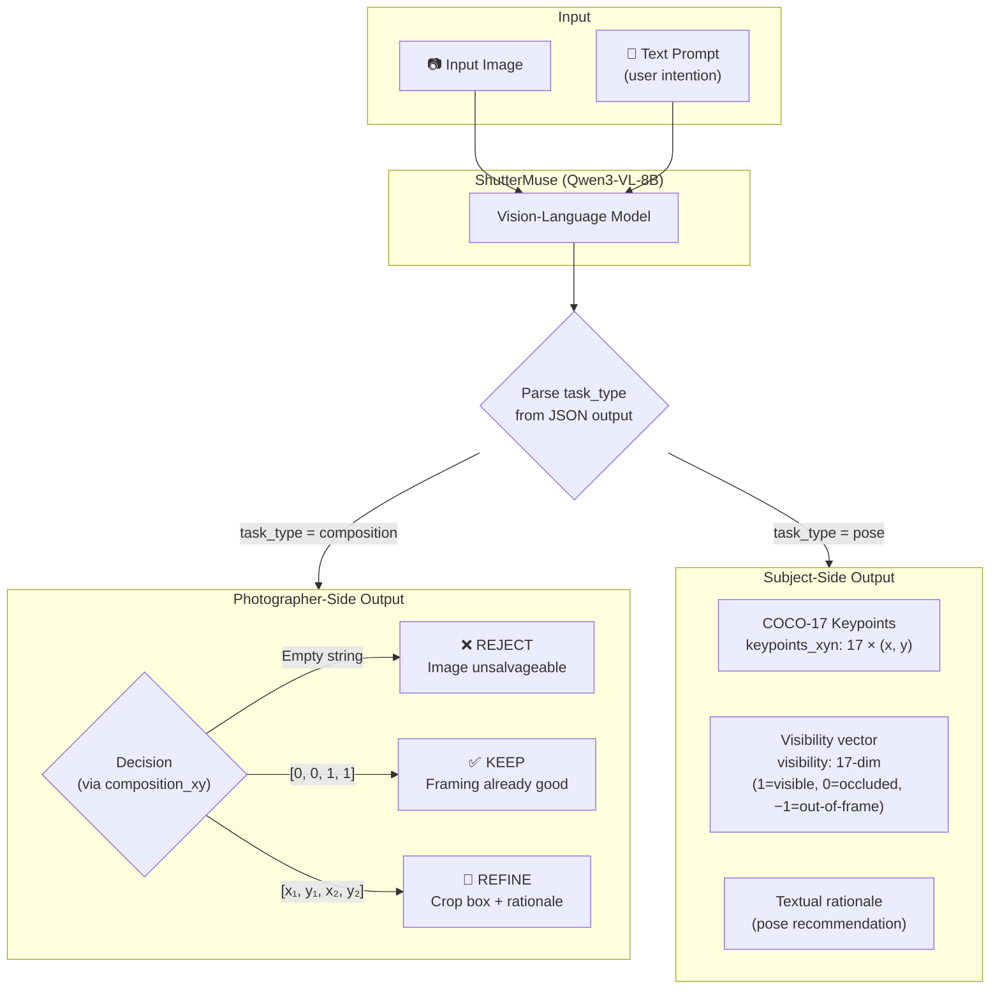
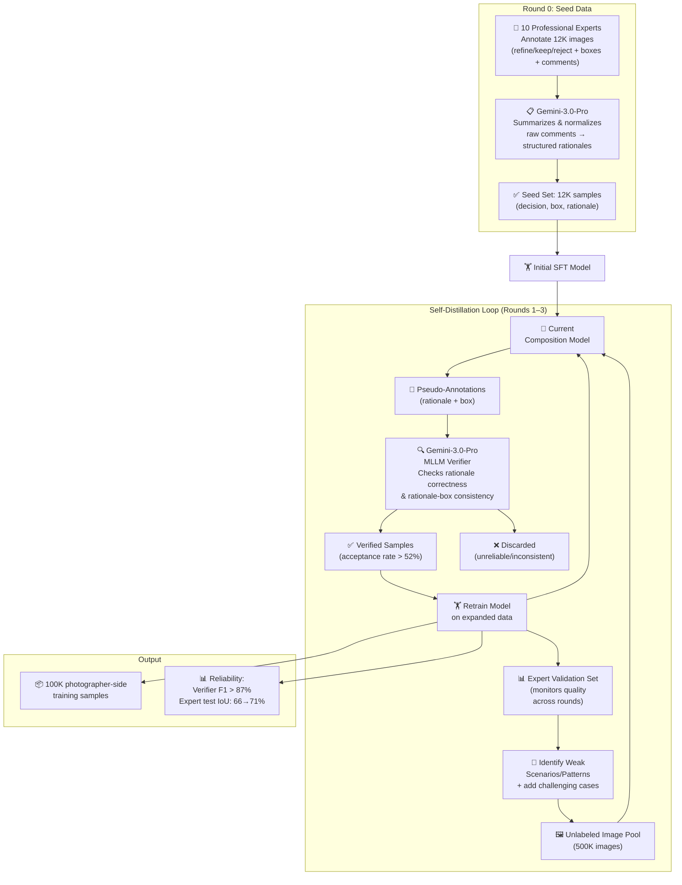
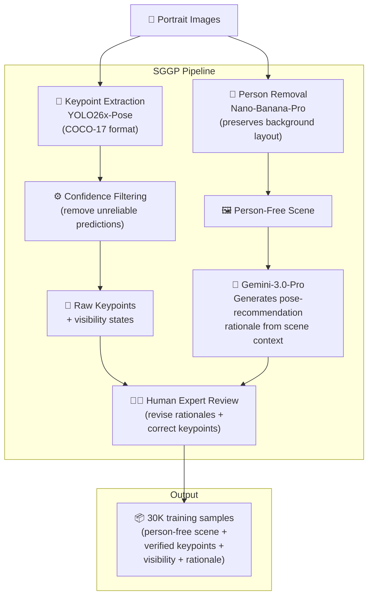

# Breakdown — ShutterMuse: Capture-Time Photography Guidance with MLLMs

> **Paper:** ShutterMuse: Capture-Time Photography Guidance with MLLMs
> **Authors:** Jiayu Li, Yixiao Fang*, Tianyu Hu, Wei Cheng, Ping Huang, Zheheng Fan, Gang Yu†, Xingjun Ma† (Fudan University, StepFun)
> **Year:** 2026 (arXiv:2606.25763, v1, Jun 2026)
> **ArXiv:** https://arxiv.org/abs/2606.25763
> **Code (official):** https://github.com/lijayuTnT/ShutterMuse
> **Project page:** https://lijayutnt.github.io/ShutterMuse/
> **Type:** Benchmark + dataset + model (capture-time photography guidance).

---

## 1. Problem & Motivation

**Problem.** Real-world photography needs guidance at capture time — both for the photographer (should I crop? keep? is this unsalvageable?) and for the subject (how should I pose here?). Existing aesthetic cropping benchmarks only evaluate post-hoc crop prediction and assume every image can be improved by cropping. They have no keep/reject mechanism and no subject-side guidance. So we don't know whether MLLMs can actually serve as real-time photography assistants.

**Why important.** A phone could tell you "move left and raise your right arm" before you press the shutter — that's a genuinely useful product feature. But you can't build it without knowing whether models can make the right three-way decision and generate actionable pose guidance. Current benchmarks give you no signal on either.

**Prior-work limitations:**
1. Aesthetic cropping benchmarks (FCDB, FLMS, SACD) all assume every image admits a preferable crop — no keep/reject.
2. Specialized cropping models (CACNet, InstructCrop, Venus) are trained only for refinement — they always crop, even when they shouldn't.
3. General MLLMs lack precise crop localization — they can talk about composition but can't output accurate bounding boxes.
4. No benchmark evaluates subject-side pose guidance grounded in a scene.

## 2. Key Insight / Contribution

**Core idea (one sentence):** Photography guidance at capture time is a three-way decision problem (refine/keep/reject) plus scene-conditioned pose recommendation, and MLLMs can do both within a unified framework trained with supervised + reinforcement fine-tuning.

**What is genuinely new:**
- **CaptureGuide-Bench** — first benchmark for capture-time guidance with both photographer-side (three-way decision + box) and subject-side (pose recommendation) evaluation.
- **CaptureGuide-Dataset** — ~130K samples with structured annotations built via EMDP (expert-seeded, MLLM-verified self-distillation) and SGGP (subject-side generation pipeline).
- **ShutterMuse** — a unified MLLM on Qwen3-VL-8B trained with SFT + GRPO that handles both tasks in a single model.
- Demonstration that MLLMs can provide competitive subject-side guidance at 10–20× lower inference cost than foundation editing models.

## 3. Method

### 3.1 Architecture Overview

### 3.2 Photographer-Side Guidance

**Decision encoding** via `composition_xy` field:
- Empty value → **reject**
- $[0, 0, 1, 1]$ → **keep** (full image)
- $[x_1, y_1, x_2, y_2]$ where $(x_1, y_1, x_2, y_2) \in [0,1]^4 \neq [0,0,1,1]$ → **refine**

### 3.3 Subject-Side Guidance

**Pose encoding** via COCO-17 keypoints:
- `keypoints_xyn`: 17 normalized $(x, y)$ coordinates (nose, eyes, ears, shoulders, elbows, wrists, hips, knees, ankles)
- `visibility`: 17-element vector ($1$ = visible, $0$ = occluded but in-image, $-1$ = outside frame)

### 3.4 Training — Stage 1: SFT

Standard response-only next-token prediction loss on structured JSON outputs (Eq. 1):

$$\mathcal{L}_{\text{SFT}}(\theta) = -\mathbb{E}_{(q, y^\star) \sim \mathcal{D}_{\text{SFT}}} \left[ \sum_{t=1}^{L} \log \pi_\theta(y^\star_t \mid q,\, y^\star_{<t}) \right]$$

where $q = (\mathbf{x}, p)$ is the image-prompt input and $y^\star = (y^\star_1, \ldots, y^\star_L)$ is the target JSON response.

**Hyperparameters:** 8× A800 GPUs, AdamW optimizer, lr $= 10^{-4}$, effective batch size $= 64$, 5 epochs.

### 3.5 Training — Stage 2: GRPO

Reinforcement fine-tuning using Group Relative Policy Optimization on a dedicated 20K-sample RL dataset. Three task-specific reward components:

#### 3.5.1 Decision Reward (Eq. 2)

Measures whether the model predicts the correct three-way decision:

$$R_{\text{dec}} = \begin{cases} 1, & \text{if } \hat{c} = c^\star \\ 0, & \text{otherwise} \end{cases}$$

where $c^\star \in \{\text{reject}, \text{keep}, \text{refine}\}$ is the ground-truth category and $\hat{c}$ is the predicted category parsed from `composition_xy`.

#### 3.5.2 Mask Preservation Reward (Eqs. 3–4)

Evaluates whether the refined crop preserves the main subject. BiRefNet extracts a binary salient-object mask $M \in \{0, 1\}^{H \times W}$. The **mask coverage** is:

$$\text{Cov}(b, M) = \frac{\sum_{u,v} M(u,v) \cdot \mathbb{1}_b(u,v)}{\sum_{u,v} M(u,v) + \epsilon}$$

where $\mathbb{1}_b(u,v) = 1$ if pixel $(u,v)$ lies inside predicted box $b$. The reward is:

$$R_{\text{mask}} = \begin{cases} 1, & \text{if } c^\star = \text{refine} \text{ and } \text{Cov}(b, M) \geq \tau_m \\ 0, & \text{otherwise} \end{cases}$$

with threshold $\tau_m = 0.9$ (predicted box must cover $\geq 90\%$ of the subject mask).

#### 3.5.3 Subject-Side Visibility Reward (Eq. 6)

$$R_{\text{sub}} = \begin{cases} 1, & \text{if } \mathbf{v}_{\text{pred}} = \mathbf{v}_{\text{gt}} \\ 0, & \text{otherwise} \end{cases}$$

where $\mathbf{v}_{\text{gt}} \in \{-1, 0, 1\}^{17}$ and $\mathbf{v}_{\text{pred}} \in \{-1, 0, 1\}^{17}$ are the ground-truth and predicted visibility vectors.

#### 3.5.4 Composite Photographer-Side Reward (Eq. 5)

$$R_{\text{photo}} = R_{\text{dec}} + R_{\text{mask}}$$

Note: $R_{\text{photo}} \in \{0, 1, 2\}$ — a refine sample can earn up to 2 points (correct decision + subject preserved).

#### 3.5.5 GRPO Loss (Eqs. 7–9)

For each input $q$, sample a group of $G$ responses $\{y_i\}_{i=1}^G$ from the old policy $\pi_{\theta_{\text{old}}}$. The **group-relative advantage** normalizes rewards within each group:

$$A_i = \frac{r_i - \text{mean}\!\left(\{r_j\}_{j=1}^G\right)}{\text{std}\!\left(\{r_j\}_{j=1}^G\right) + \epsilon}$$

The **importance ratio** at each token step:

$$\rho_{i,t}(\theta) = \frac{\pi_\theta(y_{i,t} \mid q, y_{i,<t})}{\pi_{\theta_{\text{old}}}(y_{i,t} \mid q, y_{i,<t})}$$

The **GRPO loss** — clipped surrogate objective with per-step KL regularization against the SFT reference policy $\pi_{\text{ref}}$:

$$\mathcal{L}_{\text{GRPO}}(\theta) = -\mathbb{E}\left[ \frac{1}{G}\sum_{i=1}^{G} \frac{1}{L_i}\sum_{t=1}^{L_i} \left( \min\!\left(\rho_{i,t}\, A_i,\; \text{clip}(\rho_{i,t},\, 1-\epsilon_c,\, 1+\epsilon_c)\, A_i\right) - \beta\, D_{\text{KL}}\!\left(\pi_\theta \,\|\, \pi_{\text{ref}}\right) \right) \right]$$

**GRPO hyperparameters:** batch $= 64$, $G = 32$ rollouts per input, 1 epoch, lr $= 10^{-6}$, weight decay $= 0.1$, $\beta = 0.01$.

## 4. Dataset Construction Pipelines

### 4.1 EMDP — Expert-Seeded, MLLM-Verified Self-Distillation Pipeline (Photographer-Side)

**Reliability metrics (Figure 7):**
| Metric | Round 0 | Round 1 | Round 2 | Round 3 |
|--------|--------:|--------:|--------:|--------:|
| Expert test IoU | 66.11% | — | — | 70.99% |
| Expert test RSR | 34.48% | — | — | 88.77% |
| Expert test KSR | 16.95% | — | — | 54.24% |
| Verifier F1 (all classes) | — | > 87% | > 87% | > 87% |
| Acceptance rate | — | > 52% | > 52% | > 52% |
| Training set size | 12K | ~40K | ~60K | 100K |

### 4.2 SGGP — Subject-Side Guidance Generation Pipeline

## 5. Math

The math is relatively straightforward but the reward structure is the key engineering contribution:

**SFT loss** — standard autoregressive next-token prediction on response tokens only (Eq. 1).

**Mask coverage** — ratio of salient-object mask pixels falling inside the predicted box (Eq. 3). Uses BiRefNet for salient object detection. Threshold $\tau_m = 0.9$.

$$\text{Cov}(b, M) = \frac{\sum_{u,v} M(u,v) \cdot \mathbb{1}_b(u,v)}{\sum_{u,v} M(u,v) + \epsilon}$$

**Group-relative advantage** — normalizes rewards within each group of $G$ samples (Eq. 7):

$$A_i = \frac{r_i - \bar{r}}{\sigma_r + \epsilon}$$

This eliminates the need for a learned value model — GRPO's key advantage over PPO.

**GRPO loss** — clipped surrogate objective with per-step KL regularization against the SFT reference policy (Eq. 9):

$$\mathcal{L}_{\text{GRPO}}(\theta) = -\mathbb{E}\left[ \frac{1}{G}\sum_{i=1}^{G} \frac{1}{L_i}\sum_{t=1}^{L_i} \left( \min\!\left(\rho_{i,t}\, A_i,\; \text{clip}(\rho_{i,t},\, 1-\epsilon_c,\, 1+\epsilon_c)\, A_i\right) - \beta\, D_{\text{KL}}(\pi_\theta \,\|\, \pi_{\text{ref}}) \right) \right]$$

**Scoring metrics:**
- **RSR (Reject Success Rate)**: $\text{RSR} = \frac{|\{i : \hat{c}_i = \text{reject} \mid c_i^\star = \text{reject}\}|}{|\{i : c_i^\star = \text{reject}\}|}$
- **KSR (Keep Success Rate)**: $\text{KSR} = \frac{|\{i : \hat{c}_i = \text{keep} \mid c_i^\star = \text{keep}\}|}{|\{i : c_i^\star = \text{keep}\}|}$
- **R (Refinement Success Rate)**: $\text{R} = |\{i : \text{IoU}_i > 0.7 \mid c_i^\star = \text{refine}\}| \;/\; |\{i : c_i^\star = \text{refine}\}|$
- **MLLM-Score**: Task-aware three-level scoring $\{0, 0.5, 1\}$ by Gemini-3.0-Pro judge.

The key engineering detail: $\tau_m = 0.9$ means the predicted box must cover $\geq 90\%$ of the detected subject. This prevents the model from "cheating" by cropping to an empty region.

## 6. Evaluation Setup

### Two Benchmark Subsets

| Subset | Samples | Content |
|--------|--------:|---------|
| **Photographer-side** | 421 | 3-way decision + 3–5 GT boxes per refine |
| **Subject-side** | 552 | Balanced pose types × scene types |

### Photographer-Side Metrics

| Metric | What it measures |
|--------|-----------------|
| IoU | Max overlap with any GT box |
| BDE | Min boundary displacement error |
| R (Refinement Success Rate) | $\%$ of refine samples with IoU $> 0.7$ |
| RSR (Reject Success Rate) | $\%$ of reject samples correctly classified |
| KSR (Keep Success Rate) | $\%$ of keep samples correctly classified |
| MLLM-Score | Gemini-3.0-Pro judge: task-aware $\{0, 0.5, 1\}$ scoring |

### Subject-Side Metrics

Three MLLM-judged dimensions (each $\{0, 0.5, 1\}$):
1. **Physical plausibility** — can a human actually hold this pose?
2. **Scene interaction** — does the pose engage with the environment?
3. **Pose aesthetics** — dynamic, visually interesting, expressive?

Plus: **Mean** (average across three), **Time** (seconds), **# Tokens**.

### Baselines Compared

| Category | Models |
|----------|--------|
| Open-source MLLMs | InternVL3.5-8B, Kimi-K2.6, Qwen3-VL-8B/32B/235B, Qwen3.5-9B, Qwen3.6-27B |
| Proprietary MLLMs | Gemini-3.0-Flash/Pro, Gemini-3.1-Pro, Gemini-3.5-Flash, GPT-5.4, GPT-5.5 |
| Specialized cropping | CACNet, UNIC, InstructCrop, Venus |
| Image editing (subject) | GPT-Image-2, Nano-Banana-Pro |

## 7. Results & Ablations

### 7.1 Photographer-Side Results (Table 1 — Full)

| Method | IoU% ↑ | BDE ↓ | R% ↑ | RSR% ↑ | KSR% ↑ | MLLM-Score ↑ |
|--------|------:|------:|-----:|-------:|-------:|-------------:|
| **Open-source General MLLMs** |
| InternVL3.5-8B | 42.86 | 0.127 | 8.61 | 0.00 | 20.00 | 0.15 |
| Kimi-K2.6 | 65.44 | 0.087 | 37.92 | 0.00 | 90.90 | 0.47 |
| Qwen3-VL-8B-Instruct | 55.18 | 0.105 | 18.40 | 0.00 | 36.36 | 0.25 |
| Qwen3-VL-32B-Instruct | 63.80 | 0.101 | 35.91 | 13.79 | 98.18 | 0.47 |
| Qwen3-VL-235B-A22B-Instruct | 61.84 | 0.093 | 33.53 | 20.69 | 94.55 | 0.48 |
| Qwen3.5-9B | 61.94 | 0.094 | 30.86 | 3.45 | 83.64 | 0.45 |
| Qwen3.6-27B | 53.93 | 0.090 | 33.23 | 48.28 | 72.72 | 0.47 |
| **Proprietary General MLLMs** |
| Gemini-3.0-Flash | 64.10 | 0.079 | 38.58 | 55.17 | 87.27 | 0.50 |
| Gemini-3.0-Pro | 63.62 | 0.070 | 47.48 | 82.76 | 89.09 | 0.54 |
| Gemini-3.1-Pro | 65.63 | 0.068 | 51.34 | 79.31 | 89.09 | 0.56 |
| Gemini-3.5-Flash | 66.95 | 0.076 | 41.54 | 48.28 | 67.27 | 0.50 |
| GPT-5.4 | 64.72 | 0.093 | 40.06 | 10.34 | 85.45 | 0.49 |
| GPT-5.5 | 65.44 | 0.091 | 41.84 | 10.34 | 81.82 | 0.48 |
| **Specialized Aesthetic Cropping** |
| CACNet | 68.29 | 0.080 | 54.08 | 0.00 | 0.00 | 0.52 |
| UNIC | 62.46 | 0.081 | 31.12 | 0.00 | 0.00 | 0.29 |
| InstructCrop | 69.53 | 0.072 | 56.97 | 0.00 | 0.00 | 0.43 |
| Venus | 69.43 | 0.076 | 57.27 | 0.00 | 3.64 | 0.57 |
| **ShutterMuse (Ours)** | **74.30** | **0.054** | **70.03** | **82.76** | **74.55** | **0.64** |

**Key observations:**
- **Specialized croppers** (InstructCrop, Venus): good IoU but literally **0%** RSR and near-0% KSR — they always crop, never keep/reject.
- **General MLLMs**: decent decision-making (Gemini-3.0-Pro RSR=82.76%) but poor crop localization (IoU ≤ 67%).
- **ShutterMuse is the only model good at both** — best IoU (74.30%) AND competitive RSR (82.76%) / KSR (74.55%).

> **Sourcing (Tables 1–3).** All cells transcribed verbatim from the pdftotext `-layout` extract (`paper_layout.txt`, Table 1 lines 539–558, Table 2 lines 597–599, Table 3 lines 680–684). Plain `pdftotext` collapses each block's six metric columns into separate column-runs that lose row alignment (the RSR run bleeds into the KSR run), so the `-layout` grid is authoritative. Specialized-cropping block, ShutterMuse row, all Means, Time, and #Tokens columns reconcile with the plain extract unchanged.

### 7.2 Subject-Side Results (Table 2 — Full)

| Method | Plausibility ↑ | Interaction ↑ | Aesthetics ↑ | Mean ↑ | Time ↓ (s) | # Tokens ↓ |
|--------|---------------:|-------------:|-----------:|-------:|----------:|----------:|
| Nano-Banana-Pro | **0.63** | **0.35** | **0.17** | **0.39** | 55.16 | 1370 |
| GPT-Image-2 | 0.59 | 0.29 | 0.15 | 0.35 | 102.61 | 1427 |
| **ShutterMuse (Ours)** | 0.58 | 0.27 | 0.14 | 0.34 | **4.96** | **412** |

> ~10–20× faster inference, ~3× fewer tokens, within 0.05 mean score of best. The slight quality gap is expected — foundation models benefit from much larger capacity and broad pretraining priors over human anatomy and spatial interactions.

### 7.3 Ablation Study (Table 3 — Full)

| Method | IoU% ↑ | RSR% ↑ | KSR% ↑ | MLLM-Score ↑ | Plausibility ↑ | Interaction ↑ | Aesthetics ↑ |
|--------|------:|-------:|-------:|-------------:|---------------:|-------------:|-----------:|
| ShutterMuse-SFT (no GRPO) | 72.39 | 68.97 | 63.64 | 0.56 | 0.52 | 0.25 | 0.14 |
| ShutterMuse-RL w/o $R_{\text{dec}}$ | 74.10 | 62.07 | 65.45 | 0.62 | 0.56 | 0.27 | 0.12 |
| ShutterMuse-RL w/o $R_{\text{mask}}$ | 73.76 | 72.41 | 63.63 | 0.61 | 0.54 | 0.27 | 0.12 |
| ShutterMuse-RL w/o $R_{\text{sub}}$ | 73.49 | 79.31 | 70.91 | 0.64 | 0.53 ↓ | 0.27 | 0.11 |
| **ShutterMuse-RL (Full)** | **74.30** | **82.76** | **74.55** | **0.64** | **0.58** | **0.27** | **0.14** |

**Key takeaways:**
| Reward | Primary Effect | Evidence |
|--------|---------------|----------|
| **GRPO (all stages)** | Decision-making across the board | IoU +1.91, RSR +13.79, KSR +10.91, MLLM-Score +0.08 |
| $R_{\text{dec}}$ | Critical for 3-way decision | Removing: RSR drops 82.76→62.07 (−20.69), KSR drops 74.55→65.45 (−9.10) |
| $R_{\text{mask}}$ | Crop localization quality | Removing: IoU drops 74.30→73.76, MLLM-Score drops 0.64→0.61 |
| $R_{\text{sub}}$ | Pose plausibility consistency | Removing: Plausibility drops 0.58→0.53; Interaction unchanged |

### 7.4 User Study (Table 4)

**Photographer-side ranking agreement:**

| Method | MLLM-Score Rank | Human Rank |
|--------|:---------------:|:----------:|
| ShutterMuse | 1 | 1 |
| Venus | 2 | 2 |
| Gemini-3.0-Pro | 3 | 4 |
| GPT-5.5 | 4 | 3 |
| InstructCrop | 5 | 5 |

SRCC $= 0.90$ between MLLM-Score and human rankings.

**Subject-side ranking agreement:**

| Method | MLLM Rank | Human Rank |
|--------|:---------:|:----------:|
| Nano-Banana-Pro | 1 | 1 |
| GPT-Image-2 | 2 | 2 |
| ShutterMuse | 3 | 3 |

Subject-side: MLLM ranking **identical** to human ranking. 6 participants, 100 samples per subset, blind evaluation.

## 8. Limitations

- **Subject-side quality gap.** ShutterMuse trails Nano-Banana-Pro/GPT-Image-2 by ~0.05 mean score on subject-side guidance. The 17-keypoint representation is coarse — no foot contact points, no hand details.
- **Single backbone.** Only tested on Qwen3-VL-8B. No ablation on backbone choice or size.
- **MLLM-judge dependency.** Evaluation relies on Gemini-3.0-Pro as judge. While user study validates alignment (SRCC=0.90), the judge itself is a model, introducing potential bias.
- **Limited pose diversity.** Five pose types (stand, sit, lie, move, squat) cover common cases but miss specialized poses (sports, dance, action).
- **Static scene assumption.** No temporal or video guidance — only single-frame input.
- **COCO-17 limitation.** Ankle-only keypoints cause floating-feet artifacts in skeleton visualization (acknowledged in Appendix D). No foot contact modeling.

## 9. Open Questions / Ideas

- **Could you distill GPT-Image-2 quality into a smaller model?** The 10–20× speed advantage of ShutterMuse is already impressive. Distillation from foundation editing models could close the quality gap further.
- **Video/multi-frame guidance.** Real capture-time guidance would process a live camera feed, not a single frame. Extending to temporal sequences is the obvious next step.
- **Interactive refinement loop.** The paper shows single-shot guidance. A real product would iterate: user adjusts → model re-evaluates → refine again.
- **Fine-grained keypoint representations.** Dense pose or SMPL-style body models could fix the floating-feet problem and enable richer pose guidance.
- **Cross-cultural composition norms.** The training data and evaluation are likely dominated by Western composition conventions. How would this work with Japanese, Chinese, or Middle Eastern photography traditions?
