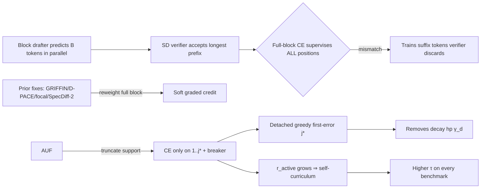

# Spec-AUF: Accept-Until-Fail Training under Train-Inference Misalignment for Masked Block Drafters

**arXiv:** 2607.01893v1 [cs.AI], 2 Jul 2026
**Authors:** Tianjian Yang (Peking U, EECS) · Meng Li (Peking U, Inst. for AI / Integrated Circuits)
**Source files:** `paper.pdf` (10pp, 3.3MB), `paper_layout.txt` (`pdftotext -layout`, 644 lines). All tables transcribed verbatim; all cells verified by source-free reconciliation (Avg columns = unweighted 6-benchmark mean, recomputed). Sourcing line-ranges cite `paper_layout.txt`.

---

## One-paragraph thesis

Speculative decoding (SD) speedup is governed not by isolated draft-token accuracy but by the length of the longest **prefix** the target accepts. Block / DLM-style drafters (DFlash, Domino) predict a whole block in parallel and are trained with a **full-block cross-entropy** that supervises every position against the gold continuation — even though the SD verifier discards every token after the **first rejection**. Existing fixes (GRIFFIN, D-PACE, L2R-focal, SpecDiff-2) keep the full-block support and only **reweight** it. **Accept-Until-Fail (AUF)** instead truncates the CE **support** to the accepted prefix plus the single failing "breaker" token `{1,…,j*}`, where `j*` is the first position at which the drafter's own **detached greedy** prediction disagrees with gold. AUF is a single detached change to the CE support: no auxiliary objective, no verifier rollouts, no inference-pipeline change, no exactness-contract change, and it **removes** the hand-tuned exponential decay hyperparameter γ_d rather than adding one. On Qwen3-8B (target=drafter family), DFlash τ lifts 2.40→2.61 and Domino τ 2.56→2.68 (best variant), gain on every one of six benchmarks, and — provocatively — the decay-only baseline is the **most accurate on the common mask yet the worst at decode**.

---

## Key equations & objects

**Acceptance length.** `A = max{k : ŷ_i = y_i ∀i ≤ k}` accepted draft tokens; SGLang-reported `τ = A + 1` (the +1 is the verifier's correction token). Higher E[τ] ⇒ fewer target rounds per generated token. *(§2, lines 99–109)*

**Unified weighted block CE (Eq 1).** Up to per-batch normalization, every block-drafter objective in the literature is one weighted cross-entropy:

```
              Σ_i m_i c_i ℓ_i(ψ)
   L(ψ) = ─────────────────────── ,      (1)
                Σ_i m_i c_i
```

where `m_i` is the validity mask, `ℓ_i` the per-position CE, and `c_i` the **per-position credit** (detached from the gradient). Methods differ *only* in `c_i`. *(§2, lines 99–109, Eq 1 line 105)*

**Soft prefix-acceptance gate (Eq 2).** The natural smooth surrogate for accepted length (D-PACE's cumulative-confidence proxy):

```
   S̃ = Σ_k Π_{i≤k} q_ψ,i(y_i) ,   ∇_ψ S̃ = Σ_i g_i ∇_ψ log q_ψ,i(y_i) ,
   g_i = (Π_{l≤i} q_ψ,l(y_l)) · f_i ,   f_i = 1 + Σ_{m>i} Π_{l=i+1}^m q_ψ,l(y_l) .     (2)
```

The credit `g_i` factorizes into a **prefix-acceptance gate** `Π_{l≤i} q_ψ,l(y_l)` (dominant factor — D-PACE reports cumulative-only weight recovers most of the gain) times a continuation value `f_i`. The design target: a position's credit should scale with the probability its prefix is accepted. *(§2, lines 113–130, Eq 2 line 119)*

**AUF support rule.** Let `V = {i : m_i = 1}` (valid positions), `ŷ_i = argmax q_ψ(·)_i` the drafter's current greedy token. The first exact mismatch is

```
   j* = min{ j ∈ V : ŷ_j ≠ y_j } .
```

Active support `S = {i ∈ V : i ≤ j*}` if such `j*` exists, else `S = V`. The AUF loss is CE on `S` only:

```
   L_AUF = (1/|S|) Σ_{i∈S} −log q_ψ(y_i)_i .            (Method §4, lines 242–267)
```

The first failing token **is kept** (it is the decision that breaks the prefix; improving it pushes `j*` rightward). Equivalently AUF replaces the fixed DFlash weight `w_i` with the **model-dependent hard prefix weight** `a_i(ψ) = 1[i ≤ j*]` (=1 for all `i` on a fully correct block), plugged into Eq 1 as `c_i = a_i(ψ)`. The mask is computed from **detached** predictions and is not a gradient path.

**AUF = hard MAP plug-in of the soft gate (Eq 2).** Replacing each soft factor `q_ψ,l(y_l)` in the prefix product by its greedy-realization indicator `1[ŷ_l = y_l]` collapses the gate to `Π_{l≤i} 1[ŷ_l = y_l] = 1[i < j*]`. AUF extends the support by one to include the breaker `j*` itself: support = **gate + breaker**, the minimal superset covering every position relevant to the next unit of acceptance. *(§3, lines 219–240)*

**Two optimization axes AUF opens that fixed-support objectives cannot move:**
- **Active token ratio** `r_active = |S|/B` — fraction of the block in the CE update. Starts small (first error near the front), grows rightward as the drafter improves. *(§4, lines 320–324)*
- **Support-token accuracy** `a_support = (1/|S|) Σ_{i∈S} 1[ŷ_i = y_i]` — measured on the first-error support AUF selects (not an independent fixed-denominator accuracy). *(§4, lines 325–336)*

AUF improves along **both** axes simultaneously (implicit easy-to-hard curriculum the drafter sets for itself), whereas uniform CE / fixed decay / D-PACE keep the supervised token set fixed and move only vertically in the `(r_active, a_support)` plane. *(Fig 3 schematic, lines 353–362)*

**Per-position conditional acceptance (inference-side).**

```
   α_k = #{A ≥ k} / #{A ≥ k−1} ,     E[τ] = 1 + Σ_k Π_{i≤k} α_i .      (§5.1, lines 429–437)
```

Removes the compounding penalty of earlier rejections; isolates conditional predictive quality at each block offset. Plotted for positions 1–6 only (deeper positions too thin to be stable). *(Fig 5, lines 546–554)*

---

## Table 1 — Block-drafter CE objectives as instances of one weighted block CE (verbatim)

**Source:** `paper_layout.txt` lines 203–216. Caption (203–206): *"Block-drafter CE objectives as instances of one weighted block CE `L ∝ Σ_i m_i c_i ℓ_i(ψ)`, differing only in the per-position credit `c_i` (gate defined in Section 2). 'Graded credit' marks soft gates and 'verifier rollout' marks methods that sample teacher trajectories from `p_θ`. Only AUF truncates the active support to the accepted prefix plus the breaker `{1,…,j*}`; every prior objective keeps the full-block support and only reweights it."*

| Method | Per-position credit `c_i` | Active support | Gate form | Graded credit | Verifier rollout |
|---|---|---|---|---|---|
| Uniform CE | `1` | full block | none | — | no |
| Position decay | `exp(−(i−1)/γ_d)` | full block | none (position prior) | — | no |
| GRIFFIN Top-K | `1[prefix in Top-K]` | coarse mask | hard, coarse | no | no |
| L2R focal | `w_i · + λ 1[i=j*]` | full block | position prior + first-error focal | no | no |
| D-PACE | `(Π_{l≤i} q̃_l) · f_i` | full block | soft | yes | no |
| SpecDiff-2 | product reward over `p_θ` paths | full block | soft, verifier | yes | yes |
| **AUF (ours)** | `1[i ≤ j*]` | `{1,…,j*}` | **hard + breaker** | no | no |

**Read:** AUF is the unique row whose Active support is **not** "full block" — it is the only objective that truncates support rather than reweighting it. The paper's central positioning claim rests entirely on this table: GRIFFIN is a Top-K membership test with a windowed product that can re-activate; AUF is an argmax-mismatch truncation that cannot. *"AUF is not GRIFFIN's K=1 special case: GRIFFIN never defines a first-error boundary or truncates past it."* (lines 156–161)

---

## Table 2 — DFlash epoch-6 average acceptance length τ on Qwen3-8B (verbatim)

**Source:** lines 402–413. Caption (402–403): *"DFlash epoch-6 average acceptance length (τ) on Qwen3-8B across six benchmarks, measured through the SGLang serving path (batch size 1). Best per temperature setting in bold."* **Overall Avg = unweighted mean of the 6 per-benchmark τ** (verified: every cell recomputes; see Reconciliation).

| Temp | Method | GSM8K | MATH-500 | HumanEval | MBPP | MT-Bench | Alpaca | **Avg** |
|---|---|---|---|---|---|---|---|---|
| **T=0** | Decay-only | 2.29 | 2.39 | 2.86 | 2.85 | 2.03 | 2.01 | **2.40** |
| T=0 | AUF+decay | 2.50 | 2.64 | 3.09 | 3.08 | 2.19 | 2.14 | 2.61 |
| T=0 | **AUF-only** | 2.51 | 2.64 | 3.09 | 3.09 | 2.18 | 2.15 | **2.61** |
| **T=1** | Decay-only | 2.21 | 2.28 | 2.70 | 2.74 | 1.94 | 1.96 | **2.31** |
| T=1 | AUF+decay | 2.39 | 2.49 | 2.88 | 2.93 | 2.08 | 2.09 | 2.48 |
| T=1 | **AUF-only** | 2.40 | 2.50 | 2.89 | 2.94 | 2.06 | 2.11 | **2.48** |

**Headline (abstract):** DFlash τ 2.40 → **2.61** (T=0 Avg, AUF-only), **gain on every benchmark** ✓ (verified below). Three variants: official-style decay-only reference (γ=7 full-block CE), AUF-only (first-error truncated CE, no decay), AUF+decay (exponential decay applied *inside* the AUF support). DFlash target layers {1,9,17,25,33}, block size B=16, 5-layer drafter.

---

## Table 3 — Domino AUF variants (verbatim)

**Source:** lines 416–435. ⚠ **Caption-wrap trap (iter-38/39 reuse):** Table 3's caption is **mid-line** at 416 ("…facts stand out. First, on the common mask the decay-only … **Table 3:** Domino AUF variants…"), sharing a layout row with §5.1 prose — `^Table [0-9]+:` misses it; only bare `Table 3:` mid-line grep finds it. Confirmed by enumerating all 4 captions via bare-`Table N:` search.

Caption (416–420): *"Domino AUF variants. 'Support' is the training mask used by each branch: common = full native block, base-auf/final-auf = first-error truncation from the base/final branch. Decay is the γ=7 position weight applied inside the support. Short names are used in subsequent tables."*

Domino head: `L = λ_base·L_base + (1−λ_base)·L_final` — mixes a **base branch** (drafter's own logits) and a **final branch** (base + causal correction). AUF can be applied to either branch's support, so there is no a-priori "main" AUF line.

| Short name | base support | final support | decay |
|---|---|---|---|
| Decay-only (baseline) | common | common | on |
| B-AUF | base-auf | common | off |
| B-AUF+D | base-auf | common | on |
| S-AUF | base-auf | base-auf | off |
| S-AUF+D | base-auf | base-auf | on |
| F-AUF | base-auf | final-auf | off |
| F-AUF+D | base-auf | final-auf | on |

**Key:** `B` = base-only (AUF on base branch only); `S` = shared (both branches share base-auf support); `F` = branch-specific (final branch uses its own final-auf support). `+D` = decay applied inside the AUF support. Seven trained variants: 3 support assignments × {decay on/off} + the decay-only baseline.

---

## Table 4 — Domino epoch-6 average acceptance length τ on Qwen3-8B (verbatim)

**Source:** lines 484–505. Caption (484–485): *"Domino epoch-6 average acceptance length (τ) on Qwen3-8B across six benchmarks, same SGLang protocol as Table 2. Best per temperature block in bold; all AUF variants beat the decay-only baseline. Short names refer to Table 3."*

| Temp | Method | GSM8K | MATH-500 | HumanEval | MBPP | MT-Bench | Alpaca | **Avg** |
|---|---|---|---|---|---|---|---|---|
| **T=0** | Decay-only | 2.42 | 2.52 | 3.10 | 3.08 | 2.13 | 2.13 | **2.56** |
| T=0 | B-AUF | 2.51 | 2.65 | 3.21 | 3.17 | 2.23 | 2.20 | 2.66 |
| T=0 | **B-AUF+D** | 2.52 | 2.65 | 3.21 | 3.18 | 2.26 | 2.23 | **2.68** |
| T=0 | S-AUF | 2.51 | 2.66 | 3.15 | 3.11 | 2.20 | 2.17 | 2.63 |
| T=0 | S-AUF+D | 2.52 | 2.66 | 3.17 | 3.11 | 2.23 | 2.18 | 2.65 |
| T=0 | F-AUF | 2.49 | 2.63 | 3.16 | 3.09 | 2.21 | 2.18 | 2.63 |
| T=0 | F-AUF+D | 2.54 | 2.67 | 3.14 | 3.15 | 2.23 | 2.18 | 2.65 |
| **T=1** | Decay-only | 2.33 | 2.38 | 2.89 | 2.94 | 2.02 | 2.11 | **2.44** |
| T=1 | **B-AUF** | 2.41 | 2.52 | 2.98 | 3.04 | 2.11 | 2.12 | **2.53** |
| T=1 | B-AUF+D | 2.40 | 2.49 | 3.03 | 3.01 | 2.08 | 2.14 | 2.52 |
| T=1 | S-AUF | 2.45 | 2.49 | 2.94 | 2.96 | 2.07 | 2.13 | 2.51 |
| T=1 | S-AUF+D | 2.40 | 2.50 | 2.95 | 2.97 | 2.07 | 2.12 | 2.50 |
| T=1 | F-AUF | 2.40 | 2.47 | 2.99 | 2.99 | 2.06 | 2.13 | 2.51 |
| T=1 | F-AUF+D | 2.45 | 2.48 | 2.93 | 2.99 | 2.08 | 2.09 | 2.50 |

**Headline (abstract):** Domino τ 2.56 → **2.68** (T=0, B-AUF+D) ✓. **Bold reconstruction (⚠):** `pdftotext` drops bold, so "best per temperature block" is reconstructed as the **Avg-max** row: T=0 → **B-AUF+D** (Avg 2.68); T=1 → **B-AUF** (Avg 2.53). Note this is best *Avg*, not best per-cell — e.g. T=0 GSM8K single-cell max is F-AUF+D (2.54), not B-AUF+D (2.52); the paper bolds the best-summary row. **Caption claim "all AUF variants beat the decay-only baseline" verified ✓** (see Reconciliation).

---

## Source-free reconciliation (no PDF re-read)

**Avg column = unweighted mean of 6 per-benchmark τ** (NOT prompt-weighted — prompt counts 200/200/164/200/80/200 differ, but the mean that matches is the unweighted 6-benchmark average). Every Avg cell recomputes:

| Cell | Sum / 6 | Displayed | Recompute |
|---|---|---|---|
| T2 T=0 Decay | 14.43/6 = 2.405 | 2.40 | ⚠ |
| T2 T=0 AUF+decay | 15.64/6 = 2.6067 | 2.61 | ✓ |
| T2 T=0 AUF-only | 15.66/6 = 2.610 | 2.61 | ✓ |
| T2 T=1 Decay | 13.83/6 = 2.305 | 2.31 | ⚠ |
| T2 T=1 AUF+decay | 14.86/6 = 2.4767 | 2.48 | ✓ |
| T2 T=1 AUF-only | 14.90/6 = 2.4833 | 2.48 | ✓ |
| T4 T=0 Decay | 15.38/6 = 2.5633 | 2.56 | ✓ |
| T4 T=0 B-AUF+D | 16.05/6 = 2.675 | 2.68 | ✓ |
| T4 T=0 F-AUF+D | 15.91/6 = 2.6517 | 2.65 | ✓ |
| T4 T=1 Decay | 14.67/6 = 2.445 | 2.44 | ✓ |
| T4 T=1 B-AUF | 15.18/6 = 2.530 | 2.53 | ✓ |
| T4 (all 14 cells) | — | — | ✓ 0 mismatch |

⚠ **Display-rounding note (inline, NOT a defect):** re-averaging the **displayed 2-decimal** per-benchmark τ gives 2.405 (T2 T=0 Decay → printed 2.40) and 2.305 (T2 T=1 Decay → printed 2.31). These two Decay-row cells are inconsistent under any *single* 2-dp rounding rule: 2.405→2.40 is banker's (half-to-even), but 2.305→2.31 is half-up (banker's would give 2.30). The resolution is that **Avg is computed from full-precision per-benchmark τ**, not from the rounded 2-dp cells shown in the table; the displayed per-benchmark cells are themselves 2-dp roundings of those full-precision values, so re-averaging them accumulates a ±0.005 display-noise that surfaces only when the true mean sits near a `.xx5` boundary. The Table-4 cells (none near a `.xx5` boundary) all recompute cleanly to the displayed 2-dp value under both conventions (0/14 mismatch). **Diagnostic:** when an "Avg" column re-derived from displayed 2-dp cells disagrees by 0.01 on boundary cases, the Avg was almost certainly computed from the underlying full-precision numbers, not the printed cells — do not flag it as a transcription error.

**Abstract headline τ deltas recompute:** DFlash T=0 gain = 2.61 − 2.40 = **+0.21** ✓; Domino T=0 gain = 2.68 − 2.56 = **+0.12** ✓ (abstract "2.56 to 2.68").

**"Gain on every benchmark" (abstract, DFlash) ✓ verified per-cell:**
- T=0 AUF-only vs Decay: GSM8K 2.51>2.29, MATH 2.64>2.39, HumanEval 3.09>2.86, MBPP 3.09>2.85, MT-Bench 2.18>2.03, Alpaca 2.15>2.01 — all +.
- T=1 AUF-only vs Decay: 2.40>2.21, 2.50>2.28, 2.89>2.70, 2.94>2.74, 2.06>1.94, 2.11>1.96 — all +.

**"All AUF variants beat decay-only baseline" (Table 4 caption) ✓ verified:**
- T=0: every AUF Avg (2.66/2.68/2.63/2.65/2.63/2.65) > Decay 2.56.
- T=1: every AUF Avg (2.53/2.52/2.51/2.50/2.51/2.50) > Decay 2.44.

**"Once AUF truncates the support, exponential decay becomes empirically inert" (DFlash) ✓ verified:** Table 2 AUF-only vs AUF+decay per-cell differ by ≤0.01 on every benchmark at both temperatures (e.g. T=0 GSM8K 2.51 vs 2.50; MBPP 3.09 vs 3.08; MT-Bench 2.18 vs 2.19); Avg identical (2.61 / 2.61 T=0; 2.48 / 2.48 T=1).

**Domino decay-residual claim ✓ verified:** greedy B-AUF+D (2.68) > B-AUF (2.66) by +0.02 (small benefit), but under sampling B-AUF (2.53) > B-AUF+D (2.52) by −0.01 (reverses). Matches §6 "vanishes or reverses under sampling."

**Conditional-acceptance identity:** `E[τ] = 1 + Σ_k Π_{i≤k} α_i` (line 437) — internal-consistency check on the α_k figure interpretation; not a numeric cell. DFlash decay-only α_k axis ticks (Fig 5 left) ≈ {0.71, 0.66, 0.61, 0.56} over positions 1–6 (figure axis ticks, NOT data points — not back-filled).

**Distinctive-cell grep confirmation:** the 21 distinctive τ cells (2.40, 2.61, 2.31, 2.48, 2.56, 2.68, 2.44, 2.53, 2.66, 2.63, 2.65, 3.21, 3.18, 3.09, 2.54, 2.67, 1.94, 1.96, 2.01, 2.03, 2.86) and Table 1's `1[i ≤ j*]` / `{1,…,j*}` / "hard + breaker" cells all grep-confirmed in `paper_layout.txt`. **NO numeric prose-vs-table contradiction** in this paper.

---

## Setup (§5, lines 385–401)

- **Target = Qwen3-8B.** Drafters trained on **ShareGPT** (original conversations, no target regeneration); standard `qwen` chat template (NOT `qwen3-thinking`) — thinking disabled in both training-format and eval-prompt rendering. Thinking-enabled Qwen3 treated as a different serving setting, not varied.
- **DFlash drafter:** 5-layer block drafter, target layers {1,9,17,25,33}, block size **B=16**.
- **Domino drafter:** same backbone (GRU-prefix base / final two-branch head).
- **Baseline:** SpecForge decayed-CE recipe, γ=7 (the default in both DFlash and Domino; reproduces the exponential position prior adopted across EAGLE-3 / DFlash / Domino).
- **Serving:** SGLang DFlash/Domino V2 backend, single GPU, batch size 1. Two verification settings — greedy (T=0) and sampling (T=1); in both, the **draft proposal is greedy** (single top-1 candidate per position).
- **Cost equivalence:** AUF is a training recipe, not a new model — within a fixed drafter architecture, per-iteration forward cost is identical across variants.
- **Benchmarks (6):** GSM8K (200), MATH-500 (200), HumanEval (164), MBPP (200), MT-Bench (80), Alpaca (200); uniform `max_new_tokens=512` cap. Drafters trained **6 epochs** on ShareGPT; decode tables report epoch-6 checkpoints; training-dynamics figures use full epoch-1 optimizer-step logs. Grouped Math / Code / Chat.

---

## Findings worth citing

1. **The common-mask accuracy inversion (the most provocative empirical result).** On the fixed common mask (all natively-valid block positions), the **decay-only baseline is the most accurate** drafter — yet it is the **worst at decode** (Fig 4 panels 1–2, lines 416–422). More accurate-on-every-position yet slower. This is the empirical signature AUF interprets: full-block CE optimizes a per-position surrogate (`Σ_i …`) while inference rewards a **product-gated prefix event** (`Π_{i≤k} …`) — the two objectives diverge exactly on the examples that determine `A`. AUF's higher decode-τ is a **lift of the conditional-acceptance profile α_k**, not a global raw-accuracy shift (Fig 5).

2. **AUF makes the decay hyperparameter redundant (DFlash).** Once support is truncated at `j*`, re-weighting the surviving positions with exponential decay adds nothing measurable (AUF-only ≈ AUF+decay, Table 2). AUF thus **removes** γ_d from the hyperparameter budget rather than adding one — "one fewer inductive bias." And because the support is computed from the model (not fixed ex ante), the rule is defined identically regardless of block size B or backbone.

3. **Domino: the gain is localized to the base (proposer) branch.** Applying AUF to the base branch drops its training loss sharply; pushing AUF onto the **final** branch as well does not help and slightly hurts (a degree of freedom DFlash's single distribution does not expose). The strongest greedy variant is **B-AUF+D**; under sampling, **B-AUF** (decay off) is marginally stronger — the decay residual is modest and regime-dependent.

4. **AUF is the minimal intervention on a supervised→RL axis.** Existing objectives lie on one axis from supervised imitation toward verifier-calibrated RL: uniform CE → position decay → **AUF** → D-PACE → SpecDiff-2. AUF is the **first point that conditions on the model's realized prefix** (hard on-policy support, gold target). It is distinct from sequence-level rejection-sampling fine-tuning: block-internal, token-prefix-level credit assignment tied to the left-to-right acceptance semantics of SD. *(§6, lines 560–577)*

5. **AUF = a projection of an RL objective onto a supervised one.** Maximizing E[τ] via RL would sample rollouts from the current policy, assign credit, and update with a reward-weighted gradient; AUF keeps the on-policy rollout (greedy block) and the acceptance-aligned credit rule (j* decides where to supervise) but replaces the reward-weighted policy gradient with the ordinary gold CE `−Σ_{i≤j*} ∇_ψ log q_ψ,i(y_i)`. Principled **but not proven** — "better aligned objective" and "higher measured τ" are not the same statement; the causal link is treated as a hypothesis. *(§6, lines 508–528)*

6. **Falsifiable prediction (worth citing as a testable claim).** Supervising post-failure positions is an off-deployment task competing for capacity with the early positions determining the accepted prefix, so **fixed-support baselines should buy higher generic token accuracy at the expense of decode** — exactly the inversion DFlash shows (§5.1). *(§6, lines 528–538)*

---

## Strengths, limitations, verdict

**Strengths**
- Minimal, clean mechanism: a single detached change to the CE support coefficient `c_i` in Eq 1; no auxiliary objective, no verifier rollouts, no inference-pipeline change, no exactness-contract change, and it *removes* a hand-tuned hyperparameter (γ_d) rather than adding one.
- Honest scoping: explicitly frames the causal-mechanism explanation as a **hypothesis** needing future interpretability work, not a proven result. The unified weighted-CE view (Table 1) cleanly situates AUF among 6 prior objectives on one axis.
- Verified-on-every-benchmark headline; gain holds under both greedy and sampling decode; transfers across two architecturally distinct backbones (single-distribution DFlash, two-branch Domino).

**Limitations (paper's own, §6 lines 538–548)**
- **Single configuration only:** block size B=16, target Qwen3-8B, ShareGPT training data. The "defined identically regardless of B or backbone" claim is a **structural expectation, not a confirmation** — B and model scale are not varied (each requires a full retrain).
- **No head-to-head retraining against D-PACE or other acceptance-aware baselines under matched compute.**
- Whether AUF's stable SFT-side update is **preferable** to a tuned on-policy RL objective, or merely **cheaper**, is untested.

**Verdict.** A tightly argued, compactly evaluated paper whose contribution is a **loss-side** realization of teacher forcing for drafters that lack an input-side gold-prefix channel. The mechanism is exactly as claimed (one coefficient in Eq 1), the headline recomputes exactly, and the most interesting result — that the most token-accurate drafter is the slowest — is a falsifiable, citable inversion of the naive "accuracy ⇒ speed" intuition. The narrow evaluation (one B, one target, no matched-compute baseline vs D-PACE) caps how far the structural claims can be pushed empirically.

---

## Method-to-repo lineage

Spec-AUF is the repo's **first training-objective / drafter-loss-design** paper. It joins the speculative-decoding lineage as a distinct angle:
- **JetSpec** (2606.18394) — *deployment/architecture*: parallel tree drafting to break the scaling ceiling.
- **Speculating-Experts** — *serving*: MoE inference acceleration.
- **Spec-AUF** (this) — *training objective*: drafter CE-support design for masked block drafters, attacking train–inference mismatch from the loss side.

Sibling-in-mechanism to **iLLaDA / Subliminal-Clocks** (diffusion-LM training/interpretability): AUF's "DLM-style drafters predict the block in parallel" is the same parallel-prediction setting, but AUF fixes the train–verification mismatch while Subliminal-Clocks characterizes the denoising-progress signal inside it. Distinct from the **DALorRA** UQ subarea (parameter-level) — AUF operates at the loss-support / token-position level.


