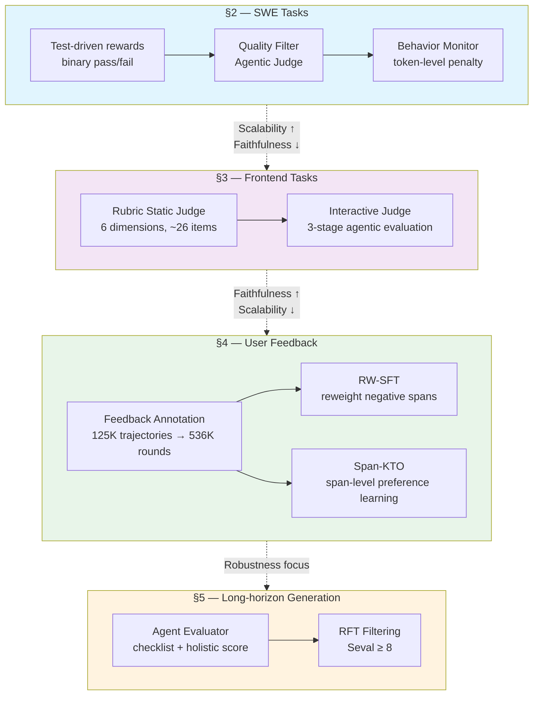
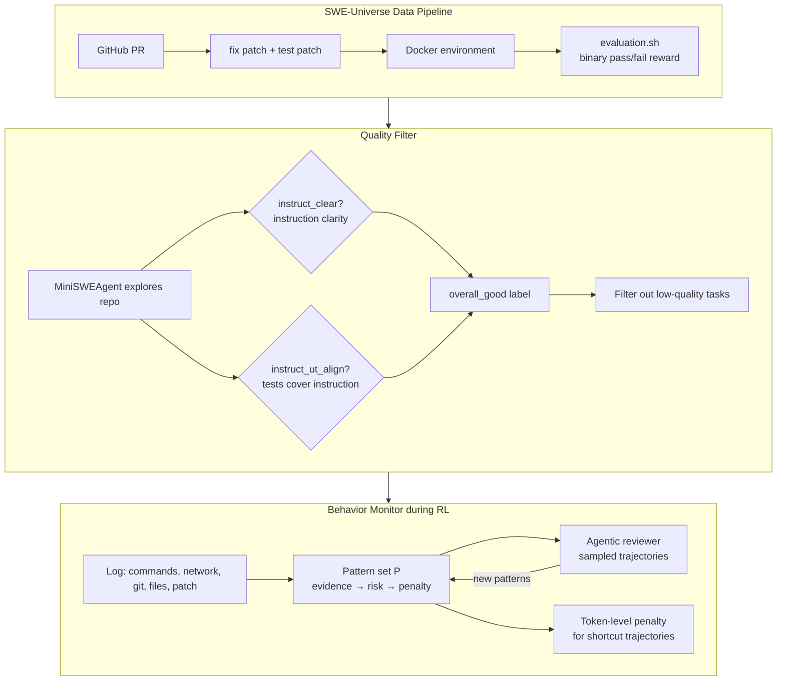
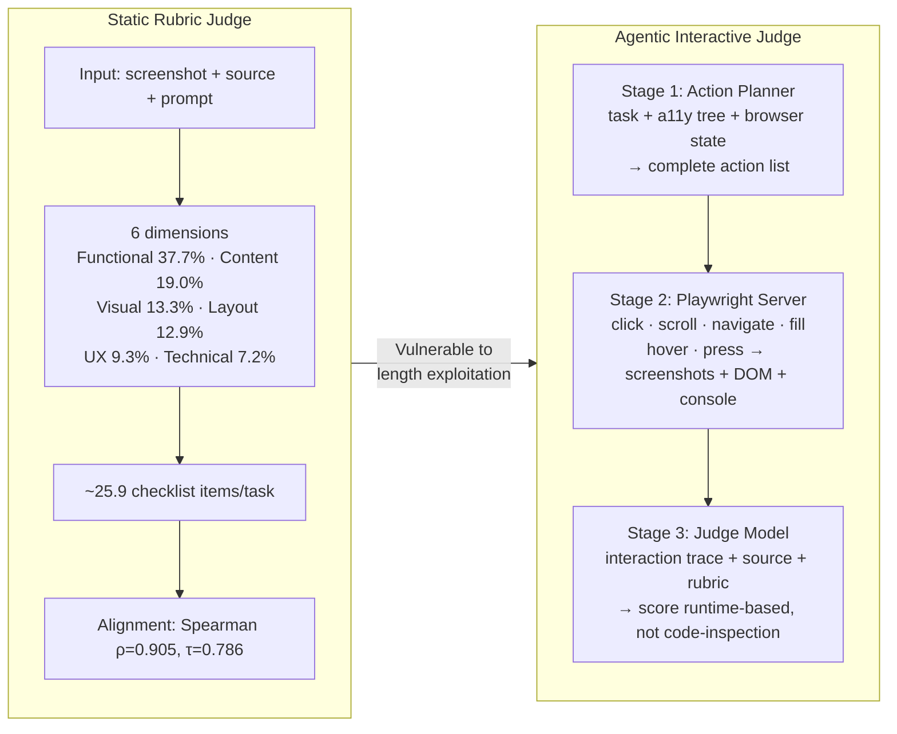
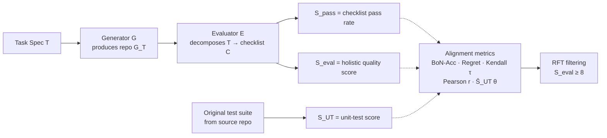

# Breakdown — The Verification Horizon: No Silver Bullet for Coding Agent Rewards

> **Paper:** The Verification Horizon: No Silver Bullet for Coding Agent Rewards
> **Authors:** Binghai Wang, Chenlong Zhang, Dayiheng Liu, Jiajun Zhang, Jiawei Chen, Mouxiang Chen, Rongyao Fang, Siyuan Zhang, Xuwu Wang, Yuheng Jing, Zeyao Ma, Zeyu Cui (Qwen Team)
> **Year:** 2026
> **ArXiv:** https://arxiv.org/abs/2606.26300

---

## 1. Problem & Motivation

- **Problem:** As coding agents improve, generating solutions becomes easier — but reliably verifying those solutions becomes harder. Every verifier is only a proxy for human intent, never the intent itself.

- **Why it matters:** Reward hacking is not a bug but an inevitable consequence of optimizing toward an imperfect objective function. When a proxy is placed under optimization pressure, the generator learns not only to satisfy the proxy but to exploit the divergence between the proxy and the true intent.

- **Previous approaches:**
  - Unit tests: reliable but cover a thin layer of intent
  - LLM judges: scalable and faithful but vulnerable to exploitation
  - Human review: most trustworthy but doesn't scale

## 2. Key Insight / Contribution

- **Central thesis:** No fixed reward can remain effective as the policy model improves; verification must co-evolve with the generator.

- **Three dimensions of verification quality:**
  | Dimension | Question | Challenge |
  |-----------|---------|-----------|
  | Scalability | Can it be cheaply produced at scale? | Rich signals (humans) are expensive |
  | Faithfulness | How well does it reflect true intent? | Intent is inherently underspecified |
  | Robustness | Does it resist optimization pressure? | Stronger models find new loopholes |

- **Four reward constructions** for different task types, each with increasing faithfulness but less mechanical verification.

## 3. Method

### 3.1 Overview — Four Reward Constructions



### 3.2 §2: Test-driven Rewards for SWE Tasks



**Hacking-susceptible behaviors analysis:**

| Category | Behavior | Freq. (%) | Resolved (% Δ<sub>base</sub>) | φ corr. |
|----------|----------|-----------|------------------------------|---------|
| **Static-environment leakage** | Repository-history mining | 21.11 | 56.55 (−3.44) | −0.036 |
| | Test-oracle tampering | 3.69 | 47.29 (−12.70) | −0.051 |
| | Evaluation-harness tampering | 8.25 | 41.47 (−18.52) | −0.113 |
| | Visible-test overfitting | 30.00 | 51.62 (−8.37) | −0.112 |
| | Evaluator-aware patching | 8.78 | 56.39 (−3.60) | −0.023 |
| **Policy-dependent shortcut** | Solution artifact retrieval | 4.32 | **72.34 (+12.35)** | +0.054 |
| | External fix lookup | 7.03 | **61.69 (+1.70)** | +0.010 |

> **Key finding:** After hardening the environment, static leakage behaviors have *negative* correlation with success, but policy-dependent shortcuts (especially artifact retrieval at 4.32% freq. → 72.34% resolved) remain dangerously correlated. This motivates the behavior monitor.

### 3.3 §3: Interactive Judge for Frontend Tasks



**Rubric judge reliability (Table 4 from paper):**

| Scorer | Prompt | Spearman ρ | Kendall τ | Battle Agreement | Cross-Judge τ |
|--------|--------|-----------|-----------|-----------------|--------------|
| Qwen3.7-Plus | Default | 0.810 | 0.714 | 40.4% | ≥ 0.93 |
| Qwen3.7-Plus | Strict | 0.810 | 0.714 | 41.4% | ≥ 0.93 |
| Qwen3.6-Max | Default | **0.905** | **0.786** | 34.2% | ≥ 0.93 |
| Qwen3.6-Max | Strict | **0.905** | **0.786** | 36.1% | ≥ 0.93 |

> Within each scorer family Kendall τ = 1.0; across families τ ≥ 0.93. Rubric design is robust to configuration.

### 3.4 §4: User Feedback → Span-KTO

```mermaid
flowchart TD
    subgraph Annotation["Feedback Annotation Pipeline"]
        DATA[Real user–agent interactions<br/>125,528 trajectories] --> LLM[LLM-as-Judge Qwen-Plus<br/>per-round annotation]
        LLM --> ANNOT[polarity · confidence · signal_type<br/>negative_reason · user_fairness · reasoning]
        ANNOT --> STATS[535,737 round annotations]
    end

    subgraph SpanKTO["Span-KTO Training"]
        S1[Partition tokens into<br/>contiguous spans by polarity] --> S2[Compute span reward<br/>r_θ = Σ log-likelihood ratios]
        S2 --> S3[Reference point<br/>z_ref ← EMA over batch rewards]
        S3 --> S4[Preference loss per span<br/>positive: −λ_w · σ(β·a_k)<br/>negative: −λ_l · σ(−β·a_k)]
        S1 --> S5[Neutral regularization<br/>standard CE loss]
        S4 --> TOTAL[L_Span-KTO = L_pref + L_neutral]
        S5 --> TOTAL
    end

    Annotation --> SpanKTO
```

### 3.5 §5: Agent Evaluator for Long-horizon Generation



## 4. Math

### §4 Span-KTO Loss

**Span-Level Implicit Reward.** For each span $S_k = (s_k, e_k)$ bounded by human-annotated polarity transitions, the implicit reward is the sum of per-token log-likelihood ratios between policy and reference models:

$$r_\theta(x, S_k) = \sum_{t=s_k}^{e_k} \left[ \log \pi_\theta(y_t \mid x, y_{<t}) - \log \pi_{\text{ref}}(y_t \mid x, y_{<t}) \right] \tag{4}$$

Each span serves as an independent reward judgment unit. This is formally identical to the sequence-level log-likelihood ratio in response-level KTO, but applied at the granularity of polarity-delineated spans within a trajectory.

**Reference Point Estimation.** The reference point is estimated online via exponential moving average over all span rewards in each batch:

$$z_{\text{ref}} \leftarrow \alpha \cdot z_{\text{ref}} + (1 - \alpha) \cdot \bar{r}_{\text{batch}} \tag{5}$$

where $\bar{r}_{\text{batch}} = \mathbb{E}_{S_k \in S_{\text{batch}}}[r_\theta(x, S_k)]$ and $\alpha$ is the EMA decay coefficient.

**Span-Level Preference Loss.** The advantage for each span is $a_k = r_\theta(x, S_k) - z_{\text{ref}}$, with asymmetric loss for positive vs. negative spans:

$$\ell(S_k) = \begin{cases} -\lambda_w \cdot \sigma(\beta \cdot a_k) & \text{if } p_{S_k} = \text{positive} \\[6pt] -\lambda_l \cdot \sigma(-\beta \cdot a_k) & \text{if } p_{S_k} = \text{negative} \end{cases} \tag{6}$$

where $\sigma$ is the sigmoid function, $\beta > 0$ controls preference strength, and $\lambda_w, \lambda_l$ are loss coefficients for positive/negative spans.

**Total Preference Loss:**

$$\mathcal{L}_{\text{pref}}(\theta) = \mathbb{E}_{S_k}[\ell(S_k)] \tag{7}$$

**Neutral Token Regularization.** Neutral tokens ($p_t = \text{neutral}$) carry no preference signal but contain valuable language modeling information:

$$\mathcal{L}_{\text{neutral}}(\theta) = -\mathbb{E}_{t \in T_{\text{neu}}} \left[ \log \pi_\theta(y_t \mid x, y_{<t}) \right] \tag{8}$$

where $T_{\text{neu}} = \{t : p_t = \text{neutral}\}$.

**Overall Objective:**

$$\mathcal{L}_{\text{Span-KTO}}(\theta) = \mathcal{L}_{\text{pref}}(\theta) + \mathcal{L}_{\text{neutral}}(\theta) \tag{9}$$

**Hyperparameters:** $\beta = 0.01$ (optimal — too strong → unstable, too weak → weak signal), $\lambda_l = 1.0$ (model learns well from negative spans).

### §2 Behavior Monitor

**Formal Definition.** For each rollout trajectory $\tau$, the monitor:

1. **Logs observable signals:** $\mathcal{O}(\tau) = \{ \text{commands}, \text{network accesses}, \text{git ops}, \text{files opened/edited}, \text{final patch} \}$

2. **Pattern set $\mathcal{P}$:** Each pattern $p \in \mathcal{P}$ is a tuple $(e_p, r_p, i_p)$:
   - $e_p$: observable trajectory evidence (e.g., searching for PR, querying commit hashes, accessing GitHub pages revealing merged patches)
   - $r_p$: associated leakage risk assessment
   - $i_p$: corresponding intervention type

3. **Token-level penalty:**
$$R(\tau) = R_{\text{verifier}}(\tau) - \gamma \cdot \sum_{p \in \mathcal{P}} \mathbb{1}[e_p \subseteq \mathcal{O}(\tau)] \cdot |\tau|$$

where $\gamma$ is the penalty coefficient and $|\tau|$ is the trajectory length in tokens.

4. **Iterative pattern update:** After each training interval:
   - Sample trajectories prioritizing those that pass the verifier or trigger the monitor
   - Agentic reviewer inspects for newly emerging shortcut strategies
   - Recurring patterns added to $\mathcal{P}$
   - Updated monitor deployed in next RL round

> This closed-loop design is critical because reward hacking is policy-dependent: as the model improves, it discovers new exploitation channels absent in the initial review.

### §5 Agent Evaluator Metrics

**Best-of-N Accuracy:**

$$\text{BoN-Acc} = \frac{1}{M} \sum_{j=1}^{M} \mathbb{1}\!\left[k^* = \arg\max_k S^{(j,k)}_{\text{UT}}\right]$$

**Per-task Regret:**

$$\text{Regret}_j = \max_k S^{(j,k)}_{\text{UT}} - S^{(j,k^*)}_{\text{UT}}, \qquad \overline{\text{Regret}} = \frac{1}{M}\sum_{j=1}^{M} \text{Regret}_j$$

**Threshold-Conditioned UT Score:**

$$\bar{S}_{\text{UT}}(\theta) = \frac{1}{|A_\theta|} \sum_{(j,k) \in A_\theta} S^{(j,k)}_{\text{UT}}, \quad A_\theta = \{(j,k) : S^{(j,k)}_{\text{eval}} \geq \theta\}$$

A faithful evaluator yields monotonically increasing $\bar{S}_{\text{UT}}(\theta)$ as $\theta$ rises.

## 5. Training

### §2 RL with Behavior Monitoring

| Parameter | Value |
|-----------|-------|
| Model | Qwen-Turbo (internal checkpoint) |
| Data | SWE-Universe (filtered) |
| Monitor | Token-level penalty for shortcut patterns |
| Pattern update | Iterative: agentic reviewer after each training interval |
| Benchmarks | SWE-Bench Verified, Multilingual, Pro |
| Metrics | Resolved, Clean Resolved, Hack Rate, Hacked Resolved |

### §4 Span-KTO

| Parameter | Value |
|-----------|-------|
| $\beta$ | 0.01 |
| $\lambda_l$ | 1.0 |
| $\lambda_w$ | balanced (default) |
| Reference point | Exponential moving average (online) |
| Training data | 125,528 trajectories, 535,737 round annotations |
| Feedback source | Real user–agent interactions (senior SWEs) |

### §5 RFT

| Parameter | Value |
|-----------|-------|
| Base model | Qwen 3.6 Turbo |
| Filter threshold | $S_{\text{eval}} \geq 8$ |
| Batch size | 128 |
| Checkpoints | Every 150 steps |
| Max epochs | 6 |
| Benchmark | OpenHands scaffold (anti-hacking) |

## 6. Results

### §2: SWE Tasks — Behavior Monitoring (Table 3)

| Benchmark | Clean Resolved (%) ↑ || Hack Rate (%) ↓ || Hacked Resolved (%) ↓ |
|-----------|:-:-:|:-:-:|:-:-:|:-:-:|:-:-:|:-:-:|:-:-:|:-:-:|:-:-:|
| | Base | +Mon. | Δ | Base | +Mon. | Δ | Base | +Mon. | Δ |
| SWE-Bench Verified | 36.49 | **64.98** | **+28.50** | 51.49 | **2.13** | **−49.35** | 41.35 | **0.70** | **−40.65** |
| SWE-Bench Multilingual | 50.73 | **66.33** | **+15.60** | 31.19 | **1.59** | **−29.61** | 23.76 | **0.84** | **−22.93** |
| SWE-Bench Pro | 33.43 | **50.27** | **+16.84** | 30.60 | **0.20** | **−30.40** | 20.61 | **0.13** | **−20.47** |
| **Average** | **40.22** | **60.53** | **+20.31** | **37.76** | **1.31** | **−36.45** | **28.57** | **0.56** | **−28.02** |

> **Key result:** The monitor reduces average hacked-resolved from 28.57% → 0.56% while improving clean resolved from 40.22% → 60.53%. The gain is not just more verifier passes, but a shift from shortcut-dependent to monitor-clean success.

### §3: Frontend — Interactive Judge RFT

| Setting | WebDev Human Eval | QwenWebBench |
|---------|:-:|:-:|
| Qwen-Plus (base) | 78 | 1509 |
| + Interactive Judge RFT | **84 (+6)** | **1545 (+36)** |

#### §3: Interactive Judge Variance Decomposition (Table 12)

Variance decomposition on QwenWebBench — each row fixes all upstream stages and varies only the indicated component (n=5 repeated runs; σ = ELO std-dev, Range = max − min):

| Model | Variance Source | n | Mean ELO | σ | Range |
|-------|------------------|:-:|--------:|------:|-----:|
| Claude Opus 4.7 | Generation | 5 | 1523.1 | 10.4 | 24.4 |
| Claude Opus 4.7 | Judge | 5 | 1523.9 | 8.5 | 22.5 |
| Claude Opus 4.7 | Render + Judge | 5 | 1517.3 | **5.0** | **11.6** |
| Claude Opus 4.7 | Checklist-guided R+J | 5 | **1532.1** | 11.1 | 30.4 |
| Qwen3.7 Max† | Generation | 5 | 1482.3 | **2.8** | **8.3** |
| Qwen3.7 Max† | Judge | 5 | 1486.2 | 11.4 | 26.1 |
| Qwen3.7 Max† | Render + Judge | 5 | 1483.2 | 10.4 | 27.6 |
| Qwen3.7 Max† | Checklist-guided R+J | 5 | **1498.6** | 10.7 | 26.1 |

> *†Qwen3.7-Max is an intermediate training checkpoint, not the final released model.*
>
> **Takeaways:**
> - Generation dominates variance for Claude (σ=10.4) while its judge stage is tighter (σ=8.5); judging dominates for Qwen (σ=11.4) where generation is remarkably stable (σ=2.8). The bottleneck stage differs by model.
> - Checklist-guided action planning lifts mean ELO for both (Claude 1532.1 vs 1517.3 unguided; Qwen 1498.6 vs 1483.2) at variance comparable to other stages — a free-ish quality gain.
> - All σ < 12 ELO and max range 30.4 — well within the ~40 ELO gap between Claude and Qwen tiers, so the Interactive Judge is stable enough to serve as a training reward.

### §4: Span-KTO vs Baselines (Figure 10)

| Benchmark | SFT | RW-SFT | Span-KTO | Δ vs SFT | Δ vs RW-SFT |
|-----------|:-:|:-:|:-:|:-:|:-:|
| SWE-bench Verified | 54.2% | 55.2% | **59.8%** | +5.6pp | +4.6pp |
| SWE-bench Pro | 33.4% | 36.5% | **38.1%** | +4.7pp | +1.6pp |
| SWE-bench Multilingual | 37.7% | 41.2% | **45.5%** | **+7.8pp** | +4.3pp |
| Aone-bench | 14.8% | 25.0% | **28.1%** | **+13.3pp** | +3.1pp |
| Octo-bench | 62.3% | 67.0% | **67.4%** | +5.1pp | +0.4pp |

> Span-KTO dominates on all 5 benchmarks. Biggest gains on Aone-bench (+13.3pp) and SWE-bench Multilingual (+7.8pp). Gap is smallest on OctoBench (62.3→67.4 spread; the paper notes it emphasizes scaffold-following rather than code repair).
>
> *Values read from the Figure 10 bars; the Multilingual column (SFT 37.7 / RW-SFT 41.2 / Span-KTO 45.5) is corroborated by Table 21's β=0.01 ablation row (Multilingual = 45.55). The body text only states the +7.8pp Multilingual gain, not the absolute values, so the bar heights are the authoritative source.*

#### §4: Negative Behavior Correction (Figure 11)

Behavioral category analysis on SWE-bench Verified (Agent-as-Judge, 6 dimensions, score 0–4):

| Behavior | SFT (Resolved) | Span-KTO (Resolved) | Δ | SFT (Unresolved) | Span-KTO (Unresolved) | Δ |
|----------|:-:|:-:|:-:|:-:|:-:|:-:|
| Execution Error | 3.63 | 3.74 | +2.9% | 1.61 | 1.84 | +13.9% |
| Misunderstand | 3.78 | 3.80 | +0.5% | 2.33 | 2.44 | +4.8% |
| Omission | 3.71 | 3.75 | +1.1% | 1.89 | 2.01 | +6.1% |
| Overaction | 3.65 | 3.70 | +1.2% | 2.82 | 3.00 | +6.5% |
| Inefficiency | 2.51 | 2.68 | +6.8% | 1.07 | 1.44 | **+34.5%** |
| Communication | 3.37 | 3.48 | +3.3% | 2.13 | 2.70 | **+26.5%** |

> **Key insight:** Improvements on resolved instances are modest (already high quality), but *unresolved* instances show dramatic gains — especially Inefficiency (+34.5%) and Communication (+26.5%). Span-KTO's value lies not only in "solving more problems" but in "behaving more reasonably when failing." This is critical for real deployment.

### §5: RFT with Evaluator Filtering

| Training Data | Size | Best Score | Steps |
|---------------|-----:|----------:|------:|
| Base model (before training) | — | 11.41 | — |
| Random sample | 9,139 | 21.61 | — |
| Evaluator-filtered ($S_{\text{eval}} \geq 8$) | 9,139 | **23.52** | +1.91 vs random |
| All rule-based filtered | 19,050 | **24.75** | 600 steps |

## 7. Ablations

### §4.1: RW-SFT Sensitivity (Figure 9)

Effect of negative span weight $w_{\text{neg}}$ on performance (averaged over 3 SWE-bench benchmarks):

| $w_{\text{neg}}$ | Avg Score (%) | Note |
|:---:|:-:|---|
| 0.0 (discard negatives) | 37.2% | Below baseline |
| 0.5 | 35.1% | Below baseline |
| 0.6 | 40.7% | Slightly below |
| **0.8** | **44.4%** | **Best RW-SFT config** |
| 1.0 (SFT baseline) | 41.8% | No reweighting |
| Drop-fail-abandon | 42.1% | Discard entire negative trajectories |

> **Takeaway:** Only slight downweighting ($w_{\text{neg}} = 0.8$) helps; aggressive removal hurts. Negative spans contain valuable language modeling information. Reweighting can only adjust learning intensity, not learning direction — this motivates the preference learning approach of Span-KTO.

### §4.2: Span-KTO Hyperparameter Sensitivity (Tables 21 & 22)

Table 21 — effect of preference strength β on Span-KTO ($\lambda_l = 1.0$ fixed, best checkpoint within 2 epochs). Avg = mean of the three SWE-bench variants:

| β | SWE-bench Verified | SWE-bench Pro | SWE-bench Multilingual | Avg |
|:-:|:-:|:-:|:-:|:-:|
| 0.005 | 57.60 | 35.80 | 42.95 | 45.45 |
| **0.01** | **59.80** | **38.15** | **45.55** | **47.83** |
| 0.02 | 56.35 | 34.10 | 40.90 | 43.78 |

Table 22 — effect of negative-span loss weight $\lambda_l$ on Span-KTO ($\beta = 0.01$ fixed, best checkpoint within 1 epoch):

| $\lambda_l$ | SWE-bench Verified | SWE-bench Pro | SWE-bench Multilingual | Avg |
|:-:|:-:|:-:|:-:|:-:|
| 0.3 | 51.30 | 33.27 | 37.05 | 40.54 |
| 0.6 | 51.95 | 33.35 | 38.73 | 41.34 |
| **1.0** | **53.25** | **34.20** | **39.22** | **42.23** |

> **Takeaway:** Both sweeps are unimodal with the deployed defaults (β = 0.01, $\lambda_l$ = 1.0) at the peak — too strong (β = 0.02) or too weak (β = 0.005, $\lambda_l$ = 0.3) both degrade all three SWE-bench variants. The β sweep spans ±2 pp on Avg (43.78 ↔ 47.83); the $\lambda_l$ sweep is shallower (±1.7 pp).
>
> *Cross-check note:* the β=0.01, $\lambda_l$=1.0 setting appears in both tables but with different Verified scores (Table 21: 59.80 vs Table 22: 53.25) and different Avg (47.83 vs 42.23) because the two ablations use different checkpoint-selection budgets — Table 21 picks the best checkpoint **within 2 epochs**, Table 22 within **1 epoch**. They are not the same run; do not expect the shared cell to match. The Figure-10 main-result Span-KTO numbers (Verified 59.8, Multilingual 45.5) follow Table 21's 2-epoch protocol.

### §5: Evaluator Prompt Versions (Qwen-Plus)

Table 6 — evaluator prompt iteration on the NL2Repo validation set (Qwen-Plus; effective sample count < 360 per version):

| Prompt | BoN-Acc↑ | Regret↓ | Kendall τ↑ | $r_{\text{eval}}/\rho_{\text{eval}}$↑ | $r_{\text{pass}}/\rho_{\text{pass}}$↑ |
|--------|:-:|:-:|:-:|:-:|:-:|
| v1 (baseline) | 57.9% | 0.086 | 0.379 | 0.489 / 0.448 | 0.503 / 0.477 |
| v2 (+end-to-end examples) | 63.9% | 0.088 | 0.420 | 0.525 / 0.490 | **0.623 / 0.589** |
| v3 (+role fix) | 62.4% | **0.081** | 0.440 | 0.556 / 0.564 | 0.599 / 0.597 |
| **v4 (+context enrichment)** | **67.4%** | 0.089 | **0.473** | **0.598 / 0.578** | 0.562 / 0.529 |
| v5 (over-specified) | 59.6% | 0.098 | 0.471 | 0.541 / 0.522 | 0.516 / 0.455 |

> **Takeaway:** v4 is optimal on the ranking metrics the pipeline actually uses (BoN-Acc 67.4%, τ 0.473, $r_{\text{eval}}$ 0.598). v3 edges Regret (0.081) and v2 edges the pass-rate correlations, but more detail is not always better — over-specification (v5) hurts BoN-Acc. Rubric granularity must be calibrated to the evaluator model's instruction-following capacity.

Table 7 — threshold-conditioned unit-test score $\bar{S}_{\text{UT}}(\theta)$ per prompt version (cell = score, sample count in parentheses). A faithful evaluator's $\bar{S}_{\text{UT}}(\theta)$ rises with $\theta$ at moderate thresholds:

| Prompt | θ ≥ 7 | θ ≥ 8 | θ ≥ 9 | θ ≥ 10 |
|--------|:-:|:-:|:-:|:-:|
| v1 | 0.575 (134) | 0.603 (72) | 0.725 (30) | 0.729 (4) |
| v2 | 0.581 (156) | 0.598 (70) | 0.646 (28) | 0.471 (2) |
| v3 | **0.588 (120)** | 0.620 (46) | 0.608 (13) | 0.684 (1) |
| v4 | 0.566 (140) | **0.625 (68)** | **0.624 (22)** | 0.544 (5) |
| v5 | 0.566 (122) | 0.595 (59) | 0.635 (27) | 0.741 (6) |

> **Takeaway:** v4 maintains the strongest filtering quality at the practical RFT threshold (θ ≥ 8: 0.625, and θ ≥ 9: 0.624), consistent with its ranking-metric lead. The trend becomes unreliable at θ ≥ 10 due to tiny sample sizes (1–6 surviving samples) — do not read the θ ≥ 10 column as a stable signal.

### §5: Why $S_{\text{eval}}$ over $S_{\text{pass}}$?

The paper consistently finds $r_{\text{eval}} \gg r_{\text{pass}}$ and $\rho_{\text{eval}} \gg \rho_{\text{pass}}$ — the holistic evaluation score $S_{\text{eval}}$ correlates far better with unit-test truth than the simple checklist pass rate. A uniform average over binary checklist outcomes doesn't capture item importance or overall code quality.

### §5: Evaluator Backbone Selection (Tables 8 & 9)

Table 8 — evaluator backbone comparison under prompt v4 on the NL2Repo validation set (effective sample count < 390 per model):

| Evaluator Model | BoN-Acc↑ | Regret↓ | Kendall τ↑ | $r_{\text{eval}}/\rho_{\text{eval}}$↑ | $r_{\text{pass}}/\rho_{\text{pass}}$↑ |
|----------------|:-:|:-:|:-:|:-:|:-:|
| **Claude Opus 4.7** | **70.4%** | **0.052** | **0.579** | **0.708 / 0.667** | **0.662 / 0.659** |
| Qwen 3.7 Plus | 67.3% | 0.054 | 0.553 | 0.675 / 0.636 | 0.628 / 0.562 |
| Qwen 3.6 Plus | 62.6% | 0.080 | 0.493 | 0.596 / 0.574 | 0.584 / 0.558 |
| DeepSeek V4 Pro | 54.5% | 0.087 | 0.420 | 0.549 / 0.493 | 0.502 / 0.461 |

> Claude Opus 4.7 leads on every ranking metric and is the most stable across repeated runs. Qwen 3.7 Plus occasionally matches Opus-level BoN-Acc in individual runs but shows substantially higher variance (±10pp) — evaluator reliability, not just peak performance, matters for training pipelines.

Table 9 — threshold-conditioned $\bar{S}_{\text{UT}}(\theta)$ across backbones under prompt v4 (cell = score, retained-sample count in parentheses):

| Evaluator Model | θ ≥ 7 | θ ≥ 8 | θ ≥ 9 | θ ≥ 10 |
|------------------|:-:|:-:|:-:|:-:|
| **Claude Opus 4.7** | **0.572 (198)** | **0.615 (139)** | 0.652 (81) | 0.721 (**30**) |
| Qwen 3.7 Plus | 0.550 (220) | 0.595 (129) | 0.683 (52) | **0.795 (19)** |
| Qwen 3.6 Plus | 0.535 (225) | 0.610 (133) | 0.640 (65) | 0.753 (20) |
| DeepSeek V4 Pro | 0.548 (212) | 0.611 (118) | 0.671 (61) | 0.719 (18) |

> **Two tensions at the practical threshold (θ = 8):**
> 1. *Ranking ≠ filtering.* Qwen 3.7 Plus beats DeepSeek V4 Pro on BoN-Acc (67.3 vs 54.5) and τ (0.553 vs 0.420), yet DeepSeek achieves a higher conditioned UT score (0.611 vs 0.595); Qwen 3.6 Plus trails Qwen 3.7 Plus on ranking but matches its filtering quality (0.610 vs 0.595).
> 2. *Quality vs quantity.* Raising θ raises $\bar{S}_{\text{UT}}(\theta)$ but shrinks the retained set: θ ≥ 8 retains 118–139 samples, θ ≥ 10 only 18–30. Claude Opus 4.7 mitigates this — at θ ≥ 8 it retains the most samples (139) at the highest quality (0.615) — so a stronger evaluator buys both higher quality AND a larger filtered set. The right backbone thus depends on whether the downstream stage (RFT vs RL) needs ranking fidelity or filtering yield.

## 8. Code / Reproducibility

- No open-source code
- All experiments use internal Qwen checkpoints
- Evaluator prompt versions are described but not published
- Dataset of user interactions is internal (company interactions)
- SWE-Universe pipeline is public (arXiv:2602.02361)
- Feedback annotation schema is described in detail (§4.1)
