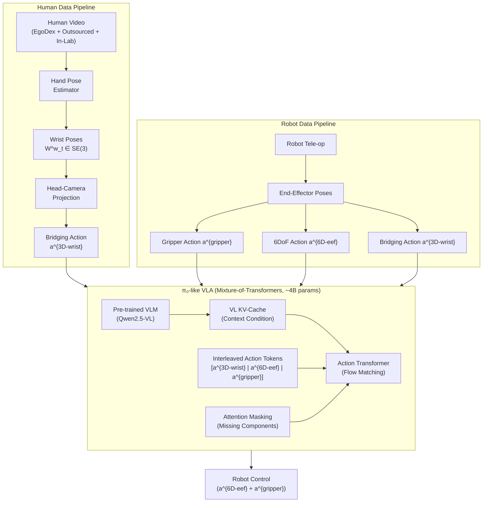
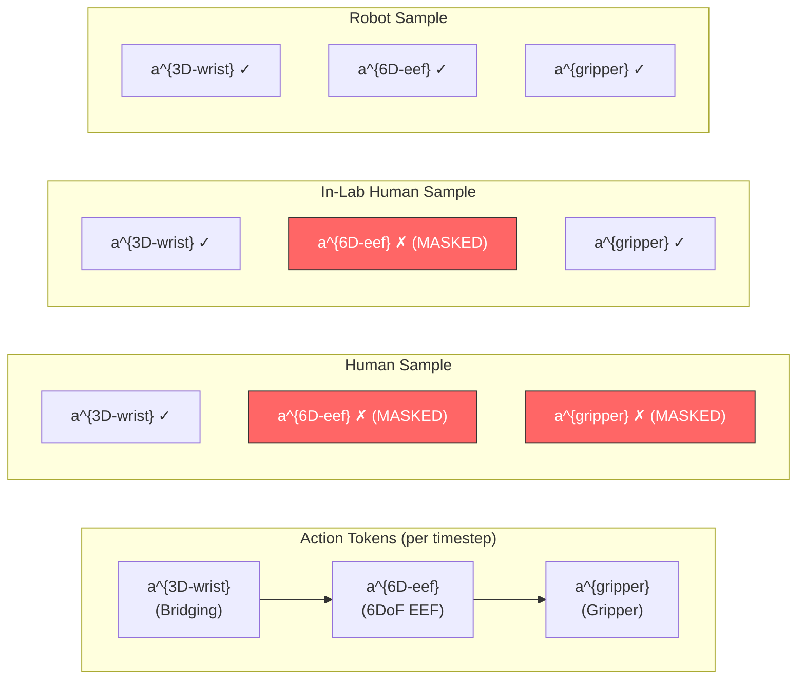
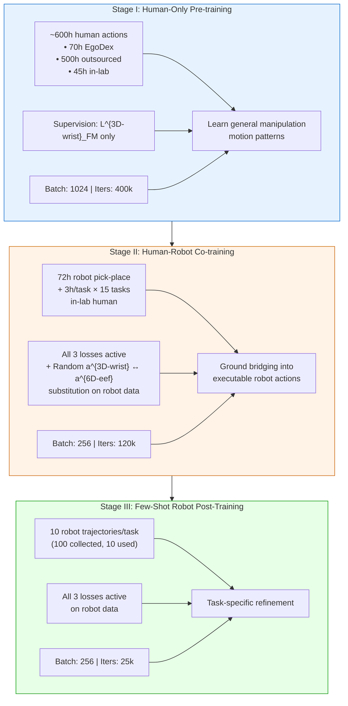

# Breakdown — Translation as a Bridging Action: Transferring Manipulation Skills from Humans to Robots

> **Paper:** Translation as a Bridging Action: Transferring Manipulation Skills from Humans to Robots
> **Authors:** Sijin Chen, Kaixuan Jiang, Haixin Shi, Yanhui Wang, Weiheng Zhong, Haosheng Li, Bo Jiang, Yuxiao Liu, Xihui Liu
> **Affiliations:** HKU-MMLab (1), ByteDance Seed (2)
> **Year:** 2026 (arXiv:2606.28133, v1, Jun 2026)
> **ArXiv:** https://arxiv.org/abs/2606.28133
> **Project page:** https://translation-as-a-bridging-action.github.io/
> **Type:** Action representation + training strategy for human-to-robot manipulation transfer.

---

## 1. Problem & Motivation

**Problem.** Human action data is cheap, abundant, and diverse — one of the most promising paths for scaling robot learning. But transferring manipulation skills from humans to robots is hard. The mainstream approach treats humans as just another 6-DOF embodiment: extract wrist pose from hand pose estimators, use it to train robot policies. Two things make this sub-optimal:

1. **Noisy rotation estimation.** Hand pose predictors give unreliable wrist rotation, especially roll and pitch angles.
2. **Contact pattern mismatch.** Human fingers have many more DOFs than parallel grippers. Wrist rotation in a human hand is semantically decoupled from the manipulation behavior in a way it isn't with a gripper. Directly replaying extracted human 6DoF wrist actions on robots often yields distorted, twisted motions.

**Why important.** If we can't reliably learn from human data, we're stuck collecting expensive robot tele-operation demos forever. Human data could be the key data flywheel for embodied AI — but only if the action representation bridges the embodiment gap properly.

**Prior-work limitations:**
1. Existing cross-embodiment methods concatenate action spaces [13, 26, 35], pad missing dimensions [8, 25, 42], or build separate projectors [7, 53] — none of which address the fundamental rotation noise problem.
2. No one has systematically compared translation-only vs full 6DoF human actions for robot transfer.
3. Missing action components across data sources are handled with padding/concatenation rather than structured masking.

---

## 2. Key Insight / Contribution

**Core idea (one sentence):** Use only the relative wrist translation in the head-camera frame as a shared "bridging action" between humans and robots — it's robust to noisy rotation estimates, physically meaningful, and embodiment-agnostic — then train a π0-like VLA with interleaved action tokens that handles missing components via attention masking.

**What is genuinely new:**
- The **bridging action representation** ($\mathbf{a}^{3D\text{-}wrist}$): translation-only, camera-frame-relative, shared across embodiments.
- **Interleaved action tokens** ordered `[bridging → 6DoF → gripper]` with attention masking for missing components — enables knowledge transfer within the attention pattern.
- **Random bridging substitution** during co-training: randomly swap $\mathbf{a}^{3D\text{-}wrist}$ for $\mathbf{a}^{6D\text{-}eef}$ as prediction target on robot data — the load-binding mechanism (ablation: removing this drops success 38.33% → 12.50%).
- **Large-scale human-only pre-training** (600h) that only supervises the non-executable bridging signal, yet transfers to full robot actions.
- Upper-bound characterization showing the representation has significant headroom (+14pp progress, +18pp success).

---

## 3. Method

### 3.1 High-Level Pipeline



### 3.2 Bridging Action — $\mathbf{a}^{3D\text{-}wrist}$

The key representation. Given wrist pose $\mathbf{W}^w_t \in SE(3)$ in the world frame and head-camera pose $\mathbf{T}^{c \leftarrow w}_t \in SE(3)$, we first project the wrist pose into the head-camera frame $c_t$:

$$\mathbf{W}^c_{t+i} = \left(\mathbf{T}^{c \leftarrow w}_t\right)^{-1} \cdot \mathbf{W}^w_{t+i}$$

Then extract the **relative wrist translation** over a $k$-step future window as the bridging action:

$$\mathbf{a}^{3D\text{-}wrist}_t = \Delta\mathbf{W}^{3D}_{t} = \mathcal{T}\!\left(\mathbf{W}^c_{t+i}\right) - \mathcal{T}\!\left(\mathbf{W}^c_{t}\right), \quad i = 1, \ldots, k$$

where $\mathcal{T}(\cdot)$ extracts the $3 \times 1$ translation components from an $SE(3)$ matrix. For bi-manual operation (two arms), we concatenate both wrist translations, yielding:

$$\mathbf{a}^{3D\text{-}wrist}_t \in \mathbb{R}^{k \times 6}$$

| Symbol | Definition |
|--------|-----------|
| $\mathbf{W}^w_t \in SE(3)$ | Wrist pose in world frame at time $t$ |
| $\mathbf{T}^{c \leftarrow w}_t \in SE(3)$ | Head-camera extrinsic pose (world-to-camera transform) at time $t$ |
| $c_t$ | Abbreviation for the head-camera coordinate frame at time $t$ |
| $\mathbf{W}^c_{t+i}$ | Wrist pose expressed in the camera frame at time $t$ |
| $\mathcal{T}(\cdot): SE(3) \to \mathbb{R}^3$ | Translation extraction operator (takes 3×1 translational component) |
| $\Delta\mathbf{W}^{3D}_{t}$ | Relative 3D wrist translation between time steps $t$ and $t+i$ |
| $k$ | Action chunk horizon (number of future time steps) |

**Three key properties of the bridging action:**
1. **Physically meaningful** — describes motion trajectories under a shared observation perspective (the head camera), so both humans and robots "see" the same motion.
2. **Robust to noisy rotation** — by construction, rotation is completely excluded, eliminating the dominant noise source from hand-pose estimators.
3. **Embodiment-agnostic** — the same mathematical operation applies identically to human wrist poses and robot end-effector poses.

### 3.3 Robot End-Effector Action — $\mathbf{a}^{6D\text{-}eef}$

The standard 6DoF end-effector action is defined as the relative wrist motion with respect to the initial end-effector pose:

$$\mathbf{a}^{6D\text{-}eef}_t = \Delta\mathbf{W}^{6D}_{t} = \left(\mathbf{W}^w_{t}\right)^{-1} \cdot \mathbf{W}^w_{t+i}, \quad i = 1, \ldots, k$$

This relative pose between two $SE(3)$ elements is invariant to absolute camera pose and physically meaningful for describing arm motions. The $SE(3)$ relative pose is further parameterized into Cartesian coordinates $(x, y, z)$ and Euler angles $(\alpha, \beta, \gamma)$ for both arms:

$$\mathbf{a}^{6D\text{-}eef}_t \in \mathbb{R}^{k \times 12}$$

### 3.4 Gripper Action — $\mathbf{a}^{\text{gripper}}$

Defined as a chunk of binary signals per gripper per time step:

$$a^{\text{gripper}}_{t,i} \in \{0, 1\}, \quad \text{where } 1 = \text{close}, \; 0 = \text{open}$$

For bi-manual robots with two grippers:

$$\mathbf{a}^{\text{gripper}}_t \in \mathbb{R}^{k \times 2}$$

For in-lab human data, hand closure is manually annotated as the gripper control signal.

### 3.5 Unified Action Space

All three action components are concatenated into a single unified action representation:

$$\mathbf{a}_t = \left(\mathbf{a}^{3D\text{-}wrist}_t, \;\mathbf{a}^{6D\text{-}eef}_t, \;\mathbf{a}^{\text{gripper}}_t\right)$$

Different data sources contain different subsets of these action components, and the model only supervises the components that are reliably available:

| Data Source | $\mathbf{a}^{3D\text{-}wrist}$ | $\mathbf{a}^{6D\text{-}eef}$ | $\mathbf{a}^{\text{gripper}}$ |
|-------------|:---------------------:|:--------------------:|:-------------------:|
| In-the-wild human (EgoDex + outsourced, ~570h) | ✓ | ✗ | ✗ |
| In-lab human (PICO 4 Ultra, ~45h) | ✓ | ✗ | ✓ |
| Robot tele-op (~72h pick-place + task-specific) | ✓ | ✓ | ✓ |

**Plain English:** The in-the-wild data has no robot info at all (no end-effector or gripper signals), so only the translation is supervised. In-lab human data has hand-closure labels mimicking gripper signals. Robot data has everything.

### 3.6 Interleaved Action Tokens



The action tokens are organized in the fixed order $\mathbf{a}^{3D\text{-}wrist} \to \mathbf{a}^{6D\text{-}eef} \to \mathbf{a}^{\text{gripper}}$ per timestep. This ordering encodes two priors:

1. **Knowledge transfer via attention:** The shared bridging signal is placed first so that 6DoF action tokens can attend to it, enabling explicit manipulation knowledge transfer from human to robot within the attention pattern itself.
2. **Temporal causality:** The gripper signal is typically triggered after the end-effector reaches its target position, so gripper tokens come last.

Missing components are masked in the self-attention layers using standard Transformer attention masks and position IDs [51], and the corresponding loss terms are omitted. Separate input/output projection layers handle the different action modalities, while the action transformer weights are fully shared.

### 3.7 Flow Matching Action Generation

The action generation is trained with **flow matching** [34, 36]. Given a noise level $\tau \in (0, 1)$ and noise $\boldsymbol{\epsilon} \sim \mathcal{N}(\mathbf{0}, \mathbf{I})$, the model constructs a noisy action chunk:

$$\mathbf{a}^\tau_t = \tau \, \boldsymbol{\epsilon} + (1 - \tau) \, \mathbf{a}_t$$

The model must predict the velocity field $\hat{\mathbf{v}}(\mathbf{a}^\tau_t, \mathbf{o}_t, \mathbf{l}, \tau)$ that steers from the noise $\boldsymbol{\epsilon}$ toward the ground-truth action $\mathbf{a}_t$. The ground-truth velocity is:

$$\mathbf{v}^* = \boldsymbol{\epsilon} - \mathbf{a}_t$$

And the flow matching loss is the mean-squared error between predicted and ground-truth velocity:

$$\mathcal{L}_{FM} = \left\| \hat{\mathbf{v}}(\mathbf{a}^\tau_t, \mathbf{o}_t, \mathbf{l}, \tau) - \mathbf{v}^* \right\|^2$$

| Symbol | Definition |
|--------|-----------|
| $\mathbf{a}_t$ | Ground-truth action chunk (one of or subset of $\mathbf{a}^{3D\text{-}wrist}, \mathbf{a}^{6D\text{-}eef}, \mathbf{a}^{\text{gripper}}$) |
| $\mathbf{a}^\tau_t$ | Noisy action at noise level $\tau$ (linear interpolation between noise and clean action) |
| $\tau \in (0, 1)$ | Continuous noise level (0 = clean action, 1 = pure noise) |
| $\boldsymbol{\epsilon} \sim \mathcal{N}(\mathbf{0}, \mathbf{I})$ | Standard Gaussian noise sample |
| $\hat{\mathbf{v}}(\cdot)$ | Predicted velocity field from the action transformer |
| $\mathbf{v}^* = \boldsymbol{\epsilon} - \mathbf{a}_t$ | Ground-truth velocity (direction from noise to clean action) |
| $\mathbf{o}_t$ | Multi-camera observations (head + 2 wrist cameras) at time $t$ |
| $\mathbf{l}$ | Language instruction describing the task |

**Inference:** The model generates only $\mathbf{a}^{6D\text{-}eef}$ and $\mathbf{a}^{\text{gripper}}$ for robot control (not the bridging action). The velocity is integrated from $\tau = 0$ to $\tau = 1$ using forward Euler steps with step size $\Delta\tau = 0.2$:

$$\mathbf{a}^{\tau + \Delta\tau}_t = \mathbf{a}^\tau_t + \Delta\tau \cdot \hat{\mathbf{v}}(\mathbf{a}^\tau_t, \mathbf{o}_t, \mathbf{l}, \tau)$$

This yields 5 integration steps total ($\tau \in \{0, 0.2, 0.4, 0.6, 0.8\}$).

### 3.8 Vision-Language Co-Training

To prevent over-fitting on action data, the VLA model is co-trained with vision-language corpora using standard **next-token prediction** (NTP):

$$\mathcal{L}_{NTP} = -\frac{1}{|s|} \sum_{i=1}^{|s|} \log P\!\left(s_i \mid s_{1,\ldots,i-1}; \mathbf{o}_t, \mathbf{l}\right)$$

| Symbol | Definition |
|--------|-----------|
| $s$ | Response sequence from the VL corpus |
| $s_i$ | The $i$-th token in the response sequence |
| $|s|$ | Length of the response sequence |
| $P(\cdot \mid \cdot)$ | Token probability from the VLM |

Each training sample uses either $\mathcal{L}_{FM}$ (for action data) or $\mathcal{L}_{NTP}$ (for vision-language data). The total training loss per batch is effectively a weighted sum based on the proportion of each data type.

### 3.9 Three-Stage Training Strategy



| Stage | Data | Supervision | Batch Size | Iterations | Purpose |
|-------|------|-------------|:----------:|:----------:|---------|
| **I: Pre-train** | ~600h human (70h EgoDex + 500h outsourced + 45h in-lab) | $\mathcal{L}^{3D\text{-}wrist}_{FM}$ only | 1024 | 400k | Learn general manipulation motion from human data |
| **II: Co-train** | 72h robot pick-place + 3h/task × 15 tasks in-lab human | All 3 FM losses + random $\mathbf{a}^{3D\text{-}wrist} \leftrightarrow \mathbf{a}^{6D\text{-}eef}$ on robot data | 256 | 120k | Ground bridging into executable robot actions |
| **III: Post-train** | 10 robot traj/task (from 100 collected) | All 3 FM losses | 256 | 25k | Task-specific refinement |

**Key implementation details:**
- The VLM KV-cache is **repeated 4×** per training batch to increase the action transformer's effective batch size and accelerate convergence.
- In Stage II, on robot data, $\mathbf{a}^{3D\text{-}wrist}_t$ is **randomly added to or substituted for** $\mathbf{a}^{6D\text{-}eef}_t$ as the prediction target. This forces the model to ground the shared bridging representation into executable robot end-effector actions. Without this, the model learns bridging and end-effector actions as independent signals and fails to transfer knowledge.

---

## 4. Complete Mathematical Formulation

### 4.1 Bridging Action (Equation 1)

**Camera-frame projection:**

$$\mathbf{W}^c_{t+i} = \left(\mathbf{T}^{c \leftarrow w}_t\right)^{-1} \cdot \mathbf{W}^w_{t+i}$$

**Relative wrist translation (bridging action):**

$$\boxed{\mathbf{a}^{3D\text{-}wrist}_t = \Delta\mathbf{W}^{3D}_{t} = \mathcal{T}\!\left(\mathbf{W}^c_{t+i}\right) - \mathcal{T}\!\left(\mathbf{W}^c_{t}\right), \quad i = 1, \ldots, k}$$

**What this means in plain English:** "How much did the wrist move in the camera's view between time $t$ and time $t+i$?" We only look at the translation (position change), not the rotation. Both the human's wrist and the robot's end-effector can be projected the same way, so this is a shared language.

### 4.2 End-Effector Action (Equation 2)

$$\boxed{\mathbf{a}^{6D\text{-}eef}_t = \Delta\mathbf{W}^{6D}_{t} = \left(\mathbf{W}^w_{t}\right)^{-1} \cdot \mathbf{W}^w_{t+i}, \quad i = 1, \ldots, k}$$

**What this means in plain English:** "How should the end-effector move relative to its current pose?" This is a full 6DoF relative pose (3 translation + 3 rotation), parameterized as $\mathbb{R}^{k \times 12}$ via Cartesian + Euler angles. This is only available for robot data.

### 4.3 Flow Matching Loss (Equation 3)

**Noisy action construction:**

$$\mathbf{a}^\tau_t = \tau \, \boldsymbol{\epsilon} + (1 - \tau) \, \mathbf{a}_t, \qquad \boldsymbol{\epsilon} \sim \mathcal{N}(\mathbf{0}, \mathbf{I})$$

**Ground-truth velocity:**

$$\mathbf{v}^* = \boldsymbol{\epsilon} - \mathbf{a}_t$$

**Flow matching loss:**

$$\boxed{\mathcal{L}_{FM} = \left\| \hat{\mathbf{v}}(\mathbf{a}^\tau_t, \mathbf{o}_t, \mathbf{l}, \tau) - \mathbf{v}^* \right\|^2}$$

**What this means in plain English:** "Can the model predict the direction to 'denoise' the action?" The model takes a noisy action, the current observations, and the language instruction, and must predict which direction to move to recover the clean action. This is applied only to the unmasked action components for each sample.

### 4.4 Next-Token Prediction Loss

$$\boxed{\mathcal{L}_{NTP} = -\frac{1}{|s|} \sum_{i=1}^{|s|} \log P\!\left(s_i \mid s_{1,\ldots,i-1}; \mathbf{o}_t, \mathbf{l}\right)}$$

**What this means in plain English:** Standard language modeling loss over vision-language response sequences. This keeps the VLM backbone competent during action training.

### 4.5 Euler Inference Step

$$\boxed{\mathbf{a}^{\tau + \Delta\tau}_t = \mathbf{a}^\tau_t + \Delta\tau \cdot \hat{\mathbf{v}}(\mathbf{a}^\tau_t, \mathbf{o}_t, \mathbf{l}, \tau), \qquad \Delta\tau = 0.2}$$

**What this means in plain English:** At deployment, the model starts from pure noise ($\tau = 0$) and takes 5 small steps ($\Delta\tau = 0.2$) toward the clean action. At each step, the velocity prediction nudges the noisy action closer to the real one.

### 4.6 Per-Source Loss Decomposition

For each training sample type, different subsets of $\mathcal{L}_{FM}$ are active:

| Data Source | $\mathcal{L}^{3D\text{-}wrist}_{FM}$ | $\mathcal{L}^{6D\text{-}eef}_{FM}$ | $\mathcal{L}^{\text{gripper}}_{FM}$ |
|-------------|:-----:|:----------:|:------------:|
| In-the-wild human | ✓ | ✗ (masked) | ✗ (masked) |
| In-lab human | ✓ | ✗ (masked) | ✓ |
| Robot tele-op | ✓ | ✓ | ✓ |

---

## 5. Evaluation Setup

### 5.1 Task Suite (15 tasks across 4 categories)

| # | Category | Task | Progress Scoring (selected) |
|---|----------|------|----------------------------|
| 1 | Microwave | Open microwave door | 0.0→0.25→0.5→0.75→1.0 (handle→contact→pull→partial→full open) |
| 2 | Microwave | Close microwave door | 0.0→0.25→0.4→0.7→1.0 (reach→contact→push→partial→full close) |
| 3 | Microwave | Take bowl out of microwave | 0.0→0.25→0.5→0.75→1.0 (reach→grasp→lift→out→on table) |
| 4 | Microwave | Place bowl into microwave | 0.0→0.25→0.5→0.75→1.0 (reach→grasp→entrance→inside→centered) |
| 5 | Microwave | Wipe microwave top L→R | 0.0→0.25→0.5→0.75→1.0 (reach→cloth→partial→mostly→entire) |
| 6 | Microwave | Wipe microwave top R→L | 0.0→0.25→0.5→0.75→1.0 (same progression) |
| 7 | Drawer | Open drawer | 0.0→0.25→0.6→0.8→1.0 (reach→handle→partial→≥50%→release) |
| 8 | Drawer | Close drawer | 0.0→0.2→0.75→1.0 (reach→handle→partial→closed) |
| 9 | Mug/Cup | Hang left mug on holder | 0.0→0.2→0.4→0.6→0.8→1.0 (reach→lift→move→hook→stable) |
| 10 | Mug/Cup | Hang right mug on holder | Same as #9 |
| 11 | Mug/Cup | Stack left cup | 0.0→0.2→0.4→0.6→0.8→1.0 (reach→lift→above→place→stable) |
| 12 | Mug/Cup | Stack right cup | Same as #11 |
| 13 | Mug/Cup | Insert straw into cup | 0.0→0.2→0.4→0.6→0.8→1.0 (reach→grasp→above→touch→insert) |
| 14 | Other | Toast → plate | 0.0→0.2→0.4→0.6→0.8→1.0 (reach→grasp→lift→move→place) |
| 15 | Other | Unplug charger | 0.0→0.25→0.5→0.75→1.0 (reach→grasp→unplug→release) |

### 5.2 Evaluation Protocol & Platform

- **Per task:** 2 distinct scenes × 4 rollouts = **8 trials per task** (120 total trials)
- **Metrics:** Binary success rate + fine-grained average progress score (0–1 scale per task)
- **All evaluation scenes differ from training data**
- **Robot:** ByteMini — bi-manual mobile platform, 2×7-DoF arms, parallel grippers, 3× RGB-D cameras (head + 2 wrists)
- **Human data collection:** PICO 4 Ultra Enterprise VR headset
- **Model:** ~4B params, Mixture-of-Transformers [32], Qwen2.5-VL backbone [3]

---

## 6. Results & Ablations

### 6.1 Main Results — Scaling with Human Data (Figure 5, Table 2)

```mermaid
bar-chart
    title "Overall Progress & Success Rate Across Training Stages"
    x-axis ["w/o Human", "Co-train (II)", "Pre+Co-train (I+II)", "Pre+Co+Post (I+II+III)"]
    y-axis "Score (%)" 0 --> 80
    bar [17.79, 49.58, 59.75, 71.83]
    bar [12.08, 31.25, 38.33, 55.00]
```

> Source: paper Figure 5 / Figure 6 (radar + per-task bars). The **Overall** column below is read from the Figure 5 radar (outer ring = Avg-Progress, inner ring = Avg-Success); only the Stage-I+II Pre+Co-train Overall (59.75 / 38.33) is corroborated by Table 5's "Default (Ours)" row. The "+ Few-shot Post-train" Overall progress (71.83) is figure-only and differs slightly from Table 3's Stage-I+III run (71.21) — they are different checkpoints (Fig-5 includes Stage-II co-training, Table 3 does not). Per-task Prog/Succ cells are **not** transcribed here because Figure 6's bars do not extract reliably under `pdftotext`; they are not source-verifiable and a prior version of this table had filled them with values cross-contaminated from Tables 3/5.

| Setting | **Overall Prog.** | **Overall Succ.** |
|---------|--:|--:|
| Robot pick-place only (no human) | **17.79%** | **12.08%** |
| + Human co-training (Stage II) | **49.58%** | **31.25%** |
| + Human pre-train (Stage I+II) | **59.75%** | **38.33%** |
| + Few-shot post-train (Stage I+II+III) | **71.83%** | **55.00%** |

**Key findings:**
1. **Finding 1 (Skill transfer):** Robot pick-and-place alone gets ~18% progress / ~12% success. Adding human co-training jumps to ~50% / ~31%. The bridging action transfers skills well beyond generic pick-and-place.
2. **Finding 2 (Scaling with pre-training):** Adding 600h of human-only pre-training (which only supervises the non-executable bridging signal) further improves to ~60% / ~38%. This is remarkable because the pre-training phase never sees robot actions at all.

### 6.2 Bridging vs. 6DoF Human Actions (Table 2)

> Source: paper Table 2 (verbatim via `paper_layout.txt`). Both rows are **co-trained from scratch** — i.e. *without* Stage-I human pre-training — so the bridging row here is the from-scratch `a3D-wrist` result (Overall 44.58 / 22.50), **not** the pre-trained default (59.75 / 38.33, which is Table 5 / the §6.1 Pre+Co-train row).

| Human Action Type | Microwave Prog. | Microwave Succ. | Drawer Prog. | Drawer Succ. | Mug/Cup Prog. | Mug/Cup Succ. | Other Prog. | Other Succ. | **Overall Prog.** | **Overall Succ.** |
|-------------------|:-:|:-:|:-:|:-:|:-:|:-:|:-:|:-:|--:|--:|
| 6DoF wrist actions (`a6D-eef`) | 25.00 | 4.17 | 55.00 | 31.25 | 28.13 | 0.00 | 49.17 | 33.33 | **34.67%** | **12.50%** |
| **Translation-only (bridging, `a3D-wrist`)** | **38.02** | **25.00** | **49.06** | **31.25** | **48.13** | **3.13** | **50.00** | **37.50** | **44.58%** | **22.50%** |
| Δ (bridging − 6DoF) | +13.02 | +20.83 | −5.94 | 0.00 | +20.00 | +3.13 | +0.83 | +4.17 | **+9.91** | **+10.00** |

**Analysis:**
- The bridging action outperforms 6DoF human actions overall (**+9.91pp progress, +10.00pp success**) — a clear but modest gap, *not* the dramatic +21.7/+13.3pp that the from-scratch-vs-pretrained confusion would suggest.
- The gap is largest on **microwave success** (+20.83pp) and **mug/cup progress** (+20.00pp, from 28.13% to 48.13%) — the contact-rich / rotation-sensitive tasks where 6DoF wrist noise hurts most.
- 6DoF human actions are actually **slightly ahead on drawer progress** (55.00 vs 49.06, −5.94pp) and **tie on drawer success** (31.25 = 31.25) — drawer motion is mostly translation, so the noisy rotation in 6DoF is less harmful there.
- 6DoF achieves **0% success on mug/cup tasks** at the from-scratch setting — the noise and contact-pattern mismatch destroy the final grasping/contact step (bridging lifts this to only 3.13%, still low without pre-training).
- Qualitatively (Figures 7–8): 6DoF produces **twisted, distorted, off-target** wrist poses; bridging gives **stable, natural** manipulation trajectories.

### 6.3 Post-Training Data Efficiency (Table 3)

> Source: paper Table 3 (verbatim via `paper_layout.txt`). Both rows use the *same* few-shot robot post-training (Stage III, 10 traj/task); they differ only in whether Stage-I human-only pre-training preceded it.

| Model | Microwave Prog. | Microwave Succ. | Drawer Prog. | Drawer Succ. | Mug/Cup Prog. | Mug/Cup Succ. | Other Prog. | Other Succ. | **Overall Prog.** | **Overall Succ.** |
|-------|:-:|:-:|:-:|:-:|:-:|:-:|:-:|:-:|--:|--:|
| Stage III only (no pre-train) | 71.77 | 58.33 | 56.88 | 43.75 | 37.50 | 6.25 | 37.50 | 25.00 | **53.79%** | **35.83%** |
| **Stage I + III** | **80.73** | **68.75** | **44.38** | **25.00** | **71.25** | **46.88** | **70.00** | **58.33** | **71.21%** | **55.00%** |

**Key takeaway:** Pre-training on 600h of non-executable human translation-only actions makes few-shot robot fine-tuning (10 trajectories/task) substantially more efficient: **+17.42pp progress, +19.17pp success**. The model learns general manipulation priors from human data that transfer to robot control.

### 6.4 Bridging Objective Ablation (Table 4) — 🔥 Most Important Ablation

> Source: paper Table 4 (verbatim via `paper_layout.txt`). Both rows are built on top of Stage-I human pre-training; they differ only in whether the random `a3D-wrist ↔ a6D-eef` substitution is applied to robot data during co-training.

| Robot Data Supervision | Microwave Prog. | Microwave Succ. | Drawer Prog. | Drawer Succ. | Mug/Cup Prog. | Mug/Cup Succ. | Other Prog. | Other Succ. | **Overall Prog.** | **Overall Succ.** |
|------------------------|:-:|:-:|:-:|:-:|:-:|:-:|:-:|:-:|--:|--:|
| w/o $\mathbf{a}^{3D\text{-}wrist}$ on robot data | 35.73 | 10.42 | 39.38 | 12.50 | 39.38 | 0.00 | 48.13 | 33.33 | **39.67%** | **12.50%** |
| **w/ $\mathbf{a}^{3D\text{-}wrist}$ on robot data** | **64.58** | **45.83** | **56.88** | **43.75** | **52.50** | **15.63** | **61.67** | **50.00** | **59.75%** | **38.33%** |
| Δ (w − w/o) | +28.85 | +35.41 | +17.50 | +31.25 | +13.12 | +15.63 | +13.54 | +16.67 | **+20.08** | **+25.83** |

**This is the single most important result in the paper.** Removing the random $\mathbf{a}^{3D\text{-}wrist} \leftrightarrow \mathbf{a}^{6D\text{-}eef}$ substitution on robot data during co-training **crashes overall success from 38.33% to 12.50%** (a 67% relative drop). The model needs to be explicitly forced to ground bridging representations into executable actions — without this binding, it learns the two action spaces as independent, non-transferable signals.

### 6.5 Upper Bound Analysis (Table 5)

To probe the headroom of the bridging representation, task-specific robot demonstrations (100 traj/task) are treated as "perfect human data" — same training objective, no observation gap, minimal action noise:

| Model | Microwave Prog. | Microwave Succ. | Drawer Prog. | Drawer Succ. | Mug/Cup Prog. | Mug/Cup Succ. | Other Prog. | Other Succ. | **Overall Prog.** | **Overall Succ.** |
|-------|:-:|:-:|:-:|:-:|:-:|:-:|:-:|:-:|--:|--:|
| Default (real human data) | 64.58 | 45.83 | 56.88 | 43.75 | 52.50 | 15.63 | 61.67 | 50.00 | **59.75%** | **38.33%** |
| **Upper bound (robot demos as "perfect human")** | **68.75** | **54.17** | **75.94** | **62.50** | **81.25** | **53.13** | **71.25** | **58.33** | **73.54%** | **55.83%** |

**Headroom: +13.79pp progress, +17.50pp success.** The biggest gains are in mug/cup tasks (+28.75pp progress, +37.50pp success) — these are the most contact-rich and rotation-sensitive tasks, where reducing the observation gap and action noise matters most. This confirms that (1) the bridging representation itself is an effective medium, and (2) transfer improves as visual gap and action noise diminish.

### 6.6 Training Loss Alignment (Figure 9)

Pre-training on bridging-only actions yields **lower training loss** for both $\mathbf{a}^{6D\text{-}eef}$ and $\mathbf{a}^{\text{gripper}}$ during co-training (Stage II), despite only supervising $\mathbf{a}^{3D\text{-}wrist}$ during pre-training (Stage I). Key observations:

- **$\mathcal{L}_{FM}(\mathbf{a}^{3D\text{-}wrist})$:** With 400k pre-training (blue), converges faster and reaches lower final loss (~0.02 vs ~0.05 without pre-training).
- **$\mathcal{L}_{FM}(\mathbf{a}^{6D\text{-}eef})$:** With pre-training, starts lower and converges faster (~0.04 final vs ~0.15 without).
- **$\mathcal{L}_{FM}(\mathbf{a}^{\text{gripper}})$:** Similar pattern — pre-training accelerates gripper action learning.

**Implication:** Optimizing the bridging signal $\mathbf{a}^{3D\text{-}wrist}$ shares a similar objective landscape with the executable $\mathbf{a}^{6D\text{-}eef}$. The translation-only pre-training transfers to the full robot action space because the underlying motion patterns are aligned.

### 6.7 Action Alignment Visualization (Figure 10)

When the model produces both $\mathbf{a}^{3D\text{-}wrist}$ and $\mathbf{a}^{6D\text{-}eef}$ from the same vision-language input and both are projected onto the head camera frame, the two action trajectories **align closely** across diverse tasks for both arms. This confirms that $\mathbf{a}^{3D\text{-}wrist}$ serves as a reliable proxy for executable robot actions.

---

## 7. Limitations

- **No rotation at all.** Contact-rich tasks needing precise end-effector orientation (insert straw, open drawer) are where it fails. The robot knows *what* to do but can't get the angle right. The paper explicitly acknowledges this and suggests adding limited, reliable rotation cues as future work.
- **Thin objects.** Robot struggles to pick up thin objects after co-training — attributed to observation gap + human action noise.
- **Single robot platform.** Only tested on ByteMini (parallel grippers, bi-manual). Unknown how this transfers to single-arm, dexterous hands, or mobile platforms.
- **No code released** (as of the paper). The project page exists but code isn't mentioned.
- **600h of human data** is non-trivial to collect — the "cheap and abundant" argument is relative (outsourced collection requires coordination).
- **15 tasks, 8 trials each.** Reasonable but not massive. Statistical robustness could be questioned for per-task comparisons.
- **Gripper signal on human data** requires manual annotation of hand closure for in-lab data — doesn't scale to in-the-wild settings.

---

## 8. Open Questions / Ideas

- **Can we add back limited rotation?** The failure cases cry out for it. A conditional rotation signal (only when a reliable pose estimate is available, or from a smaller, higher-quality dataset) could fill the gap without re-introducing the noise problem. The upper bound analysis shows +17.5pp success is on the table.
- **Scale the bridging to more robot platforms.** The whole argument is embodiment-agnostic by construction — should work on single-arm, mobile, humanoid platforms too. Testing on Open X-Embodiment [40] or similar multi-robot benchmarks would be compelling.
- **Combine with latent action pre-training.** Current work uses explicit wrist translations. What if you pre-train with latent actions from videos [9, 15, 17, 63] and then fine-tune with bridging? Could capture richer manipulation semantics.
- **The substitution ablation is the most interesting result.** The idea that randomly swapping prediction targets during training forces the model to ground shared representations is generalizable beyond this paper. Could apply to any multi-embodiment setting — e.g., swapping visual tokens across camera viewpoints.
- **Active learning for human data.** Instead of collecting 600h blindly, use the model's training loss signal to identify which human skills would most benefit downstream robot performance.
- **Curriculum on the bridging signal.** Start with coarse translation, progressively add rotation confidence weighting as the model's representations mature.

---

## 9. Implementation Sketch

For reproducing the core ideas, the key components are:

### 9.1 Bridging Action Extraction

```python
# Extract bridging action from wrist pose and camera pose
def extract_bridging_action(wrist_pose_t, wrist_pose_t_plus_i, cam_pose_t):
    """
    Args:
        wrist_pose_t: SE(3) wrist pose at time t (world frame)
        wrist_pose_t_plus_i: SE(3) wrist pose at time t+i (world frame)
        cam_pose_t: SE(3) head-camera extrinsic at time t
    Returns:
        delta_translation: np.array of shape (3,) or (6,) for bimanual
    """
    T_inv = np.linalg.inv(cam_pose_t)
    W_c_t = T_inv @ wrist_pose_t        # Project to camera frame at t
    W_c_t_plus_i = T_inv @ wrist_pose_t_plus_i  # Project to camera frame at t+i
    translation_t = W_c_t[:3, 3]        # Extract 3x1 translation
    translation_t_plus_i = W_c_t_plus_i[:3, 3]
    return translation_t_plus_i - translation_t  # Relative translation
```

### 9.2 Interleaved Action Token Construction

```python
# Build interleaved action sequence per timestep
def build_interleaved_tokens(a_3d_wrist, a_6d_eef, a_gripper, data_source):
    """
    Args:
        a_3d_wrist: Optional[np.array], bridging action (always present)
        a_6d_eef: Optional[np.array], 6DoF end-effector action (robot only)
        a_gripper: Optional[np.array], gripper signal (robot + in-lab human)
        data_source: str, one of 'wild_human', 'lab_human', 'robot'
    Returns:
        tokens: list of action token tensors
        mask: attention mask (True = attend, False = mask out)
    """
    tokens, mask = [], []
    # Always include bridging (shared across all sources)
    tokens.append(a_3d_wrist)
    mask.append(True)
    # 6DoF only for robot data
    tokens.append(a_6d_eef if data_source == 'robot' else None)
    mask.append(data_source == 'robot')
    # Gripper for robot + in-lab human
    has_gripper = data_source in ('robot', 'lab_human')
    tokens.append(a_gripper if has_gripper else None)
    mask.append(has_gripper)
    return tokens, mask
```

---

## 10. Summary of Key Numbers

| Metric | Value |
|--------|-------|
| Total human data (pre-training) | ~600 hours |
| EgoDex subset | ~70 hours |
| Outsourced household data | ~500 hours |
| In-lab human data | ~45 hours |
| Robot pick-and-place data | ~72 hours (100 objects) |
| Task-specific human data | ~3 hours/task × 15 tasks |
| Few-shot robot trajectories (post-train) | 10 trajectories/task |
| Evaluation tasks | 15 tasks, 4 categories |
| Evaluation trials per task | 8 (2 scenes × 4 rollouts) |
| Total evaluation trials | 120 |
| Model size | ~4B parameters |
| Pre-training iterations | 400k (batch 1024) |
| Co-training iterations | 120k (batch 256) |
| Post-training iterations | 25k (batch 256) |
| **Best overall progress** | **71.83%** (Stage I+II+III) |
| **Best overall success** | **55.00%** (Stage I+II+III) |
| Upper bound progress | 73.54% |
| Upper bound success | 55.83% |
| 6DoF human action progress | 34.67% |
| 6DoF human action success | 12.50% |
| Bridging vs 6DoF progress gain | +9.91pp |
| Bridging vs 6DoF success gain | +10.00pp |
| Ablation crash (w/o bridging on robot) | 38.33% → 12.50% success |
| Pre-training data efficiency gain | +17.42pp progress, +19.17pp success |
