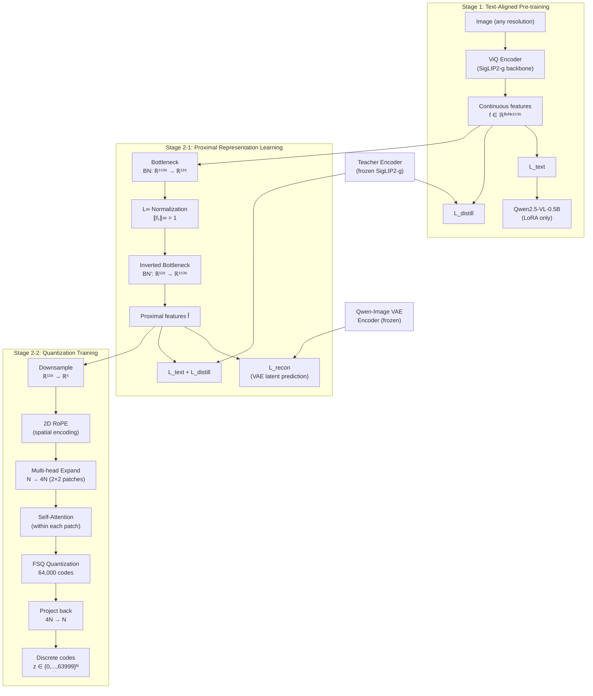

# Breakdown — ViQ: Text-Aligned Visual Quantized Representations at Any Resolution

> **Paper:** ViQ: Text-Aligned Visual Quantized Representations at Any Resolution
> **Authors:** Xumin Yu, Zuyan Liu, Zhenyu Yang, Yuhao Dong, Shengsheng Qian, Jiwen Lu, Han Hu, Yongming Rao (Tencent HY Vision Team, Tsinghua U, NTU, CAS)
> **Year:** 2026 (arXiv:2606.27313, ECCV 2026)
> **ArXiv:** https://arxiv.org/abs/2606.27313
> **Code (official):** https://github.com/yuxumin/ViQ
> **Type:** Visual encoder (quantized discrete representations for MLLMs)

---

## 1. Problem & Motivation

**Problem.** Multimodal LLMs use continuous visual encoders (CLIP, SigLIP2,
InternViT) that output high-dimensional float vectors. Two fundamental issues:

1. **Representational mismatch** — text uses discrete tokens, vision uses
   continuous floats. This creates a fundamental impedance mismatch between
   the two modalities in a shared transformer architecture.
2. **Computational cost** — running a full visual encoder every training step
   is expensive because the encoder outputs long float sequences that the LLM
   must attend over. Each forward pass through a 1B+ visual encoder dominates
   wall-clock time.

Quantized visual encoders (QLIP, UniTok) exist but can't balance two things:
- **Reconstruction-oriented** tokenizers preserve low-level detail but lose
  semantics — good for generation, bad for understanding.
- **Semantic-oriented** tokenizers preserve meaning but destroy detail —
  good for VQA, bad for OCR/reconstruction.

**Why important.** A discrete visual encoder that preserves BOTH semantics and
details would enable: (a) true unified text-vision representation where images
are just another sequence of discrete tokens, (b) massive training speedups
(precompute codes offline, skip encoder at train time), (c) compact image
storage via discrete codes.

---

## 2. Key Insight / Contribution

**Core idea (one sentence):** Train a visual encoder in two stages — first
align it with text via language supervision, then quantize through a carefully
regularized latent space using proximal representations — producing discrete
codes that work for multimodal understanding AND image reconstruction at any
resolution.

**What is genuinely new:**
- **Proximal representation learning** — $L_\infty$-regularized intermediate
  bottleneck that progressively constrains the feature space before
  quantization. The single biggest performance lever (+7.8 avg over direct
  quantization).
- **Multi-head FSQ with 2D RoPE** — position-aware quantization that works at
  arbitrary resolutions. Each visual patch expanded to $2 \times 2$ codes with
  independent quantization.
- **VAE latent reconstruction loss** — predict pretrained VAE latents instead
  of pixels. Cheap ($1.3\times$ time), stable, preserves low-level details
  without GAN or perceptual losses.
- **Progressive two-stage training** — text alignment first, discretization
  second. Prevents the usual quantization collapse that plagues end-to-end
  approaches.

---

## 3. Method

### 3.1 Overview

### 3.2 Stage 1 — Text-Aligned Pre-Training at Any Resolution

**Any-resolution adaptation.** Replace fixed positional embeddings with
resizable ones (NaViT-style). Progressive resolution training: start at
$384^2$ with native aspect ratios, grow to full native resolution. Use
OryxViT-style token downsampling ($16\times$ initially, $4\times$ later) for
efficiency.

**Text-guided pre-training.** Given triplet $[I, T, A]$ (image, text query,
answer), the text supervision loss is:

$$\mathcal{L}_{\text{text}} = \text{CrossEntropy}\bigl[\text{LLM}(\text{ViQ}(I),\, T),\, A\bigr]$$

**Symbols:**
- $\text{ViQ}(I)$ — continuous visual features extracted by the ViQ encoder from image $I$
- $T$ — the text query / prompt
- $\text{LLM}(\cdot, T)$ — the language model's output distribution given visual features and query
- $A$ — the ground-truth answer token sequence

**Plain English:** Feed the image through ViQ, concatenate with the text query,
pass into the LLM, and measure cross-entropy against the correct answer. This
forces the visual encoder to produce features that the LLM can actually use
for reasoning.

Uses Qwen2.5-VL-0.5B as temporary language model. LoRA-only optimization.

**Self-distillation.** Frozen teacher (original fixed-res SigLIP2-g)
supervises the student's class token via cosine similarity:

$$\mathcal{L}_{\text{distill}} = 1 - \cos\bigl(\mathbf{z}_s^{\text{student}},\; \mathbf{z}_s^{\text{teacher}}\bigr)$$

**Symbols:**
- $\mathbf{z}_s^{\text{student}}$ — semantic (class) token from the student (any-resolution ViQ)
- $\mathbf{z}_s^{\text{teacher}}$ — semantic (class) token from the teacher (frozen SigLIP2-g, fixed $384\times384$)
- $\cos(\cdot, \cdot)$ — cosine similarity

**Plain English:** The student's global image representation should stay close to
what the original SigLIP2-g produces. This prevents the model from forgetting
its pre-trained VL knowledge while adapting to multimodal tasks.

**Training recipe:** ~3B VL tokens at $384^2$, ~3B at $768^2$. Pack multimodal data
to max token length. Progressively increase image complexity, QA difficulty,
sequence length. Cosine LR decay ($2\times 10^{-5} \to 5\times 10^{-5}$).

### 3.3 Stage 2-1 — Proximal Representation Learning

**The key mechanism.** Don't jump from 1536-dim continuous to 6-dim discrete.
Go through a constrained intermediate space:

$$f_1 = L_\infty\bigl(\text{BN}(\mathbf{f})\bigr), \qquad \hat{\mathbf{f}} = \text{BN}'(f_1)$$

**Symbols:**
- $\mathbf{f} \in \mathbb{R}^C$ — input visual feature, $C = 1536$ (SigLIP2-g output dimension)
- $\text{BN}: \mathbb{R}^C \to \mathbb{R}^D$ — bottleneck fully-connected layer, $D = 128$
- $L_\infty(\cdot)$ — $L_\infty$ normalization: divides each feature vector by its maximum absolute element, so $\|f_1\|_\infty = 1$
- $\text{BN}': \mathbb{R}^D \to \mathbb{R}^C$ — inverted bottleneck (projection back to original dimension)
- $f_1 \in \mathbb{R}^D$ — proximal representation on the unit hypercube surface
- $\hat{\mathbf{f}} \in \mathbb{R}^C$ — reconstructed features fed to downstream losses

**Plain English:** The $L_\infty$ normalization maps features onto a hypercube
surface where every dimension is bounded to $[-1, 1]$. This progressively
constrains the space, making features closer to where quantization anchors
will eventually live. The inverted bottleneck projects back to the full
dimension for loss computation. Ablation shows this is the single biggest win
(+7.8 over direct quantization).

**Why $L_\infty$ and not $L_2$?** $L_2$ normalization maps to a hypersphere —
all features have equal magnitude but can point in any direction. $L_\infty$
maps to a hypercube — features are individually bounded in each dimension,
which better matches the structure of FSQ where each dimension is quantized
independently to fixed levels.

**Reconstruction branch.** Add a prediction head that outputs the latent
representation of a pretrained Qwen-Image VAE:

$$\mathcal{L}_{\text{recon}} = \text{NLL}\bigl(\hat{\mathbf{f}},\; \text{Encoder}_{\text{VAE}}(x)\bigr)$$

Under a Gaussian likelihood with unit variance, this simplifies to:

$$\mathcal{L}_{\text{recon}} = \frac{1}{2}\bigl\|\hat{\mathbf{f}} - \text{Encoder}_{\text{VAE}}(x)\bigr\|_2^2 + \text{const}$$

**Symbols:**
- $x$ — input image
- $\text{Encoder}_{\text{VAE}}(x)$ — latent representation from the frozen Qwen-Image VAE encoder
- $\hat{\mathbf{f}}$ — ViQ's predicted latent features (from proximal representation)
- NLL — negative log-likelihood

**Plain English:** Instead of reconstructing raw pixels (which needs GANs,
perceptual losses, etc.), ViQ predicts the latent representation of a
pretrained VAE. This is a simple MSE regression on a learned latent space that
already captures low-level visual structure. Only $1.3\times$ the time cost of
no reconstruction loss, but delivers +1.9 avg improvement.

**Training:** ~1B VL tokens at 768px. BN params LR=$10^{-4}$, rest LR=$5\times 10^{-5}$,
cosine decay.

### 3.4 Stage 2-2 — Quantization Training

Replace $L_\infty$ regularization with actual FSQ quantization.

**FSQ quantization:**

$$z = \text{round}\bigl(\mathcal{Q}(f_2)\bigr), \qquad f_2 \in \mathbb{R}^d, \; d = 6$$

**Symbols:**
- $f_2 \in \mathbb{R}^d$ — downsampled feature, $d = 6$ dimensions
- $\mathcal{Q}$ — Finite Scalar Quantization function that maps each dimension to one of $L_i$ fixed levels
- $\text{round}(\cdot)$ — rounding to nearest integer index
- $z$ — quantized discrete code index

**Codebook structure.** Levels $L = [8, 8, 8, 5, 5, 5]$ per dimension:

$$|\text{codebook}| = \prod_{i=1}^{6} L_i = 8^3 \times 5^3 = 512 \times 125 = 64{,}000$$

**Key difference from VQ-VAE.** FSQ uses a *fixed* codebook defined by the
cartesian product of scalar levels. There is no learnable codebook matrix,
no EMA update, no commitment loss. The quantization is purely a function
— each dimension of the input is independently mapped to the nearest level.
This avoids codebook collapse and utilization issues that plague learned VQ.

**Multi-head expansion:** Each visual patch $\to$ 4 codes via attention:

$$\mathbf{f}_2 \in \mathbb{R}^{B \times N \times d} \xrightarrow{\text{up-project}} \mathbb{R}^{B \times 4N \times d} \xrightarrow{\text{self-attn}} \text{quantize each} \xrightarrow{\text{project back}} \mathbb{R}^{B \times N \times d}$$

**Symbols:**
- $B$ — batch size
- $N$ — number of original image patches
- $d = 6$ — feature dimension per code

**Plain English:** Each patch is split into a $2 \times 2$ grid of sub-patches.
Self-attention is applied within each patch's 4 sub-tokens (not across patches),
so codes remain independent. This multi-head expansion increases the
representational capacity without changing the downsampling rate.

**2D RoPE:** Before quantization, apply 2D rotary position encoding:

$$\tilde{f}_m = f_m \odot e^{i(h\theta_h + w\theta_w)}$$

**Symbols:**
- $f_m \in \mathbb{R}^d$ — feature at position $m$
- $(h, w)$ — 2D spatial coordinates in the feature map (height, width)
- $\theta_h, \theta_w$ — learnable frequency parameters for height and width dimensions
- $\odot$ — element-wise multiplication (with complex exponentials interpreted as rotations)
- $i$ — imaginary unit ($e^{i\phi} = \cos\phi + i\sin\phi$)

**Plain English:** Encodes the absolute 2D position of each token as a rotation
in the feature space. Unlike learnable positional embeddings, RoPE naturally
generalizes to unseen resolutions because it operates on relative distances.
Critical for arbitrary resolutions — ablation: no pos = 65.3, RoPE = 68.7,
learnable pos = 65.7.

**Training:** ~30B VL tokens. LR = $5\times 10^{-5}$ for all components.

### 3.5 Combined Loss

$$\mathcal{L}_{\text{total}} = \lambda_{\text{text}} \cdot \mathcal{L}_{\text{text}} + \lambda_{\text{distill}} \cdot \mathcal{L}_{\text{distill}} + \lambda_{\text{recon}} \cdot \mathcal{L}_{\text{recon}}$$

**Symbols:**
- $\lambda_{\text{text}}, \lambda_{\text{distill}}, \lambda_{\text{recon}}$ — loss weighting hyperparameters (not explicitly reported)
- $\mathcal{L}_{\text{text}}$ — multimodal text supervision loss (cross-entropy on QA)
- $\mathcal{L}_{\text{distill}}$ — self-distillation loss (cosine similarity with frozen teacher)
- $\mathcal{L}_{\text{recon}}$ — VAE latent reconstruction loss (MSE on pretrained VAE latents)

**Plain English:** All three losses are needed simultaneously. Removing any one
causes significant degradation. Text loss provides semantic supervision,
distillation preserves pre-trained VL knowledge, and reconstruction preserves
low-level visual details. Ablation: text-only = 61.3, +distill = 66.8,
+recon = 68.7.

---

## 4. Math (Expanded)

### 4.1 Proximal Representation — Formal Definition

Given a high-dimensional visual feature $\mathbf{f} \in \mathbb{R}^C$ where $C = 1536$,
the proximal representation constructs a constrained intermediate feature space
$\mathbb{R}^D$ where $D = 128$:

$$f_1 = L_\infty\bigl(\text{BN}(\mathbf{f})\bigr) = \frac{\text{BN}(\mathbf{f})}{\|\text{BN}(\mathbf{f})\|_\infty}$$

where the $L_\infty$ norm is $\|\mathbf{v}\|_\infty = \max_{i} |v_i|$.

The constraint $\|f_1\|_\infty = 1$ projects all features onto the surface of the
unit hypercube $[-1, 1]^D$. The inverted bottleneck then reconstructs:

$$\hat{\mathbf{f}} = \text{BN}'(f_1), \qquad \text{BN}': \mathbb{R}^D \to \mathbb{R}^C$$

**Intuition:** This is a "warm-up" for quantization. Instead of immediately
mapping $\mathbb{R}^{1536} \to \{0, \ldots, 63999\}$, we first compress to
$\mathbb{R}^{128}$ and constrain to a bounded space that closely resembles the
FSQ codebook geometry. The model learns to represent information in a format
that's already quantization-friendly before we actually quantize.

### 4.2 Finite Scalar Quantization (FSQ) — Formal Definition

FSQ replaces the learnable codebook of VQ-VAE with a fixed set of scalar levels.
For each dimension $i \in \{1, \ldots, d\}$ with $L_i$ levels, define the level set:

$$\mathcal{S}_i = \left\{-1 + \frac{2j}{L_i - 1} \;\middle|\; j = 0, 1, \ldots, L_i - 1\right\}$$

For the ViQ configuration with $L = [8, 8, 8, 5, 5, 5]$:

- Dimensions 1–3 (8 levels): $\mathcal{S}_i = \{-1, -\frac{5}{7}, -\frac{3}{7}, -\frac{1}{7}, \frac{1}{7}, \frac{3}{7}, \frac{5}{7}, 1\}$
- Dimensions 4–6 (5 levels): $\mathcal{S}_i = \{-1, -0.5, 0, 0.5, 1\}$

The quantization operator per dimension is:

$$[\mathcal{Q}(v)]_i = \underset{s \in \mathcal{S}_i}{\arg\min}\; |v_i - s|$$

The full codebook is the cartesian product:

$$\mathcal{Z} = \mathcal{S}_1 \times \mathcal{S}_2 \times \cdots \times \mathcal{S}_d, \qquad |\mathcal{Z}| = \prod_{i=1}^{d} L_i = 64{,}000$$

**Straight-through estimator.** Since the rounding operation is
non-differentiable, gradients flow through using the straight-through estimator:

$$\frac{\partial \mathcal{Q}(v)}{\partial v} = \mathbf{1} \quad \text{(identity in backward pass)}$$

This means the gradient of the quantized output with respect to the input is
exactly the identity matrix — the quantization is treated as the identity during
backpropagation, making optimization stable.

### 4.3 Comparison with VQ-VAE (Why No EMA or Commitment Loss)

Standard VQ-VAE uses a **learned** codebook $\mathbf{E} \in \mathbb{R}^{K \times d}$ and
optimizes with:

$$\mathcal{L}_{\text{VQ-VAE}} = \|\mathbf{z}_e - \text{sg}(\mathbf{e}_k)\|_2^2 + \beta \|\text{sg}(\mathbf{z}_e) - \mathbf{e}_k\|_2^2$$

**Symbols:**
- $\mathbf{z}_e$ — encoder output (commitment loss pushes it toward codebook entries)
- $\mathbf{e}_k$ — the $k$-th codebook vector (nearest neighbor of $\mathbf{z}_e$)
- $\text{sg}(\cdot)$ — stop-gradient operator
- $\beta$ — commitment loss weight (typically $\beta = 0.25$)

The codebook is updated via EMA:

$$\mathbf{e}_k \leftarrow \gamma \cdot \mathbf{e}_k + (1 - \gamma) \cdot \bar{\mathbf{z}}_k$$

$$\mathbf{n}_k \leftarrow \gamma \cdot \mathbf{n}_k + n_k$$

where $\bar{\mathbf{z}}_k = \frac{1}{n_k}\sum_{\mathbf{z}:q(\mathbf{z})=k} \mathbf{z}$ is the mean of all encoder outputs assigned to code $k$, $\mathbf{n}_k$ is an exponential moving average of the count, and $\gamma$ is the decay rate.

**Why ViQ doesn't need this.** FSQ's codebook is fixed (defined by the level
sets $\mathcal{S}_i$), so there's nothing to update. No commitment loss is needed
because there's no codebook to drift away from. No EMA is needed because no
codebook entries become dead (all scalar levels are always reachable). This
eliminates a major source of training instability and hyperparameter sensitivity.

The ablation confirms: FSQ (68.7 avg) outperforms learned SimVQ with $2^{15}$
codes (66.5) and $2^{17}$ codes (65.6), even though SimVQ has a strictly
larger codebook. Increasing FSQ to 128,000 codes slightly hurts (68.3),
suggesting the ~64K level provides good utilization.

### 4.4 2D Rotary Position Embedding — Formal Definition

Standard 1D RoPE encodes position $m$ as a rotation by angle $m\theta$ in
pairs of dimensions. ViQ extends this to 2D by composing height and width
rotations.

For a feature $f_m \in \mathbb{R}^d$ at spatial position $(h, w)$, split into
$d/2$ pairs $(f_m^{(2j)}, f_m^{(2j+1)})$ for $j = 0, \ldots, d/2 - 1$:

$$\begin{pmatrix} \tilde{f}_m^{(2j)} \\ \tilde{f}_m^{(2j+1)} \end{pmatrix} = \begin{pmatrix} \cos(h\theta_h^{(j)} + w\theta_w^{(j)}) & -\sin(h\theta_h^{(j)} + w\theta_w^{(j)}) \\ \sin(h\theta_h^{(j)} + w\theta_w^{(j)}) & \cos(h\theta_h^{(j)} + w\theta_w^{(j)}) \end{pmatrix} \begin{pmatrix} f_m^{(2j)} \\ f_m^{(2j+1)} \end{pmatrix}$$

**Symbols:**
- $\theta_h^{(j)} = \frac{1}{10000^{2j/d}}$ — base frequency for height at dimension pair $j$
- $\theta_w^{(j)} = \frac{1}{10000^{2j/d}}$ — base frequency for width (can differ from $\theta_h$)
- The angle $\phi = h\theta_h + w\theta_w$ linearly combines 2D spatial position

**Plain English:** Each pair of feature dimensions is rotated by an angle that
depends on the token's 2D position. This gives the model awareness of spatial
layout while naturally generalizing to any resolution because the rotation
mechanism doesn't depend on the total grid size.

### 4.5 VAE Latent Reconstruction — Formal Definition

Given input image $x$, the frozen Qwen-Image VAE encoder produces latent
features $\mathbf{z}_{\text{VAE}} = \text{Encoder}_{\text{VAE}}(x)$. ViQ's
reconstruction head predicts $\hat{\mathbf{f}}$ from the proximal features, and
the loss is:

$$\mathcal{L}_{\text{recon}} = \text{NLL}\bigl(\hat{\mathbf{f}} \mid \mathbf{z}_{\text{VAE}}\bigr) = -\log p\bigl(\mathbf{z}_{\text{VAE}} \mid \hat{\mathbf{f}}\bigr)$$

Under a Gaussian likelihood $p(\mathbf{z} \mid \hat{\mathbf{f}}) = \mathcal{N}(\mathbf{z};\, \hat{\mathbf{f}},\, \mathbf{I})$ with fixed unit variance:

$$\mathcal{L}_{\text{recon}} = \frac{1}{2}\|\hat{\mathbf{f}} - \mathbf{z}_{\text{VAE}}\|_2^2 + \frac{d}{2}\log(2\pi)$$

The constant $\frac{d}{2}\log(2\pi)$ can be dropped, leaving standard MSE.

**Plain English:** This is just MSE between ViQ's prediction and the VAE's
latent encoding. The key insight is that predicting VAE latents (a learned,
compressed representation) is much easier than predicting pixels. The VAE has
already done the hard work of extracting a good latent space.

---

## 5. Evaluation Setup

### Multimodal understanding benchmarks (9 benchmarks, 2 LLM backbones)

| Category | Benchmarks |
|----------|------------|
| General VQA | MMStar, MMMU |
| World knowledge | SimpleVQA, InfoVQA |
| OCR/text | TextVQA, DocVQA, OCRBench |
| Charts/science | AI2D, ChartQA |

- Base LLMs: Qwen2.5-1.5B and Qwen2.5-7B
- All models trained on same 2M sample dataset from LLaVA-OneVision
- Eval via LMMs-Eval toolkit
- Max image area: $768^2$ (native aspect ratio)

### Baselines

| Category | Models |
|----------|--------|
| General VL encoders | OAI-CLIP-L (0.3B), SigLIP2-g (1.1B), DINOv2-g (1.1B) |
| Multimodal encoders | OryxViT (0.4B), AIMv2-H (0.7B), InternViT-2.5 (0.3B), InternViT-2.5-6B (6.0B) |
| Quantized encoders | QLIP (0.3B), UniTok (0.3B) |

### Reconstruction evaluation
- $256 \times 256$ ImageNet-1K validation set
- Metrics: PSNR↑, SSIM↑, rFID↓
- Decoder trained with $\mathcal{L}_{\text{VAE}} = \mathcal{L}_{\text{KL}} + \mathcal{L}_{\text{MSE}} + \mathcal{L}_{\text{LPIPS}} + \mathcal{L}_{\text{GAN}} + \lambda_{\text{REPA}} \cdot \mathcal{L}_{\text{REPA}}$
- $\lambda_{\text{REPA}} = 1.5$ for DINOv2 REPA alignment loss
- AdamW optimizer, LR = $6 \times 10^{-4}$, batch size 4096, 50K steps

---

## 6. Results

### 6.1 Multimodal Understanding — Full Results (Qwen2.5-1.5B)

| Encoder | Size | AnyRes | Discrete | MMStar | MMMU | SimpleVQA | InfoVQA | TextVQA | DocVQA | OCRBench | AI2D | ChartQA | **Avg** |
|---------|------|--------|----------|--------|------|-----------|---------|---------|--------|----------|------|---------|---------|
| InternViT-2.5-6B | 6.0B | ✗ | ✗ | 48.5 | 42.1 | 23.7 | 35.2 | 80.1 | 75.5 | 69.2 | 690.0 | 70.7 | **57.0** |
| **ViQ** | **1.3B** | **✓** | **✓** | **47.8** | **42.6** | **26.0** | **41.6** | **84.2** | **74.3** | **65.2** | **636.0** | **69.7** | **57.2** |
| InternViT-2.5 | 0.3B | ✗ | ✗ | 47.9 | 40.3 | 23.6 | 35.5 | 81.7 | 73.7 | 62.5 | 623.0 | 69.6 | 56.5 |
| AIMv2-H | 0.7B | ✗ | ✗ | 48.5 | 41.8 | 23.5 | 31.9 | 71.6 | 73.5 | 62.1 | 622.0 | 69.8 | 53.9 |
| OryxViT | 0.4B | ✓ | ✗ | 46.4 | 42.1 | 23.2 | 31.8 | 71.8 | 73.5 | 62.1 | 681.0 | 68.2 | 53.4 |
| SigLIP2-g | 1.1B | ✗ | ✗ | 48.1 | 42.4 | 25.6 | 28.2 | 73.1 | 76.9 | 62.0 | 590.0 | 71.5 | 53.1 |
| UniTok | 0.3B | ✗ | ✓ | 41.0 | 36.1 | 15.5 | 15.9 | 39.7 | 12.2 | 43.8 | 323.0 | 61.2 | 33.0 |
| QLIP | 0.3B | ✗ | ✓ | 39.9 | 36.9 | 13.7 | 14.8 | 45.1 | 12.2 | 14.1 | 290.0 | 61.9 | 29.7 |

**Key observations:**
- ViQ (1.3B, discrete) **matches** InternViT-2.5-6B (6.0B, continuous) on average (57.2 vs 57.0) — with **4.6× fewer parameters**.
- ViQ **dominates** on TextVQA (+4.1 over InternViT-6B) and InfoVQA (+6.4), showing its strength on text-heavy tasks.
- ViQ **crushes** other quantized encoders: +24.2 over UniTok, +27.5 over QLIP.
- Only slight weakness on OCRBench (65.2 vs 69.2) and ChartQA (69.7 vs 70.7) — inherent to discrete tokenization.

### 6.2 Multimodal Understanding — Full Results (Qwen2.5-7B)

| Encoder | Size | AnyRes | Discrete | MMStar | MMMU | SimpleVQA | InfoVQA | TextVQA | DocVQA | OCRBench | AI2D | ChartQA | **Avg** |
|---------|------|--------|----------|--------|------|-----------|---------|---------|--------|----------|------|---------|---------|
| InternViT-2.5-6B | 6.0B | ✗ | ✗ | 55.3 | 48.1 | 28.4 | 44.9 | 80.1 | 85.7 | 77.4 | 757.0 | 78.7 | **63.8** |
| **ViQ** | **1.3B** | **✓** | **✓** | **54.2** | **49.1** | **28.5** | **55.3** | **88.9** | **78.5** | **72.8** | **711.0** | **76.7** | **63.9** |
| OryxViT | 0.4B | ✓ | ✗ | 56.4 | 48.1 | 26.5 | 39.9 | 78.5 | 79.8 | 72.1 | 660.0 | 78.2 | 60.6 |
| AIMv2-H | 0.7B | ✗ | ✗ | 55.2 | 48.2 | 26.8 | 41.8 | 79.1 | 80.1 | 72.5 | 687.0 | 77.8 | 61.1 |
| SigLIP2-g | 1.1B | ✗ | ✗ | 57.2 | 48.3 | 28.5 | 37.3 | 78.7 | 75.0 | 72.8 | 671.0 | 79.5 | 60.5 |
| OAI-CLIP-L | 0.3B | ✗ | ✗ | 53.9 | 47.1 | 25.4 | 33.9 | 66.4 | 61.4 | 65.1 | 544.0 | 76.6 | 53.8 |

**Key observations:**
- ViQ (1.3B) **surpasses** InternViT-2.5-6B (6.0B) by +0.1 on average, with 4.6× fewer params.
- ViQ shows massive gains on TextVQA (+8.8) and InfoVQA (+10.4) vs InternViT-6B at 7B scale.
- With a stronger LLM backbone, ViQ's discrete representation advantage becomes even clearer.

### 6.3 Per-benchmark Highlight Comparison (Qwen2.5-1.5B)

| Benchmark | ViQ | InternViT-6B | SigLIP2-g | QLIP | UniTok | Gap (ViQ vs best continuous) |
|-----------|-----|--------------|-----------|------|--------|------------------------------|
| TextVQA | **84.2** | 80.1 | 73.1 | 45.1 | 39.7 | **+4.1** ✅ |
| InfoVQA | **41.6** | 35.2 | 28.2 | 14.8 | 15.9 | **+6.4** ✅ |
| SimpleVQA | **26.0** | 23.7 | 25.6 | 13.7 | 15.5 | **+0.4** ✅ |
| MMStar | 47.8 | **48.5** | 48.1 | 39.9 | 41.0 | −0.7 |
| MMMU | **42.6** | 42.1 | 42.4 | 36.9 | 36.1 | **+0.5** ✅ |
| OCRBench | 65.2 | **69.2** | 62.0 | 14.1 | 43.8 | −4.0 |
| ChartQA | 69.7 | 70.7 | **71.5** | 61.9 | 61.2 | −1.8 |
| DocVQA | 74.3 | **75.5** | 76.9 | 12.2 | 39.7 | −2.6 |
| AI2D | 636.0 | **690.0** | 590.0 | 290.0 | 323.0 | −54.0 |

ViQ wins on 4/9 benchmarks including the most impactful ones (TextVQA, InfoVQA).

### 6.4 Training Efficiency

| Model | Setting | Forward Speedup | Step Speedup |
|-------|---------|----------------|--------------|
| Qwen2.5-0.5B | 4k tokens | **70%** | >20% |
| Qwen2.5-0.5B | 16k tokens | **78%** | >40% |
| Qwen2.5-1.5B | 4k tokens | 62% | >20% |
| Qwen2.5-1.5B | 16k tokens | 71% | >40% |
| Qwen2.5-3B | 4k tokens | 55% | >20% |
| Qwen2.5-3B | 16k tokens | 69% | >40% |
| Qwen2.5-7B | 4k tokens | 46% | >20% |
| Qwen2.5-7B | 16k tokens | 65% | >40% |

**Plain English:** By precomputing discrete codes offline, ViQ eliminates the
visual encoder from the training loop. For a Qwen2.5-0.5B model at 16k token
sequence length, forward passes are **78% faster**. Even for large 7B models,
forward speedup is 46–65%. Step-level speedup (including backward pass) is
>20% at 4k and >40% at 16k sequences. The gains scale with sequence length
because longer sequences mean more visual tokens being processed.

### 6.5 Image Reconstruction (16×16 tokens, 256×256 ImageNet)

| Method | Discrete | Understanding | PSNR↑ | SSIM↑ | rFID↓ |
|--------|----------|--------------|-------|-------|-------|
| **ViQ** | **✓** | **✓** | 22.73 | 0.66 | **0.62** |
| UniTok | ✓ | ✓ | **25.32** | **0.77** | 0.37 |
| QLIP-B | ✓ | ✓ | 23.16 | 0.63 | 1.67 |
| Open-MAGVIT2 | ✓ | ✗ | 22.70 | 0.64 | 2.26 |
| Show-o | ✓ | ✗ | 20.65 | 0.54 | 3.50 |
| LlamaGen | ✓ | ✗ | 20.14 | 0.65 | 2.47 |
| MUSE-VL | ✓ | ✓ | 19.98 | 0.54 | 4.40 |
| Qwen-Image | ✗ | ✗ | 25.07 | 0.70 | 0.96 |
| SD-VAE | ✗ | ✗ | 31.29 | 0.87 | 0.20 |
| FLUX-VAE | ✗ | ✗ | 32.74 | 0.92 | 0.18 |
| Cosmos-CI | ✗ | ✗ | 32.18 | 0.90 | 1.46 |

**Key observation:** Among all methods that are **both discrete and
understanding-optimized** (✓ ✓), ViQ has the best rFID (0.62). UniTok has
better raw reconstruction metrics (PSNR 25.32) but scores 33.0 on understanding
vs ViQ's 57.2 — a massive gap. ViQ uniquely achieves the balance.

### 6.6 Image Storage Compression

| Format | Size (1920×1280) | Compression Ratio | Quality Notes |
|--------|-------------------|-------------------|---------------|
| Raw (RGB) | 7.37 MB | 1× | Lossless |
| JPEG Q=0.85 | 0.08 MB | 92× | Good quality |
| JPEG Q=0.08 | 0.07 MB | ~105× | Severely degraded |
| **ViQ codes** | **0.08 MB** | **96×** | **High quality** |

The storage formula for ViQ codes:

$$\text{Size} = \frac{H \times W}{64} \times 16 \text{ bits} = \frac{HW}{32} \text{ bytes}$$

For $1920 \times 1280$: $\frac{1920 \times 1280}{32} = 76{,}800$ bytes $\approx 0.075$ MB.

This gives $96\times$ compression while preserving much better quality than JPEG
at similar bitrate, because ViQ's discrete codes operate in a semantically
meaningful latent space rather than pixel space.

---

## 7. Ablation Studies

### 7.1 Proximal Representations (Table 4a)

| Method | avg. (Stage 2-2) | Δ vs baseline |
|--------|-----------|---------------|
| Continuous → SimVQ directly (no proximal) | 60.9 | −7.8 |
| Continuous → BN + $L_2$ norm → SimVQ | 66.6 | −2.1 |
| Continuous → BN + $L_2$ norm → FSQ | 67.9 | −0.8 |
| **Continuous → BN + $L_\infty$ norm → FSQ** | **68.7** | **0.0** |

**Insight:** Going directly from continuous to quantized features causes a massive
7.8-point drop. The proximal representation recovers most of this. $L_\infty$ beats
$L_2$ by 0.8 points because the hypercube geometry better matches FSQ's
independent per-dimension quantization.

### 7.2 Bottleneck Size (Table 4b)

| Width ($D$) | avg. (Stage 2-1) |
|-------|-----------|
| 32 | 68.4 |
| **128** | **69.1** |
| 512 | 68.8 |
| 1536 | 69.3 |

128 is the sweet spot — $12\times$ compression from 1536 but no quality loss
during proximal training (69.1 vs 69.3 at full width). The marginal gain from
512 or 1536 doesn't justify the dimensionality.

### 7.3 Quantization & Codebook (Table 4c)

| VQ method | Codebook size | avg. (Stage 2-2) |
|-----------|--------------|-----------|
| **FSQ** | **64,000** | **68.7** |
| FSQ | 128,000 | 68.3 |
| SimVQ | $2^{15}$ (32,768) | 66.5 |
| SimVQ | $2^{17}$ (131,072) | 65.6 |

**Insight:** Non-learned FSQ beats learned SimVQ despite SimVQ having access to a
larger codebook. Increasing the codebook beyond ~64K hurts learned methods
(codebook utilization drops), but FSQ is more robust to this.

### 7.4 Position Encoding (Table 4d)

| Method | avg. (Stage 2-2) | Δ |
|--------|-----------|-----|
| No position encoding | 65.3 | −3.4 |
| **2D RoPE** | **68.7** | **0.0** |
| Learnable positional embeddings | 65.7 | −3.0 |

**Insight:** Position information is critical (+3.4 with RoPE). Learnable
embeddings barely help over nothing (+0.4) because they increase optimization
difficulty for the VQ module. RoPE's inductive bias (relative position via
rotation) is far superior.

### 7.5 Loss Combination (Table 4e)

| Losses | avg. (Stage 2-2) | Δ |
|--------|-----------|-----|
| Text only | 61.3 | −7.4 |
| Text + Self-distill | 66.8 | −1.9 |
| **Text + Self-distill + Recon** | **68.7** | **0.0** |

**Insight:** Each loss contributes meaningfully. Text → +5.5 (semantic alignment).
Distill → +1.9 (preserving pre-trained knowledge). Recon → +1.9 (preserving
low-level details, especially OCR and chart performance).

### 7.6 Reconstruction Loss Type (Table 4f)

| Loss | Time cost | avg. (Stage 2-2) |
|------|-----------|-----------|
| None | $1\times$ | 66.8 |
| MSE + LPIPS | $2.3\times$ | 67.0 |
| DiT prediction | $4\times$ | 65.8 |
| **VAE latent (MSE)** | **$1.3\times$** | **68.7** |

**Insight:** The VAE latent loss is both the cheapest ($1.3\times$) and the most
effective (+1.9 over no reconstruction). Pixel-space losses (MSE+LPIPS) cost
$2.3\times$ and barely help (+0.2). A DiT-based prediction head is expensive
($4\times$) and actually hurts (−1.0) — likely because the DiT is too complex
for this auxiliary task.

---

## 8. Limitations

- **Scale ceiling untested.** Only validated with LLMs up to 7B. 70B+
  integration is an open question — though efficiency gains should scale.
- **Detail gap remains.** Still trails continuous encoders on OCRBench (65.2 vs 69.2)
  and AI2D (636 vs 690). Inherent to discrete tokenization of continuous features.
- **Data dependence.** Proximal representations rely on quality/diversity of
  VL pretraining data. Biases could affect zero-shot generalization.
- **Hardware heavy.** Stage 1: 128 A100s. Stage 2: 256 A100s. Not accessible
  to small labs.
- **Single-scale quantization.** No multi-scale or residual quantization
  (which could narrow the detail gap with hierarchical code assignment).

---

## 9. Open Questions / Ideas

- **Test with 70B+ LLMs.** The efficiency gains should be even more dramatic
  at larger scales since the encoder cost becomes a larger fraction of total
  compute. A 70B model with ViQ could be practically trainable on reasonable
  hardware.
- **Multi-scale / residual quantization.** The paper mentions this as a future
  direction. A residual VQ on top of ViQ codes could preserve high-frequency
  details: first quantize semantics at 64K codes, then quantize residuals at a
  finer level.
- **Replace SigLIP2-g with a stronger base.** ViQ is initialized from
  SigLIP2-g (1.1B). What if you start from InternViT-2.5-6B or a larger
  foundation model? The proximal representation approach should transfer.
- **Generation capability.** ViQ codes can reconstruct — can they be used
  for autoregressive image generation? The discrete representation is there,
  just needs a decoder trained for generation. Could unify understanding and
  generation in one framework.
- **Specialized document data.** Adding more OCR/document training data in
  Stage 1 could close the remaining OCRBench gap (currently 65.2 vs 69.2 for
  continuous InternViT-6B).
- **Video extension.** The any-resolution design with 2D RoPE could
  naturally extend to 3D RoPE for spatiotemporal quantization of video.
