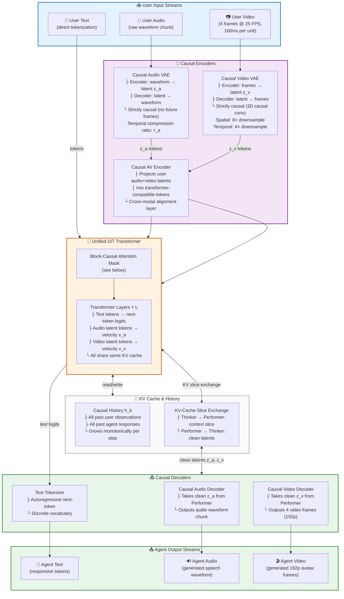
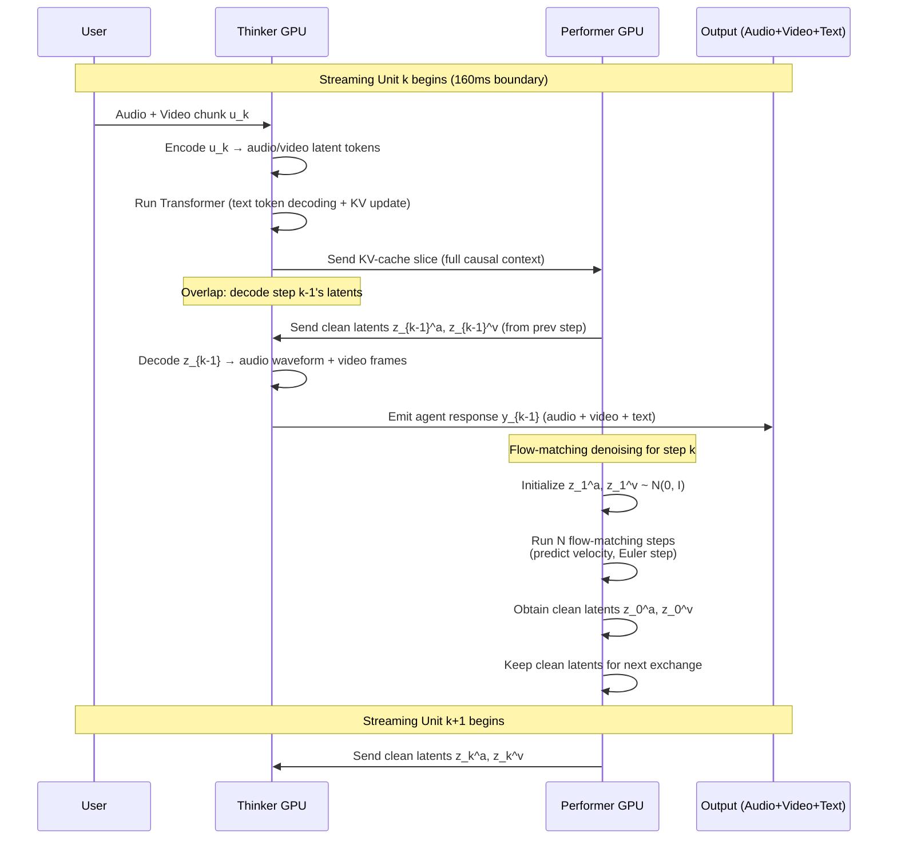
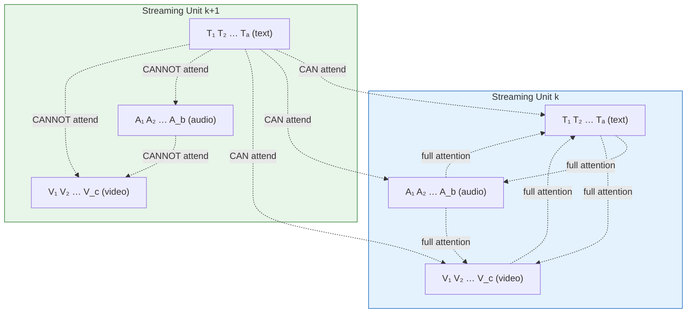
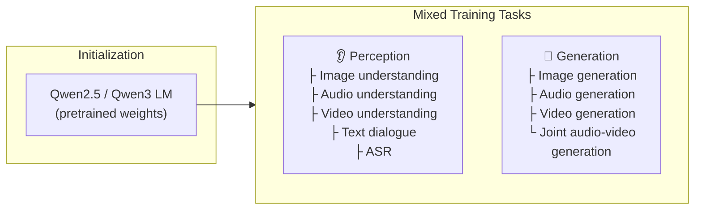
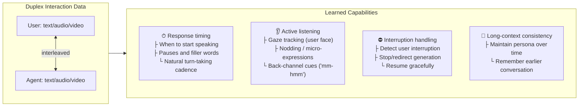
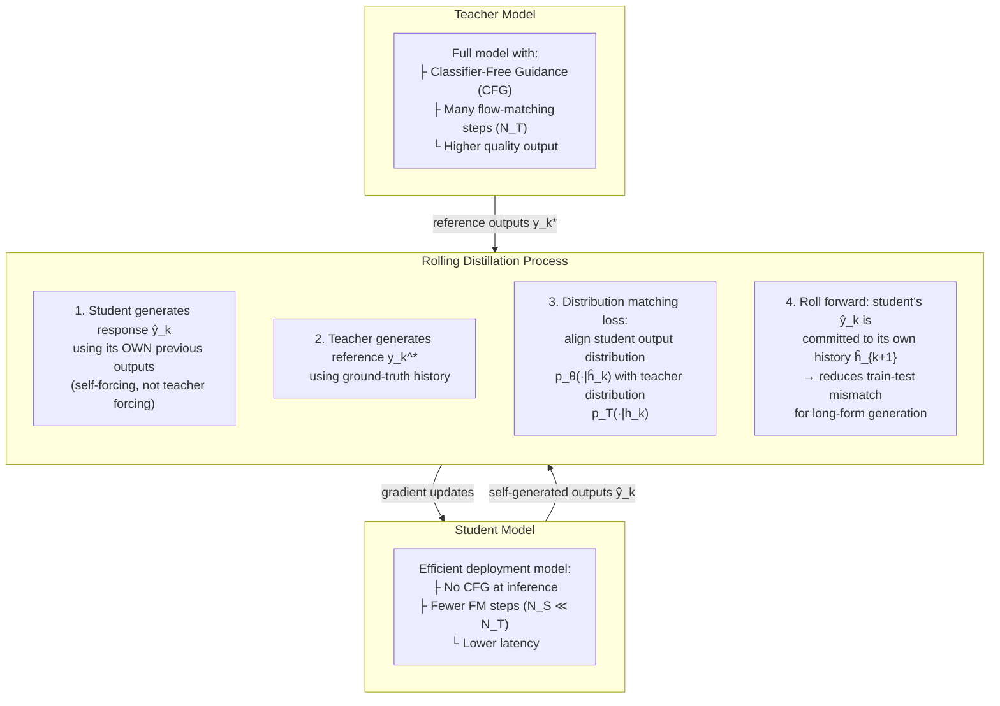

# Wan-Streamer v0.1 — Full Breakdown

**Paper:** Wan-Streamer v0.1: End-to-end Real-time Interactive Foundation Models
**Authors:** Wan Team (Alibaba Group), June 2026
**ArXiv:** https://arxiv.org/abs/2606.25041
**Project:** https://wan-streamer.com/

---

## Problem & Motivation

Building AI systems that interact with humans in real time the way humans interact with each other — continuously, with overlapping speech, gestures, and listening behavior — is fundamentally different from building a good language model or a good video generator.

**Why existing approaches fall short:**

| Approach | Problem |
|----------|---------|
| Cascaded ASR → LLM → TTS → Avatar | Latency accumulates across module boundaries; no native audio-visual sync |
| Speech-only full-duplex (Moshi, GPT-4o voice) | No visual agent output — can't show listening behavior, facial expressions |
| Audio-driven avatar renderers (VASA-1, StreamAvatar) | Fast at rendering but depend on external dialogue/speech modules — true latency is hidden |
| Omni-modal models (Qwen-Omni, MiniCPM-o) | Accept audio/video input but only output speech/text — no synchronized video response |

**Core insight:** Real-time audio-visual interaction isn't just the union of understanding + generation. It's *intrinsically full-duplex*: when the user speaks, the agent should still show visible listening behavior; when the agent responds, it should still perceive the user for interruption and adaptation. Streamability must be a modeling constraint from the start.

---

## Key Insight

> Design every component for causality from the beginning, model all modalities in one Transformer, and the system naturally achieves low-latency full-duplex interaction without pipeline hacks.

The three pillars:
1. **Single Transformer** for language, audio, and video (input and output) — no external modules
2. **Strictly causal stack** — VAEs, encoders, decoders, attention — everything processes left-to-right
3. **Streaming contract** — every observed unit is usable immediately, every generated unit is emitted and committed back to history

---

## Method

### Overview

At each streaming step $k$, the model sees:
- **User observations:** $\mathbf{u}_k = (\text{text}, \text{audio}, \text{video})$ — what the user just said/did
- **Causal history:** all past user observations + all past agent responses

It produces:
- **Agent response:** $\mathbf{y}_k = (\text{text}, \text{audio}, \text{video})$ — what the agent says/does next

The entire interaction is modeled as one long causal sequence of interleaved multimodal tokens.

### Formal Streaming Model (Eq. 1)

The full interaction probability decomposes autoregressively over streaming units:

$$
p\bigl(\mathbf{y}_{1:K} \mid \mathbf{u}_{1:K}\bigr) = \prod_{k=1}^{K} p\bigl(\mathbf{y}_k \mid \mathbf{y}_{<k},\, \mathbf{u}_{\leq k}\bigr)
$$

where $\mathbf{u}_{\leq k} = (\mathbf{u}_1, \dots, \mathbf{u}_k)$ are user observations up to step $k$ and $\mathbf{y}_{<k} = (\mathbf{y}_1, \dots, \mathbf{y}_{k-1})$ are all prior agent responses committed to the causal history $\mathbf{h}_k$:

$$
\mathbf{h}_k = \bigl[\mathbf{u}_1,\; \mathbf{y}_1,\; \mathbf{u}_2,\; \mathbf{y}_2,\; \dots,\; \mathbf{u}_k\bigr]
$$

Each response $\mathbf{y}_k$ is jointly distributed over text, audio, and video:

$$
p\bigl(\mathbf{y}_k \mid \mathbf{h}_k\bigr) = p\bigl(\mathbf{y}_k^{\text{text}} \mid \mathbf{h}_k\bigr) \cdot p\bigl(\mathbf{y}_k^{\text{audio}}, \mathbf{y}_k^{\text{video}} \mid \mathbf{h}_k, \mathbf{y}_k^{\text{text}}\bigr)
$$

Text is generated autoregressively (discrete next-token prediction), while audio and video are generated jointly via conditional flow matching (continuous latent denoising).

---

### Architecture — Detailed Mermaid Diagram



### Thinker–Performer Inference Pipeline (Detailed)



**Key architectural components:**

1. **Causal Audio VAE** — compresses audio into a latent space that can be processed strictly left-to-right. Uses causal convolutional encoder with temporal compression ratio $\tau_a$.
2. **Causal Video VAE** — same idea for video frames. Uses 3D causal convolutions with $8\times$ spatial and $4\times$ temporal downsampling. Input: 4 frames at 25 FPS (160ms chunks).
3. **Causal Audio-Visual Encoders** — project user observation latents into tokens compatible with the Transformer, with cross-modal alignment.
4. **Unified DiT/Transformer** — one model with block-causal attention that processes:
   - Text tokens (discrete, next-token prediction)
   - Audio latent tokens (continuous, flow matching)
   - Video latent tokens (continuous, flow matching)
   - All interleaved in one causal sequence
5. **Causal Audio & Video Decoders** — convert generated latents back to waveforms/pixels

---

### Block-Causal Attention — Formal Definition

Given a streaming unit $k$ containing tokens from $M$ modalities, let the token sequence for unit $k$ be:

$$
\mathbf{X}_k = \bigl[\underbrace{x_k^{(1)}, \dots, x_k^{(1)}_{T_1}}_{\text{text}},\; \underbrace{x_k^{(2)}, \dots, x_k^{(2)}_{T_2}}_{\text{audio}},\; \underbrace{x_k^{(3)}, \dots, x_k^{(3)}_{T_3}}_{\text{video}}\bigr]
$$

where $T_m$ is the number of tokens for modality $m$ in unit $k$. The full sequence up to step $k$ is:

$$
\mathbf{X}_{\leq k} = [\mathbf{X}_1, \mathbf{X}_2, \dots, \mathbf{X}_k]
$$

The **block-causal attention mask** $\mathbf{M} \in \{0, -\infty\}^{N \times N}$ for a sequence of length $N = \sum_{j=1}^{k} \sum_{m=1}^{M} T_m^{(j)}$ is defined as:

$$
\mathbf{M}_{ij} = \begin{cases}
0 & \text{if block}(i) \leq \text{block}(j),\; \text{and } \text{pos}(i) \leq \text{pos}(j) \\
-\infty & \text{otherwise}
\end{cases}
$$

where:
- $\text{block}(i)$ is the streaming unit index of token $i$
- $\text{pos}(i)$ is the position of token $i$ within its block

This gives three levels of structure:

| Level | Constraint | Effect |
|-------|-----------|--------|
| **Global causal** | Token at position $i$ cannot attend to any token at position $j > i$ | No information leakage from future |
| **Block boundary** | Tokens in unit $k$ can attend to all tokens in units $1, \dots, k-1$ but not $k+1, \dots$ | Streaming-safe chunking |
| **Cross-modal** | Within a block, audio/video/text tokens freely cross-attend | Multimodal coupling |



This enables streaming units as short as $\Delta = 160\,\text{ms}$ at 25 FPS (4 frames per unit).

---

### Forward Pass (per streaming unit k)

```
Step k: User sends audio+video chunk u_k

1. ENCODE (Thinker GPU):
   - Causal audio VAE encodes user audio → audio latent tokens
   - Causal video VAE encodes user video → video latent tokens
   - Text tokens from user input (if any)

2. TRANSFORMER PASS (Thinker GPU):
   - Run token-causal decoding over language/state slots
   - Produces KV-cache slice for current interaction state
   - Send KV slice to Performer GPU

3. DECODE PREVIOUS (Thinker GPU, overlapped):
   - Receive clean audio+video latents from Performer (generated for step k-1)
   - Decode latents → output audio waveform + video frames
   - Emit immediately to user

4. FLOW MATCHING (Performer GPU):
   - Receive KV slice from Thinker
   - Run flow-matching solver to denoise audio+video latents for step k
   - Keep clean latents, send to Thinker at step k+1
```

---

### Loss Functions — Formal Definitions

#### Language Loss (Cross-Entropy)

Standard next-token prediction over the discrete text output vocabulary:

$$
\mathcal{L}_{\text{CE}} = -\frac{1}{|\mathcal{Y}_{\text{text}}|} \sum_{t=1}^{|\mathcal{Y}_{\text{text}}|} \log p_\theta\bigl(y_t^{\text{text}} \mid \mathbf{h},\, y_{<t}^{\text{text}}\bigr)
$$

where $\mathcal{Y}_{\text{text}}$ is the text token sequence and $\mathbf{h}$ is the full causal history.

#### Conditional Flow Matching (Audio & Video)

For modality $m \in \{\text{audio}, \text{video}\}$, a noisy latent is constructed by interpolating between the clean target $\mathbf{z}_0^m$ and Gaussian noise $\boldsymbol{\varepsilon}^m$:

$$
\mathbf{z}_\tau^m = (1 - \tau)\,\mathbf{z}_0^m + \tau\,\boldsymbol{\varepsilon}^m, \qquad \boldsymbol{\varepsilon}^m \sim \mathcal{N}(\mathbf{0}, \mathbf{I}), \quad \tau \sim \mathcal{U}[0, 1]
$$

The ground-truth velocity field (optimal transport path) is:

$$
\frac{\partial \mathbf{z}_\tau^m}{\partial \tau} = \boldsymbol{\varepsilon}^m - \mathbf{z}_0^m
$$

The unified Transformer $f_\theta$ predicts the velocity for **both** modalities jointly, conditioned on the same noisy inputs and causal context:

$$
\mathcal{L}_{\text{FM}}^m = \mathbb{E}_{\boldsymbol{\varepsilon}^a, \boldsymbol{\varepsilon}^v, \tau} \left[ \left\| f_\theta^m\!\left(\mathbf{z}_\tau^a, \mathbf{z}_\tau^v,\, \mathbf{c}_k,\, \tau\right) - \left(\boldsymbol{\varepsilon}^m - \mathbf{z}_0^m\right) \right\|^2 \right]
$$

where $\mathbf{c}_k = \mathbf{h}_k$ is the full causal context and $f_\theta^m$ denotes the velocity output head for modality $m$.

**Key coupling property:** Both audio and video velocity predictions share:
- The **same noisy latents** $(\mathbf{z}_\tau^a, \mathbf{z}_\tau^v)$ as inputs
- The **same causal context** $\mathbf{c}_k$
- The **same flow time** $\tau$

This forces the Transformer to learn a joint audio-visual representation where speech content and lip motion are coupled at generation time — lip sync is native, not post-hoc.

#### Total Training Objective

$$
\mathcal{L} = \lambda_{\text{text}}\,\mathcal{L}_{\text{CE}} + \lambda_{\text{audio}}\,\mathcal{L}_{\text{FM}}^{\text{audio}} + \lambda_{\text{video}}\,\mathcal{L}_{\text{FM}}^{\text{video}}
$$

where $\lambda_{\text{text}}, \lambda_{\text{audio}}, \lambda_{\text{video}}$ are loss weighting coefficients (not specified in the paper).

#### Flow Matching Inference (ODE Solver)

At inference, the clean latent is recovered by integrating the learned velocity field from $\tau = 1$ (noise) to $\tau = 0$ (clean signal):

$$
\mathbf{z}_0^m \approx \mathbf{z}_1^m + \int_0^1 f_\theta^m\!\left(\mathbf{z}_\tau^a, \mathbf{z}_\tau^v,\, \mathbf{c}_k,\, \tau\right)\,d\tau
$$

In practice, this is discretized with $N_{\text{FM}}$ Euler steps:

$$
\mathbf{z}_{\tau_{n-1}}^m = \mathbf{z}_{\tau_n}^m - \frac{1}{N_{\text{FM}}} \cdot f_\theta^m\!\left(\mathbf{z}_{\tau_n}^a, \mathbf{z}_{\tau_n}^v,\, \mathbf{c}_k,\, \tau_n\right)
$$

The number of solver steps $N_{\text{FM}}$ is reduced during distillation (Stage 3) to minimize latency.

---

## Math in Plain English

**Eq. 1 — Autoregressive streaming model:** The probability of the full interaction is the product of per-step conditional probabilities. At each step, the model predicts the agent's text, audio, and video response given ALL past user inputs and ALL past agent outputs (the "causal history"). Once predicted, the response gets appended to the history.

**Eq. 2 — Conditional flow matching:** To generate audio/video, they start from noise and smoothly transform it into the clean signal. The noisy latent is a linear interpolation between clean and noise, controlled by a time parameter $\tau$ ($0$ = clean, $1$ = pure noise). The "velocity" tells you which direction to move through this interpolation.

**Eq. 3 — Flow matching loss:** The Transformer predicts the velocity field for both audio and video simultaneously, conditioned on the causal context and noise level. The loss is just the squared error between predicted and true velocity. Key point: both audio and video velocities are predicted from the SAME noisy inputs and SAME context, which couples the two modalities.

---

## Training Details — Expanded

### Stage 1: Independent-Task Pretraining



- **Initialization:** Transformer weights inherited from a pretrained language model (Qwen2.5/Qwen3 family). The visual and audio modality heads are randomly initialized and trained from scratch.
- **Task mixing strategy:** Perception and generation tasks are interleaved in each training batch to encourage the model to develop unified representations across understanding and generation.
- **Understanding tasks** teach the model to map multimodal inputs → text/audio/video outputs:
  - Image/audio/video understanding (VQA-style)
  - Text dialogue
  - Automatic speech recognition (ASR)
  - Audio-visual scene understanding
- **Generation tasks** teach the model to produce multimodal outputs:
  - Text-to-image generation
  - Text-to-audio generation (TTS-like)
  - Text-to-video generation
  - Joint audio-video generation (coupled via shared flow matching)
- **Goal:** Align perception, language reasoning, and latent generation in one sequence model so the same parameters that "understand" also "create."
- **Missing details:** No dataset sizes, mixing ratios, number of tokens/GPU-hours, or specific benchmarks reported.

### Stage 2: End-to-End Interaction Training



- **Data format:** Duplex interaction data where user text/audio/video and agent text/audio/video are **interleaved** in causal order, mimicking real conversation structure.
- **Key distinction from Stage 1:** The model now sees its *own previous outputs* in the input context (teacher-forced during training), learning to maintain coherent multi-turn behavior.
- **Learned behaviors (emergent from data, not explicitly programmed):**
  - **Response timing:** When to begin speaking, natural pauses, filler words
  - **Active listening:** Responsive non-verbal feedback (gaze shifts, nods, micro-expressions) coupled with user's speech
  - **Interruption handling:** The model keeps consuming user audio-video even while generating a response; can stop/redirect when interrupted
  - **Proactive speaking:** Can initiate comments based on visual observations without waiting for explicit request
  - **Long-context consistency:** Maintains persona, remembers earlier parts of the conversation
- **Missing details:** No dataset size, no information on data collection (synthetic vs. human), no training duration.

### Stage 3: Distillation for Low-Latency Streaming

This is the most technically novel training stage.



- **Teacher model:** The full Stage 2 model with classifier-free guidance (CFG) and many flow-matching solver steps $N_T$.
- **Student model:** Same architecture but trained to produce comparable outputs with:
  - No CFG at inference (faster, single forward pass)
  - Fewer flow-matching steps $N_S \ll N_T$ (fewer denoising iterations)
- **Rolling distillation (self-forcing with distribution matching):**
  1. The student is **rolled out** over consecutive streaming units, conditioned on its **own generated history** rather than ground-truth teacher outputs
  2. This creates a realistic training setting that matches deployment: at inference, the model sees its own past outputs, not ground truth
  3. A **distribution matching** loss aligns the student's output distribution with the teacher's, rather than matching individual samples
- **Purpose:** Reduce the train-test mismatch that accumulates over long conversations when a model is always trained on ground-truth context but deployed on its own generations.
- **Connection to prior work:** This technique builds on the self-forcing literature (e.g., for long-horizon RL and multi-step generation), adapted here for multimodal streaming.

#### Formal Distillation Objective

At each streaming unit $k$ in the rolling sequence:

$$
\mathcal{L}_{\text{distill}} = \mathbb{E}_{\hat{\mathbf{h}}_k} \left[ D_{\text{KL}}\!\left(\,p_T\!\left(\cdot \mid \mathbf{h}_k\right) \;\|\; p_\theta\!\left(\cdot \mid \hat{\mathbf{h}}_k\right)\right) \right]
$$

where:
- $p_T(\cdot \mid \mathbf{h}_k)$ is the teacher's output distribution given ground-truth history
- $p_\theta(\cdot \mid \hat{\mathbf{h}}_k)$ is the student's output distribution given its **self-generated** history $\hat{\mathbf{h}}_k = [\mathbf{u}_1, \hat{\mathbf{y}}_1, \dots, \mathbf{u}_k]$

The key difference from standard distillation: $\hat{\mathbf{h}}_k$ contains the student's own previous predictions, not the teacher's. This means errors compound realistically during training, teaching the student to recover from its own mistakes.

### Missing Training Details

| Detail | Status |
|--------|--------|
| Parameter count | ❌ Not disclosed |
| Dataset sizes / composition | ❌ "Broad mixture" only |
| Training compute (GPU-hours, FLOPs) | ❌ Not disclosed |
| Hyperparameters (LR, batch size) | ❌ Not disclosed |
| Loss weights $\lambda_{\text{text}}, \lambda_{\text{audio}}, \lambda_{\text{video}}$ | ❌ Not disclosed |
| Number of flow-matching steps $N_T$ (teacher) / $N_S$ (student) | ❌ Not disclosed |
| CFG scale (teacher) | ❌ Not disclosed |
| Distribution matching method specifics | ❌ Briefly mentioned, no details |

---

## Results

### Latency Comparison

| System | Type | User-visible Latency | Notes |
|--------|------|---------------------|-------|
| Doubao Realtime Voice | speech-to-speech | ~1s overall | Speech-only product |
| GPT-4o Realtime API | speech-to-speech | ~500ms API TTFB; ~800ms voice-to-voice | No visual output |
| Hume EVI 3 | speech-to-speech | 0.9–1.4s web-app benchmark | No visual output |
| Gemini Live API | speech-to-speech | 1.2–3.6s API benchmark | No visual output |
| Moshi | speech-to-speech | ~200ms model latency | Native full-duplex but no visual |
| Qwen3/3.5-Omni | audio-video in, speech out | 234–547ms first-packet | No visual avatar generation |
| **Wan-Streamer** | **text/audio/video in+out** | **~550ms total (incl. 350ms network)** | **Single end-to-end model** |

### Latency Decomposition — Detailed Analysis

```mermaid
gantt
    title Wan-Streamer: Per-Step Latency Breakdown (Streaming Unit k)
    dateFormat X
    axisFormat %Lms

    section Thinker GPU (parallel pipeline)
    Encode user input u_k         :a1, 0, 30
    Transformer pass (text+KV)    :a2, 25, 75
    Decode prev latents (overlap)  :a3, 75, 170

    section Performer GPU
    Recv KV slice from Thinker    :b1, 75, 80
    Flow matching (N_S steps)     :b2, 80, 190
    Keep clean latents             :b3, 190, 200

    section Communication
    KV cache transfer (T→P)       :c1, 75, 80
    Latent transfer (P→T, next k) :c2, 190, 200
```



The total **model-side latency** for a single streaming unit is approximately **200ms**, broken down as:

$$
\underbrace{t_{\text{encode}}}_{\sim 25\,\text{ms}} + \underbrace{t_{\text{transformer}}}_{\sim 50\,\text{ms}} + \underbrace{t_{\text{FM}}}_{\sim 110\,\text{ms}} + \underbrace{t_{\text{decode}}}_{\sim 95\,\text{ms}} + \underbrace{t_{\text{comm}}}_{\sim 5\,\text{ms}} \approx 200\,\text{ms (with overlap)}
$$

**Critical overlap:** The Thinker decodes step $k-1$'s latents *while* the Performer runs flow matching for step $k$. This hides most of the decode latency, reducing perceived latency from ~285ms (serial) to ~200ms (parallel).

#### Full End-to-End Latency Budget

| Component | Latency | Notes |
|-----------|---------|-------|
| Audio/video capture (client) | ~10ms | Microphone + camera |
| Network upload (user → server) | ~175ms | One-way network RTT component |
| **Encode (Thinker)** | ~25ms | Causal VAE encoding of user input |
| **Transformer pass (Thinker)** | ~50ms | Text decoding + KV cache update |
| KV cache transfer (T → P) | ~5ms | GPU-to-GPU communication |
| **Flow matching (Performer)** | ~110ms | $N_S$ denoising steps |
| Latent transfer (P → T) | ~5ms | GPU-to-GPU for next step's decode |
| **Decode (Thinker, overlapped)** | ~95ms | VAE decoding to waveform + frames |
| Network download (server → client) | ~175ms | One-way network RTT component |
| Client playback buffer | ~5ms | Minimal buffering |
| **Total (model-side)** | **~200ms** | Excluding network |
| **Total (end-to-end)** | **~550ms** | Including ~350ms network RTT |

**Observation:** Network latency (~350ms) dominates the total budget. The model-side latency (~200ms) for generating synchronized audio + video is remarkably competitive — comparable to speech-only systems like Moshi (~200ms model latency) that don't have to generate video at all.

#### Latency Scaling Considerations

| Scaling Factor | Impact on Latency | Notes |
|---------------|-------------------|-------|
| Higher resolution (192p → 720p) | $t_{\text{encode}}, t_{\text{decode}} \uparrow$; $t_{\text{FM}} \uparrow\uparrow$ | Video latent space grows ~14×; flow matching is the bottleneck |
| More FM steps ($N_S \uparrow$) | $t_{\text{FM}} \propto N_S$ | Linear scaling; distillation trades quality for fewer steps |
| Longer context window | KV cache grows; transfer time $\uparrow$ | May require cache eviction strategies |
| Single GPU (no T/P split) | Lose overlap; latency ~285ms serial | Encode → FM → Decode cannot parallelize |

### Visual Agent Comparison

| System | Scope | Runtime | Difference from Wan-Streamer |
|--------|-------|---------|---------------------------|
| Body of Her | end-to-end humanoid | 42ms/frame at 24 FPS | No deployed signal-to-signal latency |
| X-Streamer | video chat from portrait | 25 FPS on 2×A100 | Absolute response latency undisclosed |
| VASA-1 | audio-driven talking face | 40 FPS, 170ms preceding | Renderer only, no dialogue |
| TalkingMachines | audio-driven video | real-time chunks | External audio LLM needed |
| StreamAvatar | streaming avatar | FFD 0.33–0.39s | No unified dialogue model |
| AvatarForcing (Cui) | one-step streaming avatar | 34ms/frame | Not perceptual dialogue |
| Hallo-Live | text-driven avatar | 20.38 FPS, 0.94s latency | Text-driven, no user perception |
| **Wan-Streamer** | **full perceptual dialogue + video** | **25 FPS, ~550ms total, ~200ms model** | **Single causal Transformer** |

### Naturalness & Full-Duplex Behavior

The paper claims (qualitatively):
- **Idle state:** Agent maintains identity, gaze, posture, breathing — doesn't freeze
- **Listening state:** Responsive non-verbal feedback (gaze shifts, nods, micro-expressions) coupled with user's speech
- **Interruption:** Model keeps consuming user audio-video even while generating response, can stop/redirect when interrupted
- **Proactive speaking:** Can initiate comments based on visual observations without waiting for explicit request
- **Lip sync:** Native synchronization because audio and video are predicted from the same context before decoding

### Ablations

**None.** This is the biggest weakness of the paper. There are zero ablation studies.

---

## Limitations

1. **192p resolution** — very low quality, described as "proof of concept"
2. **No quantitative quality metrics** — no FID, FVD, ASR-WER, user studies, MOS scores
3. **No ablations** — can't tell which design choices matter
4. **No code or model release** — not reproducible
5. **No model size disclosed** — can't assess computational requirements
6. **Latency comparisons are asymmetric** — they compare full end-to-end path against partial metrics from other systems, making direct comparison hard
7. **Training data is vague** — "broad mixture" with no specifics on curation, filtering, or licensing

---

## Open Questions

1. How well does this scale to higher resolutions? They claim it's straightforward but the compute requirements for flow-matching over video latents will increase dramatically.
2. How much training data is needed for the end-to-end interaction stage? This is presumably rare and expensive.
3. What happens with longer conversations — does the KV cache become unwieldy? Is there context window management?
4. How does the joint audio-video flow matching actually work in practice? Does one modality degrade to help the other?
5. Can the thinker-performer split work on a single GPU with pipelining, or does it fundamentally need two?
6. What's the actual model size and can this run on consumer hardware?
7. How does the quality compare to cascaded systems at equal compute budget?
