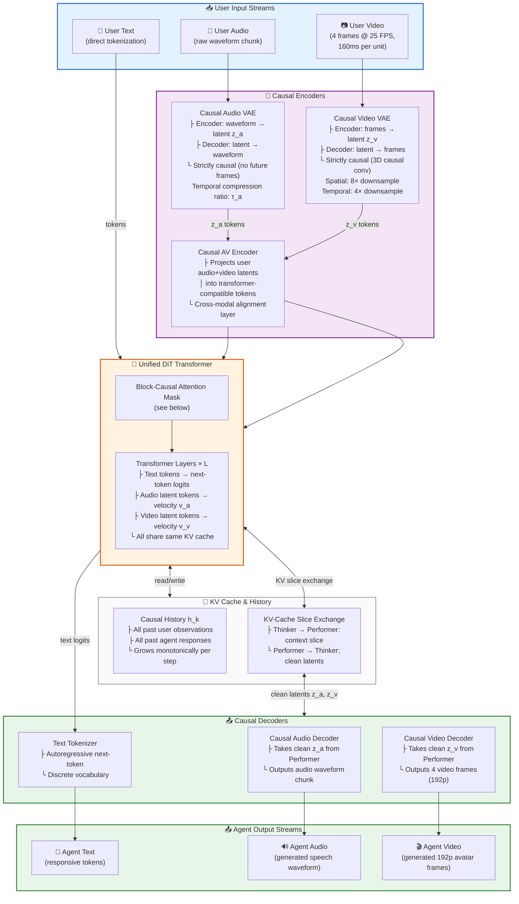
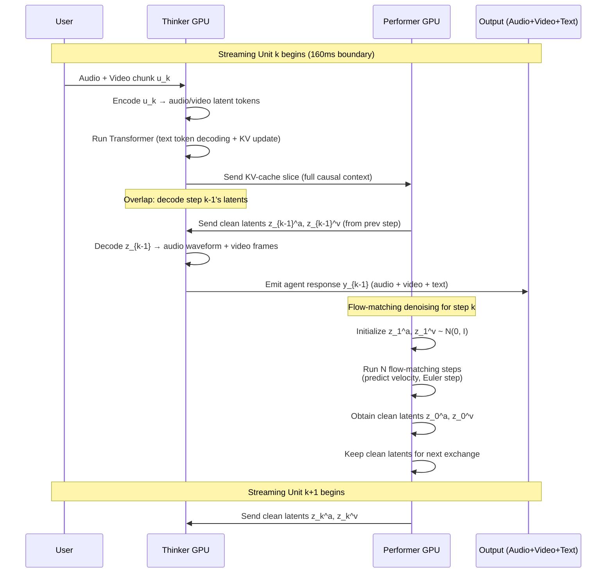
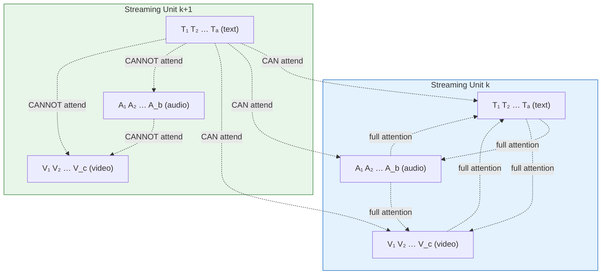
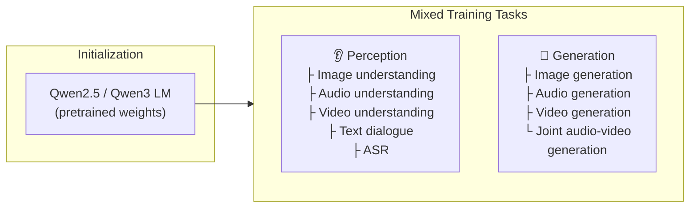
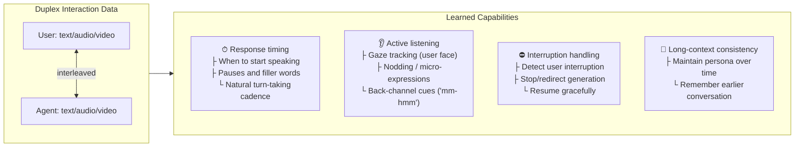
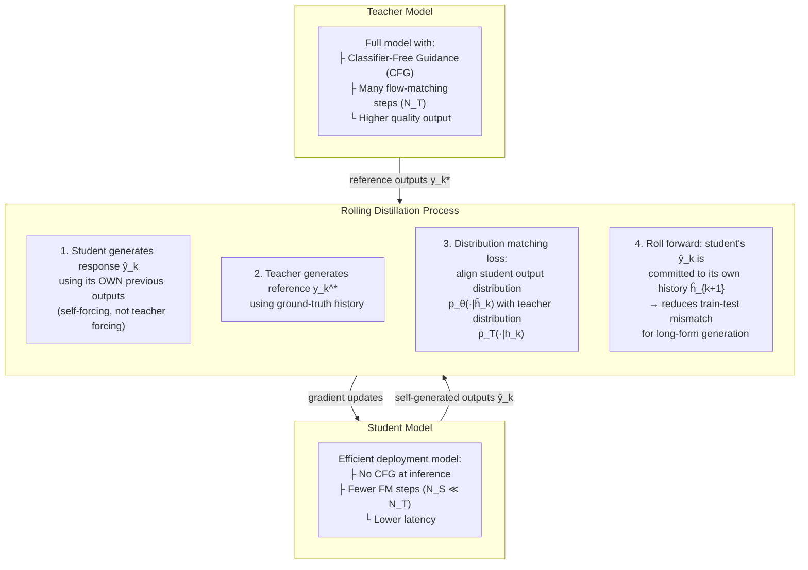

# Wan-Streamer v0.1 — Full Breakdown

**Paper:** Wan-Streamer v0.1: End-to-end Real-time Interactive Foundation Models
**Authors:** Wan Team (Alibaba Group), June 2026
**ArXiv:** https://arxiv.org/abs/2606.25041
**Project:** https://wan-streamer.com/

---

## Problem & Motivation

Building AI systems that interact with humans in real time the way humans interact with each other — continuously, with overlapping speech, gestures, and listening behavior — is fundamentally different from building a good language model or a good video generator.

**Why existing approaches fall short:**

| Approach | Problem |
|----------|---------|
| Cascaded ASR → LLM → TTS → Avatar | Latency accumulates across module boundaries; no native audio-visual sync |
| Speech-only full-duplex (Moshi, GPT-4o voice) | No visual agent output — can't show listening behavior, facial expressions |
| Audio-driven avatar renderers (VASA-1, StreamAvatar) | Fast at rendering but depend on external dialogue/speech modules — true latency is hidden |
| Omni-modal models (Qwen-Omni, MiniCPM-o) | Accept audio/video input but only output speech/text — no synchronized video response |

**Core insight:** Real-time audio-visual interaction isn't just the union of understanding + generation. It's *intrinsically full-duplex*: when the user speaks, the agent should still show visible listening behavior; when the agent responds, it should still perceive the user for interruption and adaptation. Streamability must be a modeling constraint from the start.

---

## Key Insight

> Design every component for causality from the beginning, model all modalities in one Transformer, and the system naturally achieves low-latency full-duplex interaction without pipeline hacks.

The three pillars:
1. **Single Transformer** for language, audio, and video (input and output) — no external modules
2. **Strictly causal stack** — VAEs, encoders, decoders, attention — everything processes left-to-right
3. **Streaming contract** — every observed unit is usable immediately, every generated unit is emitted and committed back to history

---

## Method

### Overview

At each streaming step $k$, the model sees:
- **User observations:** $\mathbf{u}_k = (\text{text}, \text{audio}, \text{video})$ — what the user just said/did
- **Causal history:** all past user observations + all past agent responses

It produces:
- **Agent response:** $\mathbf{y}_k = (\text{text}, \text{audio}, \text{video})$ — what the agent says/does next

The entire interaction is modeled as one long causal sequence of interleaved multimodal tokens.

### Formal Streaming Model (Eq. 1)

The full interaction probability decomposes autoregressively over streaming units:

$$
p\bigl(\mathbf{y}_{1:K} \mid \mathbf{u}_{1:K}\bigr) = \prod_{k=1}^{K} p\bigl(\mathbf{y}_k \mid \mathbf{y}_{<k},\, \mathbf{u}_{\leq k}\bigr)
$$

where $\mathbf{u}_{\leq k} = (\mathbf{u}_1, \dots, \mathbf{u}_k)$ are user observations up to step $k$ and $\mathbf{y}_{<k} = (\mathbf{y}_1, \dots, \mathbf{y}_{k-1})$ are all prior agent responses committed to the causal history $\mathbf{h}_k$:

$$
\mathbf{h}_k = \bigl[\mathbf{u}_1,\; \mathbf{y}_1,\; \mathbf{u}_2,\; \mathbf{y}_2,\; \dots,\; \mathbf{u}_k\bigr]
$$

Each response $\mathbf{y}_k$ is jointly distributed over text, audio, and video:

$$
p\bigl(\mathbf{y}_k \mid \mathbf{h}_k\bigr) = p\bigl(\mathbf{y}_k^{\text{text}} \mid \mathbf{h}_k\bigr) \cdot p\bigl(\mathbf{y}_k^{\text{audio}}, \mathbf{y}_k^{\text{video}} \mid \mathbf{h}_k, \mathbf{y}_k^{\text{text}}\bigr)
$$

Text is generated autoregressively (discrete next-token prediction), while audio and video are generated jointly via conditional flow matching (continuous latent denoising).

---

### Architecture — Detailed Mermaid Diagram



### Thinker–Performer Inference Pipeline (Detailed)



**Key architectural components:**

1. **Causal Audio VAE** — compresses audio into a latent space that can be processed strictly left-to-right. Uses causal convolutional encoder with temporal compression ratio $\tau_a$.
2. **Causal Video VAE** — same idea for video frames. Uses 3D causal convolutions with $8\times$ spatial and $4\times$ temporal downsampling. Input: 4 frames at 25 FPS (160ms chunks).
3. **Causal Audio-Visual Encoders** — project user observation latents into tokens compatible with the Transformer, with cross-modal alignment.
4. **Unified DiT/Transformer** — one model with block-causal attention that processes:
   - Text tokens (discrete, next-token prediction)
   - Audio latent tokens (continuous, flow matching)
   - Video latent tokens (continuous, flow matching)
   - All interleaved in one causal sequence
5. **Causal Audio & Video Decoders** — convert generated latents back to waveforms/pixels

---

### Block-Causal Attention — Formal Definition

Given a streaming unit $k$ containing tokens from $M$ modalities, let the token sequence for unit $k$ be:

$$
\mathbf{X}_k = \bigl[\underbrace{x_k^{(1)}, \dots, x_k^{(1)}_{T_1}}_{\text{text}},\; \underbrace{x_k^{(2)}, \dots, x_k^{(2)}_{T_2}}_{\text{audio}},\; \underbrace{x_k^{(3)}, \dots, x_k^{(3)}_{T_3}}_{\text{video}}\bigr]
$$

where $T_m$ is the number of tokens for modality $m$ in unit $k$. The full sequence up to step $k$ is:

$$
\mathbf{X}_{\leq k} = [\mathbf{X}_1, \mathbf{X}_2, \dots, \mathbf{X}_k]
$$

The **block-causal attention mask** $\mathbf{M} \in \{0, -\infty\}^{N \times N}$ for a sequence of length $N = \sum_{j=1}^{k} \sum_{m=1}^{M} T_m^{(j)}$ is defined as:

$$
\mathbf{M}_{ij} = \begin{cases}
0 & \text{if block}(i) \leq \text{block}(j),\; \text{and } \text{pos}(i) \leq \text{pos}(j) \\
-\infty & \text{otherwise}
\end{cases}
$$

where:
- $\text{block}(i)$ is the streaming unit index of token $i$
- $\text{pos}(i)$ is the position of token $i$ within its block

This gives three levels of structure:

| Level | Constraint | Effect |
|-------|-----------|--------|
| **Global causal** | Token at position $i$ cannot attend to any token at position $j > i$ | No information leakage from future |
| **Block boundary** | Tokens in unit $k$ can attend to all tokens in units $1, \dots, k-1$ but not $k+1, \dots$ | Streaming-safe chunking |
| **Cross-modal** | Within a block, audio/video/text tokens freely cross-attend | Multimodal coupling |



This enables streaming units as short as $\Delta = 160\,\text{ms}$ at 25 FPS (4 frames per unit).

---

### Forward Pass (per streaming unit k)

```
Step k: User sends audio+video chunk u_k

1. ENCODE (Thinker GPU):
   - Causal audio VAE encodes user audio → audio latent tokens
   - Causal video VAE encodes user video → video latent tokens
   - Text tokens from user input (if any)

2. TRANSFORMER PASS (Thinker GPU):
   - Run token-causal decoding over language/state slots
   - Produces KV-cache slice for current interaction state
   - Send KV slice to Performer GPU

3. DECODE PREVIOUS (Thinker GPU, overlapped):
   - Receive clean audio+video latents from Performer (generated for step k-1)
   - Decode latents → output audio waveform + video frames
   - Emit immediately to user

4. FLOW MATCHING (Performer GPU):
   - Receive KV slice from Thinker
   - Run flow-matching solver to denoise audio+video latents for step k
   - Keep clean latents, send to Thinker at step k+1
```

---

### Loss Functions — Formal Definitions

#### Language Loss (Cross-Entropy)

Standard next-token prediction over the discrete text output vocabulary:

$$
\mathcal{L}_{\text{CE}} = -\frac{1}{|\mathcal{Y}_{\text{text}}|} \sum_{t=1}^{|\mathcal{Y}_{\text{text}}|} \log p_\theta\bigl(y_t^{\text{text}} \mid \mathbf{h},\, y_{<t}^{\text{text}}\bigr)
$$

where $\mathcal{Y}_{\text{text}}$ is the text token sequence and $\mathbf{h}$ is the full causal history.

#### Conditional Flow Matching (Audio & Video)

For modality $m \in \{\text{audio}, \text{video}\}$, a noisy latent is constructed by interpolating between the clean target $\mathbf{z}_0^m$ and Gaussian noise $\boldsymbol{\varepsilon}^m$:

$$
\mathbf{z}_\tau^m = (1 - \tau)\,\mathbf{z}_0^m + \tau\,\boldsymbol{\varepsilon}^m, \qquad \boldsymbol{\varepsilon}^m \sim \mathcal{N}(\mathbf{0}, \mathbf{I}), \quad \tau \sim \mathcal{U}[0, 1]
$$

The ground-truth velocity field (optimal transport path) is:

$$
\frac{\partial \mathbf{z}_\tau^m}{\partial \tau} = \boldsymbol{\varepsilon}^m - \mathbf{z}_0^m
$$

The unified Transformer $f_\theta$ predicts the velocity for **both** modalities jointly, conditioned on the same noisy inputs and causal context:

$$
\mathcal{L}_{\text{FM}}^m = \mathbb{E}_{\boldsymbol{\varepsilon}^a, \boldsymbol{\varepsilon}^v, \tau} \left[ \left\| f_\theta^m\!\left(\mathbf{z}_\tau^a, \mathbf{z}_\tau^v,\, \mathbf{c}_k,\, \tau\right) - \left(\boldsymbol{\varepsilon}^m - \mathbf{z}_0^m\right) \right\|^2 \right]
$$

where $\mathbf{c}_k = \mathbf{h}_k$ is the full causal context and $f_\theta^m$ denotes the velocity output head for modality $m$.

**Key coupling property:** Both audio and video velocity predictions share:
- The **same noisy latents** $(\mathbf{z}_\tau^a, \mathbf{z}_\tau^v)$ as inputs
- The **same causal context** $\mathbf{c}_k$
- The **same flow time** $\tau$

This forces the Transformer to learn a joint audio-visual representation where speech content and lip motion are coupled at generation time — lip sync is native, not post-hoc.

#### Total Training Objective

$$
\mathcal{L} = \lambda_{\text{text}}\,\mathcal{L}_{\text{CE}} + \lambda_{\text{audio}}\,\mathcal{L}_{\text{FM}}^{\text{audio}} + \lambda_{\text{video}}\,\mathcal{L}_{\text{FM}}^{\text{video}}
$$

where $\lambda_{\text{text}}, \lambda_{\text{audio}}, \lambda_{\text{video}}$ are loss weighting coefficients (not specified in the paper).

#### Flow Matching Inference (ODE Solver)

At inference, the clean latent is recovered by integrating the learned velocity field from $\tau = 1$ (noise) to $\tau = 0$ (clean signal):

$$
\mathbf{z}_0^m \approx \mathbf{z}_1^m + \int_0^1 f_\theta^m\!\left(\mathbf{z}_\tau^a, \mathbf{z}_\tau^v,\, \mathbf{c}_k,\, \tau\right)\,d\tau
$$

In practice, this is discretized with $N_{\text{FM}}$ Euler steps:

$$
\mathbf{z}_{\tau_{n-1}}^m = \mathbf{z}_{\tau_n}^m - \frac{1}{N_{\text{FM}}} \cdot f_\theta^m\!\left(\mathbf{z}_{\tau_n}^a, \mathbf{z}_{\tau_n}^v,\, \mathbf{c}_k,\, \tau_n\right)
$$

The number of solver steps $N_{\text{FM}}$ is reduced during distillation (Stage 3) to minimize latency.

---

## Math in Plain English

**Eq. 1 — Autoregressive streaming model:** The probability of the full interaction is the product of per-step conditional probabilities. At each step, the model predicts the agent's text, audio, and video response given ALL past user inputs and ALL past agent outputs (the "causal history"). Once predicted, the response gets appended to the history.

**Eq. 2 — Conditional flow matching:** To generate audio/video, they start from noise and smoothly transform it into the clean signal. The noisy latent is a linear interpolation between clean and noise, controlled by a time parameter $\tau$ ($0$ = clean, $1$ = pure noise). The "velocity" tells you which direction to move through this interpolation.

**Eq. 3 — Flow matching loss:** The Transformer predicts the velocity field for both audio and video simultaneously, conditioned on the causal context and noise level. The loss is just the squared error between predicted and true velocity. Key point: both audio and video velocities are predicted from the SAME noisy inputs and SAME context, which couples the two modalities.

---

## Training Details — Expanded

### Stage 1: Independent-Task Pretraining



- **Initialization:** Transformer weights inherited from a pretrained language model (Qwen2.5/Qwen3 family). The visual and audio modality heads are randomly initialized and trained from scratch.
- **Task mixing strategy:** Perception and generation tasks are interleaved in each training batch to encourage the model to develop unified representations across understanding and generation.
- **Understanding tasks** teach the model to map multimodal inputs → text/audio/video outputs:
  - Image/audio/video understanding (VQA-style)
  - Text dialogue
  - Automatic speech recognition (ASR)
  - Audio-visual scene understanding
- **Generation tasks** teach the model to produce multimodal outputs:
  - Text-to-image generation
  - Text-to-audio generation (TTS-like)
  - Text-to-video generation
  - Joint audio-video generation (coupled via shared flow matching)
- **Goal:** Align perception, language reasoning, and latent generation in one sequence model so the same parameters that "understand" also "create."
- **Missing details:** No dataset sizes, mixing ratios, number of tokens/GPU-hours, or specific benchmarks reported.

### Stage 2: End-to-End Interaction Training



- **Data format:** Duplex interaction data where user text/audio/video and agent text/audio/video are **interleaved** in causal order, mimicking real conversation structure.
- **Key distinction from Stage 1:** The model now sees its *own previous outputs* in the input context (teacher-forced during training), learning to maintain coherent multi-turn behavior.
- **Learned behaviors (emergent from data, not explicitly programmed):**
  - **Response timing:** When to begin speaking, natural pauses, filler words
  - **Active listening:** Responsive non-verbal feedback (gaze shifts, nods, micro-expressions) coupled with user's speech
  - **Interruption handling:** The model keeps consuming user audio-video even while generating a response; can stop/redirect when interrupted
  - **Proactive speaking:** Can initiate comments based on visual observations without waiting for explicit request
  - **Long-context consistency:** Maintains persona, remembers earlier parts of the conversation
- **Missing details:** No dataset size, no information on data collection (synthetic vs. human), no training duration.

### Stage 3: Distillation for Low-Latency Streaming

This is the most technically novel training stage.



- **Teacher model:** The full Stage 2 model with classifier-free guidance (CFG) and many flow-matching solver steps $N_T$.
- **Student model:** Same architecture but trained to produce comparable outputs with:
  - No CFG at inference (faster, single forward pass)
  - Fewer flow-matching steps $N_S \ll N_T$ (fewer denoising iterations)
- **Rolling distillation (self-forcing with distribution matching):**
  1. The student is **rolled out** over consecutive streaming units, conditioned on its **own generated history** rather than ground-truth teacher outputs
  2. This creates a realistic training setting that matches deployment: at inference, the model sees its own past outputs, not ground truth
  3. A **distribution matching** loss aligns the student's output distribution with the teacher's, rather than matching individual samples
- **Purpose:** Reduce the train-test mismatch that accumulates over long conversations when a model is always trained on ground-truth context but deployed on its own generations.
- **Connection to prior work:** This technique builds on the self-forcing literature (e.g., for long-horizon RL and multi-step generation), adapted here for multimodal streaming.

#### Formal Distillation Objective

At each streaming unit $k$ in the rolling sequence:

$$
\mathcal{L}_{\text{distill}} = \mathbb{E}_{\hat{\mathbf{h}}_k} \left[ D_{\text{KL}}\!\left(\,p_T\!\left(\cdot \mid \mathbf{h}_k\right) \;\|\; p_\theta\!\left(\cdot \mid \hat{\mathbf{h}}_k\right)\right) \right]
$$

where:
- $p_T(\cdot \mid \mathbf{h}_k)$ is the teacher's output distribution given ground-truth history
- $p_\theta(\cdot \mid \hat{\mathbf{h}}_k)$ is the student's output distribution given its **self-generated** history $\hat{\mathbf{h}}_k = [\mathbf{u}_1, \hat{\mathbf{y}}_1, \dots, \mathbf{u}_k]$

The key difference from standard distillation: $\hat{\mathbf{h}}_k$ contains the student's own previous predictions, not the teacher's. This means errors compound realistically during training, teaching the student to recover from its own mistakes.

### Missing Training Details

| Detail | Status |
|--------|--------|
| Parameter count | ❌ Not disclosed |
| Dataset sizes / composition | ❌ "Broad mixture" only |
| Training compute (GPU-hours, FLOPs) | ❌ Not disclosed |
| Hyperparameters (LR, batch size) | ❌ Not disclosed |
| Loss weights $\lambda_{\text{text}}, \lambda_{\text{audio}}, \lambda_{\text{video}}$ | ❌ Not disclosed |
| Number of flow-matching steps $N_T$ (teacher) / $N_S$ (student) | ❌ Not disclosed |
| CFG scale (teacher) | ❌ Not disclosed |
| Distribution matching method specifics | ❌ Briefly mentioned, no details |

---

## Results

### Latency Comparison (Table 1, verbatim)

Per Table 1, the paper deliberately separates *user-visible response latency* from an *other reported metric* column and explicitly warns the table "should be read by measurement boundary rather than by the smallest raw number" (model-internal, first-packet, first-token, endpointing, and API TTFB latency are not directly comparable).

| System | Interaction | User-visible response latency | Other reported metric | Comparison boundary |
|--------|-------------|-------------------------------|----------------------|---------------------|
| Doubao Realtime Voice | speech-to-speech | ~1s overall | ~700ms bare-model latency | Official speech-only product numbers; no visual agent output |
| Seeduplex | speech-to-speech | N/R absolute | −250ms endpoint, −300ms interruption latency vs previous Doubao | Relative production improvement; speech-only |
| GPT-4o / Realtime API | speech-to-speech, audio/vision input | protocol-dependent | 232/320ms official audio response; ~500ms API TTFB; ~800ms target voice-to-voice | Reported numbers mix model response, API TTFB, endpointing, and network |
| Hume EVI 3 | speech-to-speech | 0.9–1.4s web-app benchmark | under 300ms model response | Vendor benchmark; no visual output stream |
| Gemini Live API | speech-to-speech | 1.2–3.6s API benchmark | N/R model-side | Vendor benchmark; not an official model breakdown |
| Sesame web app | speech-to-speech | 0.8–1.2s web-app benchmark | N/R model-side | Vendor benchmark; speech-only |
| Moshi | speech-to-speech | N/R product path | 160ms theoretical; 200ms practical model latency | Native full-duplex speech model; no visual agent |
| Qwen3/3.5-Omni | audio-video-text in, speech/text out | N/R interaction loop | first-packet: 234/547ms; Qwen3.5 Flash 235/426ms, Plus 435/651ms | First-packet metric; no synchronized visual avatar generation |
| MiniCPM-o 4.5 | audio-video in, speech/text out | N/R interaction loop | 0.58s first-token; RTF 0.20–0.27 | First-token/RTF metric; no visual avatar generation |
| **Wan-Streamer (ours)** | **text/audio/video in/out** | **~550ms total incl. 350ms network** | **~200ms model-side; 25 FPS video output** | **One end-to-end model; text I/O, speech, and synchronized visual response share one causal stream** |

> **Sourcing note.** The earlier version of this table dropped three of the nine compared systems (Seeduplex, Sesame web app, MiniCPM-o 4.5) and folded the "Other reported metric" column into Notes, which hid Doubao's ~700ms bare-model latency, Moshi's 160ms theoretical figure, and the Qwen3.5 Flash/Plus first-packet breakdown. Values above are verbatim from Table 1 (paper_layout.txt lines 349–376).

### Latency Decomposition — What the Paper Actually Reports

> **Correction note.** A prior version of this section contained a per-step gantt chart and a "Full End-to-End Latency Budget" table breaking the ~200 ms model-side latency into specific per-component figures (encode ~25 ms, transformer ~50 ms, flow-matching ~110 ms, decode ~95 ms, comm ~5 ms, plus a "~285 ms serial" baseline and 175 ms upload/download splits). **None of these per-component millisecond figures appear in the paper.** The paper reports only the aggregate ~200 ms model-side latency, the 350 ms bidirectional network budget, and the ~550 ms total (Abstract; §1; §2.4; §3). The decomposition below is sourced verbatim.

The paper states (§2.4 / §3) that **model-side signal-to-signal latency** is "the sum of encoding, thinker state update, performer latent generation, and decoding, and is currently approximately 200 ms." The protocol: the clock starts when a 160 ms user streaming unit is available to the thinker and ends when the corresponding audio-video response unit has been decoded for emission at 25 FPS.

**Sourced latency facts:**

| Quantity | Value | Source |
|----------|-------|--------|
| Streaming unit duration | 160 ms (4 frames @ 25 FPS) | Abstract; §2.4 |
| Model-side signal-to-signal latency | ~200 ms | Abstract; §1; §2.4; §3 |
| Bidirectional network budget | 350 ms | Abstract; §3 |
| Total interaction latency (remote user) | ~550 ms | Abstract; §1; §3 |
| Real-time throughput condition | performer wall-time + KV/latent communication must fit within one 160 ms unit | §2.4 (Fig. 2 caption) |
| Additional optimizations | CUDA graph capture, compilation, optimized kernels, KV-cache exchange | §2.4 |

**Thinker–Performer overlap (the only "decomposition" the paper gives, Fig. 2).** The schedule *pipelines across adjacent streaming units* — it does NOT give a within-unit ms breakdown:

- **Thinker GPU:** encodes current user observations $u_k$, updates the KV cache, and decodes the *previous* response latents $y_{k-1}$ for immediate emission.
- **Performer GPU:** receives the current KV slice and runs *only* the flow-matching solver to produce the next clean audio-visual latents $y_k$, returned to the thinker at the following unit.
- The short Thinker work is hidden under the longer Performer window; per-frame throughput is determined mainly by the Performer wall-time (plus the small KV/latent communication), which must stay under the 160 ms unit duration for real-time operation.

**Observation:** Network latency (~350 ms) dominates the ~550 ms total. The ~200 ms model-side latency for synchronized audio + video is competitive with speech-only systems like Moshi (~200 ms practical model latency) that do not generate video at all.

#### Latency Scaling Considerations (engineering inference, not paper-measured)

> **Sourcing note.** The paper's only scaling statement is that "scaling to higher resolutions is straightforward and left to future work" (§5). The specific multipliers in the prior version of this table ("video latent space grows ~14×", "latency ~285ms serial") were not in the paper and have been removed. The qualitative directions below are reasonable engineering inference from the architecture (heavier latent load ⇒ heavier flow matching; distillation reduces solver steps; two-GPU overlap is lost on one GPU), but no measured scaling numbers exist in v0.1.

| Scaling factor | Expected direction | Why |
|----------------|-------------------|-----|
| Higher resolution (192p → higher) | encode/decode and flow-matching cost ↑ | Larger video latent space; flow matching is the dominant per-unit cost |
| More FM steps ($N_S \uparrow$) | performer wall-time ↑ roughly with $N_S$ | Stage-3 distillation reduces $N_S$ precisely to cut this |
| Longer context window | KV cache grows; KV/latent transfer ↑ | Real-time condition requires performer + comm < 160 ms unit |
| Single GPU (no Thinker/Performer split) | lose cross-unit overlap; throughput drops | Encode/KV-update/decode and flow matching can no longer run on separate GPUs |

### Visual Agent Comparison (Table 2, verbatim)

Table 2 separates **full-loop / interactive digital-human systems** from **avatar rendering / joint audio-visual generation components**, and records each system's reported runtime (FPS, first-frame delay, chunk latency, or audio-to-visual delay) plus the part of the interaction stack it covers — most numbers are component-level runtime, not the aligned response latency of Table 1.

**Full-loop or interactive digital-human systems**

| System | Visual interaction scope | Reported runtime | Main difference from Wan-Streamer |
|--------|--------------------------|------------------|-----------------------------------|
| Body of Her | end-to-end humanoid agent | next frame within 42ms at 24 FPS | Preliminary unified agent; no deployed signal-to-signal latency |
| MIDAS | multimodal digital-human video synthesis | real-time frame-by-frame generation | Does not disclose absolute response latency |
| U-Mind | text, speech, motion, and video interaction loop | real-time video rendering claimed | Text-first pipeline; latency breakdown not public |
| X-Streamer | open-ended video chat from a portrait | 25 FPS multimodal streaming on two A100 GPUs | Absolute response latency is not disclosed |
| LPM 1.0 | online character performance engine | low-latency real-time causal streaming | Visual engine coupled to external A2A systems; latency not intrinsic to LPM alone |
| MAViD | audio-visual dialogue framework | no absolute latency reported | Modular framework; useful for capability comparison, not latency comparison |
| M.I.O | interactive omni-avatar system | bounded-latency design discussed | Multi-module embodied system; no public signal-to-signal number |

**Avatar rendering or joint audio-visual generation components**

| System | Visual interaction scope | Reported runtime | Main difference from Wan-Streamer |
|--------|--------------------------|------------------|-----------------------------------|
| VASA-1 | audio-driven talking face | 40 FPS with 170ms preceding latency | Renderer only; no dialogue reasoning or user visual perception |
| TalkingMachines | FaceTime-style audio-driven video | real-time chunk generation by TTBC | Relies on an external audio LLM for dialogue and speech |
| StreamAvatar | streaming talking/listening avatar | FFD 0.33–0.39s; video latency ~1.20s | Avatar renderer driven by speech/audio; no unified dialogue model |
| Avatar Forcing (Ki et al.) | interactive head-avatar reactions | ~500ms reaction latency; 6.8× speedup | Reacts to user audio/motion, but does not generate dialogue speech |
| AvatarForcing (Cui et al.) | one-step streaming talking avatar | 34ms/frame; 0.51s audio-to-visual delay | Strong visual streaming metric, not perceptual dialogue |
| LiveTalk | multimodal interactive avatar video | 24.82 FPS; 0.33s first-frame latency | Uses Qwen3-Omni for speech reasoning; video latency is separate |
| Hallo-Live | text-driven joint audio-video avatar | 20.38 FPS with 0.94s latency | Text-driven; does not continuously perceive user audio-video |
| OmniForcing | text-to-audio-video streaming generation | TTFC ~0.7s; ~25 FPS | First-chunk generation latency, not user response latency |
| **Wan-Streamer (ours)** | **text/audio/video perceptual dialogue with synchronized speech and video output** | **25 FPS; ~550ms total; ~200ms model-side** | **Single causal Transformer learns text I/O, perception, speaking, listening behavior, interruption, and visual response together** |

> **Sourcing note.** The earlier version of this table listed only 7 of the 15 compared systems, omitting MIDAS, U-Mind, LPM 1.0, MAViD, M.I.O, Avatar Forcing (Ki et al.), LiveTalk, and OmniForcing, and it truncated several runtime cells (e.g. AvatarForcing-Cui dropped its "0.51s audio-to-visual delay"; StreamAvatar dropped its "~1.20s video latency"). Values above are verbatim from Table 2 (paper_layout.txt lines 417–454).

### Naturalness & Full-Duplex Behavior

The paper claims (qualitatively):
- **Idle state:** Agent maintains identity, gaze, posture, breathing — doesn't freeze
- **Listening state:** Responsive non-verbal feedback (gaze shifts, nods, micro-expressions) coupled with user's speech
- **Interruption:** Model keeps consuming user audio-video even while generating response, can stop/redirect when interrupted
- **Proactive speaking:** Can initiate comments based on visual observations without waiting for explicit request
- **Lip sync:** Native synchronization because audio and video are predicted from the same context before decoding

### Ablations

**None.** This is the biggest weakness of the paper. There are zero ablation studies.

---

## Limitations

1. **192p resolution** — very low quality, described as "proof of concept"
2. **No quantitative quality metrics** — no FID, FVD, ASR-WER, user studies, MOS scores
3. **No ablations** — can't tell which design choices matter
4. **No code or model release** — not reproducible
5. **No model size disclosed** — can't assess computational requirements
6. **Latency comparisons are asymmetric** — they compare full end-to-end path against partial metrics from other systems, making direct comparison hard
7. **Training data is vague** — "broad mixture" with no specifics on curation, filtering, or licensing

---

## Open Questions

1. How well does this scale to higher resolutions? They claim it's straightforward but the compute requirements for flow-matching over video latents will increase dramatically.
2. How much training data is needed for the end-to-end interaction stage? This is presumably rare and expensive.
3. What happens with longer conversations — does the KV cache become unwieldy? Is there context window management?
4. How does the joint audio-video flow matching actually work in practice? Does one modality degrade to help the other?
5. Can the thinker-performer split work on a single GPU with pipelining, or does it fundamentally need two?
6. What's the actual model size and can this run on consumer hardware?
7. How does the quality compare to cascaded systems at equal compute budget?
